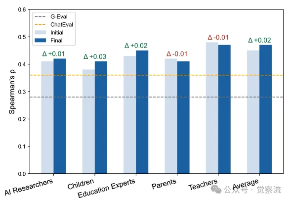
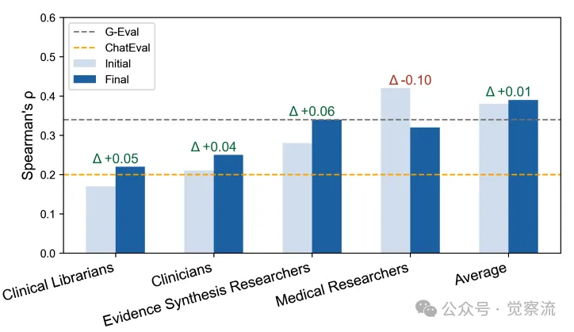

# 1. 资源

Multi-Agent-as-Judge: Aligning LLM-Agent-Based Automated Evaluation with Multi-Dimensional Human Evaluation
https://arxiv.org/pdf/2507.21028

“ 传统自动评估指标为何总与人类判断"脱节"？MAJ-EVAL框架通过"基于证据的角色构建"和"多智能体辩论机制"，让自动化评估真正理解教育专家为何更关注"教育价值"而非"语法正确性"。这一创新解决了角色设计任意性和框架不可迁移性两大难题，更为NLP评估开辟了新范式。”

# 2. 问题

评估困境：当指标与人类判断"渐行渐远"有这样一个假设的场景：精心开发了一个用于儿童教育的AI故事生成系统，ROUGE-L指标显示高质量，但教育专家却皱着眉头说："内容缺乏教育价值"。这种评估断层在医疗、法律等专业领域尤为突出——传统自动评估指标只能衡量表面相似度，无法捕捉"儿童教育适宜性"或"干预效果方向"等关键维度。问题出在哪里？现有评估方法面临两大根本挑战。首先是角色设计的任意性：手工定义的"教师"或"医生"角色缺乏客观依据。在ChatEval中，"批评者"角色在不同任务中可能表现出截然不同的评估优先级，导致评估结果难以复现。例如，一项研究可能手工地为"教师"智能体设计关注"语法准确性"，而另一项研究则可能让同一角色优先考虑"学生参与度"，这使得研究结果无法在不同研究之间可靠地复制。其次是框架的不可迁移性：为医疗摘要设计的"临床一致性"维度对儿童教育任务毫无意义，而"儿童参与度"对医疗摘要又不相关。这些维度硬编码在特定任务中，导致评估框架无法跨领域复用。例如，一个为医疗摘要设计的评估流水线可能包含维度如"临床一致性"，但这些维度对类似儿童教育的摘要任务并不适用，后者更需要"儿童参与度"等指标。由于这些维度和角色定义针对特定任务硬编码，评估框架通常需要完全重新设计才能处理新领域，这严重限制了其可扩展性和可转移性。正如研究中指出："在评估儿童互动故事内容时，教师可能优先考虑教育价值，而家长则关注情感互动。这种多样性既必要又难以通过传统人类评估协议规模化。"在现实世界中，由于多利益相关者的复杂性，如护理人员、家庭护理人员和患者在评估LLM生成的患者摘要时有不同的需求，而评估儿童阅读理解的LLM生成问答对则需要儿童、家长和教师的反馈。更为关键的是，现有方法未能充分模拟真实世界中多利益相关者如何讨论、辩论并最终达成评估共识的过程。人类评估中的反思、挑战和修正环节在自动化评估中常被简化或忽略，导致评估结果缺乏深度和全面性。

# 3. 原理

从"单一裁判"到"专家委员会"：评估范式的根本转变MAJ-EVAL (Multi-Agent-as-Judge Evaluation)框架应运而生，通过两大创新解决了上述痛点：基于证据的角色构建和多智能体辩论机制。这一框架代表了从"单一裁判"向"专家委员会"演进的评估范式，更贴近真实世界复杂评估需求。

上图，MAJ-EVAL的两步设计流程。第一步，从研究文献中提取利益相关者视角并构建角色；第二步，通过多智能体辩论生成评估结果。

为什么我们需要这种转变？因为在当今社会，几乎所有人类工作都具有协作性质，这意味着现实世界中NLP应用的评估往往需要考虑多个维度，以反映不同人类视角的多样性。在儿童故事书问答生成任务中，教师关注"问题是否能激发批判性思维"，家长重视"问题是否能促进情感互动"，而孩子们最关心的是"问题是否有趣"。同样，在医疗摘要评估中，临床医生重视"干预效果方向是否明确"，患者则希望"语言通俗易懂"，而护理人员可能更关注"护理建议的实用性"。

传统自动评估指标如ROUGE-L、BLEU和BERTScore虽然简单可扩展，但主要计算生成文本与参考文本之间的词汇级或嵌入级相似度，无法评估深层的上下文理解、事实正确性和任务特定适宜性。例如，在医疗摘要生成中，ROUGE可能无法惩罚那些表达流畅但缺乏证据支持的幻觉内容；研究指出："该摘要传达了当前证据的一般不确定性和局限性，但在临床应用、医学教育和AI驱动决策支持所需的精确性和特异性方面有所欠缺。"在儿童教育QA生成中，词汇相似度无法判断问题是否具有教育意义。研究发现，家长对AI工具的评价是"很愚蠢"，实质是表达对缺乏启发性问题的不满——AI生成的问题往往"严肃专业"，不符合儿童认知水平和心理年龄，导致孩子难以理解。比如，有研究指出："我们的参与者表示，当他们使用工具如C5和C6回答儿童故事相关问题时，生成的答案往往严肃专业，没有特别针对儿童的认知水平和心理年龄，导致孩子难以理解。"

为解决这些挑战，"LLM-as-a-Judge"（Large Language Model-as-a-Judge）范式被提出，利用大型语言模型(LLM)替代人类评估者。单LLM评估方法如G-Eval通过链式思维提示引导GPT-4进行结构化评估，而PandaLM则微调LLaMA-7B模型用于偏好排序。然而，这些方法存在"单一模型偏差"，其判断受限于模型自身的训练数据和推理风格，难以模拟真实世界评估所需的多利益相关者视角。

多智能体框架进一步扩展了这一范式，使用多个扮演不同角色的LLM智能体进行协作或辩论以达成最终评估。例如，ChatEval为智能体分配"公众"或"批评者"等预定义角色，而MADISSE则将评估框架化为持有对立初始立场的智能体之间的辩论。尽管前景广阔，现有LLM-as-a-judge方法面临两大关键限制：首先，智能体角色设计往往主观随意且缺乏可复现性；其次，评估框架缺乏可迁移性，难以适应不同领域的评估需求。

MAJ-EVAL 如何工作？
MAJ-EVAL的第一阶段是解决角色设计任意性的关键——利益相关者角色创建。框架从领域文档中自动提取客观评估维度，而非依赖手工设计。给定一系列领域特定任务的文档列表，框架使用LLM识别相关利益相关者(如"家长"、"临床医生")并提取其描述性属性(如优先级、价值观)以及基于证据的评估维度。

每个文档的输出是一个结构化列表，包含利益相关者元组，其中包含名称、描述和(维度, 证据)对集合。例如，在儿童故事书阅读的QAG任务中，从Sun等(2024)的研究中提取的家长评估维度为："家长期望问题能激发创造力、批判性思维和好奇心，而非事实回忆"，证据来自论文中大多数参与者认为当前AI工具"很愚蠢"的表述。

为统一重叠角色并确保一致性，MAJ-EVAL使用基于LLM的语义聚类将相似利益相关者分组，并在组内自动合并冗余或语义相近的维度，同时保留组内多样性以增强辩论效果。例如，在医疗摘要任务中，MAJ-EVAL识别出"急诊医生"、"专科医生"和"全科医生"等角色，通过聚类将它们合并为"临床医生"组，但保留了各自独特的视角：急诊医生关注时间紧迫情况下的关键信息，专科医生注重专业领域的精确性，全科医生则更关注患者整体情况。

对于每个合并后的维度，MAJ-EVAL构建包含五个关键属性的详细角色：人口统计学信息(如姓名、年龄、职业)、评估维度(来自前期视角提取)、专业领域(如"专长于设计适合年龄的提问策略")、心理特征(如"精力充沛、直觉强、对培养儿童自然好奇心充满热情")和社会关系(如"有三个孩子，经常参与学校活动")。

儿童互动故事阅读任务的角色示例
上表，儿童互动故事阅读任务中的角色示例。例如，"27岁的早期教育教师Emma Watson"专长于设计适合年龄的提问策略，心理特征为精力充沛、直觉强、对培养儿童自然好奇心充满热情。

为什么心理特征如此关键？因为真实评估中，专家判断不仅基于专业知识，还受其价值观和经验影响。一位"对培养儿童自然好奇心充满热情"的教师，会更关注问题是否能激发思考，而非仅检查语法。同样，一位"富有同情心、善于沟通"的急诊医生(论文中提及39岁的Dr. Sarah Thompson)，会特别关注医疗摘要是否将复杂医学信息转化为患者可理解的语言。

研究通过消融实验验证了详细角色构建的必要性。比较"详细角色"(包含全部五个属性)与"简单角色定义"(仅职业描述，如"你是一位经常给孩子读书的学前教师")的效果，发现详细角色在所有维度上均显著优于简单角色。在StorySparkQA的"儿童教育适宜性"维度上，详细角色相关系数为0.40，而简单角色仅为0.25。在MSLR-COCHRANE上，Claude-3.7-Sonnet变体的总体质量相关性从0.30提升至0.40。这表明角色构建的丰富性是MAJ-EVAL成功的关键因素。

完成角色构建后，MAJ-EVAL进入第二阶段——多智能体辩论评估，模拟真实评估中的讨论和共识形成过程。

MAJ-EVAL的多智能体辩论评估流程
上图：MAJ-EVAL的多智能体辩论评估过程。每个智能体首先独立提供初始评估，然后协调器组织自由辩论，智能体可更新思考并修改评分，最终生成与人类评分一致的综合评估。

这一过程分为三个关键阶段：首先，每个角色基于专业视角提供初始评分。提示词会明确指示："您的反馈和评分应基于您的视角和/或专业。避免生成与其他智能体重复或相似的评估。"这一阶段目的是捕捉多样化的观点，反映不同利益相关者如何以任务特定方式初步解读相同内容。

其次，在协调员引导下进行辩论，这是MAJ-EVAL的核心创新。辩论机制设计精巧：优先选择存在未解决分歧的智能体发言，确保辩论聚焦于关键分歧点；允许智能体基于讨论更新自己的评估；采用结构化辩论流程，避免无序讨论。研究显示，辩论后15/20个利益相关者组的评估质量都有所提升，证明这一机制有效支持大多数利益相关者智能体优化其评估。

例如，在MSLR-COCHRANE中，"跨学科临床医生"组的相关性从0.76提升至0.83，"医学研究人员"组从0.61提升至0.86。即使少数组(如语言研究者)相关性略有下降，但它们引入了更有价值的扩展维度(如"推理性支架"和"词汇丰富度")，这些维度虽超出人类评分使用的维度，但反映了早期儿童教育中的理论关注点。这种"创造性偏差"实际上是评估过程中的有益补充，为任务提供了更全面的视角。

最后，一个中立的聚合器整合所有智能体的更新后评估，生成最终反馈。聚合器被指示："公平代表所有视角，提供全面总结。"研究发现，MAJ-EVAL不是简单增加智能体数量，而是通过基于证据的角色构建和结构化辩论机制，模拟真实评估中的专业判断过程。这解释了为何它在领域特定维度上表现尤为突出。框架中利益相关者智能体的"权衡"行为(重视领域维度、轻视表面语言)与真实人类评估行为一致，证明了其对人类评估过程的深度模拟。

# 4. 实证效果：多维度对齐的硬核证据
研究团队在两个具有挑战性的领域特定真实世界任务上验证了MAJ-EVAL：

• StorySparkQA：儿童故事书问答生成任务，包含5,868个专家标注的问答对，专为3-6岁儿童的互动阅读活动设计。评估维度包括：语法正确性(是否语法正确)、答案相关性(答案是否有意义地回答问题)、上下文一致性(问答对是否基于故事内容但引入外部真实世界知识)以及儿童教育适宜性(是否适合3-6岁儿童)。
• MSLR-COCHRANE：医学文献多文档摘要生成任务，包含600个模型生成的摘要。评估维度包括：流畅性(摘要是否流畅)、PIO一致性(人群、干预和结果是否与目标摘要一致)、效果方向(报告的干预影响)以及证据强度(主张得到基础研究支持的程度)。
研究比较了MAJ-EVAL与三类基线方法：传统自动指标(ROUGE-L F1和BERTScore)、单LLM-as-a-judge(G-Eval)和多智能体方法(ChatEval)。

MAJ-EVAL(Claude-3.7-Sonnet)辩论前后相关性对比
上图：MAJ-EVAL(Claude-3.7-Sonnet)利益相关者智能体辩论前后评分与人类评分的相关性对比。深蓝色柱状图高于浅蓝色表明辩论后与人类评分一致性提升。

研究发现，MAJ-EVAL在领域特定维度上表现尤为突出：在StorySparkQA的"儿童教育适宜性"维度上，MAJ-EVAL相关系数达0.40，显著高于G-Eval的0.20和ChatEval的0.15；在MSLR-COCHRANE的"效果方向"维度上，MAJ-EVAL相关系数达0.38，而ROUGE-L仅为0.12。

关键发现是：MAJ-EVAL在"语法正确性"上的相关性相对较低并非缺陷，而是反映了真实人类评估者的优先级——教育专家更关注"教育价值"而非字面语法，临床医生更重视"干预效果方向"而非表面流畅性。这种"权衡"恰恰说明MAJ-EVAL模拟的是有偏好的专业判断，而非机械的语言匹配，与真实人类评估行为高度一致。

研究指出，"利益相关者智能体倾向于优先考虑领域特定维度而非表面语言保真度"，这与现实世界人类评估行为相符。例如，在评估医疗摘要时，MAJ-EVAL能识别出关键缺陷："缺乏临床特异性，特别是没有将COPD患者分为脱氧者和非脱氧者——这对精准医疗、临床决策和循证学习至关重要"，以及"遗漏关键术语，如'移动家庭氧疗'"，这些是与临床指南和研究框架保持一致所必需的。

为评估MAJ-EVAL模拟多利益相关者评估的能力，研究计算了Krippendorff's Alpha(K-Alpha)来衡量利益相关者组内的一致性。Krippendorff's Alpha是衡量评估者间一致性的统计指标，值越接近1表示一致性越高。在MAJ-EVAL中，它用于验证不同利益相关者组内的判断一致性。

研究发现，MAJ-EVAL不仅模拟多维度评估，还能在组内达成合理共识：在MSLR-COCHRANE中，"公共卫生消费者"组的K-Alpha达0.86，表明医疗摘要评估中患者视角具有高度一致性；"医学研究人员"组从0.61提升至0.86，显示辩论过程有效促进了共识形成；在StorySparkQA中，"教师"组的K-Alpha为0.59，证实了教育评估中专业视角的内部一致性。

MAJ-EVAL(Qwen-3-235B)辩论前后相关性对比
上图：MAJ-EVAL(Qwen-3-235B)利益相关者智能体辩论前后评分与人类评分的相关性对比。

这一发现表明，MAJ-EVAL不仅能够捕捉多维度评估需求，还能模拟真实评估场景中专业群体内部的共识形成过程，增强了评估结果的可信度。研究还发现，MAJ-EVAL的评估结果不仅与人类评分高度一致，还能提供互补的、基于利益相关者视角的见解，为领域特定的真实世界评估提供更全面的视角。

研究通过消融实验进一步验证了MAJ-EVAL各组件的贡献。比较"详细角色"(包含全部五个属性)与"简单角色定义"(仅职业描述)的效果，发现详细角色在所有维度上均显著优于简单角色。在StorySparkQA的"儿童教育适宜性"维度上，详细角色相关系数为0.40，而简单角色仅为0.25。在MSLR-COCHRANE上，Claude-3.7-Sonnet变体的总体质量相关性从0.30提升至0.40。

实践指南：将MAJ-EVAL应用于你的工作
MAJ-EVAL特别适用于涉及多样化用户需求的任务(如教育技术产品评估)、需要多重社会角色视角的场景(如医疗决策支持系统)以及依赖领域专长的评估(如多角色对话系统)。

然而，研究也发现一种权衡：MAJ-EVAL在领域特定维度上表现优异，但在表面语言维度(如语法正确性)上相对传统指标可能略逊一筹。这并非框架缺陷，而是反映了真实评估场景中的优先级差异。对于强调表面语言质量的任务(如机器翻译、语法纠错)，传统自动指标或单LLM-as-a-judge方法可能更为合适；而对于需要专业判断的任务，MAJ-EVAL能提供更贴近人类评估的多维度洞察。

将MAJ-EVAL应用于你的工作，可遵循三个关键步骤：

首先，角色构建：从领域文档中提取评估维度，确保文档包含真实用户反馈(如访谈记录)，而非仅理论论述。例如，在教育应用评估中，分析教师访谈，自动提取"教育价值"等维度。角色构建的质量决定评估上限，确保领域文档包含真实用户反馈，如StorySparkQA任务中使用的Sun等(2024)研究，直接引用了家长对AI工具"很愚蠢"的评价，这为角色构建提供了关键证据。

实施：角色构建过程包括三个关键子步骤：

• 文档选择：使用关键词搜索(如"儿童阅读与对话代理定性访谈")在Google Scholar上查找最新研究(过去三年)
• 视角提取：识别文档中提到的名称实体(排除作者和机构)，提取每个利益相关者的特征和观点
• 角色聚类：将相似利益相关者分组，合并冗余维度，保留组内多样性

MAJ-EVAL的角色创建工作流程
上表：MAJ-EVAL的角色创建工作流程概览。

其次，辩论设计：实施结构化辩论机制，特别关注"优先选择存在未解决分歧的智能体发言"这一关键设计，为辩论设置合理轮次，避免过度辩论导致评估疲劳。

实施：辩论机制的设计需注意：

• 辩论轮次：通常3-5轮辩论最为有效，太少无法充分讨论，太多可能导致评估疲劳
• 分歧优先：确保优先选择存在未解决分歧的智能体发言，这能显著提升辩论效率
• 角色保持：智能体在辩论过程中应保持其角色一致性，避免角色漂移
最后，维度聚焦：在解读结果时，关注领域特定维度的表现，例如，在医疗摘要评估中，"效果方向"比"语法正确性"更能反映临床价值；分析不同利益相关者组的评估差异，获取更全面的洞察。

实施：在解读结果时：

• 关注领域维度：不要只看总体分数，应特别关注领域特定维度的表现
• 分析分歧点：不同利益相关者组之间的分歧往往揭示了任务的关键挑战
• 考虑权衡：理解为什么某些维度得分高而其他维度得分低，这反映了真实评估中的优先级
MAJ-EVAL的计算成本相对可控：角色创建阶段平均消耗34,103 tokens/文档，辩论阶段每个利益相关者组约18,281 tokens/数据点。若从两个文档生成角色并在四个利益相关者组中进行辩论，每任务总token消耗约141,329 tokens（Claude 3.7 Sonnet约$0.42/任务）。处理单任务约需26.13秒(Qwen-3-235B)至34.20秒(Claude 3.7 Sonnet)，显著低于人类专家评估的时间成本(通常需数小时至数天)。

MAJ-EVAL计算成本分析
上表：MAJ-EVAL各阶段的计算成本明细。

详细计算显示，角色创建阶段平均每个利益相关者组约需1.5分钟，辩论评估阶段平均每次评估约需4.33分钟(StorySparkQA)和0.50分钟(MSLR-COCHRANE)。对于大规模评估任务，框架具有良好的可扩展性，因为利益相关者组的辩论可以并行执行。例如，在StorySparkQA任务中，处理100个样本的评估仅需约7.2小时(Claude 3.7 Sonnet)，而人类专家可能需要数周时间。

未来：评估与人类价值的对齐
MAJ-EVAL不仅是一项技术突破，它代表了评估理念的根本转变——评估不应仅关注"技术质量"，而应关注"人类价值"。研究发现，MAJ-EVAL的评估不仅与人类评分一致，还能提供互补的、基于利益相关者视角的见解。例如，在StorySparkQA任务中，MAJ-EVAL不仅捕捉了人类标注者使用的维度(语法正确性、答案相关性、上下文一致性和教育适宜性)，还提供了额外的见解，如"问题是否激发批判性思维"和"是否适合儿童认知水平"。

当我们的评估框架能理解"为什么教育专家更关注教育价值而非字面语法"，AI系统才能真正融入人类社会的复杂评估生态。下次当你面对评估困境时，不妨问自己：我的评估是否真正捕捉了所有利益相关者的视角？是否基于客观证据而非主观假设？我的评估框架能否反映真实人类评估中的优先级和权衡？

通过MAJ-EVAL的思路，你可以构建更可靠、更可迁移的评估体系，让AI开发真正服务于人类需求。毕竟，评估不仅是技术问题，更是价值问题——而价值，永远需要多重视角的共同确认。

研究提出三个未来方向：收集人类标注者的推理过程，理解其判断形成机制和关键考虑因素；探索强化学习微调LLM智能体，提升角色扮演能力；在更多领域测试框架的通用性，如法律、金融等专业领域。这些方向将推动评估技术向更贴近人类价值的方向演进，为AI系统的负责任发展提供坚实基础。

评估范式的演进与启示
MAJ-EVAL工作对NLP评估具有重要启示：未来评估框架应重视多维度、多视角的整合，而非追求单一指标；评估方法应与任务目标对齐——对于复杂社会场景，需要"专家委员会"式评估；对于表面语言任务，可采用更轻量级方法；自动化评估的终极目标不是完全替代人类，而是更准确地模拟人类评估行为。

研究通过案例分析明确了MAJ-EVAL的适用边界。在StorySparkQA任务中，MAJ-EVAL的评分与人类评分高度一致，特别是在教育适宜性等关键维度上；而在MSLR-COCHRANE任务中，它成功捕捉了"效果方向"等临床重要维度。然而，对于更注重表面语言质量的任务，如简单的文本摘要，传统指标可能更为有效。这一发现提醒我们，评估方法应与任务目标紧密对齐。

值得注意的是，MAJ-EVAL的评估结果不仅与人类评分一致，还能提供互补的、基于利益相关者视角的见解。例如，在StorySparkQA任务中，MAJ-EVAL不仅捕捉了人类标注者使用的维度(语法正确性、答案相关性、上下文一致性和教育适宜性)，还提供了额外的见解，如"问题是否激发批判性思维"和"是否适合儿童认知水平"。在医疗摘要评估中，MAJ-EVAL能识别出关键缺陷："缺乏临床特异性，特别是没有将COPD患者分为脱氧者和非脱氧者——这对精准医疗、临床决策和循证学习至关重要"，以及"遗漏关键术语，如'移动家庭氧疗'"，这些是与临床指南和研究框架保持一致所必需的。

MAJ-EVAL框架通过系统化方法解决了现有LLM-as-a-judge方法的两个关键限制：角色设计的任意性和框架的不可迁移性。该框架的核心贡献在于：1) 从领域文档自动提取评估维度，确保角色设计的客观性和可复现性；2) 设计多智能体辩论机制，模拟真实世界中利益相关者的评估讨论过程；3) 在两个领域特定任务上验证了与人类评分的更高一致性，尤其在领域关键维度。

研究指出，"利益相关者智能体倾向于优先考虑领域特定维度而非表面语言保真度"，这与现实世界人类评估行为相符。这种"权衡"行为反映了真实评估场景中的优先级差异，证明了MAJ-EVAL对人类评估行为的深度模拟。

框架的局限性
尽管MAJ-EVAL在实验中表现良好，但研究也指出了其局限性。首先，虽然案例研究在儿童互动QA和医疗摘要上显示出有希望的结果，但这些领域仅代表具有有限人类评分的真实世界应用的一个子集。未来工作应扩展到更多领域和任务，以验证框架的通用性。

当前框架依赖于研究者提供的领域相关文档来构建角色。虽然这种方法确保了角色的客观性，但它也可能引入文档本身的偏见。未来研究可以探索如何减轻这种潜在偏见，例如通过多源文档融合或引入偏见检测机制。

最后，尽管MAJ-EVAL的计算成本相对可控，但对于大规模评估任务，计算资源需求仍然是一个考虑因素。未来工作可以探索模型压缩或知识蒸馏技术，以进一步降低计算成本，使框架更适合资源受限的环境。

研究提出三个关键未来方向：

1. 数据收集：收集人类标注者的推理过程，理解其判断形成机制和关键考虑因素。这将帮助我们更好地理解人类评估的内在逻辑，从而改进自动化评估框架。
2. 模型训练：探索强化学习微调LLM智能体，提升角色扮演能力。除了基于提示的方法外，研究计划利用收集到的推理过程，通过强化学习微调LLM智能体，以增强其角色扮演能力，从而产生更贴近人类评估结果的输出。
3. 跨领域验证：在更多领域测试框架的通用性，如法律、金融等专业领域。这将验证MAJ-EVAL是否真正具有跨领域的通用性，而不仅仅适用于教育和医疗领域。
这些未来工作方向将推动评估技术向更贴近人类价值的方向演进，为AI系统的负责任发展提供坚实基础。正如研究结论所述："MAJ-EVAL不仅是一种评估工具，更是一种评估理念的转变——从追求技术指标到关注人类价值，从单一视角到多维度整合，从机械匹配到专业判断模拟。"各位，看过此文有什么感想？如有其他想法可以在评论区留言，我们聊聊。或者加入“觉察流”社区群，与群里的小伙伴一起学习、交流。加入方法，私信回复“入群”“加群”即可。

# 参考

[1] 当AI评估遇见"专家委员会"：MAJ-EVAL如何让自动化评估真正理解人类价值, https://mp.weixin.qq.com/s/nuGZg2Oc7Vca0oLkv5lqCw