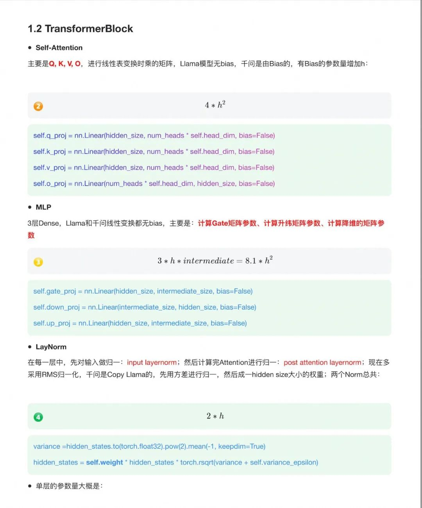
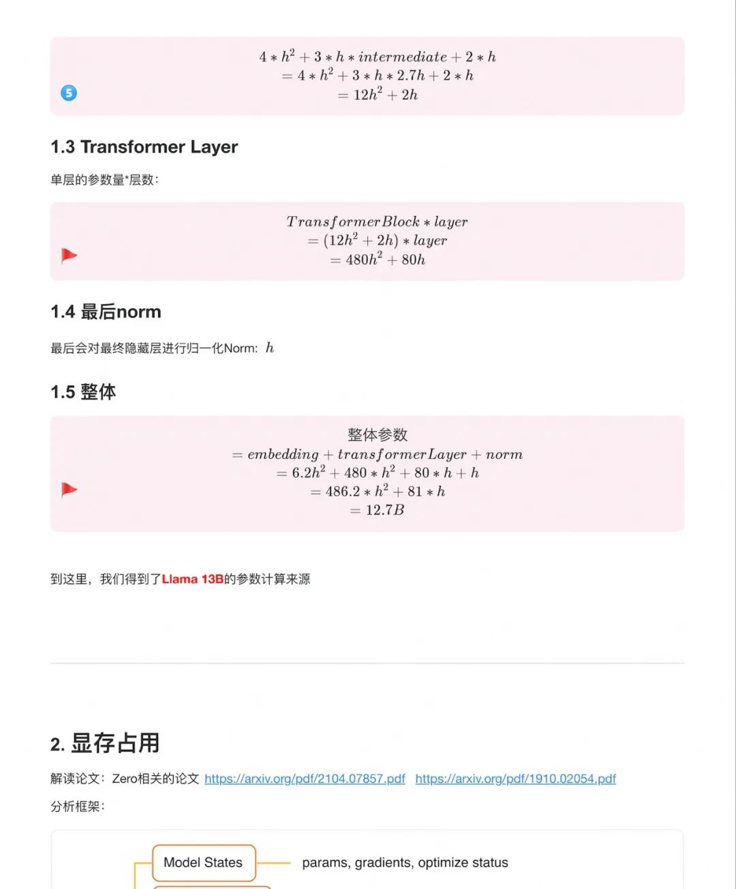
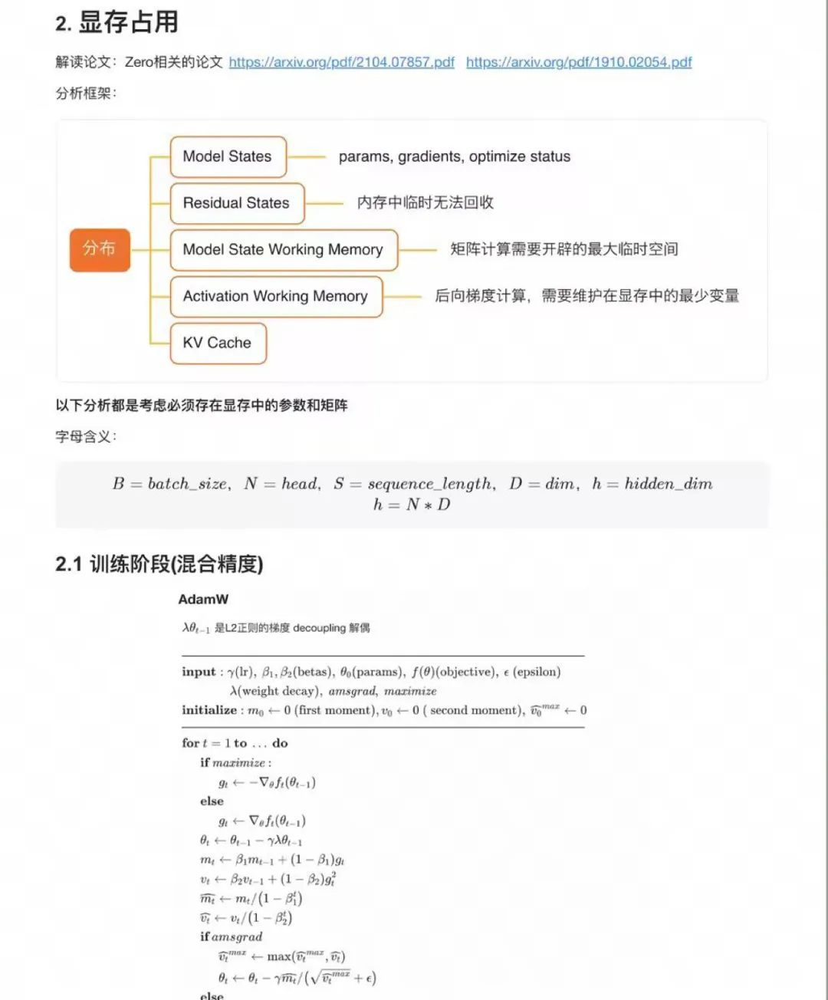
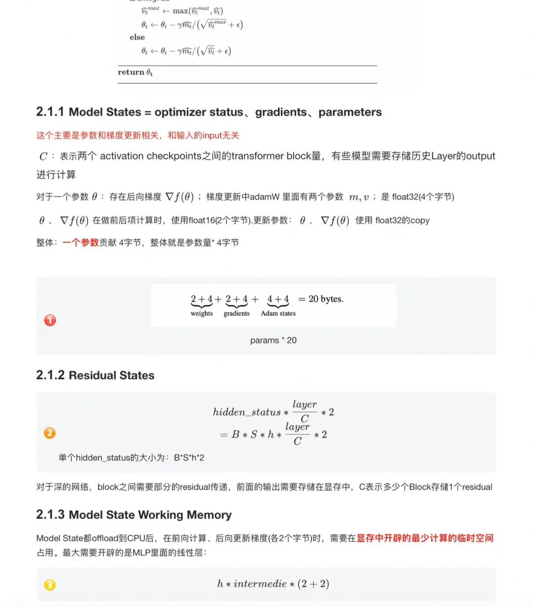
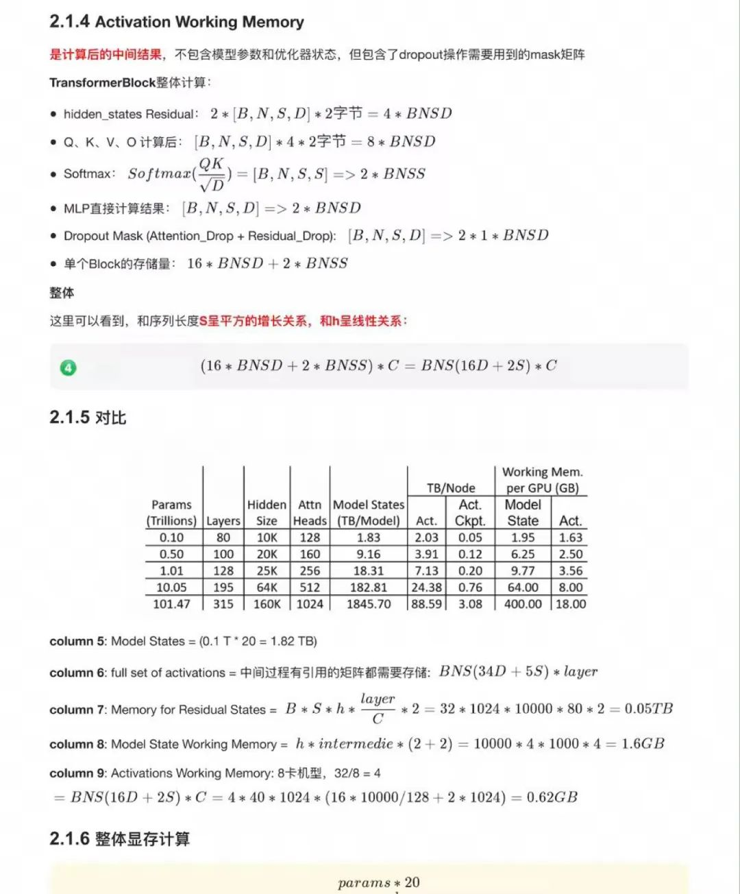
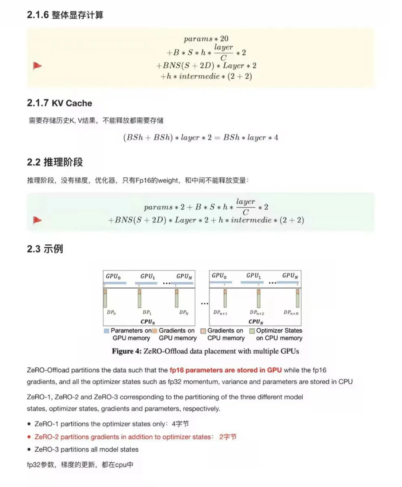
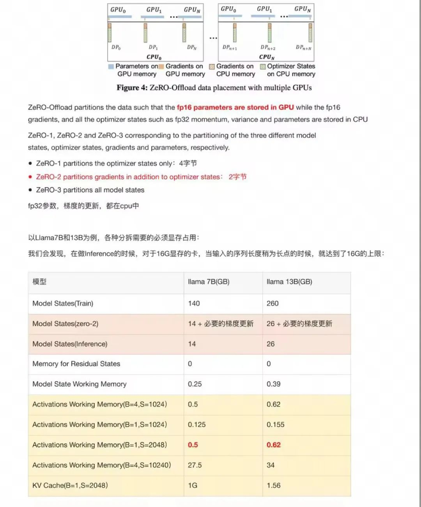
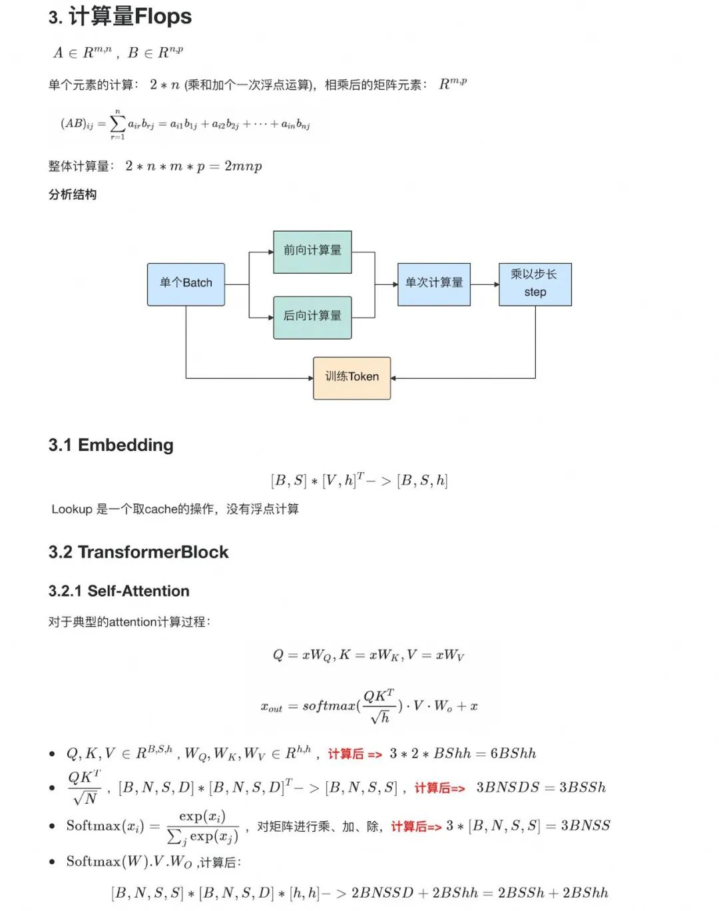
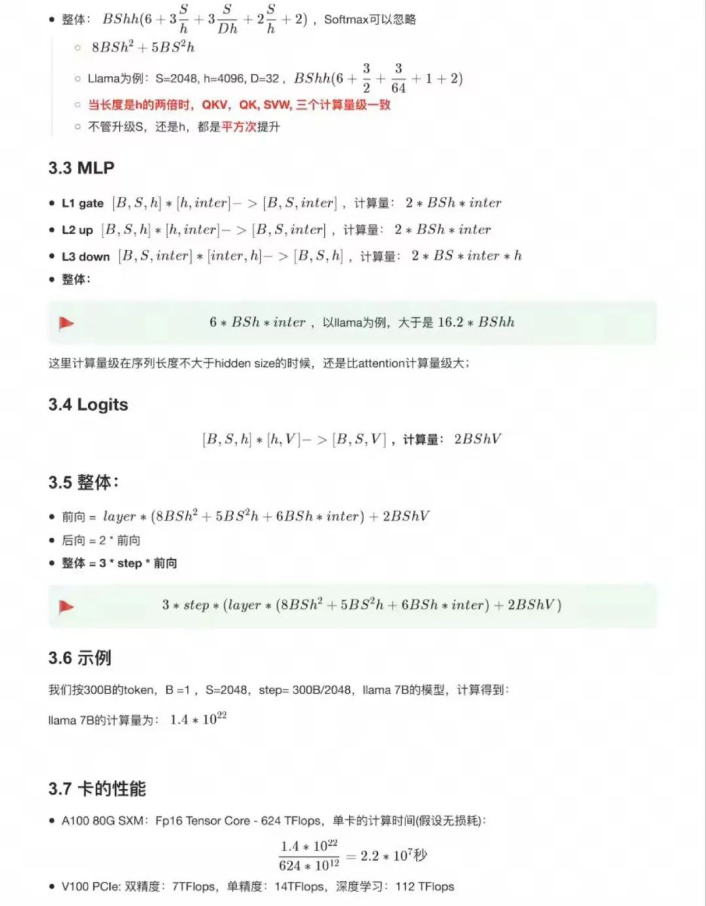

# 1. 简介

大模型的 Scaling Law

OpenAI在2020年提出Scaling Law，具体如下：

1. 对于Decoder-only的模型，计算量C（Flops），模型参数量N（除去Embedding部分），数据大小
  D（token数），三者满足：C~6ND。
2. 模型的最终性能主要与计算量C，模型参数量N
   和数据大小D三者相关，而与模型的具体结构（层数/深度/宽度）基本无关。
   固定模型的总参数量，调整层数/深度/宽度，不同模型的性能差距很小，大部分在2%以内
3. 对于计算量C，模型参数量N和数据大小D，当不受其他两个因素制约时，模型性能与每个因素都呈现幂律关系
4. 为了提升模型性能，模型参数量N和数据大小D
   需要同步放大，但模型和数据分别放大的比例还存在争议。
5. Scaling Law 不仅适用于语言模型，还适用于其他模态以及跨模态的任务2Scaling Law 曲线
   GPT4的计算量C和模型性能满足幂律关系
   - 横轴是归一化之后的计算量；纵轴是"Bits forwords"，这也是交叉熵的一个单位。
   - Baichuan2的Scaling Law 曲线基于10M到3B的模型在1T数据上训练的性能，可预测出最后7B模型和13B模型在2.6T数据上的性能

Scaling Law 的应用
1. 根据幂律定律，模型的参数固定，无限堆数据并不能无限提升模型的性能，模型最终性能会慢慢趋向一个固定的值
2. 根据训练中不同模型的参数和数据量的组合，收集计算量与模型性能的关系。然后可以进一步获得计算效率最优时，即同样计算量下性能最好的模型规模和数据大小的组合，模型大小与计算量的关系，以及数据大小与计算量的关系。
3. 但是计算效率最优这个观点是针对训练阶段而言的，并不是推理阶段，实际应用中推理阶段效率更实用。

# 2. 计算量、参数量和显存占用

# 参考

[1] 《大模型-参数/显存占用/计算量详解》，https://mp.weixin.qq.com/s/Y8HWHjH7WRiLgjojWJSsLQ