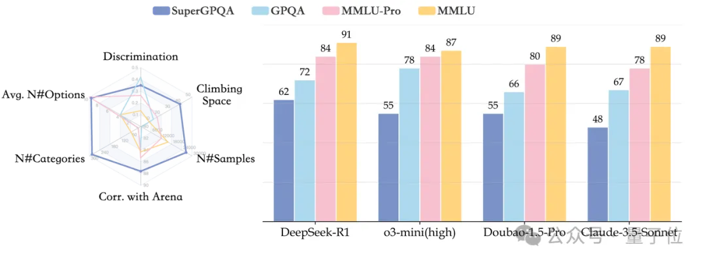
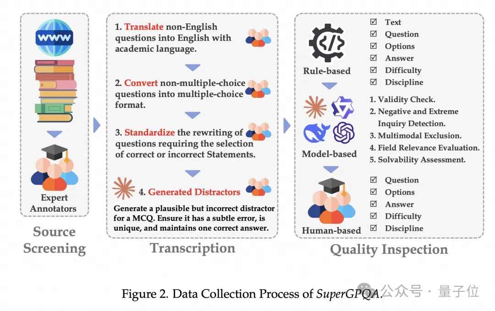
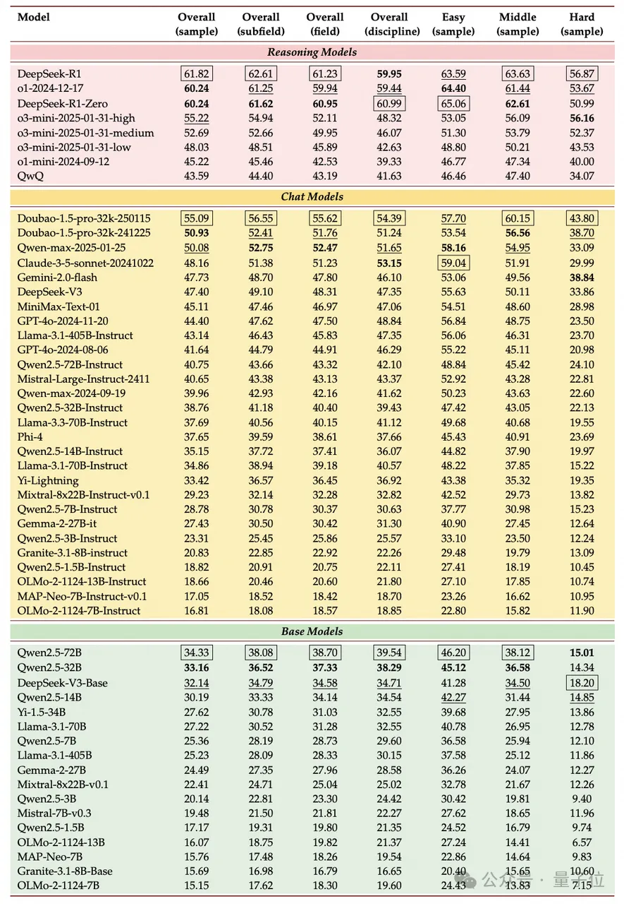
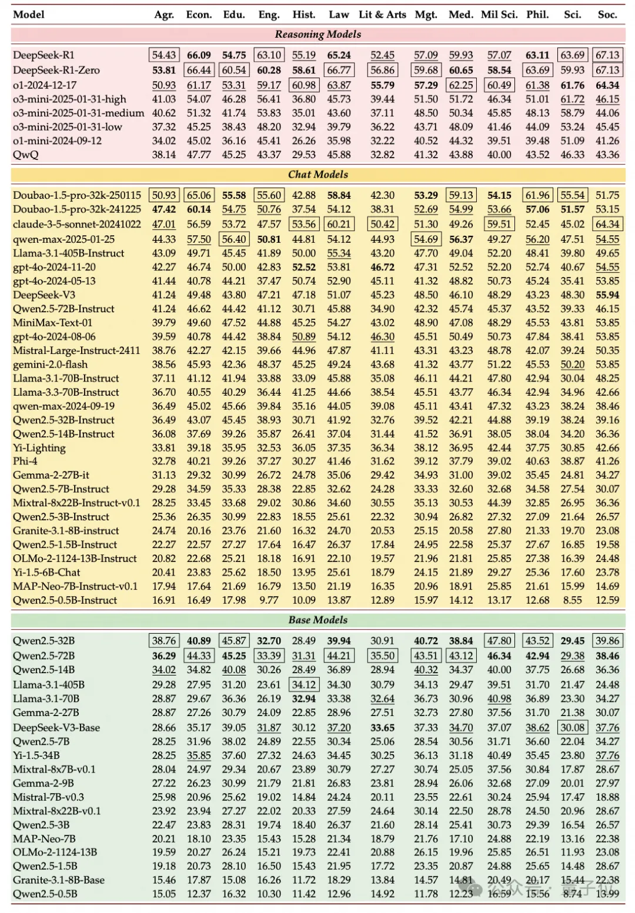

# 1. 资源
- 论文： https://arxiv.org/pdf/2502.14739
- 数据： https://huggingface.co/datasets/m-a-p/SuperGPQA
- 代码： https://github.com/SuperGPQA/SuperGPQA

# 2. 介绍

研究团队构建了迄今为止最全面，覆盖 285 个研究生级学科、包含 26529 道专业题目的评估体系。

实验证明，即便最强的 DeepSeek-R1 在 SuperGPQA 上准确率也才 61.82%，在及格线上挣扎，显著低于其在传统评估指标上的表现。

SuperGPQA 精准直击大模型评测的三大痛点：

- 学科覆盖不全：传统基准仅覆盖 5% 长尾学科，图书馆学、植物学、历史地理学等众多学科长期缺席
- 题目质量存疑：公开题库存在数据污染风险，简单改编无法反映真实学术水平
- 评测维度单一：多数测试停留在知识记忆层面，缺乏高阶推理能力评估

除此之外，SuperGPQA 也公开了严格的数据构建过程。整个体系依靠大规模人机协作系统，结合专家标注、众包注释和大模型协同验证三重流程，确保入选题目具有足够高的质量和区分度。

豆包大模型团队联合 M-A-P 开源社区推出 SuperGPQA，旨在深度挖掘 LLMs 潜力，其特点如下：
- 全面且具区分性：STEM（科学、工程、医学）领域问题占比 77.2%，确保在复杂推理任务中的高效评估。尽管非 STEM 学科（如哲学、文学、历史）问题较少，但仍能有效区分不同 LLMs 的性能。
- 难度分布多样：各学科问题难度均衡分布；在工程和科学领域，难题比例较高。42.33% 的问题需要数学计算或严谨推理，确保模型在高难度任务中的表现。
- 语义结构丰富：t-SNE 可视化显示跨学科聚类模式，工程和科学类问题语义相似，人文学科知识中心独特，不同领域语言特色鲜明。
- 题目设计一致：平均问题长度 58.42 字，选项长度统一，迷惑性和挑战性拉满，评测公平又可靠。

作为基准测试，SuperGPQA 非常全面，覆盖 13 个门类、72 个一级学科和 285 个二级学科，共 26,529 个问题，把现有 GPQA（448 题）和 MMLU-Pro（12,032 题）远远甩在身后。同时，每题平均 9.67 个选项，也比传统 4 选项格式挑战性高得多。

# 3. 构造流程

SuperGPQA 核心架构分三步：来源筛选、转录、质量检测。

团队设计时，深知众包注释方法在高复杂度题目上的不足，因此引入了专家注释员，确保题目来源靠谱、难度合适。再结合最先进的 LLMs 辅助质量检测，效率拉满，也通过多模型协作降低了题目数据泄漏的风险。

此外，团队还强调严格流程管理和持续质量反馈，保证每阶段输出都达标。靠着系统化、专业化流程，SuperGPQA 题库质量飙升，后期修正成本和时间大幅减少。

**来源筛选**

为保证题目高质量，团队直接抛弃众包注释员收集资源的老路，转而让专家注释员从可信来源（教科书、权威练习网站）筛选、收集原始问题。

这招一出，避免了早期大量无效问题的产生，并通过要求提供来源截图，大幅提升了质量检测的效率和准确性。

**转录**

转录阶段，专家注释员对收集的原始问题进行语言规范化、格式转换，确保所有问题都有统一学术语言和标准多项选择题格式。

团队发现，即使是最先进的语言模型（LLMs）在生成干扰项时也存在漏洞，因此需要专家统一重写，以提高干扰项的准确性和有效性，确保题目的挑战性和区分度。

**质量检测**

质量检测阶段采用多层次的检测机制，包括 ：
- 基于规则的初步过滤：识别并过滤格式明显不合规范的题目。
- 基于 LLM 的质量检测：多个先进 LLMs（如 GPT-4、Gemini-flash 等）齐上阵，有效性、负面和极端询问检测、多模态排除、领域相关性评估、区分度标记都不在话下。
- 专家复审：专家注释员对可疑题目进行二次审核，确保题库的高可靠性和高区分度。

# 4. 性能

SuperGPQA 还做了全面的实验，来测试业界主流 LLM 的能力表现。评估涵盖 6 个推理模型、28 个聊天模型、17 个基础模型，闭源、开源、完全开源模型全覆盖。

团队发现，在涵盖 51 个模型的横向评测中，DeepSeek-R1 以 61.82% 准确率登顶，但其表现仍显著低于人类研究生水平（平均 85%+）。

我们从论文中还扒到三大值得关注的结论：

**推理能力决定上限**

推理模型（DeepSeek-R1、O1-2024-12-17）包揽前 3，领先聊天模型超 10 个百分点

DeepSeek-V3 和 Qwen2.5-72B-Instruct 的得分（47.40 和 40.75）远超其基础版本（32.14 和 34.33），说明指令微调显著提升性能

**国内模型突围**

豆包大模型（Doubao-1.5-pro）以 55.09% 准确率位列聊天模型第一，超越 GPT-4o-2024-11-20（44.40%）

Qwen 系列展现强泛化能力：Qwen2.5-72B 在基础模型中排名第 4，超越 Llama-3.1-405B

**学科表现失衡**
- STEM 领域优势显著：在「理论流体力学」「运筹学和控制论」等子领域，Top 模型准确率超 75%
- 人文社科仍是短板：在「舞蹈研究」「设计艺术」等领域，最优模型准确率不足 50%

# 参考

[1] 字节开源全新知识推理测评集，覆盖285个学科, https://mp.weixin.qq.com/s/2QZs9M0M3jfda64rSQuVXg