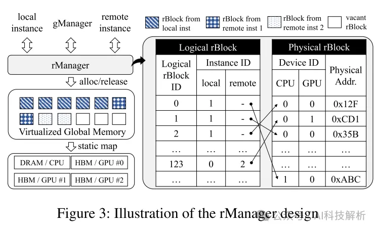
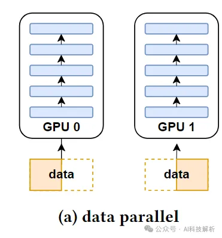
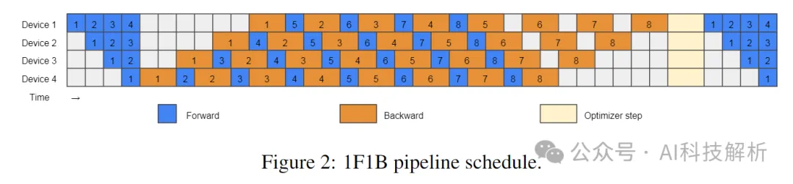
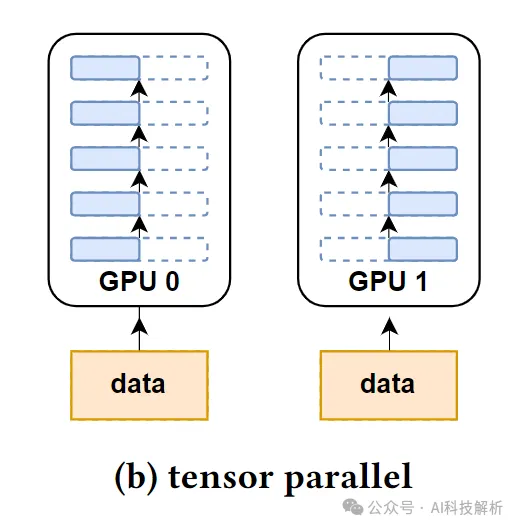
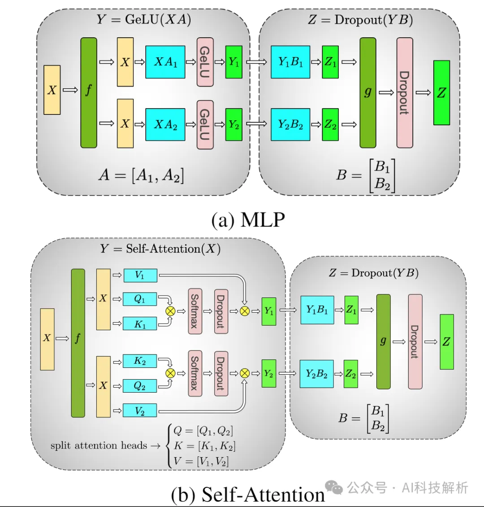
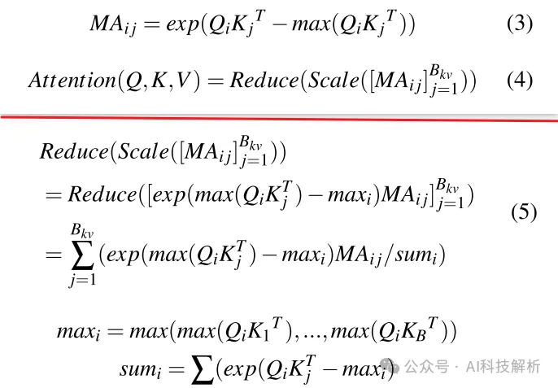
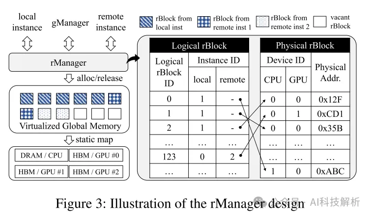
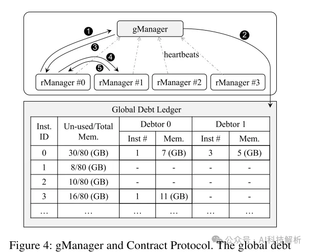
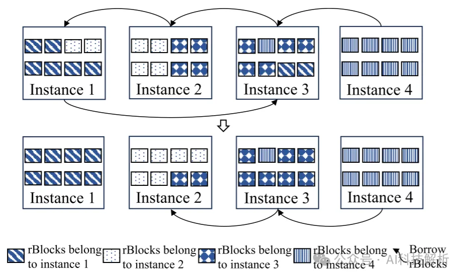
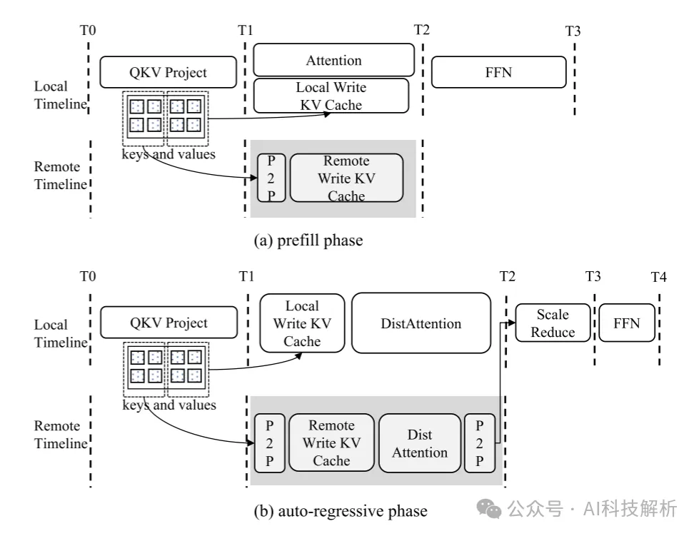

# 1. 资源

Paper：Infinite-LLM: Efficient LLM Service for Long Context with DistAttention and Distributed KVCache

介于LLM自回归生成的性质，阿里和上交团队提出了一种新的分布式注意力算法DistAttention，将KV缓存分割成更小的内存管理单元。并集成到新提出的分布式推理框架DistKV-LLM中，动态管理KV缓存，并有效地编排跨越数据中心的所有可访问的GPU和CPU内存。

1.03-2.4倍的端到端吞吐量改进

支持的上下文长度比当前最先进的LLM服务系统长219倍

# 2. 原理

## 2.1 PagedAttention🐕-> DistAttention🐕

PagedAttention通过促进GPU和CPU内存之间的数据交换来解决这些问题。然而PagedAttention的内存交换范围仅限于单个节点内的GPU和CPU内存，因此限制了容量（vllm对于每个GPU单独创建一个worker->Manager负责管理GPU内存和CPU内存）。

其次，虽然它的分页策略旨在最大限度地减少内存碎片，但它在请求级别上交换整个KV缓存，没有更细粒度的调度。最后，交换请求的计算中断可能会导致运行任务的性能抖动。

DistAttention将KV缓存划分为统一的rBlocks子块，便于模块的分布式计算和内存管理。可以访问所有可访问GPU或CPU内存资源，主动从负载较轻的实例中寻求补充内存。此外，DistKV-LLM优先考虑数据局部性和通信优化，性能提升明显。

## 2.2 模型并行

由于通常需要多卡，因此需要模型并行。

DP（Data parallelism）是每个GPU上存储一份模型，将同一batch的数据分发到不同的GPU上进行处理。

Data parallelism

由于LLM生成长度随机，因此同一batch推理过程中，最后一个token生成时刻，batchsize=1，这种bs不满的状态下GPU使用率极低。因此有了Continuous batching（vllm）和InFlightBatching（Nvidia）动态调整batch大小。

PP（Pipeline parallelism）和TP（Tensor parallelism）是模型无法完全装入单卡时的处理方法。

PP（Pipeline parallelism）是将模型的不同层分别加载到不同的GPU

但不同层之间必须按照顺序执行，因此存在bubble气泡问题，优化点就是尽量将不同GPU之间的不同层的互相等待时间尽量缩短（bubble为0）。

《ZERO BUBBLE(ALMOST) PIPELINE PARALLELISM》https://github.com/sail-sg/zero-bubble-pipeline-parallelism流逝：模型并行训练：零气泡流水线并行 ZERO BUBBLE PIPELINE PARALLELISM

TP（Tensor parallelism）是将每一层的不同部分加载到不同的GPU中。

Megatron-LM是最早提出1D Tensor并行的工作。

由于矩阵左乘计算 ，因此权重W可以按照行进行分块。

这里每一个GPU都有一份输入，最终计算后经过All-reduce操作，每个GPU得有一份输出。（内存冗余）

2D Tensor Parallel基于SUMMA和Cannon矩阵相乘算法沿着两个不同的维度对输入数据，模型权重，每层的输出进行划分。

2.5D Tensor Parallel进一步对2D Tensor优化，增加了 depth 维度。当 depth=1 时等价于2D；同样假设有个GPU，其中，类似于原来2D正方形拓扑结构的边长，而 则是新增加的维度 depth 。可以由用户指定， 则会自动计算出来了。所以一般来说至少需要8个GPU才能运行2.5D算法，即。

3D Tensor Parallel是基于3D矩阵乘法算法实现的。假设有个 GPU，tensor维度大小为，那么每个chunk的大小即为。当tensor维度小于3时，以全连接层为例，假设权重维度大小为,那么可以对第一个维度划分两次，即每个chunk的维度大小为。3D Tensor并行的通信开销复杂度是，计算和内存开销都均摊在所有GPU上。

marsggbo：深度学习并行训练算法一锅炖: DDP, TP, PP, ZeRO

2D/2.5D/3D Tensor 并行算法因为在一开始就对输入进行了划分， 所以中间层不需要做通信，只需要在最后做一次通信即可。

# 3. DistAttention原理

这种方法的关键是将DistAttention划分为多个微注意力模块（MA），每个MA包含KV缓存令牌的子序列。它能够通过单独执行MA来计算注意力结果。当所有微注意力模块（MA）完成对它们各自的令牌子块的计算时，通过All-reduce过程获得最终的attention结果。

rBlock and rManager（内存Block和管理模块）

LLM的键值（KV）缓存被分割成更小的单元，称为rBlocks。每个rBlock包含一组向量，对应于固定数量的键值标记。

每个LLM服务实例都配备有专用的rBlock管理器，称为rManager。rManager负责监督位于本地设备中的所有rBlock。它通过将GPU的全局内存空间划分为固定大小的物理rBlock来有效地虚拟化GPU的全局内存空间。

rManager维护一个详细的表，该表将这些逻辑rBlock映射到全局内存中对应的物理rBlock地址。

rManager查询rBlock表以标识第一个可用的物理rBlock空间。在没有足够空间的情况下，rManager会启动从其他实例借用空间的过程。

The gManager and Contract Protocol（全局内存管理模块）

gManager作为一个集中式管理器，维护所有实例的全局内存信息。每个实例周期性地向gManager发送心跳信号，传达关于其剩余可用内存空间的更新。

每当一个实例的rBlocks内存空间不足时，相应的rManager会从相邻实例中借用GPU或CPU内存空间。

Fragmented Memory Management（碎片化内存管理）

问题：处理长上下文内存时内存请求数量会不断增长，需要从远程实例借用内存。相反，生成短上下文的实例会更快地释放内存空间，然后可以将其借给其他实例或分配给新请求。等当前实例需要内存时，本地缺乏足够内存，导致只能向远程实例申请。大量的远程内存访问导致延迟增加和吞吐量降低。

解决方案：提出了一个基于债务图（debt-graph-based）的碎片内存管理算法，即DGFM。目的是远程申请内存时，对远程实例在本地申请的内存进行交换。将远程内存变为本地内存。

首先，我们构建一个有向图，反映这些债务关系，其中每个节点象征着一个实例，每个有向边表示从一个实例欠另一个实例的债务。然后迭代地应用我们的算法。在每次迭代期间，算法随机选择一个节点并遍历图以识别有向圆。发现这样一个循环是关键;它表明所涉及的节点或实例可以相互解决它们的债务。这种解决方案是通过策略性地调用和交换它们各自的内存块来实现的，从而提高了整体系统效率和内存利用率。

DGFM算法由gManager执行。当定向循环被识别时，gManager向相应实例中的rManager发出请求，冻结它们的修改或取消。我们为每个节点上要交换的最小内存块（rBlocks）数量设置了一个经验阈值，以防止对过小内存块进行低效的召回和交换操作。这个过程大大减少了对远程数据库访问的需求，从而增强了数据本地性，并最终导致系统性能的显著改善。

Communication Optimization（通信优化）

在LLM服务中执行长上下文任务期间，预填充和自回归阶段都可能生成大量KV Cache，从而导致rManager借用远程空间。

在预填充阶段，KV Cache的内存需求可以根据提示的长度精确预测。可以预先对rBlock分配—根据其存储位置指定为本地或远程。当执行注意力计算时，将注意力的计算时间与远程rBlocks的传输并行处理。

自回归阶段，将所有rBlocks返回本地计算会导致过多的网络流量。由于注意力模块的计算基本上是一个向量矩阵乘法，因此将query数据传输到远程节点（相比传输kv回来，数据量更小）进行多节点计算，最终将计算结果发送回当前节点。在一定程度可以延缓每个节点的带宽瓶颈问题。但会借用远程节点的计算资源，因此也需要获取节点GPU状态判断是否能够借用。

工程细节

DistAttn结合了基于输入维度的自适应内核选择过程。上下文长度分为三组：正常范围（0- 8 k），长范围（8 k-32 k）和超长范围（> 32 k），精心优化了三种不同的内核模板，实现了一种启发式方法来微调CUDA内核，以适应特定的张量形状。

# 4. 性能评估

吞吐量、长上下文支持度都比vllm更好。

# 5. 总结

LM-Infinite提出了DistKV-LLM（DistAttention）推理框架，与vllm（PagedAttention）相比，在多卡多节点场景下，可以调度更多的内存，从而支持更长的上下文和更大的吞吐量。

# 参考

[1] 强！LLM前沿技术跟踪：比vllm更强的多节点推理框架LM-Infinite，https://mp.weixin.qq.com/s/GXdFS_0YIh7mrwUD1RrgLw