# 1. 简介

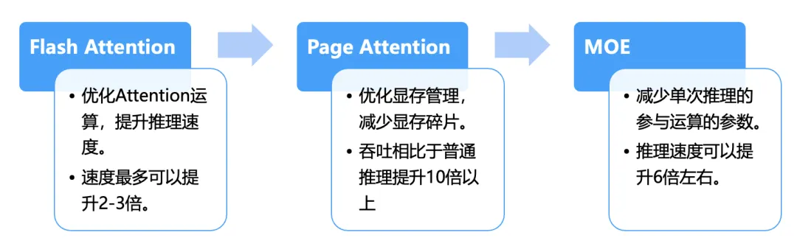

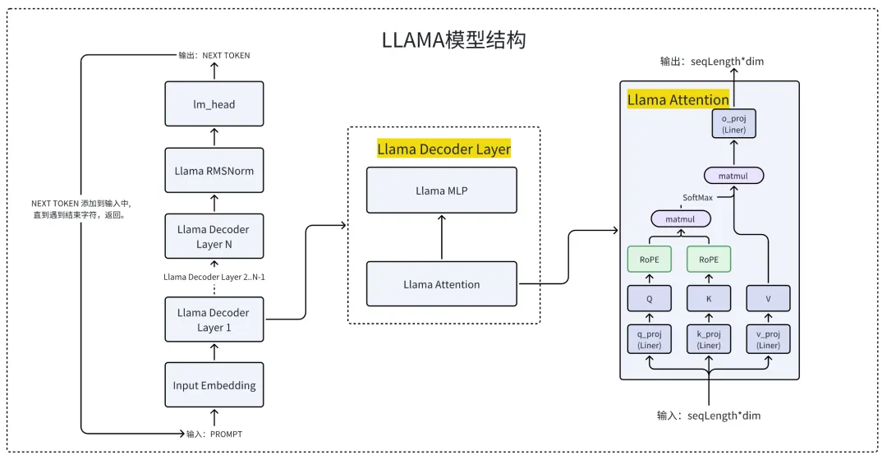

从Llama 2模型的结构分析中，我们可以总结出大模型在推理计算过程中表现出以下特点：
- 在整个推理过程中，最耗时的部分为注意力(Attention)计算。针对Attention的计算进行速度优化，可以显著提高整体推理性能。
- 注意力(Attention)计算过程中，键值对缓存(KV Cache)占用了大量显存资源。以13B模型为例，处理一个Prompt序列大约需要3GB额外显存，并且这部分显存会被频繁地分配和释放，产生大量碎片，如果能减少显存碎片，也能提升大模型的吞吐。
- 推理过程GPU需要处理和计算大量的参数。7B模型拥有70亿参数，而13B模型则包含130亿参数，最新全球最强大模型DBRX更是高达1300亿参数，这需要高效地处理这些参数。这里也可以有优化空间。

针对上述三个特性，目前业界提出了多种有效的优化方法，典型如下：

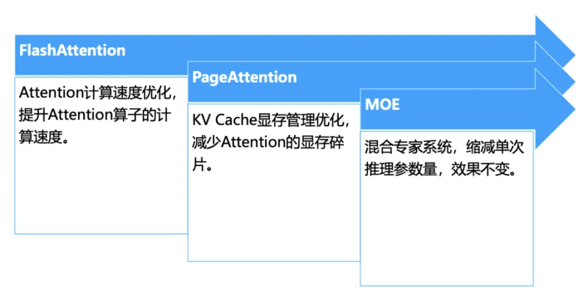

1. FlashAttention-Attention计算速度优化
    FlashAttention[1]在不改变Attention算子的计算结果的前提下，提升Attention算子的计算速度。FlashAttention在各种模型和任务上展示了显著的性能提升。例如，在BERT-large、GPT-2等模型上，相比于基线实现，FlashAttention能够实现15%到3倍的端到端加速。

2. PageAttention-KV Cache显存管理优化
   PageAttention[3]的目标是减少显存碎片，基于PageAttention的VLLM系统能够将流行的大型语言模型（LLM）的吞吐量提高到10倍以上，同时保持耗时分布平稳。

3. MOE-缩减推理时模型参数
   - MOE(Mixture of Experts)[4]目标是减少模型推理时参与计算的参数量。
   - 实验效果：Mixtral模型在多数基准测试中表现优于Llama 2 70B模型，并且其推理速度比后者快了6倍。该模型支持多种语言，具有强大的代码生成能力，并可以细化配置以遵循具体指令，从而在MT-Bench基准测试中取得了高分。

# 2. 优化详解
## 2.1 FlashAttention-Attention算子计算优化

FlashAttention先后发表了两篇论文阐述对Attention算子的优化，包括FlashAttention-1[1]与FlashAttention-2[2]，我们以FlashAttention-1[1]为例了解下他的优化原理。

我们先了解下GPU的内存分层结构，参考下图，图片来自论文FlashAttention-1[1]。

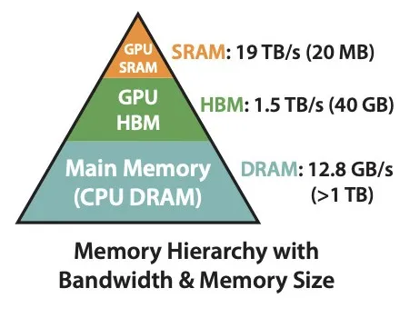

GPU的内存层次结构由三个主要部分组成：SRAM、HBM和DRAM，下面为A100GPU的参考配置。

SRAM（静态随机访问存储器）具有最快的访问速度（19TB/s），但其容量相对较小（仅20MB）。

HBM（高带宽存储器）提供较大的存储空间（40GB）和高速的数据访问（1.5TB/s）。

DRAM（动态随机访问存储器），在这里特指GPU外部的主存，容量最大（超过1TB），但访问速度最慢（12.8GB/s）。

从上述配置中可以看出，内存容量越小，处理速度就越快。

在传统的Attention计算过程中，大量的输入/输出操作都是通过访问HBM来完成的。FlashAttention算法通过优化Attention计算流程，减少了对HBM的访问次数，以提高计算效率，所以它是一种IO感知的优化算法。

下图为FlashAttention的加速方法，来自论文FlashAttention-1[1]

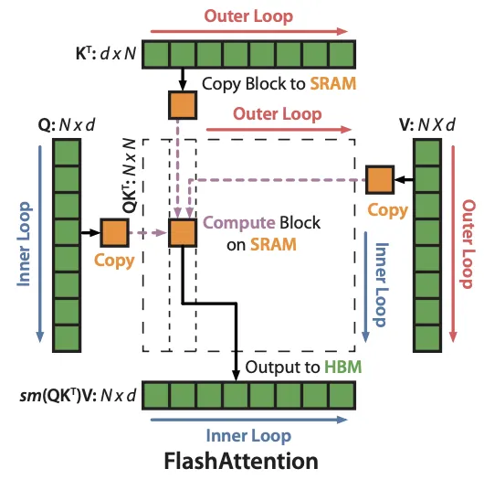

FlashAttention利用了一个聪明的技巧来快速且内存高效地计算注意力机制，即它通过将输入数据分块（tiling）来避免一次性处理整个巨大的注意力矩阵，这通常需要大量的内存和计算资源。想象一下，我们有一个巨大的图书馆(矩阵)，而FlashAttention的方法就像是把图书馆里的书分成几个小堆，然后每次只处理一堆书。这样，我们就不需要一次性把所有书都拿出来放在桌子上（这需要很大的桌子和很多时间）。

具体来说，FlashAttention在做矩阵计算的时候，通过将数据分块并利用GPU上的快速但容量较小的存储（SRAM）去计算，有效减少了对慢速但容量大的存储（HBM）的访问。这样不仅加快了计算速度，而且大幅减少了显存的需求。

通过减少对慢速存储的依赖，FlashAttention能够显著提高模型训练的速度，同时保持或甚至提高模型的性能。例如，让BERT-large的训练比MLPerf 1.1的记录快15%，GPT-2训练速度是HuggingFace和Megatron-LM基线的三倍，长序列领域训练速度提升至2.4倍。

下图来自huggingface 对flash attention介绍的blog[14]，可以更好的理解Flash Attention对矩阵拆分的方式。

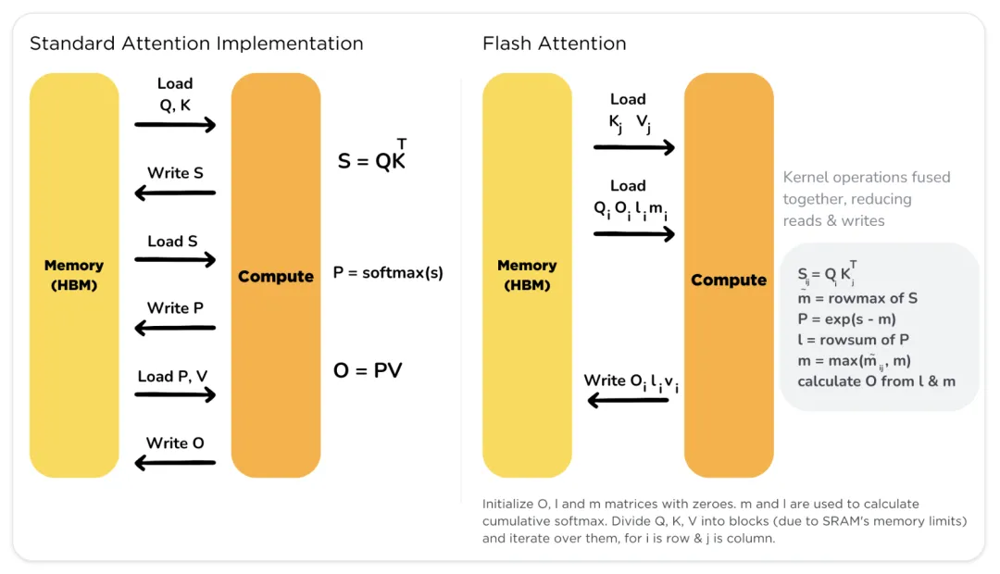

## 2.2 PageAttention-KV Cache显存管理优化

PageAttention[3]的概念最初由VLLM的作者Woosuk Kwon提出，它也是VLLM推理框架的最主要的优化策略。Woosuk Kwon在其论文中介绍了如何通过PageAttention来解决大型语言模型（LLM）服务中的一个关键问题——在不增加延迟的情况下有效管理内存以提升吞吐量。

我们先了解下大模型在推理的情况下的内存结构分布，下图来自论文[3]。

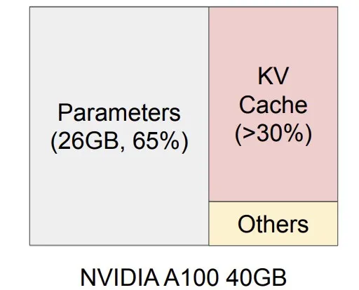

这是一个在NVIDIA A100上服务一个拥有13B参数的大型语言模型的内存布局，13B LLM 推理显存占用分部，13B LLM的参数占用26G显存，每个请求，KV Cache会占用12G显存，随着QPS的增加，KVCache会快速上升，并且会被频繁的分配与释放，系统会产生大量的显存碎片，如果不加处理，系统就会慢慢崩掉。

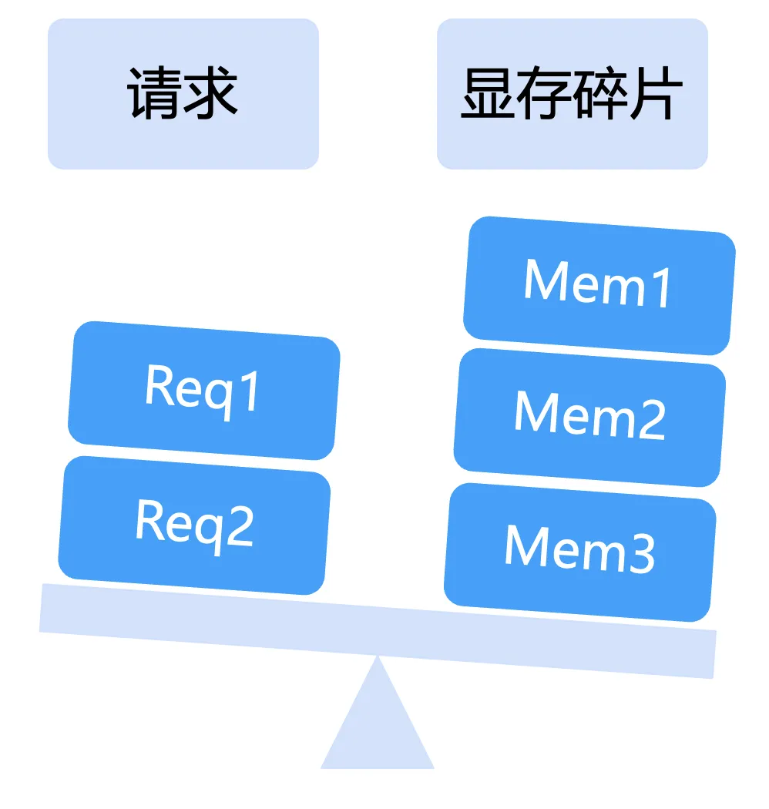

那么VLLM是如何通过PageAttention解决显存碎片的问题的呢？下图来自文章[14]，为VLLM的显存管理技术。

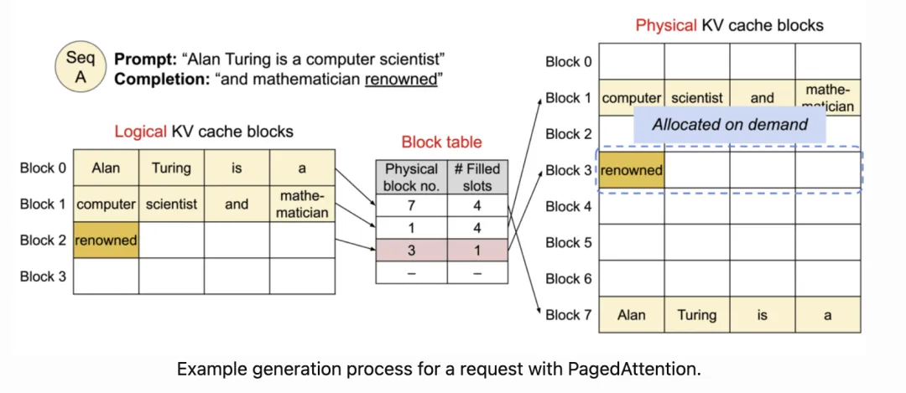

PageAttention的工作原理是通过将键值缓存（KV缓存）分割成固定大小的块（或“页面”），并允许这些块在内存中非连续地存储。这种方法灵感来源于操作系统的虚拟内存和分页技术，目的是为了更灵活和高效地管理内存资源。

在传统的注意力机制中，一个请求的KV缓存需要在内存中连续存储，这会导致两个主要问题：内存碎片化和无法高效共享内存。内存碎片化限制了批处理的大小，而无法共享内存则导致重复数据，浪费宝贵的内存资源。

PageAttention通过以下步骤工作来解决这些问题：
1. 分割KV缓存：将每个请求的KV缓存划分为多个较小的块，这些块的大小是固定的，可以根据模型和硬件的具体需求进行调整。
2. 非连续存储：与传统KV缓存块在内存中连续存储不同，PageAttention允许这些块在物理内存中非连续地分布。这样，就可以根据实际需要动态地分配和回收内存块，减少内存浪费。
3. 动态管理：通过类似于操作系统中虚拟内存管理的方式，PageAttention动态地管理这些内存块。系统可以根据当前的内存使用情况，按需分配或释放KV缓存块，从而优化内存使用。
4. 内存共享：PageAttention还支持在不同请求之间或同一个请求中的不同序列之间共享KV缓存块。这种共享是灵活的，可以基于块级别进行，进一步减少内存使用和提高效率。

通过这种方式，PageAttention允许LLM服务系统在保持相同延迟的情况下，通过减少内存浪费和提高内存共享，显著提高处理请求的吞吐量。

通过PageAttention的优化，VLLM对LLaMA 7B与13B的吞吐量提升了10倍以上，下图来自文章[11]。

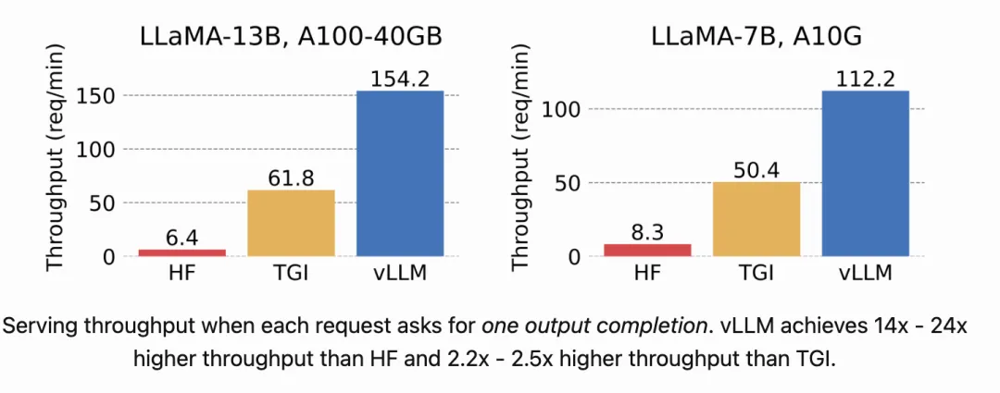

## 2.3 MOE-缩减推理时模型参数

最近发布的全球最强开源大模型1300亿参数的DBRX，以及Mistral的8x7B开源大模型都是基于MOE架构的。为什么参数量越大的模型越要使用MOE架构呢？我们以Mistral的8x7B开源大模型为例，介绍下MOE架构在性能方面的优势。

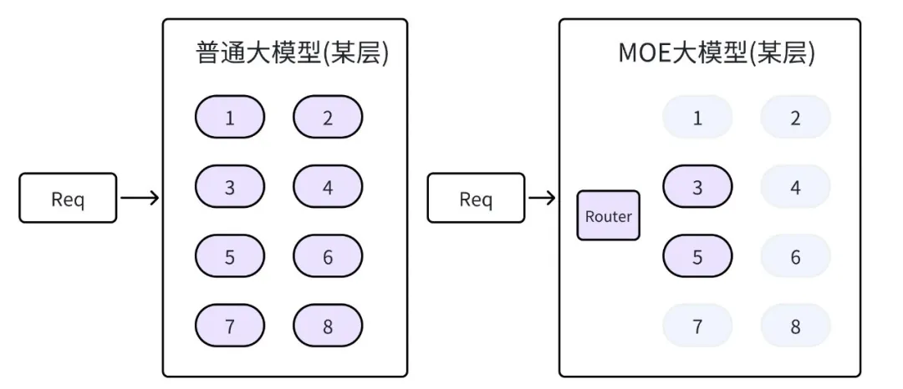

说到MOE大模型，我们先对比下普通大模型与MOE大模型在结构上的区别，参考上图。在MOE大模型中，把大模型的参数分成了8个小组外加一个路由器，每个小组我们称作专家组。当请求过来的时候，MOE大模型则先有路由器从8个专家组中选择两个，只有这两个专家组参与了计算。而对比普通大模型，则需要所有参数都参加GPU计算。

所以MOE大模型要比同等级的普通大模型推理速度快四倍左右。

我们来看下Mistral MOE的实现，Mistral MOE是由mistral.ai发布的8*7B大模型[12]，下图来自论文[12]，是其8*7B大模型的专家层的结构。

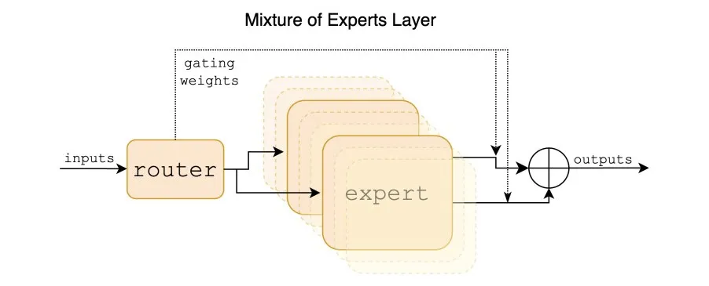

Mixtral 8x7B是一个稀疏混合专家（Sparse Mixture of Experts, SMoE）语言模型，它基于Mistral 7B的架构，但每一层都由8个前馈块（即专家）组成。在处理每个令牌时，每层的一个路由网络会选择两个专家来处理当前状态并结合它们的输出。虽然每个令牌只与两个专家交互，但在每个时间步骤中选取的专家可以不同，因此每个令牌可以接触到47B的参数，但在推理过程中只使用13B的活跃参数。

Mixtral在多项基准测试上展示了其卓越的性能，尤其是在数学、代码生成和多语言理解方面。相比于Llama 2 70B和GPT-3.5，Mixtral在大多数评估指标上表现出类似或更优的性能。具体来说，Mixtral使用的活跃参数（13B）比Llama 2 70B（70B）少5倍，但在几乎所有类别中的表现都更好或相当。

MOE大模型实现了增加参数量的同时，推理速度并不降低，是未来大模型的发展趋势。

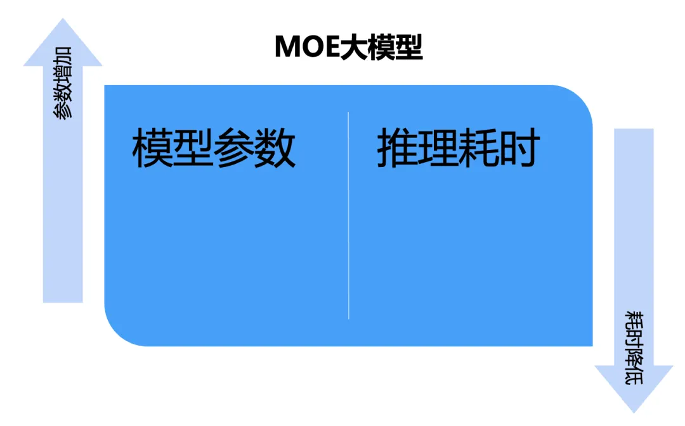

## 2.4 Tensor parallelize-张量并行

如果你有多卡GPU，可以采用张量并行进一步加速大模型的推理速度。

想象一下，你有一本非常厚的书，你想一次性复印整本书，但是你的复印机一次只能复印几页。这时，你可以把这本书分成几个部分，每个部分分别复印，最后再把所有复印好的部分按顺序拼接起来，这样就完成了整本书的复印。

在张量并行中，我们要处理的大模型就像是那本厚书，而GPU则像是复印机。因为单个GPU无法一次处理整个大模型，我们就需要把模型（在这个例子中是权重张量）分成几个部分，让不同的GPU分别处理（相当于复印书的不同部分）。在处理输入数据时，就像是把书的每一页分别复印，然后再把复印好的各个部分拼接起来，形成完整的输出结果。

这样，通过分担工作，多个GPU协同完成了一个本来单个GPU无法完成的大任务。这就是张量并行的工作方式，它让我们能够处理那些非常大的模型。

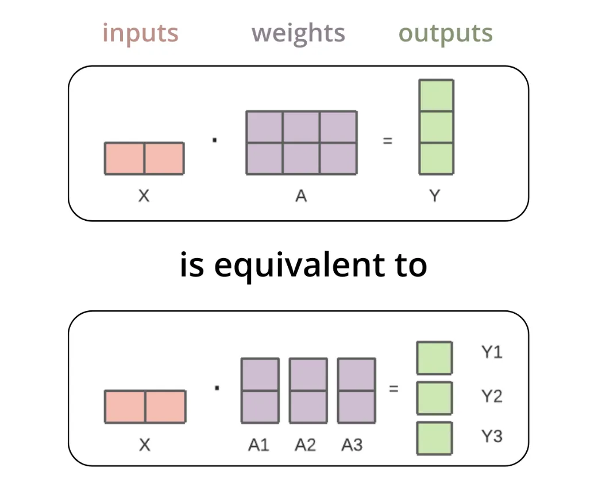

张量并行技术用于将大模型分布式地部署在多个GPU上。以矩阵乘法来打个比方，当输入张量与第一个权重张量进行矩阵相乘时，这个操作可以视作先将权重张量按列进行分割，接着将分割后的每列分别与输入张量相乘，然后把这些乘积结果合并。这些合并后的输出会被从GPU中导出，并聚合以形成最终的输出结果，过程上图，参考文章[13]。

# 3. 推理框架推荐

在前文中，我们探讨了几种加速和优化技术，诸如Flash Attention、Page Attention、MOE以及张量并行技术。接下来，基于我们自身的实际操作和评估，我们将向您推荐一些当前表现较为出色的推理框架。

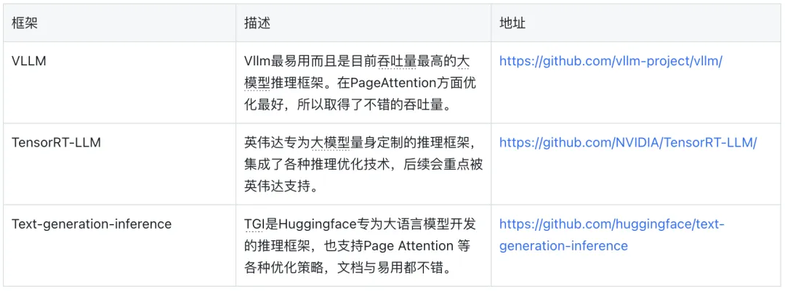

# 4. 总结与展望

在本文中，我们深入探讨了一系列旨在提升大模型推理速度的技术和方法，包括但不限于Flash Attention、Page Attention、MOE以及张量并行技术。通过在生产环境中批量部署专用大模型推理集群，我们成功地将包括70B规模模型在内的推理速度降低了50%，稳定地应用这些技术于生产环境，从而证明了这些优化方法的有效性和实用性。

随着大型模型在各个领域的应用越来越广泛，如何有效地提升推理速度、降低推理成本成为了一项挑战。我们的实践不仅展示了目前可用的一些加速技术，还基于我们的经验，推荐了几款经过评测表现优秀的大模型推理框架。这些建议旨在帮助读者在面对众多选择时，能够挑选出最适合自己需求的推理框架。

展望未来，随着技术的不断进步和新算法的不断涌现，我们相信还会有更多的加速优化技术被开发出来，进一步推动大模型推理效率的提升。最后，我们也期待未来有机会深入探讨和介绍更多提升大模型推理速度的新技术和方法。

# 参考

[0] KubeAI大模型推理加速实践｜得物技术，https://mp.weixin.qq.com/s/gFSakZKt4qay5QaKSmkKaw
[1] FlashAttention: Fast and Memory-Efficient Exact Attention with IO-Awareness(https://arxiv.org/abs/2205.14135)
[2] FlashAttention-2: Faster Attention with Better Parallelism and Work Partitioning(https://arxiv.org/abs/2307.08691)
[3] Efficient Memory Management for Large Language Model Serving with PagedAttention(https://arxiv.org/abs/2309.06180)
[4] mixtral-of-experts(https://mistral.ai/news/mixtral-of-experts/)
[5] Mixtral of Experts(https://arxiv.org/abs/2401.04088)
[6] MEDUSA: Simple LLM Inference Acceleration Framework with Multiple Decoding Heads(https://arxiv.org/pdf/2401.10774.pdf)
[7] Scaling Laws for Neural Language Models(https://arxiv.org/pdf/2001.08361.pdf)
[8] Hyung Won Chung(OpenAI), Large Language Models (in 2023) , talked at Seoul National University
[9] Llama 2: Open Foundation and Fine-Tuned Chat Models(https://arxiv.org/abs/2307.09288)
[10] Attention Is All You Need(https://arxiv.org/pdf/1706.03762.pdf)
[11] https://blog.vllm.ai/2023/06/20/vllm.html
[12] https://arxiv.org/pdf/2401.04088.pdf
[13] https://huggingface.co/docs/text-generation-inference/en/conceptual/tensor_parallelism
[14] https://huggingface.co/docs/text-generation-inference/en/conceptual/flash_attention
[15] https://blog.vllm.ai/2023/06/20/vllm.html