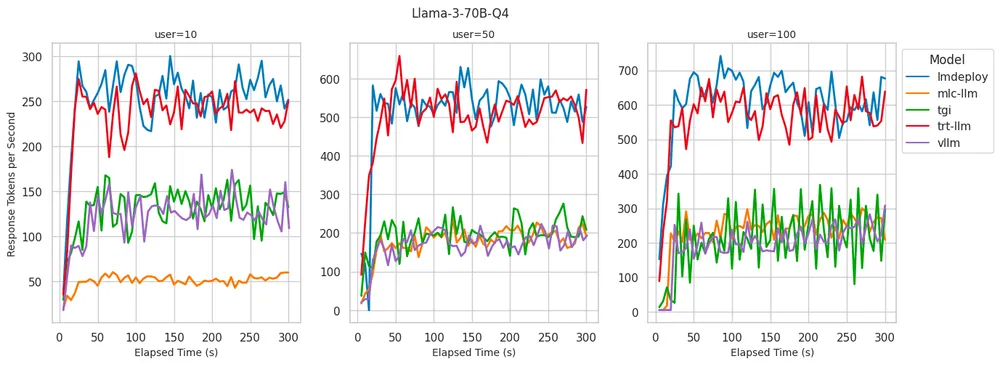

# 0. 资源

测试脚本：https://github.com/bentoml/llm-bench

文档：

- BentoVLLM：https://github.com/bentoml/BentoVLLM
- BentoMLCLLM：https://github.com/bentoml/BentoMLCLLM
- BentoLMDeploy：https://github.com/bentoml/BentoLMDeploy
- BentoTRTLLM：https://github.com/bentoml/BentoTRTLLM
- BentoTGI：https://github.com/bentoml/BentoTGI

# 1. 简介

BentoML 工程团队在 BentoCloud 上，分别使用 vLLM、LMDeploy、MLC-LLM、TensorRT-LLM 和 Hugging Face TGI 搭建了 Llama 3 推理服务，并对推理性能进行了全面的基准测试。

这些推理后端使用以下两个关键指标进行评估：

- Time to First Token (TTFT)：首 token 延时，衡量从发送请求到生成第一个 token 所花费的时间，以毫秒为单位。对于需要即时反馈的应用（如交互式聊天机器人）来说，TTFT 非常重要。更低的延迟可以提高感知性能和用户满意度。
- Token Generation Rate：token 生成率，评估模型在 decoding 阶段每秒生成的 token 数量，以 token 每秒为单位。token 生成率是衡量模型处理高负载能力的指标。较高的生成率表明模型能够高效地处理多个请求并快速生成响应，适合高并发环境。

# 2. 实验对比

在 BentoCloud 上使用 A100 80GB GPU 实例（ gpu.a100.1x80 ）对 Llama 3 8B 和 70B 4-bit 量化模型进行了基准测试，涵盖了三种不同的推理负载（10、50 和 100 个并发用户）。以下是我们的一些主要的发现：

## 2.1 Llama 3 8B

- LMDeploy：在 token 生成率方面表现最佳。对于 100 个并发用户，每秒生成高达 4000 个 token。在 10 名用户的情况下实现了同类最佳的 TTFT。尽管随着用户数量的增加，TTFT 会逐渐增加，但始终保持在较低水平且在可接受的范围内。
- MLC-LLM：实现了略低的 decoding 性能，对于 100 个用户而言，每秒可处理约 3500 个 token。然而，在运行基准测试 5 分钟后，性能有所下降，降至每秒约 3100 个 token。当用户数达到 100 时，TTFT 性能会显著下降。
- vLLM：在所有并发用户级别上实现了同类最佳的 TTFT 性能。但是，其 decoding 性能与 LMDeploy 和 MLC-LLM 相比稍显逊色，每秒 decoding 2300-2500 个 token，与 TGI 和 TRT-LLM 类似。

## 2.2 LLama3 70B 4bit 量化

- LMDeploy：在服务 100 个用户时提供了最佳的 token 生成率，达到每秒 700 token，同时在所有并发用户级别上保持最低的 TTFT。
- TensorRT-LLM：在 token 生成率方面表现出与 LMDeploy 相似的性能，在低并发用户数时保持了较低的 TTFT。但是，当并发用户数达到 100 时，TTFT 显著增加至 6 秒以上。
- vLLM：在所有并发用户级别上都表现出了稳定的低 TTFT，这与我们在 8B 模型上看到的情况类似。相比于 LMDeploy 和 TensorRT-LLM，其生成 token 的速度较低，这可能是由于缺乏针对量化模型的推理优化所致。

我们发现，token 生成率与推理后端实现的 GPU 利用率之间存在很强的相关性。能够维持高 token 生成率的后端也显示出接近100%的 GPU 利用率。相反，GPU 利用率较低的后端似乎受到了 Python 进程的限制。

# 3. 框架选择

在为 LLMs 服务选择推理后端时，除了性能，还有其他一些重要考虑因素。以下是我们认为在选择理想推理后端时需要考虑的关键维度：

## 3.1 开发者体验

用户友好的推理后端应该为在 LLMs 上运行的 AI 应用提供快速开发能力和代码的高可维护性。

稳定版本：LMDeploy、TensorRT-LLM、vLLM 和 TGI 均提供稳定版本。MLC-LLM 目前没有稳定的标记版本，只有夜间构建；一种可能的解决方案是从源代码构建。

模型编译：TensorRT-LLM 和 MLC-LLM 需要明确的模型编译步骤，这可能会在部署期间引入额外的冷启动延迟。

文档：

- LMDeploy、vLLM 和 TGI 的文档全面且包含示例，易于学习。
- MLC-LLM 的学习曲线适中，这主要是因为需要了解模型编译步骤。
- 在我们的基准测试中，TensorRT-LLM 的设置最具挑战性。由于没有足够的优质示例，我们不得不通读 TensorRT-LLM、tensorrtllm_backend 和 Triton Inference Server 的文档，转换模型，构建 TRT 引擎，并编写大量配置。

不同的后端提供各种方式来服务 LLM，每种方式都有独特的功能和优化技术。我们测试的所有推理后端均遵循 Apache 2.0 许可证。

- LMDeploy：推理后端专注于提供高 decoding 速度和高效处理并发请求。它支持各种量化技术，适合部署内存要求较低的大型模型。
- vLLM：为服务 LLM 而优化的高性能推理引擎。它以高效利用 GPU 资源和快速 decoding 能力而闻名。
- TensorRT-LLM：推理后端利用了 NVIDIA 的 TensorRT（一种高性能深度学习推理库）。它针对在 NVIDIA GPU 上运行大型模型进行了优化，提供快速推理并支持量化等高级优化。
- Hugging Face Text Generation Inference (TGI)：用于部署和服务 LLM 的工具包。它在 Hugging Face 的生产中用于为 Hugging Chat、推理 API 和推理端点提供支持。
- MLC-LLM：适用于 LLM 的 ML 编译器和高性能部署引擎。它建立在 Apache TVM 之上，在提供模型之前需要进行编译和权重转换。

将 BentoML 与各种推理后端集成以自托管 LLM 非常简单。BentoML 社区在 GitHub 上提供了以下示例项目来协助您完成整个过程。

- BentoVLLM：https://github.com/bentoml/BentoVLLM
- BentoMLCLLM：https://github.com/bentoml/BentoMLCLLM
- BentoLMDeploy：https://github.com/bentoml/BentoLMDeploy
- BentoTRTLLM：https://github.com/bentoml/BentoTRTLLM
- BentoTGI：https://github.com/bentoml/BentoTGI

## 3.2 测试方法

### 3.2.1 基准测试客户端

为了准确评估不同 LLM 后端的性能，我们创建了一个自定义基准测试脚本。该脚本通过改变用户负载并在不同并发级别下发送生成请求来模拟真实场景。

我们的基准客户端可以在 20 秒内生成目标数量的用户，之后它会通过发送带有随机选择提示词的并发生成请求来对 LLM 后端进行压力测试。我们测试了 10、50 和 100 个并发用户，以评估系统在不同负载下的表现。

每次压力测试都持续了5分钟，在此期间，我们每5秒收集一次推理指标。这个持续时间足以观察到潜在的性能下降、资源利用瓶颈或其他在较短测试中可能无法显现的问题。

想了解更多信息，请查看我们基准测试客户端的源代码：https://github.com/bentoml/llm-bench

### 3.2.2 提示词数据集

我们的测试提示词是从 databricks-dolly-15k 数据集提取的。对于每个测试会话，我们从该数据集中随机选择提示词。我们还测试了有系统提示和无系统提示的文本生成。一些后端可能通过启用前缀缓存来优化常见的系统提示场景。

### 3.2.3 库版本（Library versions）

- BentoML: 1.2.16
- vLLM: 0.4.2
- MLC-LLM: mlc-llm-nightly-cu121 0.1.dev1251 (No stable release yet)
- LMDeploy: 0.4.0
- TensorRT-LLM: 0.9.0 (with Triton v24.04)
- TGI: 2.0.4

# 参考

[1] LLM后端推理引擎性能大比拼, https://mp.weixin.qq.com/s/dPd84P_VdKog8v2IcHDOrQ