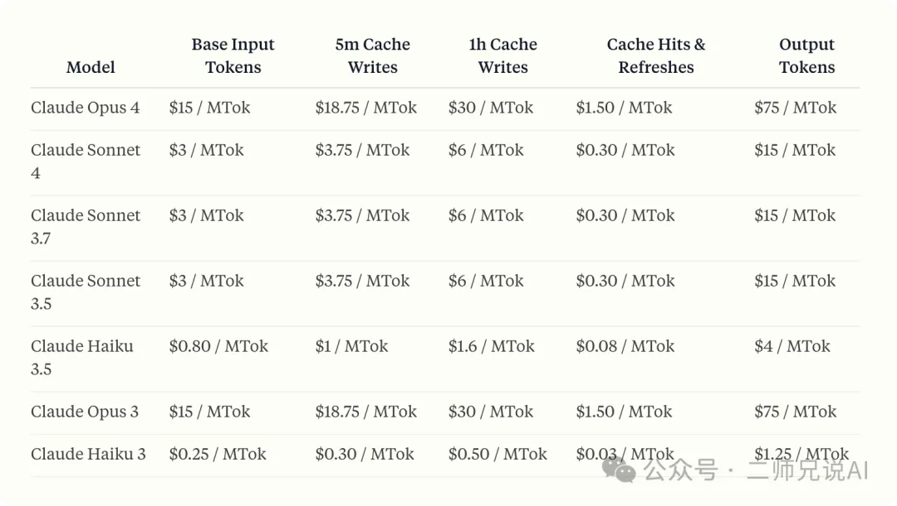

提示词缓存（Prompt Caching） 允许你将输入中的大段稳定内容（如长文档、背景信息、系统指令等）缓存起来。这样后续请求只要内容不变，就能直接复用缓存，避免重复处理，显著提升响应速度并节省费用。适用于多轮对话、长文档分析、批量问答等场景。

类似 Redis 等缓存策略，当有大量重复利用的上下文时，建议启用提示词缓存。

不同的是，提示词缓存更偏好长内容，因为缓存读取只要基础输入的10%的费用。

比如可以针对以下场景进行针对性的优化：

• 对话型机器人：对于包含长指令或需要上传文档的持续对话，缓存能有效降低每轮对话的成本和延迟。
• 代码助手：将代码库摘要或相关代码片段缓存后，可以更高效地实现代码自动补全和问答。
• 大文档处理：可以将整本书、长论文或包含图片的文档一次性缓存，后续多次提问时无需重复上传，提升响应速度且不增加延迟。
• 复杂指令和示例：如果需要让模型参考大量指令、流程或示例，缓存后可以在每次调用时直接复用，支持更丰富和多样化的高质量案例。
• 多工具和多步骤流程：在涉及多次工具调用或代码迭代的场景中，缓存可减少每一步的重复输入，提高整体处理效率。
• 知识库互动：如与书籍、论文、文档、播客转录等长文本内容交互时，将整个文档缓存后，用户可以多次提问，体验更流畅。
通过结合自身场景，合理利用缓存，可以显著优化API调用的成本和响应速度。

# 参考

[1] Anthropic 新功能解读：提示词缓存（Prompt Caching）, https://mp.weixin.qq.com/s/DiYRUaFGDwI2yx-vvlNSMw