# 1. 简介

本文中我们继续介绍一种 LLM 推理优化相关的工作，通过路由的方式组合多个模型；其与投机采样类似，通过多个不同规模和性能的模型组合来降本增效，然而又有本质的区别。投机采样在一个 Query 内会反复调用大小模型，而路由方式在调用之前已经确定好需要调用哪个模型，直到调用结束。

目前常见有两种路由的范式：

- 按意图路由：与传统意图识别思路类似。其思路是虽然小模型可能整体实力不如大模型，但是在某些垂类可能与大模型相当，比如代码、数学等，此时如果判断是代码相关 Query 就可以直接路由到专业的代码小模型。

- 按难易路由：其核心思路是说小模型虽然处理复杂问题能力不行，但是处理简单问题时与大模型相当，那么简单问题用小模型足以。比如 LeetCode 的 Easy 题目让小模型做即可，Hard 题目还是交给大模型比较靠谱。

当然，我们并不认为下面要介绍的部分方法已经充分达到可以在实际业务场景中落地应用的程度，这里只是提供一种新的优化思路。比如说，当前的很多方案还都是在有损甚至比较大损失的前提下，也许通过模型压缩量化实现的收益和路由的方式类似，反而实现起来更加简单。此外，也有很多方面是值得继续探索的，比如：

- 针对更多模型的 Router 方案。

- 提升 Router 鲁棒性，进一步扩展对不同数据分布下的适应性。

- 成本与质量更好的动态平衡，比如说流量比较高、服务压力比较大时可以降低质量要求，更多的流量到达小模型，压力比较小时可以更多流量到达大模型。

# 2. 方案

## 2.1 投机采样

投机采样核心思路如下图所示，首先以低成本的方式快速生成多个候选 Token（小模型，多头，检索，Early Exit 等方式），然后通过一次并行验证阶段快速验证多个 Token，进而减少大模型的 Decoding Step，实现加速的目的：

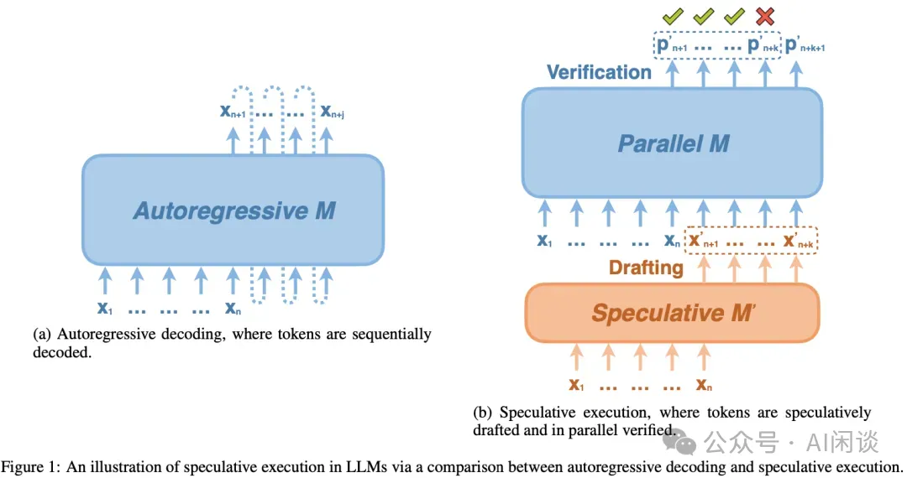

投机采样可以有效减少 Decoding Step 数量，这也是其存在的意义，然而验证的接受率会很大程度上影响最终的加速比，接受率越高，减少的 Decoding Step 数量就越多，因未接收而浪费的计算就越少（实际上只要不是接受率 100%，就一定存在计算的浪费）。除此之外，当序列比较长时，由于减少 Decoding Step 而减少的对全局 KV Cache 的访问更加可观，相当于在 Memory Bound 的时候用 Compute 换 IO。

## 2.2 BART Score

BART Score（[2106.11520] BARTScore: Evaluating Generated Text as Text Generation） 是一种用于评价自然语言生成任务中模型输出质量的指标，它是基于 BART 模型的（BART: Denoising Sequence-to-Sequence Pre-training for Natural Language Generation, Translation, and Comprehension）。BART 模型在预训练时，会使用多种噪声对原始文本进行破坏，然后通过双向 Transformer 模型重建原始文本。

BART Score 的优势在于它利用了预训练的 BART 模型所捕捉到的丰富语言信息和上下文关系，能够更好地反映生成文本的质量，特别是在考虑句子间的语义相似性和一致性方面。相比传统的 BLEU、ROUGE 等指标，BART Score 更加灵活和精确，能够更好地捕捉到文本生成任务中的细微差别。

如下图所示为 BART Score 的计算公式，其中 w 为权重，值大于等于 0；p 为概率，介于 [0, 1] 之间，因此 BART Score 始终小于等于 0：

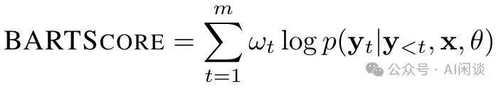

## 2.3 SambaNova CoE

如下图 Fig 2 所示（来自 [2405.07518] SambaNova SN40L: Scaling the AI Memory Wall with Dataflow and Composition of Experts），SambaNova 很早之前就提出了 CoE（Composition of Experts） 的方案，其 Samba-CoE 可能包含数十个专家模型，这些专家模型都来自开源社区，作者在编码、数学和翻译等特定领域进行微调。在这些模型之前会有一个 Router 模型，它能动态地将每个输入 Prompt 分配给最相关的专家，比如数学模型将被路由到数学专家。

Samba-CoE 的灵感来自混合专家（Mixtral of Expert, MoE），但有一些关键区别。尽管 MoE 和 CoE 都比传统的密集模型更稀疏，但 MoE 的灵活性不如 CoE。MoE 需要作为单一模型进行训练/微调，类似于整体模型，而 CoE 由独立和异构的专家模型组成，这些模型彼此独立地进行训练/微调。CoE 的能力也更强：先前的研究表明，CoE 的性能既优于 MoE，也优于 GPT-3.5 和 GPT-4 等大型单体模型。此外，CoE 和 MoE 也可以相互结合：CoE 可以在内部使用 MoE 实现的专家模型。

如下图所示，Samba 最近升级了 Samba-CoE 模型，在 Router 中添加了不确定性量化来提升 Router 质量，如下图所示为 Samba-CoE-v0.3（Samba-CoE v0.3: The Power of Routing ML Models at Scale） 的性能（看着 v0.3 主要提升来自 MMLU），可以看出其超越了很多常见的大模型：

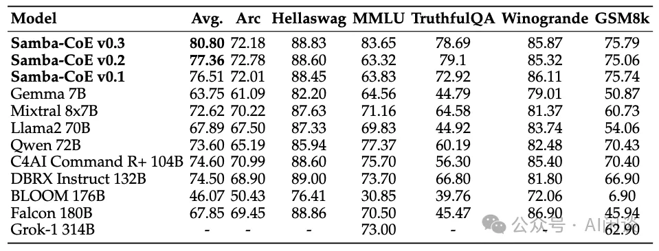

## 2.4 Hybrid LLM

## 2.4.1 摘要

在 [2404.14618] Hybrid LLM: Cost-Efficient and Quality-Aware Query Routing 中，作者提出了一种利用低成本小模型和高质量大模型进行混合推理的方案。该方案使用一个 Router 模型，根据 Query 的难度和所需的质量水平将其分配给小模型或大模型。并且可以在使用时动态的调整质量水平，以便根据场景需求无缝的用质量换成本。评估结果表明，提出的方法可以在降低对大模型 40% 调用量的情况下不降低响应质量。

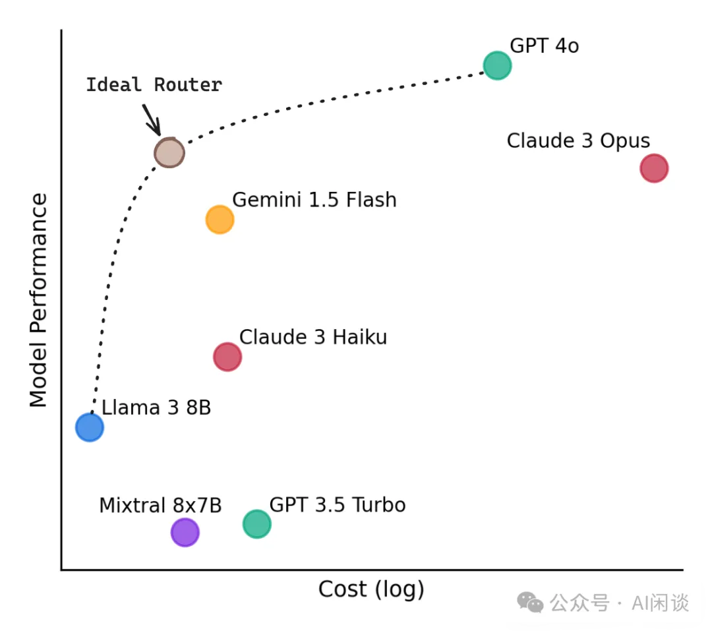

PS：当然，Hybrid LLM 中依然有一些局限性，比如没有讨论如果是多个模型时如何路由，如果数据分布改变或者大小模型改变后可能需要重新训练 Router。

对应的代码库：GitHub - lm-sys/RouteLLM: A framework for serving and evaluating LLM routers - save LLM costs without compromising quality!

## 2.4.2 方法
### 2.4.1 概览
如下图 Figure 2 所示，其核心思路是通过 Router 来判断 Query 难易程度，Easy Query 之间在 Edge 侧使用小模型计算，Hard Query 在 Cloud 侧使用大模型计算。因为小模型和大模型都是事先训练好的，因此关键问题变成了如何训练一个 Router，尽可能的把 Query 路由到小模型，同时又保证生成质量尽可能接近甚至超过大模型。

### 2.4.2 Router 训练

作者采用 DeBERTa 模型作为 Router，使用 H(x) := q(S(x)) - q(L(x)) 作为两个模型的质量差距，其中 S(x) 表示小模型结果，L(x) 表示大模型结果，q() 表示模型质量。

使用 Pr[H(x) >= 0] = Pr[q(S(x)) >= q(L(x))] 作为 Router Score，如果对于 x 来说 Pr[H(x) >= 0] 的概率很高，则可以路由 x 到小模型。

通常来说小模型的质量可能远小于大模型，此时可以设置一个阈值 t，Pr[H(x) >= -t] = Pr[q(S(x)) >= q(L(x)) - t] 时，表示如果小模型和大模型的差距不是特别大，也可以路由到小模型。t 值的大小可以作为生成质量以及成本之间的 tradeoff。

为了训练 Router，作者设计了 3 种损失函数：

确定性 Router 的损失函数：基于确定性假设，认为模型是确定性函数，将输入特征映射到输出空间的某个点。它通过为每个训练 Query 从每个模型中采样单个响应，并使用 BART Score 作为质量函数 q() 来分配二进制标签。这种 Router 称为 rdet。

概率 Router 的损失函数：考虑 NLP 任务的复杂性，LLM 生成结果通常有一定的随机性（PS：GPT-4 模型即使设置 temperature 为 0 也无法保证结果完全相同）。该损失是将 hard 标签转换为 soft 标签实现的，每个模型每个 Query 采样 10 个响应并计算相应指示函数值的平均来估计。对应的 Router 称为 rprob。

带有数据转换的概率 Router 损失函数：当小模型和大模型的差距比较大时，直接估计 Pr[H(x) >= 0] 可能得到的信号非常弱，导致训练效果不佳。为了解决这个问题，作者定义了放松的条件 Pr[H(x) >= -t] 来修正损失函数。对应的 Router 称为 rtrans。如下图 Figure 4 为一个示例：

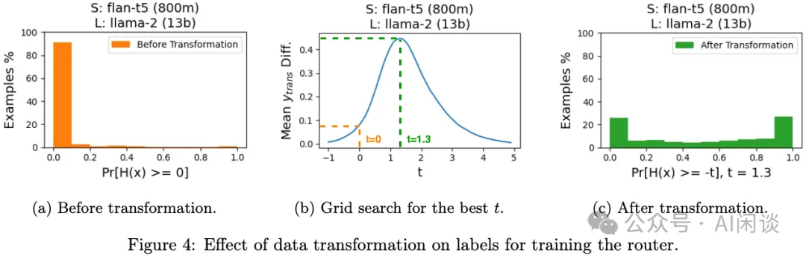

3.3 实验和评估
3.3.1 实验配置
使用 MixInstruct 数据集评估 Router 的有效性，使用 DeBERTa-v3-large 作为 Router 的基座模型，使用 BART Score 作为质量指标，使用 BART Score Drop 表示质量差异，使用路由到小模型的 Query 比例作为效率指标（Cost Advantage）。选择了 3 对大小模型，分别为 LLaMA2-7B 和 LLaMA2-13B，LLaMA2-13B 和 GPT-3.5 以及 FLAN-t5（800M） 和 LLaMA2-13B。

3.3.2 路由性能
如下图 Table 1 所示，作者评估了在不同的 Cost Advantage 下几种 Router 的效果，可以看出：

LLaMA2-7B 和 LLaMA2-13B：模型差距很小，甚至在 40% 流量到达 LLaMA2-7B（cost advantage），依然可以保持基本无损：

LLaMA2-13B 和 GPT-3.5：模型差距中等，20% 流量到达 LLaMA2-13B 就会有一些损失。

FLAN-t5 和 LLaMA2-13B：模型差距比较大，10% 流量到达 FLAN-t5 即可能存在一些损失。当然，此时也可以看出 rtrans 的优势。

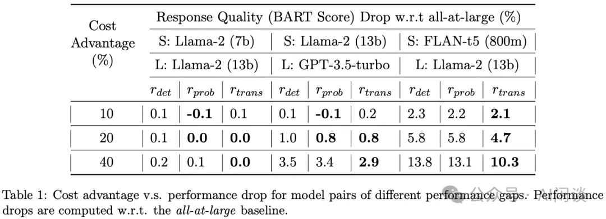

如下图 Figure 6 所示，作者进一步进行了详细的对比，并与随机路由（Query 按照比例随机分发到小模型和大模型）进行了对比。Avg Quality Gap Diff 表示的是，对于被路由到小模型的 Query 与被路由到大模型的 Query，它们之间平均质量差距的差异。正值意味着小模型的平均质量差距比大模型的小，这通常表示小模型的响应质量接近大型模型，从而实现了成本优势。Random 时，路由到小模型和大模型的 Query 分布一致，平均质量差距类似，因此相应的 Avg Quality Gap Diff 接近于 0。

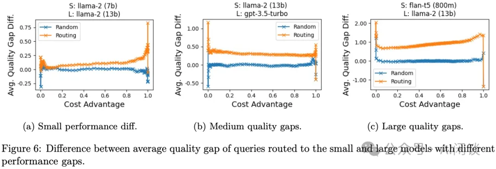

## 2.5 Router LLM

4.1 摘要
在 [2406.18665] RouteLLM: Learning to Route LLMs with Preference Data 中作者提出了 RouterLLM，其同样是为了结合小模型低成本和大模型高质量来获得生成质量和成本的平衡。为了解决这个问题，作者提出了几种高效的 Router 模型，并开发了一个训练框架，利用人类偏好数据和数据增强技术来提高 Router 性能。

在几种常见的基准上评估表明，提出的方法可以在不影响响应质量的情况下显著降低成本，某些情况可以降低 2x 成本；与此同时，提出的模型还显示了显著的迁移能力，即使在测试时更改大小模型也能保持性能。这凸显了这些 Router 为部署 LLM 提供经济高效且高性能的解决方案的潜力。

4.2 评估指标
RouterLLM 中作者主要提出了 3 种评估指标：PGR、APGR 和 CPT。

PGR（Performance Gain Ration）主要评估质量增益比例，该值越接近 1，表明获得的质量越接近于大模型的性能。

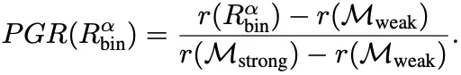

CPT（Call Performance Threshold）是调用和质量阈值，用于衡量在给定的质量目标下，需要调用大模型的的最小百分比。比如说，GPT-4-1106-Preview 的 MT-Bench 指标为 9.3，Mixtral 8x7B 的 MT-Bench 指标为 8.3，则 CPT(50%)=37% 则表示要想 MT-Bench 维持在 (9.3-8.3)*50+8.3=8.8 的水平，至少需要有 37% 的请求调用 GPT-4-1106-Preview。

APGR（Average Performance Gain Recovered）：平均质量增益恢复，是一个综合指标，用于衡量在不同成本约束下恢复质量的能力。

CPT（Call Performance Threshold）是调用和质量阈值，用于衡量在给定的质量目标下，需要调用大模型的的最小百分比。比如说，GPT-4-1106-Preview 的 MT-Bench 指标为 9.3，Mixtral 8x7B 的 MT-Bench 指标为 8.3，则 CPT(50%)=37% 则表示要想 MT-Bench 维持在 (9.3-8.3)*50+8.3=8.8 的水平，至少需要有 37% 的请求调用 GPT-4-1106-Preview。

APGR（Average Performance Gain Recovered）：平均质量增益恢复，是一个综合指标，用于衡量在不同成本约束下恢复质量的能力。

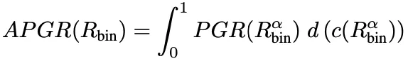

4.3 方法
4.3.1 Router 方案
作者提出了 4 种 Router 方案：

相似性加权排序（Similarity-weighted ranking, SW）：采用 Bradley-Terry（BT）模型，通过计算用户 Query q 与训练集中每个 Query qi 的相似性权重 wi 来预测大模型的获胜概率。相似度 S 是通过 Query 对应 Embedding ε 的点积或欧式距离计算。其中的 BT 系数 ع 通过二元交叉熵损失函数来学习。

矩阵分解（Matrix factorization）：这种方法受到推荐系统中矩阵分解模型的启发，目的是捕获 user-item 的低秩结构。它通过一个隐藏的评分函数 s：M x Q -> R 来表示模型 Mw 对 Query q 的回答质量。评分函数 s 被建模为模型和 Query 的双线性函数，并通过训练优化 Bradley-Terry 关系来学习。

BERT 分类器（BERT classifier）：使用 BERT 模型训练一个分类器，作者在 BERT 模型上进行了全参微调，在 2*L4 GPU 上训练了 2000 个 step，batch size 为 16，最大序列长度为 512。

因果 LLM 分类器（Causal LLM classifier）：使用 LLaMA 3 8B 模型来作为 Router，采用指令跟随范式，将用户 Query 作为输入指令，以下一个 Token 预测的方式输出获胜概率。与使用单独的分类 head 不同，这里将比较标签作为额外的 Token 添加到词汇表中，并在标签类别 L 上计算获胜概率的 softmax。在 8xA100 80GB GPU 上训练 2000 个 step，batch size 为 8，最大训练长度为 2048。

4.3.2 数据
在 RouteLLM 中，作者使用了两种类型的数据增强方面来增强 Router 模型的性能：

Golden-Labeled Dataset：使用自动生成的准确标签来增强训练数据。一个具体的例子是 MMLU 基准测试，作者使用其验证集的 1500 个问题及对应的标签来生成 Dgold。

LLM-Judge-labeled Dataset：使用一个 LLM 作为裁判来生成偏好标签。具体来说，分别从大模型 GPT-4 和小模型 Mixtral-8x7B 来生成答案，然后让 GPT-4 作为裁判来生成对应的比较标签。作者通过这种方式收集了大约 120K 个样本的偏好数据集 Djudge。

4.4 实验和评估
4.4.1 结果
如下图 Table 1 所示，作者在 MT-Bench 上评估了不同 Router 方法、训练数据情况下的性能，其中的大小模型为 GPT-4 和 Mixtral-8x7B。可以看出，Matrix factorization 和 Similarity-weighted ranking 获得更好的结果，其中 25.32%，表示保证 CPT(50%) 也就是 MT-bench 为 8.8 的情况下最少只需 25.32% 的流量路由到大模型 GPT-4，越低越好。APGR 表示质量恢复到 GPT-4 的水平，越高越好。

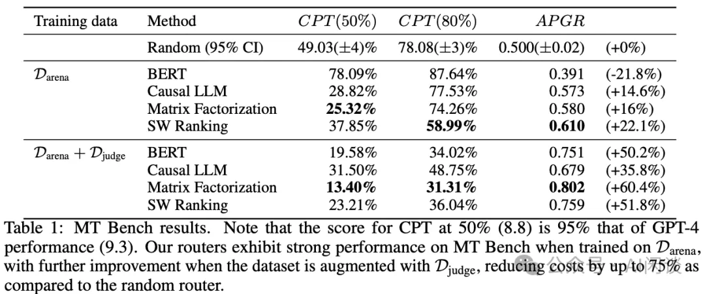

如下图 Table 3 所示，作者进一步在 8-shot GSM8K 上进行评估，结论稍有不同，不使用 Djudge 数据集结果和随机路由差不多，使用后有所改善：

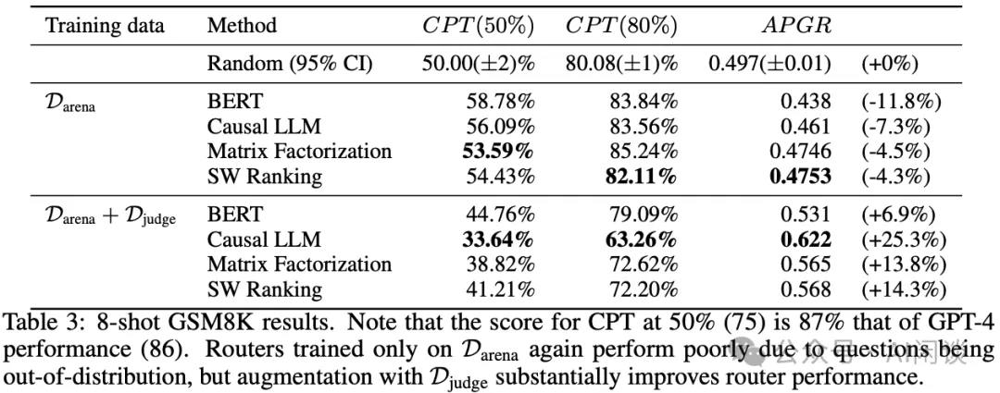

4.4.2 迁移能力

如下图 Table 5 所示，直接将训练好的 Router 模型应用到 Claude 3 Opus 和 LLaMA3-8B 上，同样可以获得一定的收益，表明其具有不错的迁移能力：

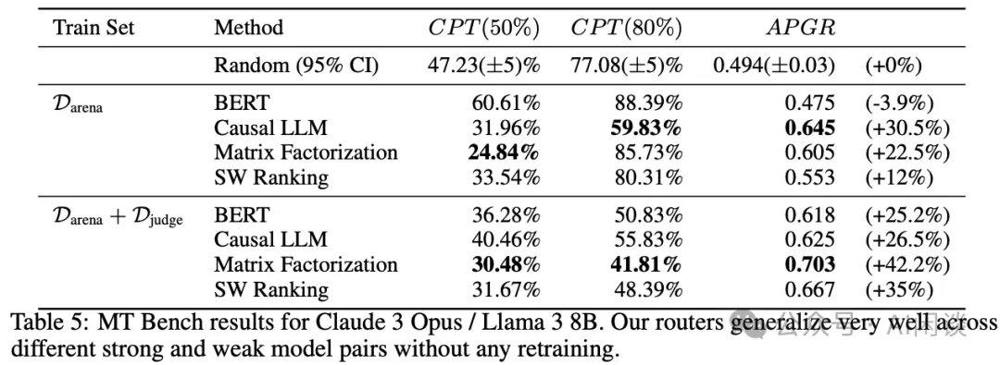

4.4.3 成本分析
如下图 Table 6 所示，作者进一步评估了在不同质量要求下成本节约情况，在 MT-Bench 上，CPT(80%) 依然可以节约 2.49x 成本：

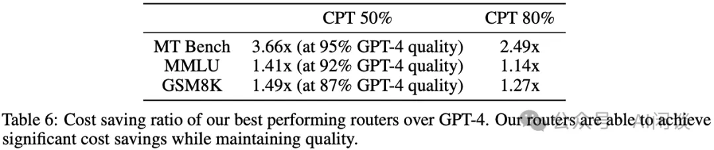

# 参考

[1] 混合模型：HybridLLM、RouterLLM 等优化 LLM 推理成本的新思路，https://mp.weixin.qq.com/s/HGBrblodub7G-kbolkk68Q
