# 1. 简介

目前业界已经开发了各种各样的LLM推理引擎，如VLLM，LLMDeploy，huggingface(text-generation-inference), DeepSpeed-Inference，以及大量的商业化API，本文介绍LLM性能主要指标，以及介绍如何基于魔搭社区的模型效果性能评估工具EvalScope（https://github.com/modelscope/eval-scope）进行性能压测，并通过wandb进行压测结果对比。

为了支持各种服务API以及开源LLM推理性能，评估是否满足生产需求，我们提供一套简单可扩展的工具，支持LLM各项指标，详细可以参考eval-scope项目中的性能perf工具说明： https://github.com/modelscope/eval-scope/tree/main/llmuses/perf

测试环境 A100 80G

测试数据

性能评测请求根据下列数据集构造。

正常上下文： 

https://huggingface.co/datasets/Hello-SimpleAI/HC3-Chinese/blob/main/open_qa.jsonl

长上下文数据集：

https://huggingface.co/datasets/Yukang/LongAlpaca-12k/blob/main/LongAlpaca-12k.json

# 2. LLM推理关键指标以及影响

- Throughput

总的吞吐（output tokens/seconds），对于LLM Serving重要，可以提高总的服务能力。

- Time to First Token(TTFT)

在prefill阶段后返回的第一个token的时间，在stream输出模式下，对体验影响大，越小用户等待返回第一个token时间越小，体验越好。

- Time per output token

生成每个token的时间，影响体验

- Latency

处理完整请求用时。

- QPS

每秒处理完成的请求数。

# 3. 测试环境

测试环境 A100 80G

测试评测引擎以及版本版本

vllm: v0.5.0.post1
lmdeploy: 0.4.1
tritonserver(tensorrt-llm backend): tensorrt_llm 0.11.0.dev2024061100

测试数据

性能评测请求根据下列数据集构造。

- 正常上下文：https://huggingface.co/datasets/Hello-SimpleAI/HC3-Chinese/blob/main/open_qa.jsonl
- 长上下文数据集：https://huggingface.co/datasets/Yukang/LongAlpaca-12k/blob/main/LongAlpaca-12k.json

测试模型
为了使测试更具有代表行，我们测试了不同size的模型（qwen2 7B，qwen2 72B），在不同请求长度以及并发下的性能，所有引擎参数大多使用默认值，未针对性调参，不代表引擎最优性能。

qwen7B单卡推理，qwen72B 4卡推理(tensor parallel 4).

服务拉起

注：所有引擎均使用默认配置启动，未针对性调参，不代表引擎最优性能。

vllm
```bash
export VLLM_USE_MODELSCOPE=true
python -m vllm.entrypoints.openai.api_server --chat-template ./qwen_template.jinja  --model='qwen/Qwen2-7B-Instruct' --trust-remote-code --served-model-name qwen --max-model-len 12000 --max-log-len 10
```

qwen caht template
```text
{{'<|im_start|>' + message['role'] + '\n' + message['content']}}{{ '<|im_end|>' + '\n'}}
{{ '<|im_start|>assistant\n' }}
```

lmdeploy
```bash
export LMDEPLOY_USE_MODELSCOPE=True
lmdeploy serve api_server --backend turbomind qwen/Qwen2-7B-Instruct --server-port 8000
```

Tensorrt-llm
```bash
python3 scripts/launch_triton_server.py --model_repo all_models/inflight_batcher_llm
```
参考： https://github.com/triton-inference-server/tensorrtllm_backend

# 4. Qwen7B测试结果

## 4.1 open_qa正常上下文

### 4.1.1 单并发
压测命令
```bash

# vllm 兼容openai接口，输出usage信息
llmuses perf --url 'http://127.0.0.1:8000/v1/chat/completions' --parallel 1 --model 'qwen' --log-every-n-query 10 --read-timeout=120 --dataset-path 'THE_PATH_TO/open_qa.jsonl' -n 1000 --max-prompt-length 128000 --api openai --stream --dataset openqa
# lmdeploy， 无usage信息，通过tokenizer统计usage
llmuses perf --url 'http://127.0.0.1:8000/v1/chat/completions' --parallel 1 --model 'qwen' --log-every-n-query 10 --read-timeout=120 --dataset-path './datasets/open_qa.jsonl' -n 1000 --max-prompt-length 128000 --api openai --stream --dataset openqa --tokenizer-path /mnt/cpfs/modelscope_cache/hub/qwen/Qwen2-7B-Instruct/
# tensorrt-llm 无usage信息，通过tokenizer统计usage
enizer-path /THE_PATH_TO_QWEN/Qwen2-7B-Instruct/
llmuses perf --url 'http://127.0.0.1:8000/v2/models/ensemble/generate_stream' --query-template '{"text_input": "%p", "max_tokens": 500, "bad_words": "", "stop_words": ["<|im_end|>","<|endoftext|>"], "end_id": 151643, "stream": true, "return_log_probs": false, "return_generation_logits": false, "return_context_logits": false}' --parallel 1 --model 'qwen' --log-every-n-query 10 --read-timeout=120 --dataset-path './datasets/open_qa.jsonl' -n 1000 --max-prompt-length 128000 --api custom --dataset openqa --tokenizer-path /THE_PATH_TO_QWEN/Qwen2-7B-Instruct/
```

结果对比（时间单位均为秒）

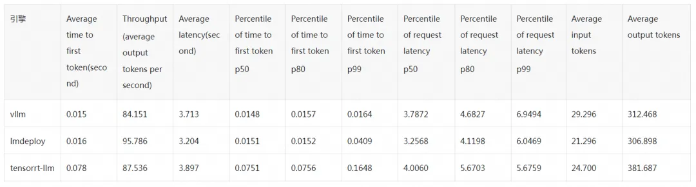

Throughput VS TTFT（Time to first token）

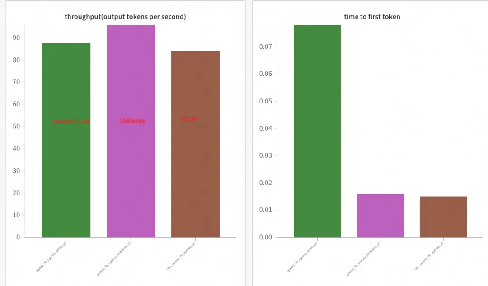

wandb详细对比图表

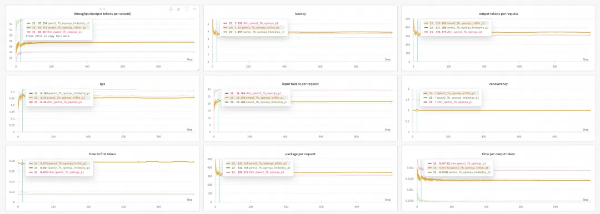

在单并发情况下tensorrt-llm TTFT最小，用户体验最好，lmdeploy through最高，服务性能最好。


### 4.1.2 多并发(128)

结果对比（时间单位均为秒）

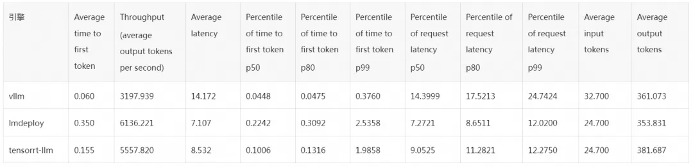

lmdeploy在短文本，多并发情况下，vllm TTFT最小，用户体验最好，响应最快，但Throughput最低，lmdeploy TTFT最大，Throughput最高。

Throughput VS TTFT（Time to first token）

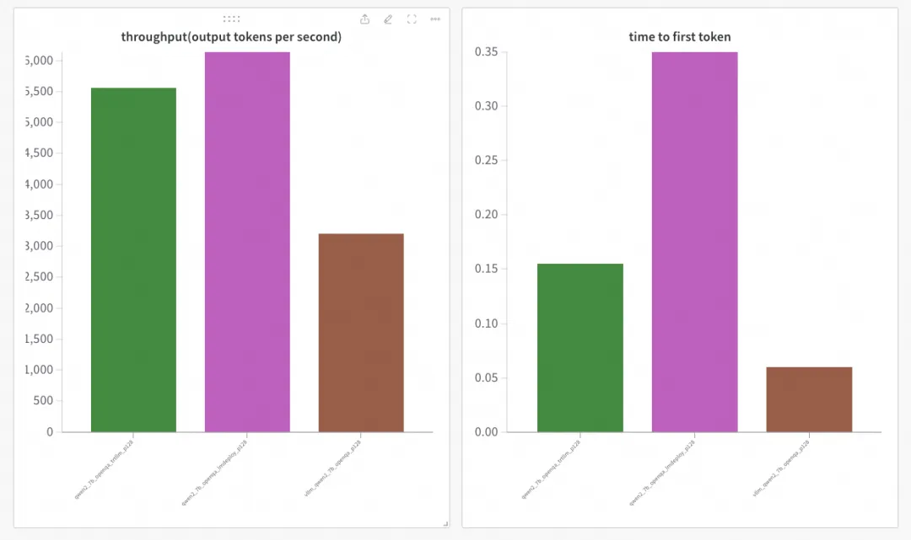

wandb详细对比图表

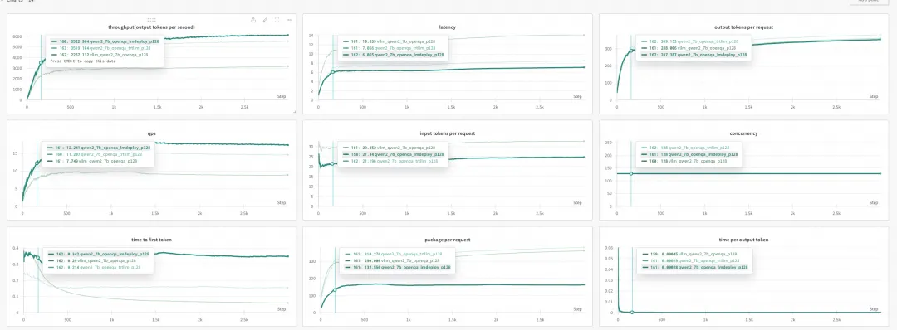

## 4.2 LongAlpaca-12K长上下文

### 4.2.1 单并发

结果对比（时间单位均为秒）

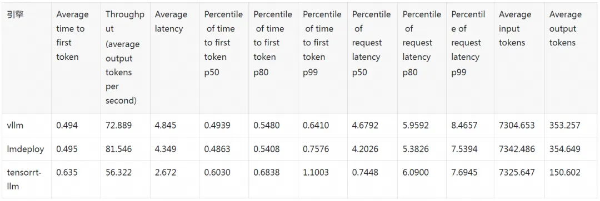

Throughput VS TTFT（Time to first token）

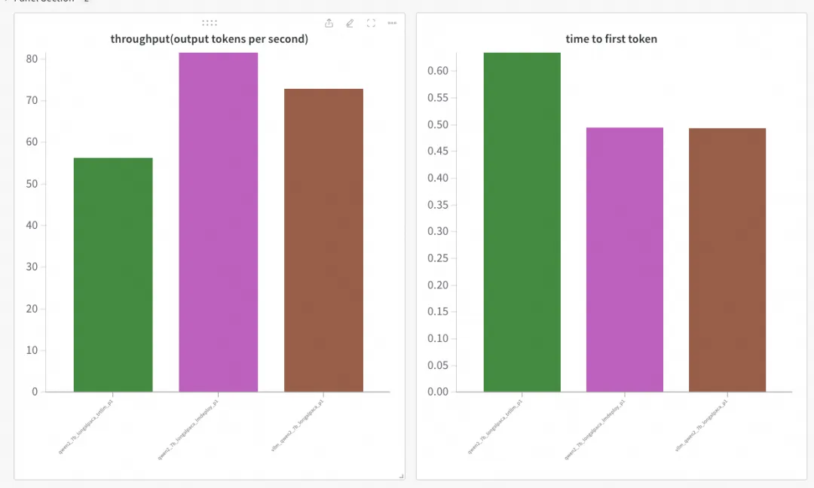

wandb详细对比图表

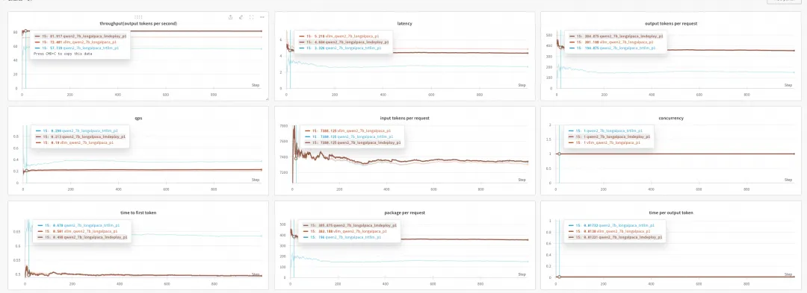

### 4.2.2 多并发(4)

结果对比（时间单位均为秒）

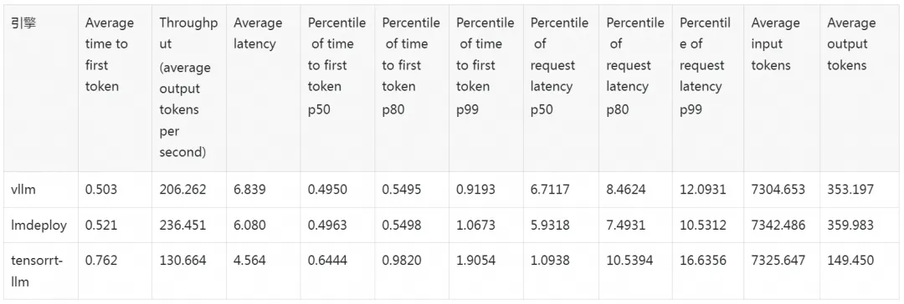

Throughput VS TTFT（Time to first token）

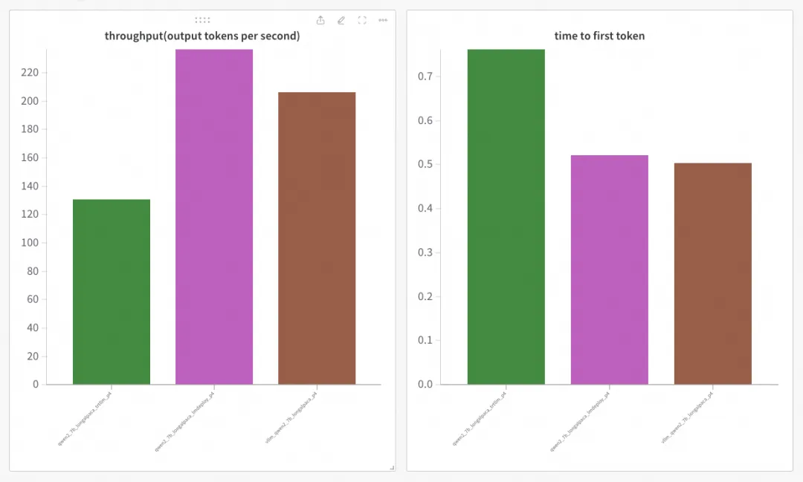

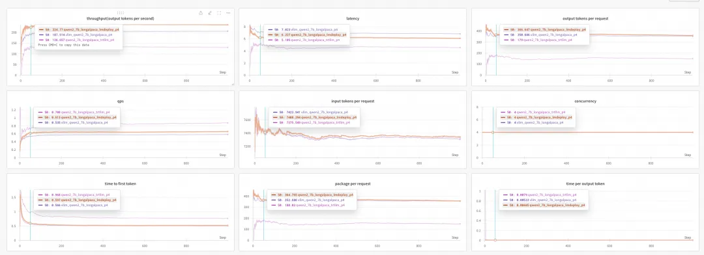

详细结果可以查看wandb（https://wandb.ai/modelscope/perf_benchmark/workspace?nw=nwuserliuyhwangyh）

# 5. Qwen72B测试结果

## 5.1 open_qa正常上下文
### 5.1.1 单并发
压测命令

```bash
# vllm 兼容openai接口，输出usage信息
llmuses perf --url 'http://127.0.0.1:8000/v1/chat/completions' --parallel 1 --model 'qwen' --log-every-n-query 10 --read-timeout=120 --dataset-path 'THE_PATH_TO/open_qa.jsonl' -n 1000 --max-prompt-length 128000 --api openai --stream --dataset openqa
# lmdeploy， 无usage信息，通过tokenizer统计usage
llmuses perf --url 'http://127.0.0.1:8000/v1/chat/completions' --parallel 1 --model 'qwen' --log-every-n-query 10 --read-timeout=120 --dataset-path './datasets/open_qa.jsonl' -n 1000 --max-prompt-length 128000 --api openai --stream --dataset openqa --tokenizer-path /mnt/cpfs/modelscope_cache/hub/qwen/Qwen2-7B-Instruct/
# tensorrt-llm 无usage信息，通过tokenizer统计usage
enizer-path /THE_PATH_TO_QWEN/Qwen2-7B-Instruct/
llmuses perf --url 'http://127.0.0.1:8000/v2/models/ensemble/generate_stream' --query-template '{"text_input": "%p", "max_tokens": 500, "bad_words": "", "stop_words": ["<|im_end|>","<|endoftext|>"], "end_id": 151643, "stream": true, "return_log_probs": false, "return_generation_logits": false, "return_context_logits": false}' --parallel 1 --model 'qwen' --log-every-n-query 10 --read-timeout=120 --dataset-path './datasets/open_qa.jsonl' -n 1000 --max-prompt-length 128000 --api custom --dataset openqa --tokenizer-path /THE_PATH_TO_QWEN/Qwen2-72B-Instruct/
```

结果对比

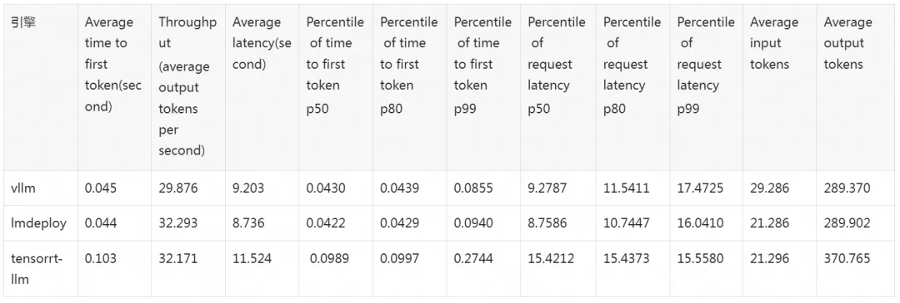

Throughput VS TTFT（Time to first token）

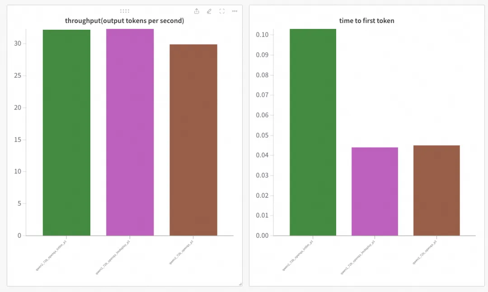

wandb详细对比图表

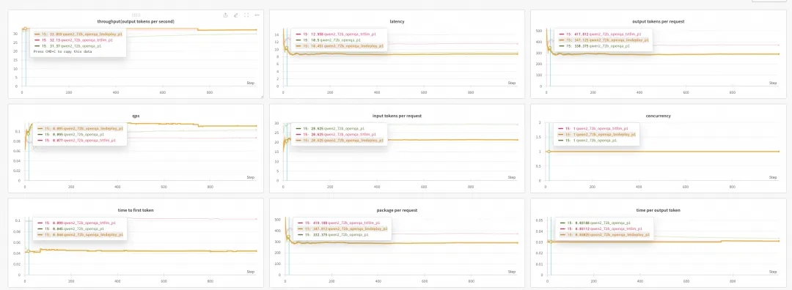

### 5.1.2 多并发(128)

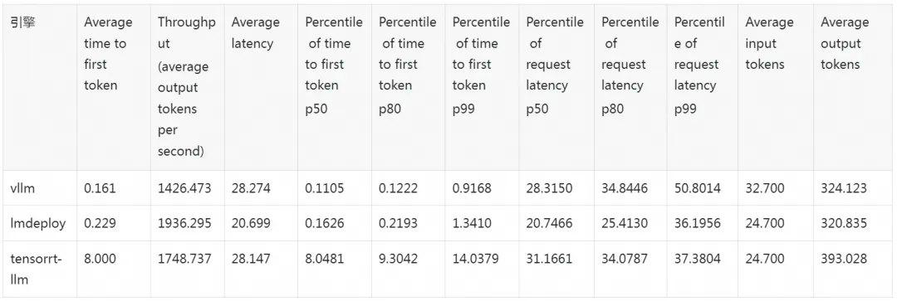

Throughput VS TTFT（Time to first token）

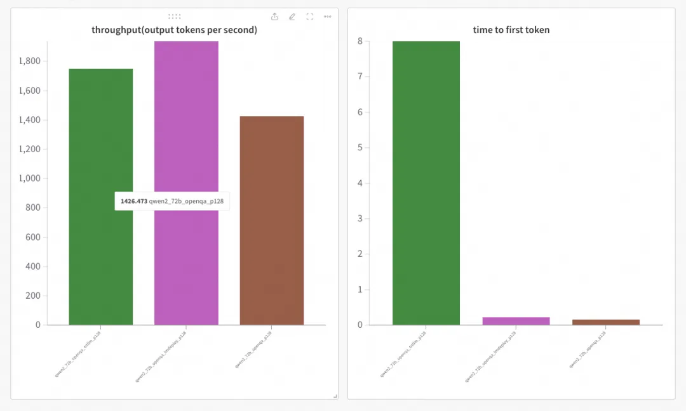

wandb详细对比图表

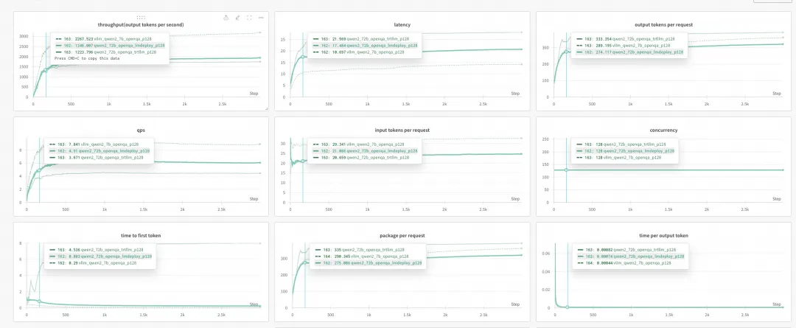

## 5.2 LongAlpaca-12K长上下文
### 5.2.1 单并发

结果对比（时间单位均为秒）

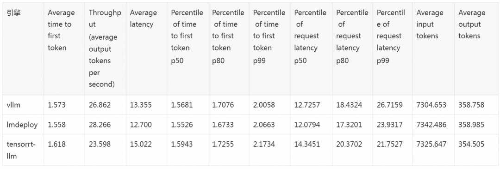

Throughput VS TTFT（Time to first token）

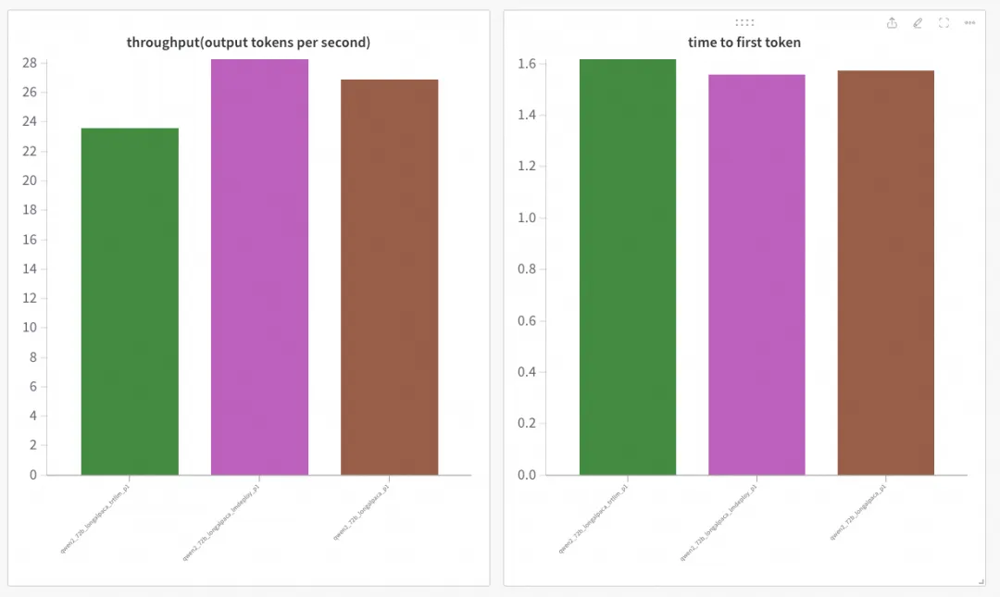

wandb详细对比图表

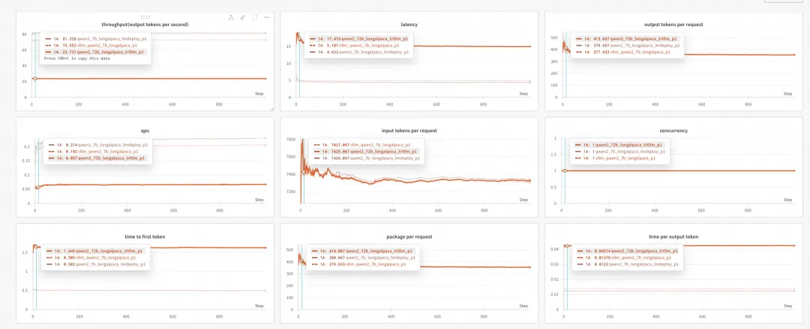

### 5.2.2 多并发(4)
结果对比（时间单位均为秒）

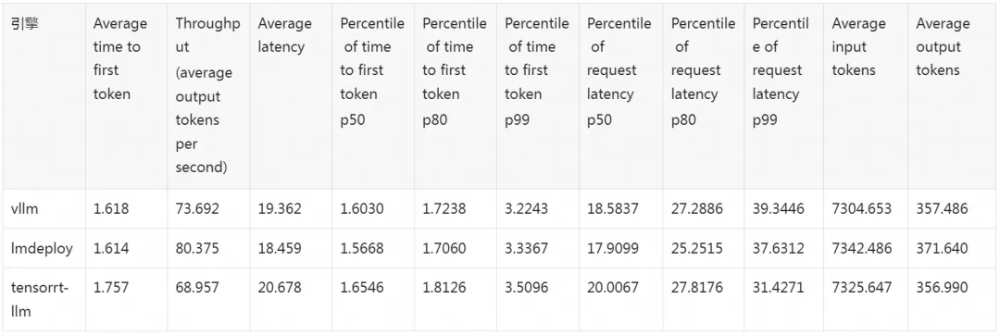

Throughput VS TTFT（Time to first token）

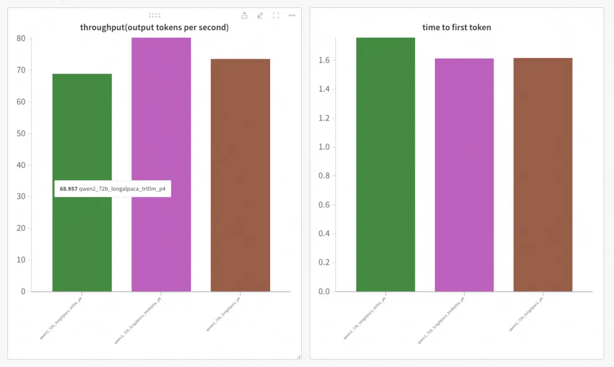

wandb详细对比图表

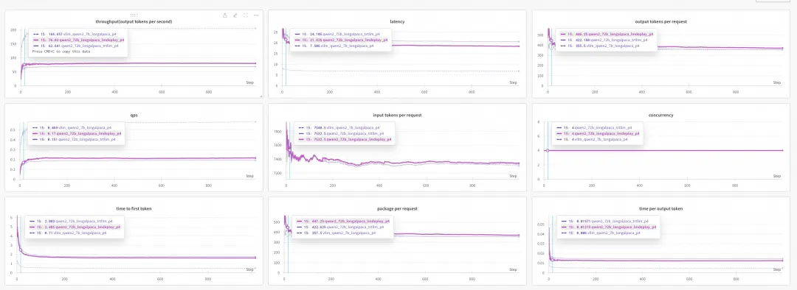

详细wandb图表（https://wandb.ai/modelscope/perf_benchmark/workspace?nw=nwuserliuyhwangyh）

# 6. 总结

从总体结果看，主流引擎在不同场景下各有优势，用户可以根据自己使用场景，选择合适的引擎，如果您服务少数用户，选择TTFT小的，用户体验更佳，如果您要服务大量用户，可以选择throughput大的，提高资源利用率。

但从使用体验上看，vllm，lmdeploy使用方便，直接从model hub下载模型即可，而tensorrt-llm需要转换和编译模型，并且创建合适的引擎环境也有一定的成本，需要tensorrt-llm，triton server以及tensorrt-llm backend，格步骤参数有一定关联性，极易出错，总体使用成本对比会高不少。

本文涉及性能压测均基于魔搭社区模型效果性能评估工具EvalScope进行，点击 阅读原文，直达 EvalScope 开源链接，欢迎star~

# 参考

[1] LLM推理引擎性能评测：vllm、lmdeploy、tensorrt-llm 请应战！，https://mp.weixin.qq.com/s/SIL1Xx_GxJOpp26k7p-VUg
