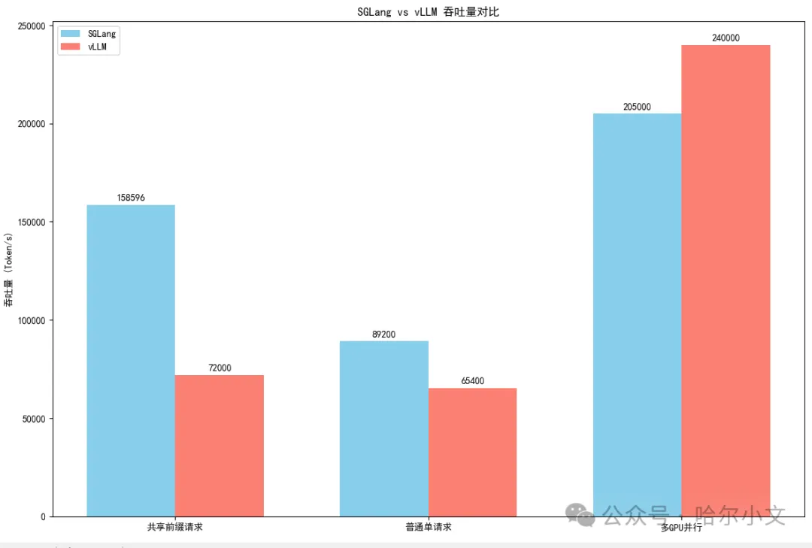
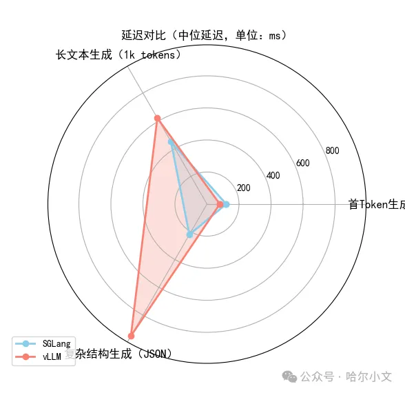

# 1. 资源

- SGLang GitHub: https://github.com/sgl-project/sglang
- vLLM GitHub: https://github.com/vllm-project/vllm
- sglang的官方文档:https://docs.sglang.ai
- vllm的官方文档：https://docs.vllm.ai/en/latest/

# 2. 选型建议
选择SGLang：若需处理高并发、复杂逻辑任务，或部署超大规模模型（如405B），且团队具备一定技术能力进行定制化优化。

选择vLLM：若优先考虑稳定性、显存效率，或需快速集成Hugging Face模型，且运行环境为Linux+NVIDIA GPU。

# 3. 优缺点分析

| 框架  | 优点  | 缺点  |
|-------|------|------|
| SGLang | 1. 性能顶尖，吞吐量和延迟优化显著； 2. 纯Python实现，易定制和扩展； 3. 支持FP8/长上下文等前沿技术。 | 1. 社区生态较新，文档和案例较少； 2. AMD显卡支持需手动配置。 |
| vLLM | 1. 成熟稳定，已被ChatGPT等产品验证； 2. 内存管理高效，显存占用低； 3. 兼容Hugging Face模型生态。 | 1. 仅支持Linux和NVIDIA GPU； 2. 功能单一，缺乏训练支持。 |

# 4. 适用场景对比
SGLang：

- 企业级高并发服务：如实时对话系统、大规模内容生成平台，需处理数千并发请求的场景。
- 复杂逻辑生成：JSON解码、多步骤推理任务，依赖RadixAttention的缓存复用优势。

vLLM：

- 在线推理服务：如智能客服、聊天机器人，依赖Continuous Batching的高吞吐能力。
- 资源受限环境：通过PagedAttention优化显存占用，适合中小型服务器部署。

# 5. 性能对比

吞吐量测试预估值

延迟对比估算

# 参考

[1] 大模型推理引擎对比SGLang vs vLLM，最佳选择？https://mp.weixin.qq.com/s/Ckhf7KAXvWGe1ZW9WnD0hg