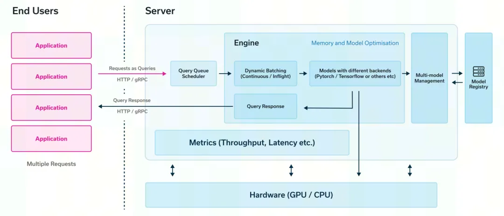
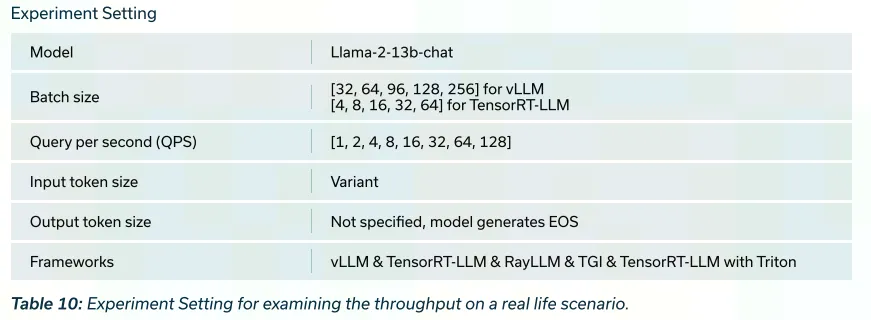
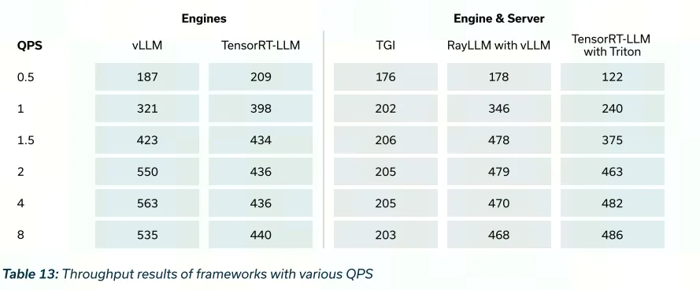
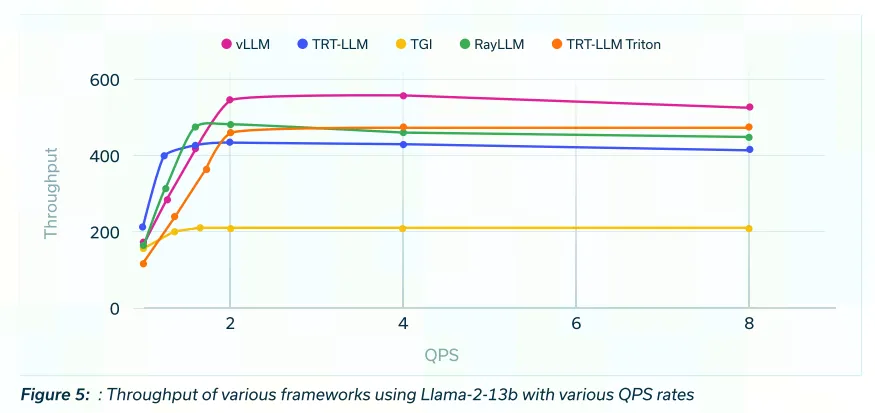
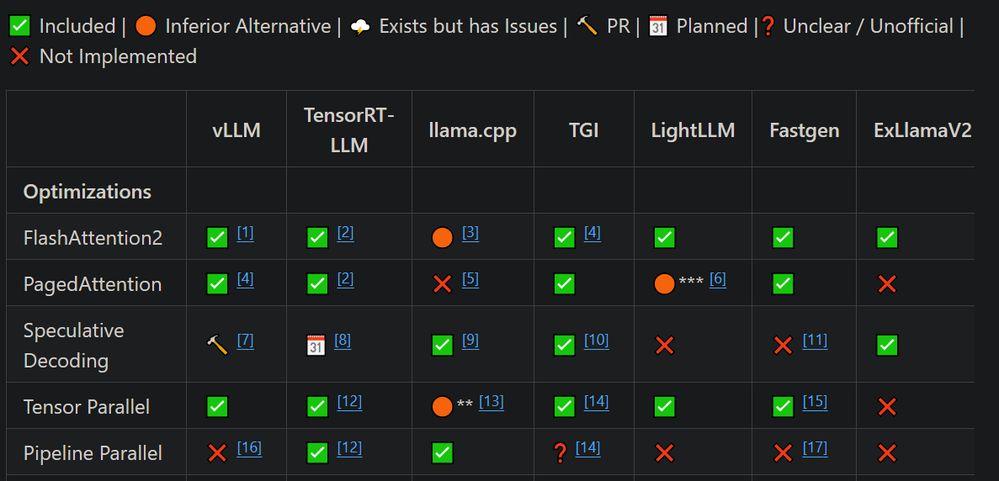

# 1. 推理框架对比

在提供基于 LLM 的应用程序服务时，Model Serving可以分为两个组件：引擎和服务。从高层次来看，引擎是处理与模型和批处理请求相关的所有事情，而服务处理转发用户请求。

引擎

引擎是运行模型以及使用不同类型优化技术的生成过程。其核心是 Python 或 C++库。它们处理来自用户到大模型的请求批处理，并为这些请求生成响应。

服务

服务负责协调来自用户的 HTTP/gRPC 请求。在实际应用中，我们会有许多用户在一天的不同时间向大模型提问。服务对这些请求进行排队，并将它们转发给引擎以生成响应。吞吐量和延迟等指标是衡量服务的重要指标，这对于模型服务非常重要。

实验

为了探索不同引擎和服务在吞吐和延时上的差异，通过以下五个试验进行了测试和分析。所有测试均是在单卡A100-40GB上进行的。

- 实验#1：QPS和批处理大小变化的吞吐量动态
  - 探索了vLLM和TensorRT-LLM在不同每秒查询数（QPS）和批处理大小下的吞吐量动态。 

- 实验#2：抢占机制分析
  - 通过改变批处理大小分析了vLLM中的抢占机制。探讨了导致实验#1中观察到的吞吐量峰值和退化的因素。

- 实验#3：不同查询速率和变量输入下的吞吐量
  - 将探索扩展到多个框架，检查了不同查询速率和变量输入下的吞吐量。比较了vLLM、TensorRT-LLM、TGI、RayLLM以及Triton + TensorRT-LLM的性能。
  
- 实验#4：从内存角度分析vLLM和TGI的吞吐量
  - 研究了KV缓存可用内存对吞吐量的影响。探讨了内存限制对vLLM、TensorRT-LLM和TGI的影响。

- 实验#5：真实场景：模型大小增加和变量输入/输出的影响
  - 通过将模型大小增加到Llama-2 13b-chat并引入变量输入/输出长度，模拟了真实场景。评估了vLLM、TensorRT-LLM、RayLLM、TGI以及Triton + TensorRT-LLM的吞吐量性能。
  
前四个实验主要关注不同引擎和服务在特定技术指标上表现的差异，最后一个实验是模拟真实场景，评测几个引擎和服务的性能差异。整个报告很长，这里只贴出试验#5的测试设置和测试结果，如果对其他测试结果感兴趣可以去星球上下载查看。

从测试结果看，vLLM的性能优于其他框架，其次是Triton + TensorRT-LLM，以及vLLM驱动的RayLLM，尤其是在较高的查询速率下。在大约2 QPS时，所有曲线开始稳定，这表明用户请求出现了积压。值得注意的是，无论使用哪种框架，吞吐量在达到一定量后会达到稳定状态。

# 2. 框架技术对比

# 参考

[1] LLM Serving 大模型服务评测结果（vLLM，TGI，TRT-LLM+Triton，RayLLM+RayServe），https://mp.weixin.qq.com/s/h39_hCiI515fNsaPWI1rlw
[2] Open Inference Engines，https://github.com/lapp0/lm-inference-engines