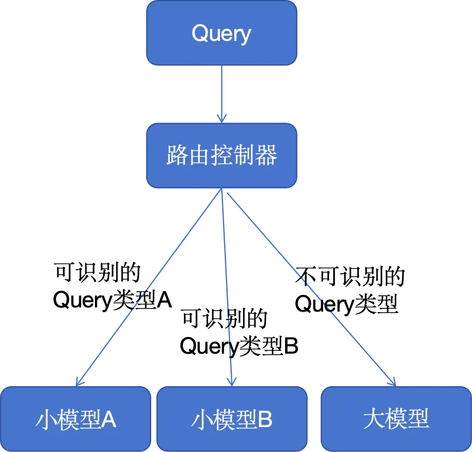
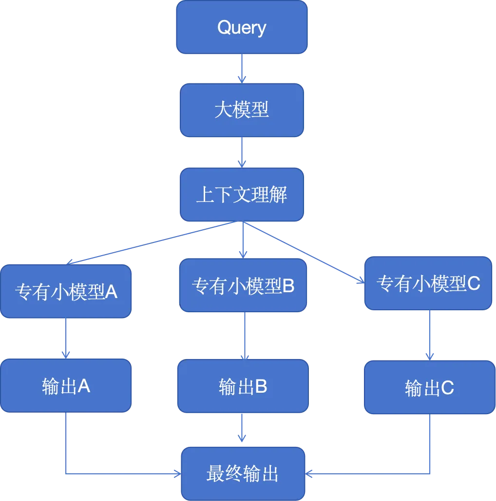
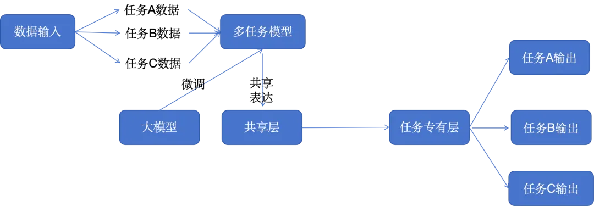
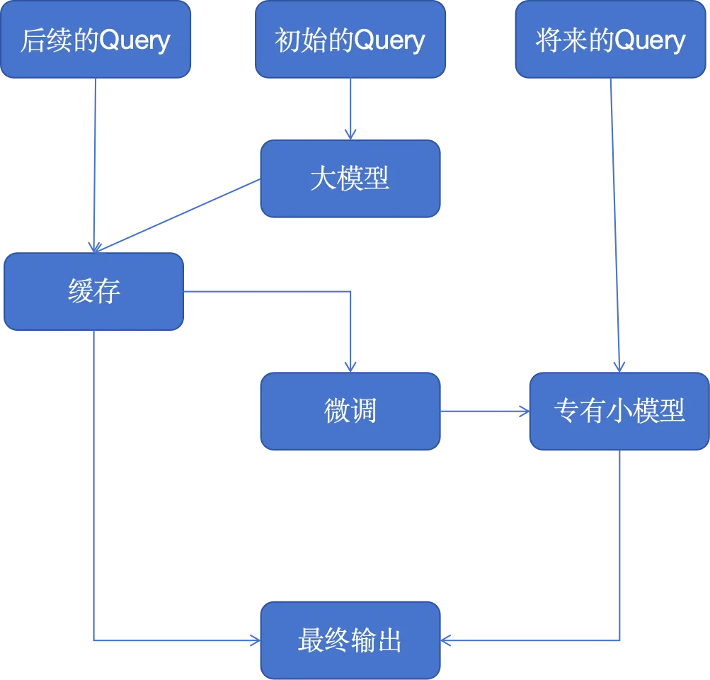
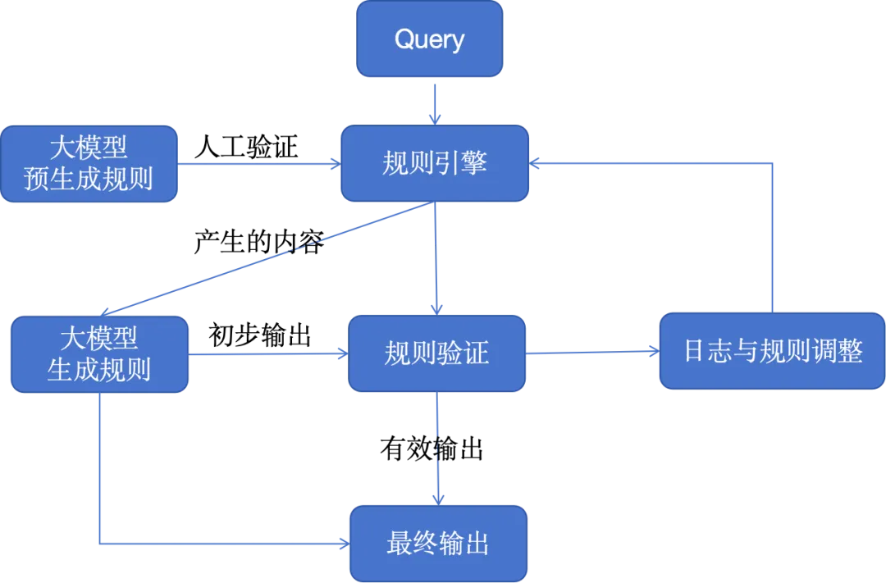
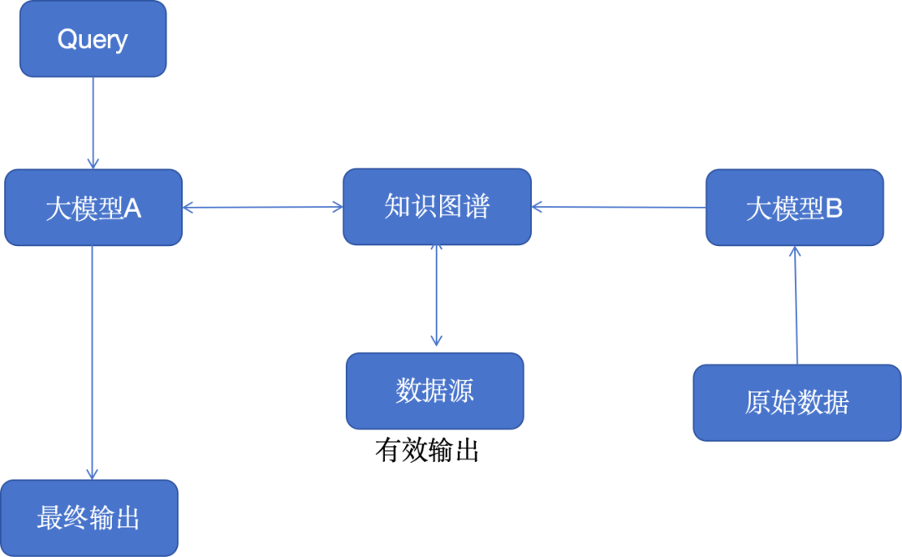
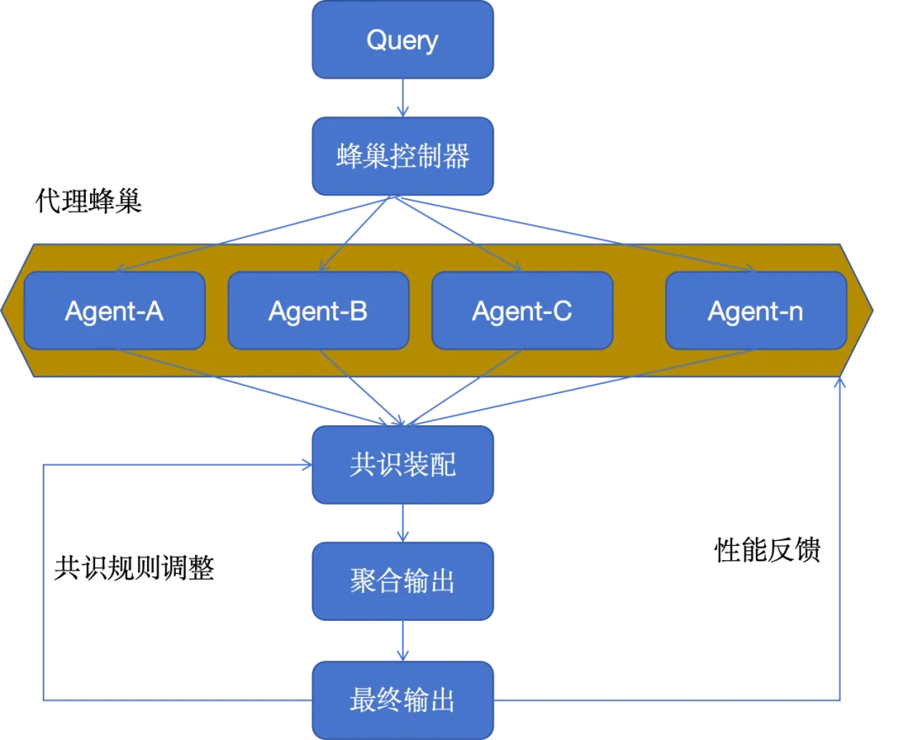
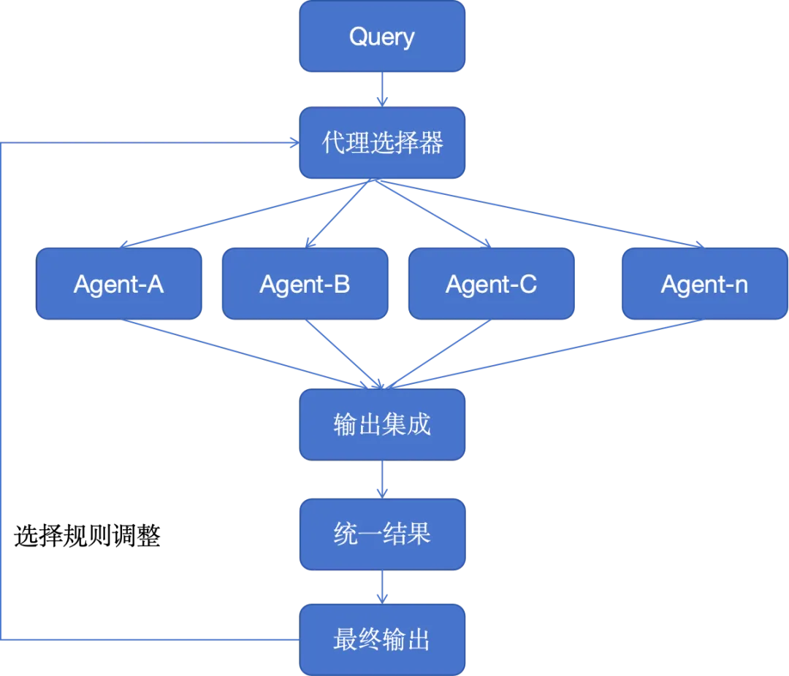
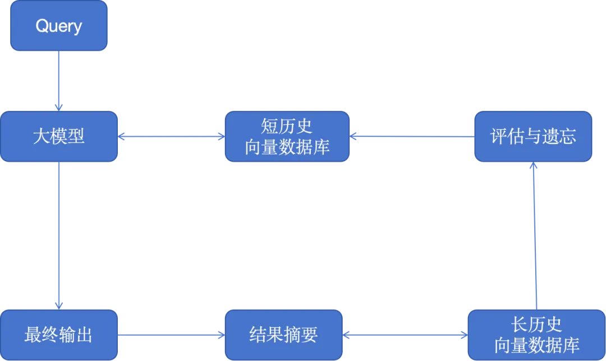
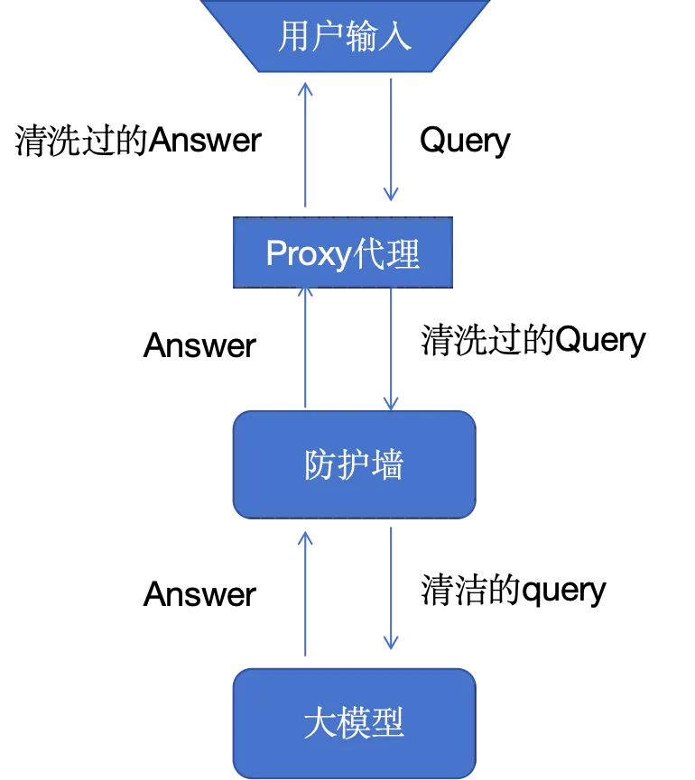

# 1. 路由分发模式

当用户输入一个查询时，该查询会被发送到控制中心，而控制中心则扮演着对输入进行分类的角色。

如果查询是可以识别的，那么它会被路由到小语言模型进行处理，这通常是一个更准确、响应更快且成本更低的操作。然而，如果查询无法被识别，那么它将由大型语言模型来处理。尽管大型语言模型的运行成本较高，但它能够成功返回更多种类型查询的答案。通过这种方式，人工智能产品可以在成本、性能和用户体验之间实现平衡。

# 2. 大模型代理模式

想象一个生态系统，其中多个专门针对特定任务的生成式AI模型各自作为其领域内的专家，并行工作以处理查询。这种多路复用模式能够生成一系列不同的响应，然后将这些响应整合在一起，形成一个全面的答案。

这样的设置非常适合复杂的问题解决场景，在这种场景中，问题的不同方面需要不同的专业知识，就像一个由专家组成的小组，每个专家负责处理更大问题的一个方面。

更大的模型（如GPT-4）负责理解上下文，并将其分解为特定的任务或信息请求，这些任务或信息请求被传递给更小的代理。这些代理可能是较小的语言模型，它们已经接受过特定任务的训练，或者是具有特定功能的通用模型，如GPT、Llama、上下文提示和函数调用。

# 3. 多任务微调模式

在这种架构模式中，我们对大型语言模型进行了微调，使其能够同时处理多个任务，而非仅仅针对单个任务。这是一种跨领域知识和技能迁移学习的方法，大大增强了模型的多功能性。

这种多任务学习方法对于那些需要应对各种复杂任务的平台来说尤其有用，例如虚拟助理或是人工智能驱动的研究工具。这极大地简化了面向复杂领域的训练和测试工作流程。

在训练大型语言模型（LLM）时，我们可以利用一些资源和软件包，如DeepSpeed，以及Hugging Face的Transformer库。

# 4. 面向微调的分层缓存策略模式

我们将缓存策略和相关服务引入到大模型应用架构中，可以成功地解决成本、数据冗余以及训练数据等组合问题。、

通过储存这些初始结果，系统能够在后续查询中迅速提供答案，从而显著提高了效率。当我们累积了足够的数据后，微调层级将启动，利用早期交互的反馈，进一步完善一个更为专业化的模型。

专有大模型不仅简化了操作流程，也使人工智能专业知识更好地适应特定任务，使其在需要高度精确性和适应性的环境中，如客户服务或个性化内容创建，表现得更为高效。

对于刚入门的用户，可以选择使用预先构建的服务，如 GPTCache，或者使用常见的缓存数据库，如 Redis、Cassandra、Memcached来运行自己的服务。在向混合服务中添加其他服务时，一定要记得监控并测量延迟情况。

# 5. 混合规则模式

许多现行的商业系统和企业应用在一定程度上仍然依赖于基于规则的架构。通过将大模型与基于规则的逻辑结合，我们能够融合结构化的精确性，旨在创造出既富有创意又遵循规范的解决方案。

对于那些必须严格遵守标准或法规的行业或产品而言，这是一个非常有效的架构模式，它确保了人工智能在保持创新的同时，仍能遵守既定的理想参数。例如，这种架构可以应用于生成电话IVR系统或基于规则的传统（非LLM）聊天机器人的意图和消息流。

# 6.知识图谱模式

将知识图谱与生成型人工智能模型结合，赋予了它们面向事实的超级能力，使得输出不仅具有上下文情境，而且更加符合事实。

对于要求内容真实性和准确性不容忽视的应用来说，这种方法至关重要，比如在教育内容创作、医疗咨询或任何误导可能带来严重后果的领域。

知识图谱及其本体能够将复杂主题或问题分解成结构化格式，为大型语言模型提供深层上下文基础。我们甚至可以借助语言模型，以JSON或RDF等格式创建本体。

可用于构建知识图谱的图数据库服务包括ArangoDB、Amazon Neptune、Google Dgraph、Azure Cosmos DB以及Neo4j等。此外，更广泛的数据集和服务也能用于访问更全面的知识图谱，包括开源的企业知识图谱API、PyKEEN数据集以及Wikidata等等。

# 7. 智能体蜂巢模式

智能体蜂巢架构模式运用了大量AI Agent，这些代理共同协作以解决一个问题，每个代理都从各自独特的视角出发进行贡献。

由此产生的综合结果展示了一种集体智慧的体现，其效果超越了任何一个单独的AI个体所能达到的成果。在需要大量创新解决方案的场景中，或者在处理复杂的数据集时，这种模式尤其有效。

例如，我们可以利用多个AI Agent来共同审查一篇研究论文，整合他们的所有数据和观点。对于处理能力要求较高的蜂巢系统，我们可以考虑部署消息队列服务，比如Apache Kafka，以便更好地处理代理和服务间的消息传递。

# 8. 智能体组合模式

该架构模式强调了灵活性，通过模块化的人工智能系统，能自我重新配置以优化任务性能。这就像一个多功能工具，可以根据需求选择和激活不同的功能模块，对于需要为各种客户需求或产品需求定制解决方案的企业来说，这是非常有效的。

我们可以通过使用各种自主代理框架和体系结构来开发每个Agent及其工具，例如CrewAI、Langchain、LLamaIndex、Microsoft Autogen和superAGI等。

通过组合不同的模块，例如一个Agent可以专注于预测，另一个处理预约查询，还有一个专注于生成消息，最后一个Agent来更新数据库。将来，随着专业AI公司提供的特定服务的增多，我们可以将一个模块替换为外部或第三方服务，以处理特定的任务或领域的问题。

# 9.记忆认知模式

这种架构为人工智能引入了类似于人类记忆的元素，允许模型回忆并基于过去的交互进行学习，从而产生更细腻的反应。

这对于正在进行的对话或学习场景非常有用，因为随着时间的推移，人工智能会形成更深的理解，就像一个专业的个人助理或者在线机器学习平台。随着时间推移，记忆认知模式能够将关键事件总结并储存到一个向量数据库中，进一步丰富RAG系统。

为了保持汇总计算量的合理性，我们可以通过使用更小的自然语言处理库来进行汇总和摘要。所使用的是向量数据库，并在提示阶段进行检索，以检查短期记忆，并通过最近邻搜索来定位关键的“事实”。有一个遵循这种模式的开源解决方案是MemGPT。

# 10. 双重安全模式

围绕大型语言模型（LLM）的核心安全性至少包含两个关键组件：一是用户组件，我们将其称为用户Proxy代理；二是防火墙，它为模型提供了保护层。

用户proxy代理在查询发出和返回的过程中对用户的query进行拦截。该代理负责清除个人身份信息（pII）和知识产权（IP）信息，记录查询的内容，并优化成本。

防火墙则保护模型及其所使用的基础设施。尽管我们对人们如何操纵模型以揭示其潜在的训练数据、潜在功能以及当今恶意行为知之甚少，但我们知道这些强大的模型是脆弱的。

在安全性相关的技术栈中，可能还存在其他安全层，但对于用户的查询路径来说，Proxy代理和防火墙是最关键的。

# 参考

[1] 大模型应用的10种架构模式，https://mp.weixin.qq.com/s/3iDXOCrPJnf8-qT1OHncBQ