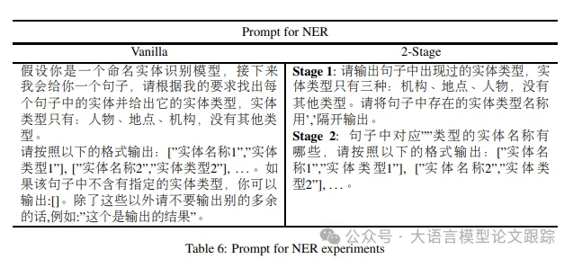
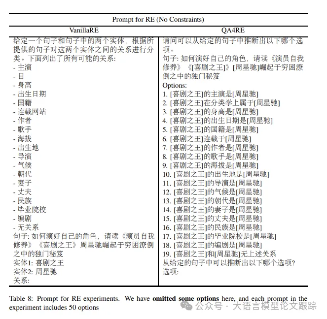
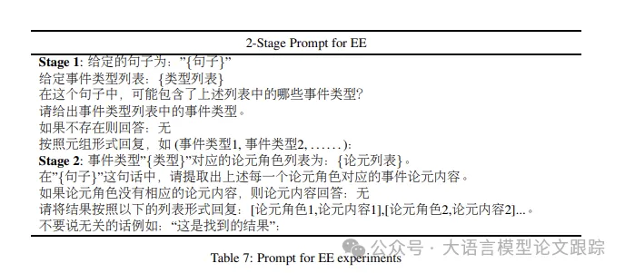
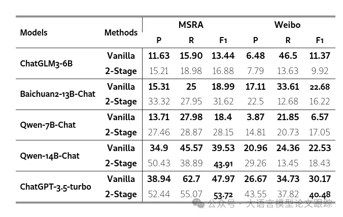
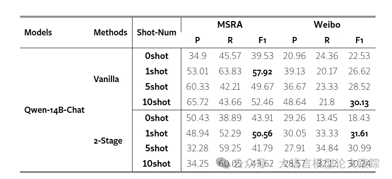
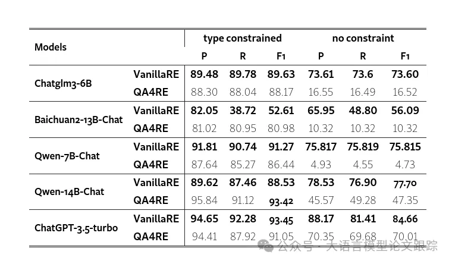
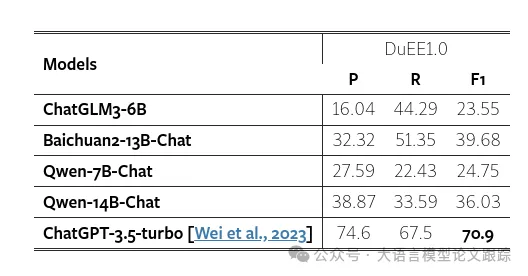

# 1. 资源

Assessing the Performance of Chinese Open Source Large Language Models in Information Extraction Tasks

https://arxiv.org/abs/2406.02079

# 2. 信息抽取概念

信息抽取（Information Extraction，IE）一般包括命名实体识别（Named Entity Recognition，NER）、关系抽取（Relation Extraction，RE）和事件抽取（Event Extraction，EE）。

NER作为基础任务，专注于识别并分类文本中的命名实体，如人物、组织、地点和日期。

RE则致力于发现实体间的语义联系，比如某人在某地工作或两人之间的婚姻关系。

EE则关注于识别文本中的特定事件及其相关要素，这些事件是特定时间、地点下发生的，涉及特定参与者和实体的行动或现象。

# 3. 方法

## 3.1 命名实体识别方法

命名实体识别（NER）方面，作者采用了两种策略：基础法和分步法。

- 基础法简洁明了，仅需提供句子和实体类型列表，模型便能按照指定格式输出实体及其类型。
- 分步法则将任务拆分为两步：第一步，模型需识别并输出文本中的实体类型；第二步，模型将逐一针对每种实体类型输出相应的实体。

下图是作者用于命名实体识别的提示词：

## 3.2 关系抽取方法

关系抽取（RE）实验中，采用了两种零样本框架：VanillaRE和QA4RE。在这两种框架下，模型输入包括句子、两个实体以及所有可能的关系类型，分别设置了有类型约束和无类型约束两种情况。

- VanillaRE框架直接列出所有候选关系供模型选择
- QA4RE框架则将关系转化为多项选择题，更适合LLMs进行生成性问答

下图是作者用于关系抽取的提示词：

## 3.3 事件抽取方法

事件抽取（EE）任务因难度较高且基础框架表现不佳，作者只展示了分步法的实验结果，并对比了不同大型语言模型的性能。在分步法的第一阶段，模型负责从文本中识别所有预定义的事件类型；第二阶段则进一步提取每种事件类型的论元角色及其内容。

下图是作者用于事件抽取的提示词：

# 4. 结果

## 4.1 命名实体识别任务哪个模型强？
在命名实体识别（NER）任务上，作者对比了零样本和少样本两种策略。零样本测试中，动用了五款大型语言模型（LLMs），并针对两个数据集进行了性能评估。少样本测试中，挑选了零样本评估中表现最优的开源模型 Qwen-14B-Chat，进一步在两个数据集上进行了测试。

### 4.1.1 零样本测试
NER 的零样本测试成果展示在下表中。

1. 所有大型语言模型中，ChatGPT-3.5-Turbo 以卓越的表现领先，其在所有数据集和方法上均取得了最高的F1分数。在所有开源LLMs中，Qwen-14B-Chat 在 MSRA 数据集上获得了最高的F1分数，而 Baichuan-13B-Chat 则在 Weibo 数据集上创下了最高纪录。

2. 在所有开源LLMs中，参数规模为13B/14B的模型在相同方法和数据集的准确度上，始终超越了参数规模为6B/7B的模型。除了 Baichuan-13B-Chat 在 Weibo 数据集上采用2-Stage方法得到的F1分数低于 Qwen-7B-Chat 0.55之外，参数规模较大的模型在F1分数上普遍优于参数规模较小的模型。这可能是因为规模更大的LLMs拥有更丰富的实体识别相关知识，从而带来更精准的分类效果。

3. 在涵盖两个数据集和五款LLMs的共10项测试中，2-Stage方法在7项测试的F1分数上超越了基础法。2-Stage方法在每次测试中至少提升了1.31个百分点，最高提升了18.01个百分点的准确率。这表明2-Stage方法能更有效地引导模型识别所需类型的实体，从而显著提高模型的预测准确度和F1分数。

4. 当模型保持不变时，MSRA 数据集上的F1分数普遍高于 Weibo 数据集。这种差异可能源于几个因素：首先，两个数据集的难度级别不同；其次，MSRA 数据集源自报纸媒体，使用的是书面语言，而 Weibo 数据集来自社交媒体，语言风格更偏向口语。模型的内在知识与书面语言更为契合，因此在提取书面文本信息方面更为得心应手。

### 4.1.2 少样本测试

NER 的少样本测试结果如下表。作者对每种方法进行了三种不同样本量的少样本测试：1个、5个和10个样本。

1. 少样本测试在四分之三的情况下F1分数超越了零样本测试，这表明提供示例有助于模型更好地理解任务。但在2-Stage方法中，除了从零样本到一样本F1分数有所提升外，增加样本数量并未显著提升，甚至降低了F1分数，这主要是由于精确度的大幅下滑。2-Stage方法将NER任务拆分为两个子任务，随着示例的增多，模型在第一阶段倾向于生成更多类型以匹配示例中的多样性，这可能导致在第二阶段询问一个不存在的类型时模型错误地输出潜在答案，从而显著降低了精确度和F1分数。

2. 在基础法中，除了在Weibo数据集上从1样本增加到5样本时精确度有所下降外，其他所有测试均显示，随着样本数量的增加，同一数据集上的精确度也随之提高。这是因为基础法的提示缺少详细的任务描述，导致模型在零样本测试中对预测实体类型的理解不够明确。一旦提供了示例，模型就能更准确地识别出需要提取的实体，从而显著提升了从零样本到一样本的精确度。随着样本数量的进一步增加，模型对任务的理解更加深入，精确度也得到了进一步提升。

3. 2-Stage方法的测试结果呈现出不同的变化趋势。除了在Weibo数据集上从5样本增加到10样本时召回率轻微下降外，其他所有测试都显示，随着样本数量的增加，同一数据集上的召回率有所提升。这可能与(1)中提到的原因有关，即生成更多内容时，实验的召回率也在一定程度上得到了改善。

## 4.2 关系抽取任务哪个模型强？

中文零样本关系抽取的结果如下表。

1. 大多数大型语言模型在类型约束下表现优异，但在缺乏约束时性能急剧下降。没有类型约束，LLM必须在50种关系类型中做出选择，而适当的约束可以大大减少对模型的干扰信息。特别地，在某些特定类型的实体对中，只保留了正确的关系类型和“无上述关系”(NoTA)。

2. 传统基础法框架下的表现普遍优于QA4RE框架。这可能是因为DuIE2.0数据集的关系抽取任务对于LLM而言并不复杂，而问答(QA)形式的引入反而增加了理解难度。此外，在无约束实验中，许多不合理的选项（如“Alice是Bob的出版商”）被加入提示中，这些信息对LLM选择关系类型造成了干扰。

3. 在两种设置下，LLM的表现大体一致。ChatGLM3-6B、Qwen-7B-Chat、Qwen-14B-Chat和ChatGPT-3.5-turbo在有类型约束和无约束的环境中均展现出领先优势。在所有开源LLM中，Qwen-14B-Chat的表现最为出色，其在类型约束环境中的表现仅比ChatGPT-3.5-turbo低0.03个百分点。

4. 在无约束的QA4RE环境中，ChatGPT-3.5-turbo的表现远远超过其他LLM（70.01%对比47.35%），显示出其在面对较长且包含不合理句子的提示时，具有比所有开源LLM更强的抗干扰能力。然而，考虑到模型规模的差异（175B对比最大的14B），这样的差距实际上也是在可接受范围内。

讨论DuIE 2.0数据集的局限性时，值得注意的是，在类型约束设置中，许多实体对只保留了正确的关系类型和“无上述关系”(NoTA)。例如，出版社和书籍之间的关系类型仅限于“出版”或NoTA。这在一定程度上解释了为什么LLM在类型约束条件下能够表现卓越。

## 4.3 事件抽取任务哪个模型强？

上表展示了零样本事件抽取任务的结果。鉴于事件抽取对模型理解力的更高挑战，只能采用两阶段分解法，才能提炼出更为明晰的答案。ChatGPT以其卓越的理解力和对复杂提示格式要求的精准把握，再次以所有大型语言模型中最高的F1分数领跑。在开源模型领域，Baichuan2-13B-Chat表现出色，尽管其F1分数仍落后ChatGPT高达31.22分。

# 参考

[1] 哪个中文开源大模型在信息抽取上效果最好？附：用于提取的提示词，https://mp.weixin.qq.com/s/GZI0ByGmG_Gh7j1L6OO8FQ