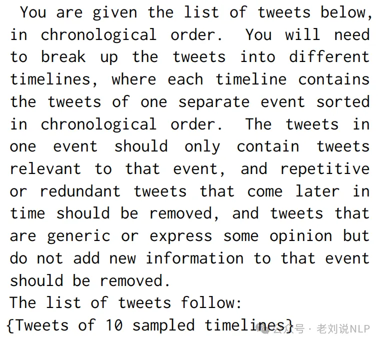

# 1. 资源

- Github (5 stars): https://github.com/nusnlp/LLM-TLS
  - ACL2024 paper "From Moments to Milestones: Incremental Timeline Summarization Leveraging Large Language Models"
    - aclanthology.org/2024.acl-long.390.pdf

- Github (33 stars): https://github.com/Alibaba-NLP/CHRONOS
    - Demo: https://modelscope.cn/studios/vickywu1022/CHRONOS
    - Unfolding the Headline: Iterative Self-Questioning for News Retrieval and Timeline Summarization
      - https://arxiv.org/abs/2501.00888

# 2. 事件分析中的时间线生成

时间线总结（TLS，Timeline Summarization）旨在从随时间变化的众多文本来源中提取并排序关键事件，提供历史发展的结构化视图，其综合了事件发展的时间顺序叙述，也可以被视为多文档总结的扩展，可以应用于追踪事件和话题随时间的进展。

如果要细分，可以细分为主题时间线总结(event timeline summarization)和话题时间线总结(topic timeline summarization)两个，其区别在于，事件TLS为用户提供详细的摘要，以便跟踪特定事件的演变，而主题TLS则有助于快速理解关于某个主题的重要事件。

当然，很直接的做法，就是直接梭哈给llm，一步到位，如使用GPT4:

但在封源环境下不奏效，怎么办，那就分开做。

但是，合成时间线的核心是建立事件之间的时间和因果关系。这个实现是比较可行的，我们可以假设LLMs所包含的知识使其能够辨别事件描述之间的相关性，可预见的，可以使用LLMs作为来解决诸如“事件i和j是否指代同一事件？”或“新推文i是否与时间线j指代同一事件？”之类的查询。这也是目前可以使用prompt进行处理的范式。

这种自然的想法，在《From Moments to Milestones: Incremental Timeline Summarization Leveraging Large Language Models》(https://github.com/nusnlp/LLM-TLS)中得到了验证，思路很简单，如下：以“史蒂夫·乔布斯”为主题的话题TLS，事件被分为几个簇（A-F），灰色圆圈表示不太重要的事件。

簇是被排序的，关键事件按时间顺序排列，以展示史蒂夫·乔布斯生活和事业中的里程碑。

一篇新到达的文章被概括成一个标记为“？”的事件描述，并通过与相邻的事件节点比较来评估其相关性。具体判断过程也是有设计思想的，当新的新闻文章到达时，首先使用LLM生成与主题关键词相关的最重要事件的简要总结。 然后再使用LLM进行成对分类，确定两个总结是否属于同一事件。将事件总结编码为向量，并在向量数据库中进行检索，找到与查询总结最相似的N个总结，然后，使用LLM判断这两个总结是否属于同一事件。

通过迭代执行这一过程，最终形成一个事件图，其中每个节点代表一个事件。最后，根据节点连接数对事件聚类进行排名，选择前K个聚类，并使用TextRank算法提取每个聚类的关键句子，形成完整的时间线。

# 3. workflow范式的时间线生成工作Unfolding the Headline

也是昨天，看到的一个工作，《Unfolding the Headline: Iterative Self-Questioning for News Retrieval and Timeline Summarization》（https://arxiv.org/abs/2501.00888，https://github.com/Alibaba-NLP/CHRONOS，https://modelscope.cn/studios/vickywu1022/CHRONOS），为了提升时间线生成全面性，将工作设计为多步骤执行，并且通过自我提问、分而治之的思路进行处理，很有趣，值得一看。一个具象化的流程如下：

简单说，该方案的核心思路：通过迭代自问的方式利用大模型来生成和更新新闻时间线。，流程图如下：

首先，使用目标新闻标题作为关键词进行搜索，获取最相关的新闻文章，称为“新闻上下文”。

然后，为了获得更全面的信息，LLM根据新闻上下文生成一些问题，这些问题无法根据当前的新闻上下文回答。这些问题旨在探索更多相关的事件，接着根据生成的问题，LLM迭代搜索新的参考文章，以获取更多信息。

为了提高自问的质量，利用LLM的上下文学习（ICL）能力，通过少量提示（few-shot prompt）指导LLM生成问题，所以，会有一个Topic-Questions Example Pool(利用GPT-4o生成了针对Crisis、T17和Open-TLS数据集中主题的50个问题)，具体的，当为新目标新闻报道生成问题时，利用BERT基础模型来嵌入查询关键词，并应用余弦相似度从池中检索最相似的主题和相关示例对。这些动态检索的几例演示确保了示例在上下文中是相关的，并且在时间上是有信息的。

但由于生成的问题通常较为复杂，难以直接用于搜索，所以，重写机制将复杂或表现不佳的查询分解为2-3个专注的查询，以提高搜索精度。

这个逻辑是成立的。例如，“政府针对硅谷银行和签名银行崩溃建议了哪些行动？”直接将这个问题作为搜索引擎中的查询，检索效果不佳。因此，可以利用大模型将每个复杂或表现不佳的查询分解成2-3个重点查询，如“政府对硅谷银行崩溃的应对措施”和“签名银行倒闭后政府的行动”。这种分解提高了检索文档的特异性和覆盖率，使后续的总结任务更加有效。

最后，在每一轮自我提问结束时，LLM被要求提取具有明确日期的重大里程碑事件，并撰写这些事件的详细摘要。

在分别处理完每一轮之后，合并生成的时间线，以确保只保留最重要的事件。合并过程涉及对齐不同轮次的事件，并解决日期和描述的任何冲突。这一个也是使用prompt来控制，LLM从原始时间线中选择前1个重要里程碑事件。

但是，有3个根本问题是很明显的：

一个是这种思路本质上依赖于迭代的自我提问的迭代次数，迭代多少次，其实很难控制，通过增加提问轮数，可以检索到更多新闻报道，从而增强其新闻数据库的全面性。但过多的检索到的新闻报道会使得合并成一个连贯的时间线有影响，性能最初随着更多轮次的提问而提升，但最终会下降。

另外一个点，就是检索多少个新闻，也是一个量的问题，检索更多的文档为模型提供了更丰富的上下文。然而，由于在整合不太相关的新闻时可能会引入噪声，进一步增加检索到的新闻数量时观察到的边际改善表明了一个阈值，超过该阈值后好处趋于平稳。如下，将数量从20篇文档增加到30篇文档显著改善了结果，而增加到40篇文档时改善则较为有限。

一个是可以看到，整个的流程都是使用prompt 来驱动大模型的，所以，对大模型自身的能力要求是很高的，新闻报道的一个明显特点就是主题领域广泛，所以对大模型要求很高，如这个工作里面所说的，可能是因为这些领域需要大量的领域知识和实体，大模型在经济和政体主题上表现就不好。

# 参考

[1] 大模型用于情报分析时间线生成(TLS)任务：根本问题及两个代表工作, https://mp.weixin.qq.com/s/GPuBtTVV1Kp0sQT5uW-5ug