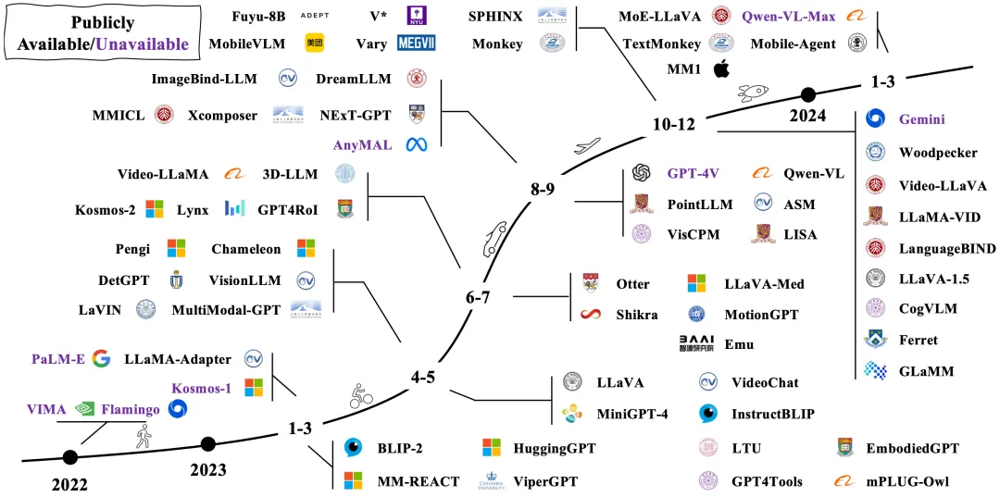
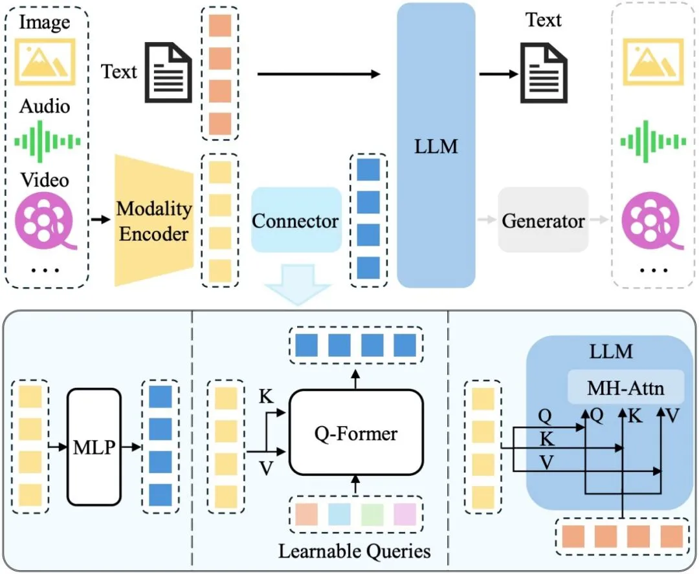

# 1. 资源

论文链接：https://arxiv.org/pdf/2306.13549.pdf
项目链接(每日更新最新论文， 8.3K Stars)：https://github.com/BradyFU/Awesome-Multimodal-Large-Language-Models

# 2. 介绍

MLLM 发展脉络图

MLLM 脱胎于近年来广受关注的大语言模型（Large Language Model , LLM），在其原有的强大泛化和推理能力基础上，进一步引入了多模态信息处理能力。相比于以往的多模态方法，例如以 CLIP 为代表的判别式，或以 OFA 为代表的生成式，新兴的 MLLM 展现出一些典型的特质：（1）模型大。MLLM 通常具有数十亿的参数量，更多的参数量带来更多的潜力；（2）新的训练范式。为了激活巨大参数量的潜力，MLLM 采用了多模态预训练、多模态指令微调等新的训练范式，与之匹配的是相应的数据集构造方式和评测方法等。在这两种特质的加持下，MLLM 涌现出一些以往多模态模型所不具备的能力，例如给定图片进行 OCR￾Free 的数学推理、给定图片进行故事创作和理解表情包的深层含义等。

本综述主要围绕 MLLM 的基础形式、拓展延伸以及相关研究课题进行展开，具体包括:

- MLLM 的基础构成与相关概念，包括架构、训练策略、数据和评测；
- MLLM 的拓展延伸，包括输入输出粒度、模态、语言和场景的支持；
- MLLM 的相关研究课题，包括多模态幻觉、多模态上下文学习(Multimodal In-Context Learning，M-ICL)、多模态思维链(Multimodal Chain of Thought，M-CoT)、LLM 辅助的视觉推理(LLM-Aided Visual Reasoning，LAVR)。

# 3. 原理
## 3.1 架构

对于多模态输入-文本输出的典型 MLLM，其架构一般包括编码器、连接器以及 LLM。如要支持更多模态的输出(如图片、音频、视频)，一般需要额外接入生成器，如下图所示:

MLLM 架构图

其中，模态编码器负责将原始的信息(如图片)编码成特征，连接器则进一步将特征处理成LLM 易于理解的形式，即视觉 Token。LLM 则作为“大脑”综合这些信息进行理解和推理，生成回答。目前，三者的参数量并不等同，以 Qwen-VL[1]为例，LLM 作为“大脑”参数量为 7.7B，约占总参数量的 80.2%，视觉编码器次之(1.9B，约占 19.7%)，而连接器参数量仅有 0.08B。

对于视觉编码器而言，增大输入图片的分辨率是提升性能的有效方法。一种方式是直接提升分辨率，这种情况下需要放开视觉编码器进行训练以适应更高的分辨率，如 Qwen-VL[1]等。另一种方式是将大分辨率图片切分成多个子图，每个子图以低分辨率送入视觉编码器中，这样可以间接提升输入的分辨率，如 Monkey[2]等工作。

对于预训练的 LLM，常用的包括 LLaMA[3]系列、Qwen[4]系列和 InternLM[5]系列等，前者主要支持英文，而后两者中英双语支持得更好。就性能影响而言，加大 LLM 的参数量可以带来显著的性能增益，如 LLaVA-NeXT[6]等工作在 7B/13B/34B 的 LLM 上进行实验，发现提升LLM 大小可以带来各 benchmark 上的显著提升，在 34B 的模型上更涌现出 zero-shot 的中文能力。除了直接增大 LLM 参数量，近期火热的 MoE 架构则提供了更高效实现的可能性，即通过稀疏计算的方式，在不增大实际计算参数量的前提下提高总的模型参数量。

相对前两者来说，连接器的重要性略低。例如，MM1[7]通过实验发现，连接器的类型不如视觉 token 数量(决定之后 LLM 可用的视觉信息)及图片的分辨率(决定视觉编码器的输入信息量)重要。

## 3.2 数据与训练

MLLM 的训练大致可以划分为预训练阶段、指令微调阶段和对齐微调阶段。预训练阶段主要通过大量配对数据将图片信息对齐到 LLM 的表征空间，即让 LLM 读懂视觉 Token。指令微调阶段则通过多样化的各种类型的任务数据提升模型在下游任务上的性能，以及模型理解和服从指令的能力。对齐微调阶段一般使用强化学习技术使模型对齐人类价值观或某些特定需求(如更少幻觉)。

早期工作在第一阶段主要使用粗粒度的图文对数据，如 LAION-5B，这些数据主要来源于互联网上的图片及其附带的文字说明，因此具有规模大（数 10 亿规模）但噪声多、文本短的特点，容易影响对齐的效果。后来的工作则探索使用更干净、文本内容更丰富的数据做对齐。如 ShareGPT4V[8]使用 GPT-4V 生成的详细描述来做更细粒度的对齐，在一定程度上缓解了对齐不充分的问题，获得了更好的性能。但由于 GPT-4V 是收费的，这种类型的数据规模通常较小（数百万规模）。此外，由于数据规模受限，其包含的世界知识也是有限的，比如是否能够识别出图像中的建筑为广州塔。此类世界知识通常储备于大规模的粗粒度图文对中。

第二阶段的微调数据一方面可以来源于各种任务的数据，如 VQA 数据、OCR 数据等，也可以来源于 GPT-4V 生成的数据，如问答对。虽然后者一般能够生成更复杂、更多样化的指令数据，但这种方式也显著地增加了成本。值得一提的是，第二阶段的训练中一般还会混合部分纯文本的对话数据，这类数据可以视为正则化的手段，保留 LLM 原有的能力与内嵌知识。

第三阶段的数据主要是针对于回答的偏好数据。这类数据通常由人工标注收集，因而成本较高。近期出现一些工作使用自动化的方法对来自不同模型的回复进行偏好排序，如 Silkie[9]通过调用 GPT-4V 来收集偏好数据。

## 3.3 其他技术方向

除了提升模型的基础能力(如支持的输入/输出形式、性能指标)外，还有一些有意思的问题以及待探索的方向。本综述中主要介绍了多模态幻觉、多模态上下文学习(Multimodal In￾Context Learning，M-ICL)、多模态思维链(Multimodal Chain of Thought，M-CoT)和 LLM 辅助的视觉推理(LLM-Aided Visual Reasoning，LAVR)等。

多模态幻觉的研究主要关注模型生成的回答与图片内容不符的问题。视觉和文本本质上是异构的信息，完全对齐两者本身就具有相当大的挑战。增大图像分辨率和提升训练数据质量是降低多模态幻觉的两种最直观的方式，此外我们仍然需要在原理上探索多模态幻觉的成因和解法。例如，当前的视觉信息的 Token 化方法、多模态对齐的范式、多模态数据和 LLM 存储知识的冲突等对多模态幻觉的影响仍需深入研究。

多模态上下文学习技术为少样本学习方法，旨在使用少量的问答样例提示模型，提升模型的few-shot 性能。提升性能的关键在于让模型有效地关注上下文，并将内在的问题模式泛化到新的问题上。以 Flamingo[10]为代表的工作通过在图文交错的数据上训练来提升模型关注上下文的能力。目前对于多模态上下文学习的研究还比较初步，有待进一步探索。

多模态思维链的基本思想是通过将复杂的问题分解为较简单的子问题，然后分别解决并汇总。相较于纯文本的推理，多模态的推理涉及更多的信息来源和更复杂的逻辑关系，因此要复杂得多。当前该方面的工作也比较少。

LLM 辅助的视觉推理方法探索如何利用 LLM 强大的内嵌知识与能力，并借助其他工具，设计各种视觉推理系统，解决各种现实问题。相比于通过端到端训练获得单一模型，这类方法一般关注如何通过免训练的方式扩展和加强 LLM 的能力，从而构建一个综合性的系统。

# 4. 挑战和未来方向

针对 MLLM 的研究现状，我们进行了深入思考，将挑战与可能的未来发展方向总结如下:

- 现有 MLLM 处理多模态长上下文的能力有限，导致模型在长视频理解、图文交错内容理解等任务中面临巨大挑战。以 Gemini 1.5 Pro 为代表的 MLLM 正在掀起长视频理解的浪潮，而多模态图文交错阅读理解（即长文档中既有图像也有文本）则相对空白，很可能会成为接下来的研究热点。
- MLLM 服从复杂指令的能力不足。例如，GPT-4V 可以理解复杂的指令来生成问答对甚至包含推理信息，但其他模型这方面的能力则明显不足，仍有较大的提升空间。
- MLLM 的上下文学习和思维链研究依然处于初步阶段，相关的能力也较弱，亟需相关底层机制以及能力提升的研究探索。
- 开发基于 MLLM 的智能体是一个研究热点。要实现这类应用，需要全面提升模型的感知、推理和规划能力。
- 安全问题。MLLM 容易受设计的恶意攻击影响，生成有偏的或不良的回答。该方面的相关研究也仍然欠缺。

- 目前 MLLM 在训练时通常都会解冻 LLM，虽然在训练过程中也会加入部分单模态的文本训练数据，但大规模的多模态和单模态数据共同训练时究竟对彼此互有增益还是互相损害仍然缺乏系统深入的研究。

# 参考

[1] 8.3K Stars!《多模态大语言模型综述》重大升级，https://mp.weixin.qq.com/s/uiojzTA2eufNcwpr29O1jA
