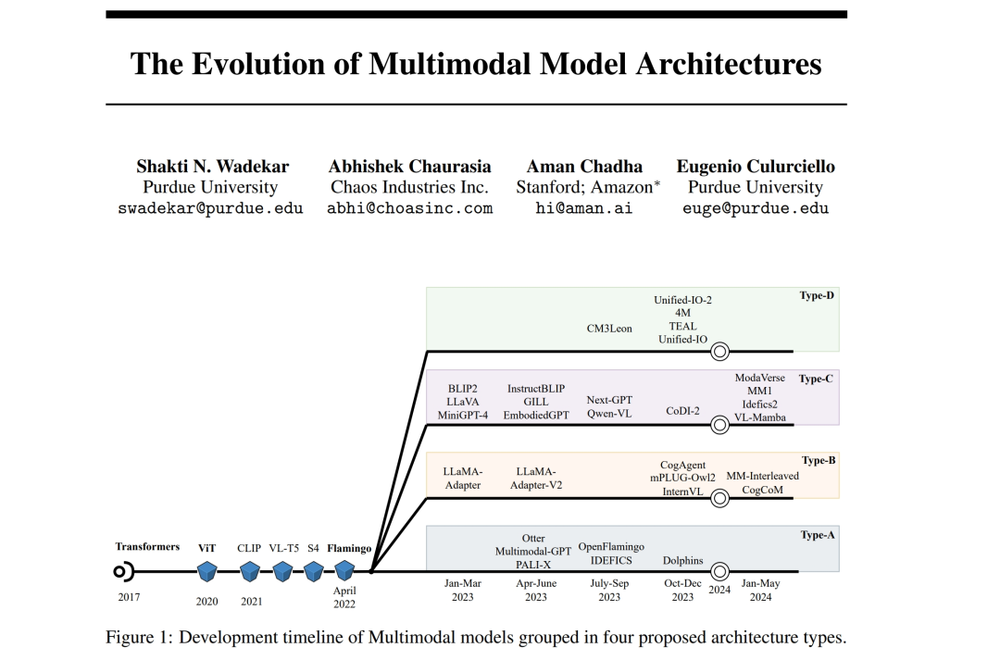
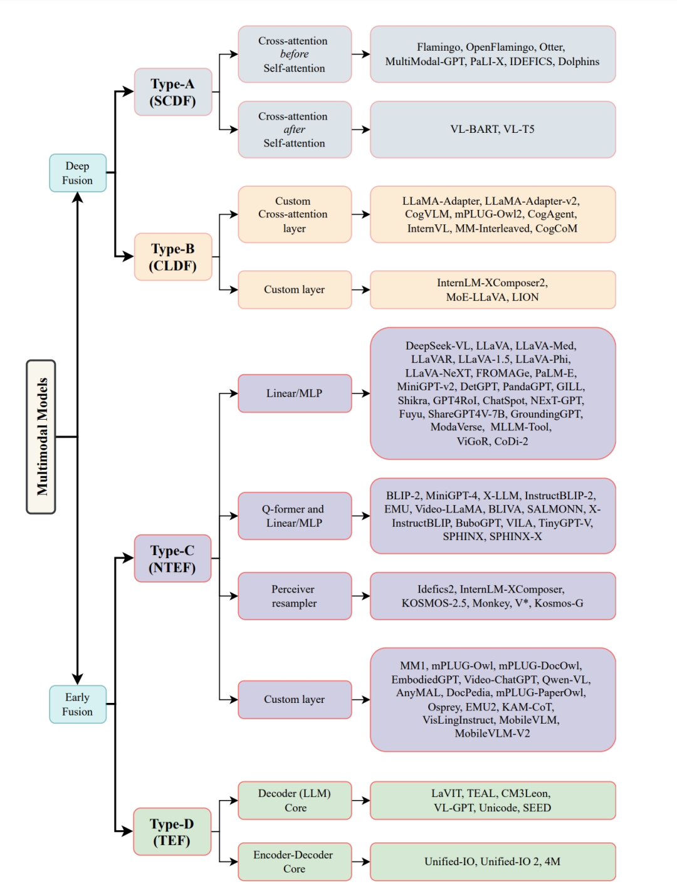
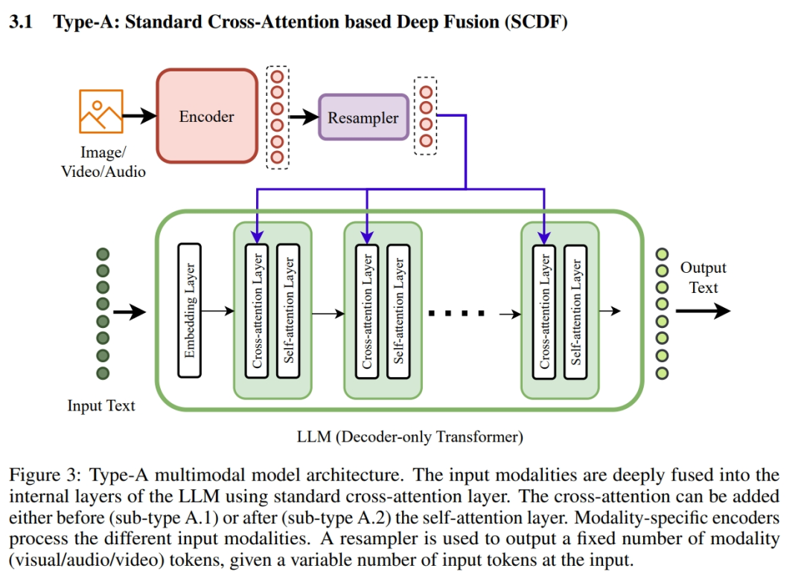
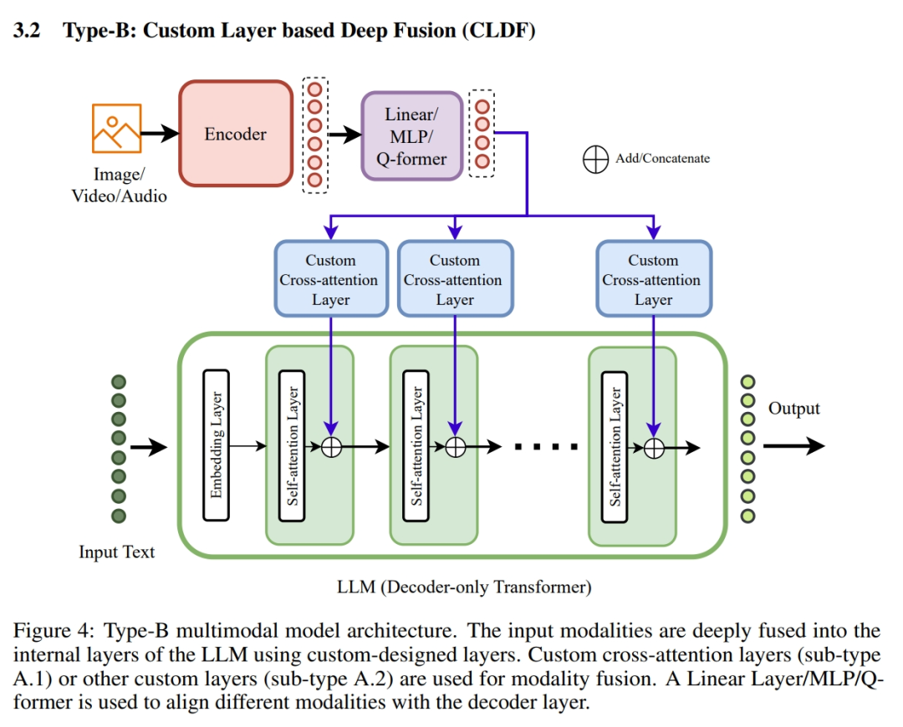
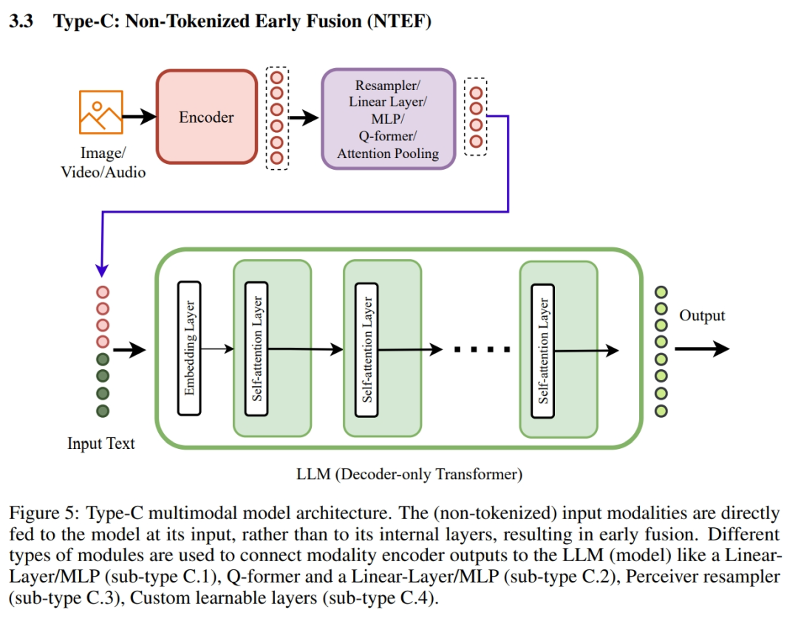
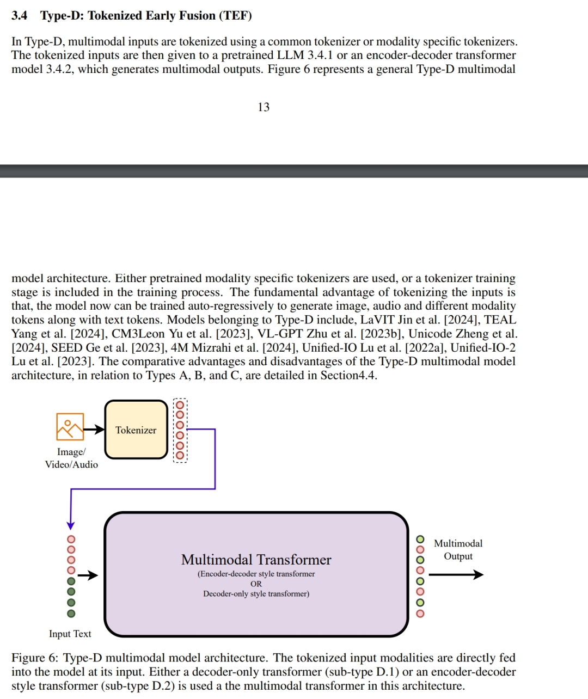
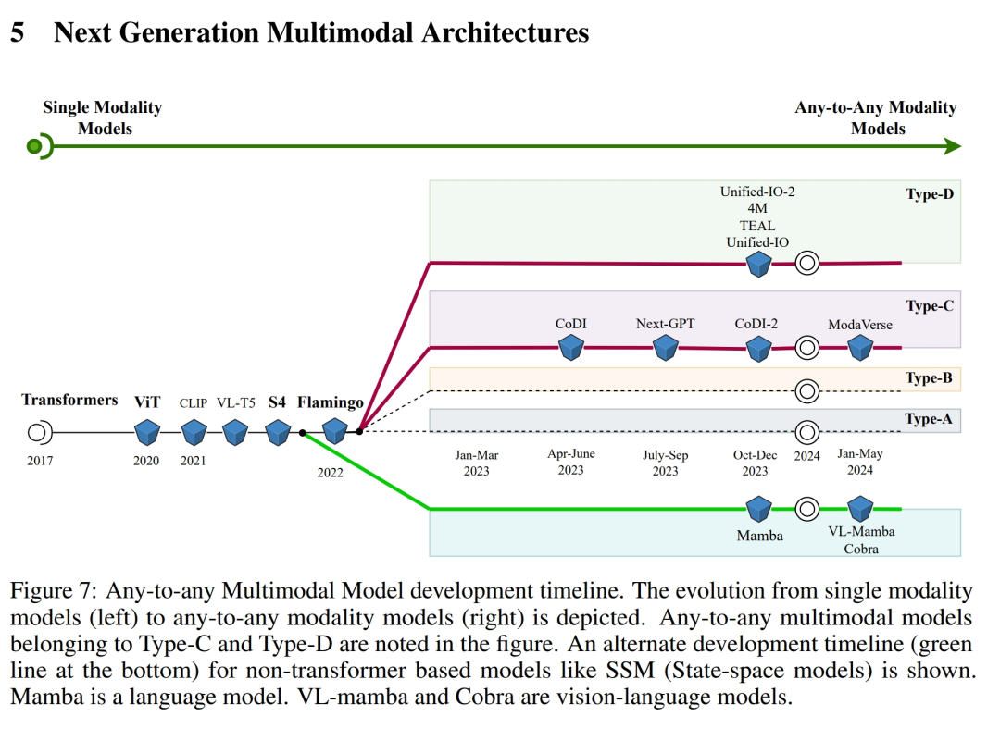

# 1. 介绍

 四类跨模态架构 研究中，他们把跨模态模型分成了四类：Type-A、Type-B、Type-C和Type-D。这四类模型就像是不同的烹饪方法，虽然原料（数据）一样，但做出来的菜（模型）风味各异。

1️⃣ Type-A：标准交叉注意力融合

Type-A模型就像是传统烹饪，用标准的交叉注意力层来融合不同模态的数据，比如文本和图像。这种模型就像是老派大厨，手艺精湛但需要大量的训练数据和计算资源。如Otter、OpenFlamingo等

2️⃣ Type-B：自定义层融合

Type-B模型则像是创新料理，用自定义设计层来融合模态，更加灵活和高效。这种模型就像是新派厨师，用新颖的手法创造出意想不到的美味。如LLaMA-Adapter、mPLUG-Owl2等

3️⃣ Type-C：: Non-Tokenized早期融合

Type-C模型则像是快速简餐，直接把不同模态的数据在输入阶段就融合起来，简单快捷。这种模型就像是快餐店，快速满足你的需求但可能不够精致。如BLIP2、LLAVA、Qwen-VL等

4️⃣ Type-D：: Tokenized早期融合

最后，Type-D模型就像是高级料理，通过Tokenized的方式在输入阶段融合数据，这种模型就像是米其林餐厅，虽然需要更多的训练和资源，但做出来的菜绝对是顶级的。如LaVIT、CM3Leon、Unified-IO等

🔥 未来展望

作者认为下一代多模态架构主要涉及Type-C和Type-D，特别是构建Any-to-any多模态模型方面，同时状态空间模型（SSMs）也是一个有前景的研究方向。

# 参考

[1] 多模态模型架构的进化史：从Transformer到多模态GPT，https://mp.weixin.qq.com/s/aS6kQEi6eCVHFlBviJXYWw