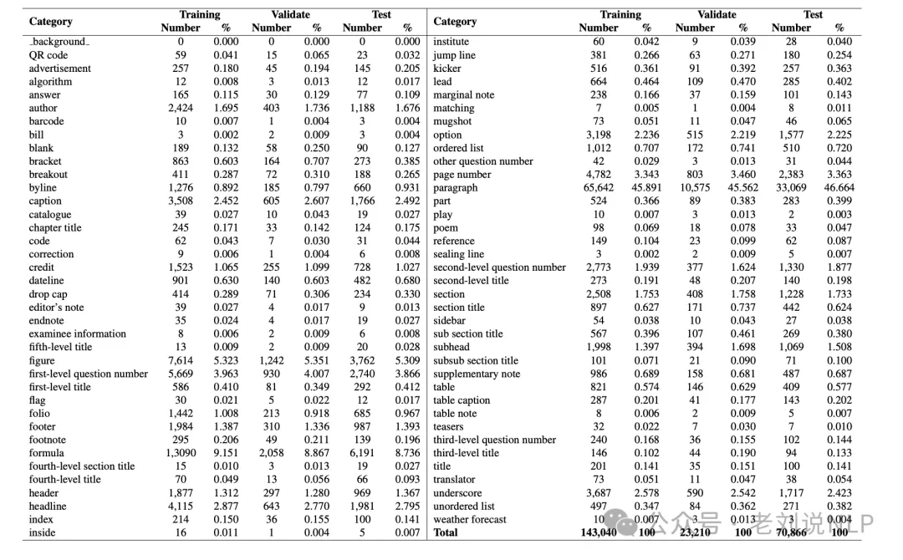

# 1. 数据

当前，文档版式分析已经成为文档分析中的一个重中之重，我们可以根据不同的文档进行版式数据的训练，其中开源的数据成了重中之重，我们可以来看看现有的一些数据集。

1、Publaynet数据集

    包含Text、Title、Tale、Figure、List，共5个类别，数据集中包含335,703张训练集、11,245张验证集和11,405张测试集
    
    地址:https://github.com/ibm-aur-nlp/PubLayNet

2、CDLA数据集

    包含5000张图像，验证集合中包含1000张图像。总共包含Text, Title, Figure, Figure caption, Table, Table caption, Header, Footer, Reference, Equation共10个类别。
    
    地址:https://github.com/buptlihang/CDLA

3、TableBank数据集

    仅包含Table 1个类别，包含Latex（训练集187199张，验证集7265张，测试集5719张）以及Word（训练集73383张，验证集2735张，测试集2281张）两种类别的文档。
    
    地址:https://doc-analysis.github.io/tablebank-page/index.html

4、D4LA数据集

    包含12类文档、DocTitle、ListText、LetterHead、Question、RegionList、TableName、FigureName、Footer、Number、ParaTitle、RegionTitle、LetterDear、OtherText、Abstract、Table、Equation、PageHeader、Catalog、ParaText、Date、LetterSign、RegionKV、Author、Figure、Reference、PageFooter、PageNumber共27种类型
    
    地址:https://modelscope.cn/datasets/iic/D4LA/summary,https://arxiv.org/pdf/2308.14978.pdf

5、DocLayNet文档布局分割数据集

    包括80863个文档、Caption、Footnote、Formula、List-item、Page-footer、Page-header、Picture、Section-header、Table、Text、Title共11个类别
    
    地址:https://github.com/DS4SD/DocLayNet，https://arxiv.org/pdf/2206.01062.pdf

6、M6Doc数据集

    共包含9,080个样本，涉及科学文章、教科书、试卷、杂志、报纸、笔记和书籍，涉及三种格式PDF、拍照文档和扫描文档。
    
    
    
    地址:https://github.com/HCIILAB/M6Doc,https://arxiv.org/pdf/2305.08719.pdf

7、cTDaR2019_cTDaR数据集

    用于表格检测(TRACKA)和表格识别(TRACKB)，只有表格一个标签。
    
    地址:https://cndplab-founder.github.io/cTDaR2019/
    
8、IIIT-AR-13K数据

    基于公开年报创建，共13k，涉及Table、Figure、Natural Image、Logo、Signature五个标签
    
    地址:http://cvit.iiit.ac.in/usodi/iiitar13k.php

9、DocBank数据集

    包括500K文档页面，包含12类：Author、Caption、Date、Equation、Figure、Footer、List、Paragraph、Reference、Section、Table、Title标签。
    
    地址:https://github.com/doc-analysis/DocBank

# 参考

[1] 值得一看的文档理解前沿方案及版式分析开源数据：三种模式、九大数据集，https://mp.weixin.qq.com/s/FsjoUUFssMv2UkbxM-IJ3A