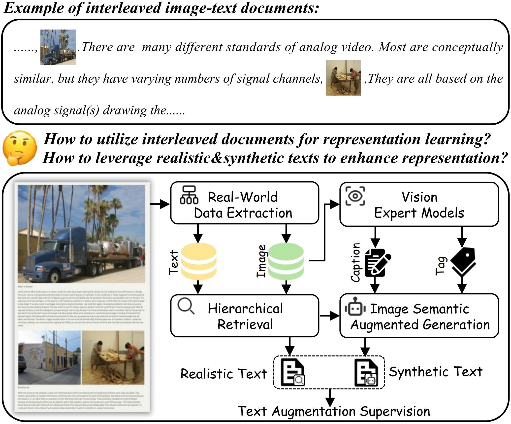
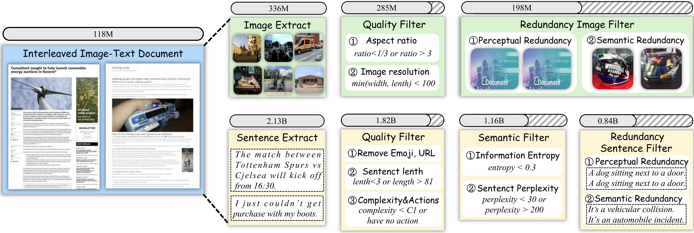
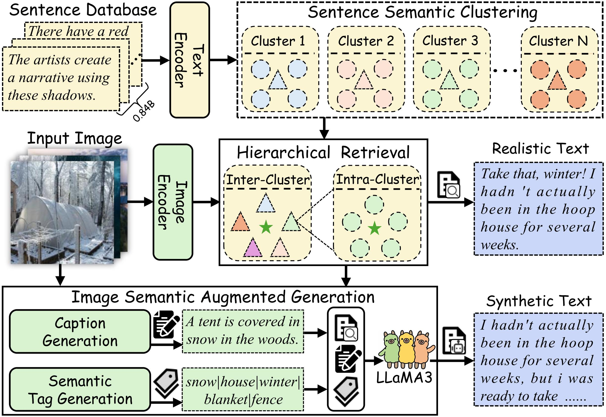

- blog: https://garygutc.github.io/RealSyn/
- Github (37 stars): https://github.com/deepglint/RealSyn
- RealSyn: An Effective and Scalable Multimodal Interleaved Document Transformation Paradigm

对比语言-图像预训练 （CLIP） 在各种基准测试中表现出良好的性能。然而，大量非配对数据，例如多模态交错文档，在视觉语言表示学习中仍未得到充分利用。

为了充分利用这些未配对的文档，我们最初建立了一个真实世界数据提取管道来提取高质量的图像和文本。

然后，我们设计了一种分层检索方法，以有效地将每个图像与多个语义相关的现实文本相关联。为了进一步增强细粒度的视觉信息，我们提出了一种用于合成文本生产的图像语义增强生成模块。此外，我们采用语义平衡采样策略来提高数据集多样性，从而更好地学习长尾概念。基于这些创新，我们构建了 RealSyn，这是一个结合现实文本和合成文本的数据集，提供三种规模：15M、30M 和 100M。大量实验表明，RealSyn有效地推进了视觉语言表示学习，并表现出很强的可扩展性。
