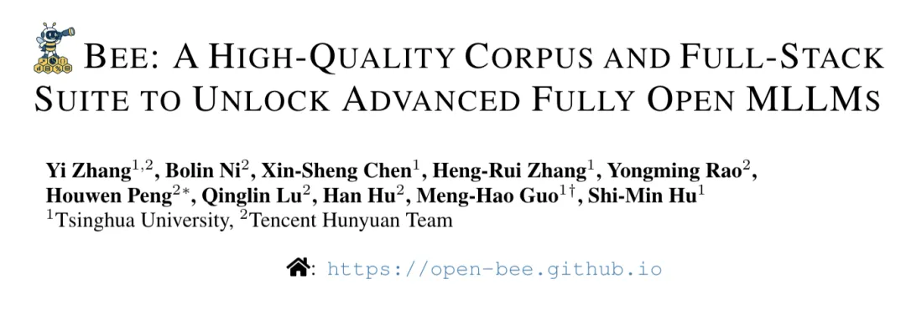
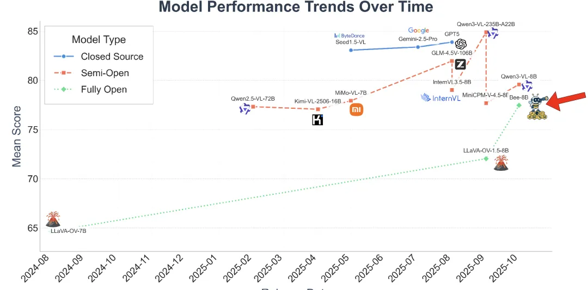
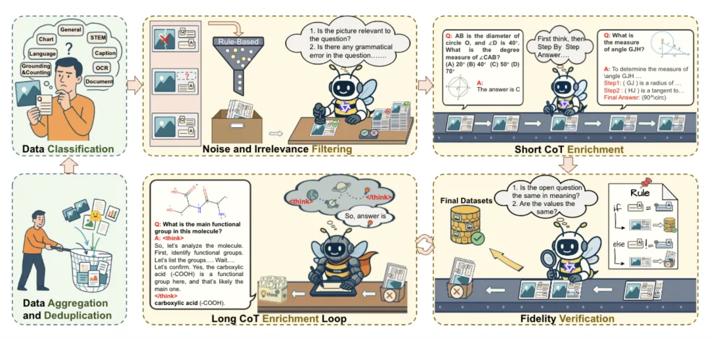
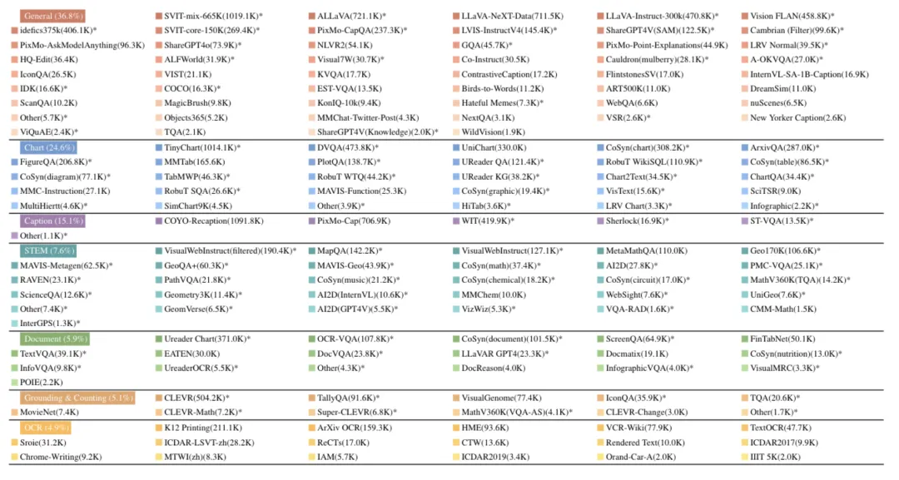
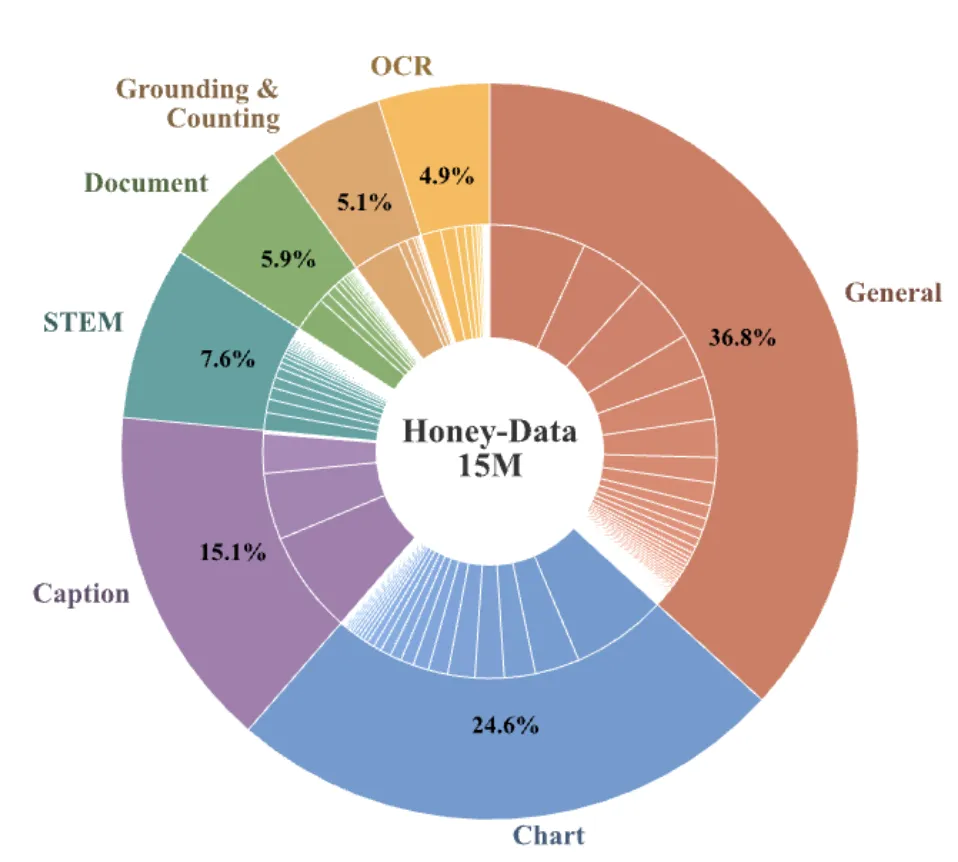
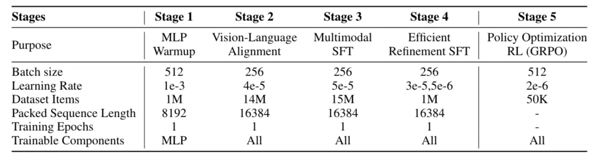
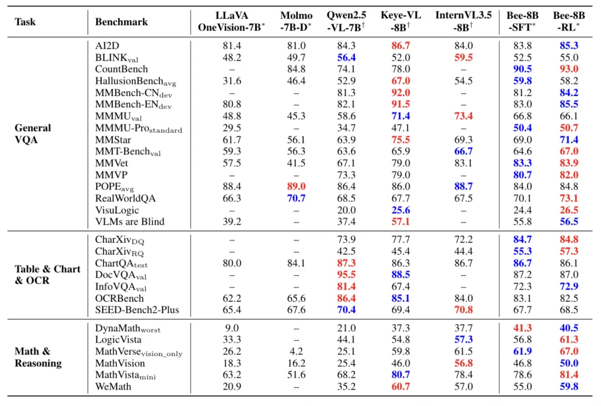

腾讯混元团队与清华大学联手推出了Bee项目，以解决全开源多模态大模型（MLLM）在监督微调（SFT）阶段的“数据质量鸿沟”。Bee 不只是一个模型，而是一套“以数据为中心”的全栈开源方案。其核心理念是：与其盲目扩充数据量，不如系统性提升数据质量，从而根本上缩小全开源与闭源/半开源模型之间的能力差距。

论文地址：

https://arxiv.org/abs/2510.13795

项目主页：

https://open-bee.github.io

数据集地址：

https://www.modelscope.cn/datasets/Open-Bee/Honey-Data-15M

Bee项目的三大核心贡献：

Honey-Data-15M：一个1500万规模、经过多重精细清洗和创新的双层CoT（思维链）扩充的高质量SFT数据集。
HoneyPipe & DataStudio：开源了从数据清洗到CoT增强的“全栈数据增强管线”，提供了一套透明、可复现的方法论。
Bee-8B：基于Honey-Data-15M训练的全新8B模型，在多项基准上刷新了全开源MLLM的SOTA纪录，性能匹敌甚至超越了主流半开源模型。

如上图所示（分数为MMMU、Mathvista等五个数据集平均的结果），在Bee项目之前，全开源（Fully Open）模型在性能上与闭源（Closed Source）和半开源（Semi-Open）模型存在巨大鸿沟。

Bee团队认为，这种差距的根源在于SFT阶段的数据质量。

现有开源数据集普遍存在两大顽疾：

普遍的噪声：充斥着事实错误、图文不匹配、格式混乱和低质量图像。
复杂推理数据匮乏：极度缺乏高级能力（如长链条思维链CoT）所需的数据。

因此，Bee项目明确指出，全开源社区最可行的路径不是盲目追求数据“数量”，而是聚焦于“数据质量”。

03

HoneyPipe：授人以渔的全栈数据增强管线

为了系统性地解决上述数据问题，团队构建了HoneyPipe，一个基于DataStudio框架的、自动化的数据增强流程。

HoneyPipe的核心价值在于其透明可复现的三阶段增强过程：

噪声与无关性过滤 (Stage 1)：结合规则过滤（如剔除小尺寸/极端宽高比图像 ）和模型过滤（使用Qwen2.5-VL-72B等强模型 ），确保图文的语义一致性（例如，过滤掉“在只有橘子的图像上提问函数问题”的样本 ）。
短CoT增强与验证 (Stage 2)：此阶段是双层CoT策略的基础层。使用Qwen2.5-VL等模型将原始的简短回答，扩充为包含明确步骤的“短CoT”响应。随后，引入“LLM-as-a-Judge”进行保真度验证，检查新CoT的最终结论是否与原始答案一致（事实性问题需精确匹配，开放性问题需语义一致 ）。
长CoT增强循环 (Stage 3)：对于(1) 在上一阶段保真度验证失败的样本（通常意味着问题更复杂），或(2) 天生复杂的数据源（如VisualWebInstruct），将它们路由到此循环。团队使用顶尖的专有MLLM来生成深度、多步骤的“长CoT”解题过程。

这一套“过滤-循环增强-验证”的精细流程，最终产出了高质量的数据集。

04

Honey-Data-15M：双层CoT赋能的高质量基石

HoneyPipe流程的最终产物是Honey-Data-15M，一个包含1500万精心策划样本的大型多模态SFT数据集。

该数据集的核心特征是其双层CoT推理结构：

约1220万 短CoT样本：用于培养模型扎实的基础逻辑和分步推理能力。
约270万 长CoT样本：专为复杂问题设计，要求模型进行更深层次的综合分析和推理。

如上图所示，数据集的来源多样化，策略性地覆盖了7大领域，确保了模型的全面发展：

05

Bee-8B：全开源MLLM的新标杆

为了验证Honey-Data-15M的卓越效果，团队开发了Bee-8B模型。

模型架构：

LLM基础：Qwen3-8B
视觉编码器：SigLIP2-so400m-patch14-384
投影器：一个简单的两层MLP

五阶段训练配方 (Recipe) ：

MLP预热 (Stage 1)：仅训练投影器，冻结LLM和视觉编码器，使用1M图像-字幕对。
视觉-语言对齐 (Stage 2)：全参数训练，混合12.6M图文对和1.43M纯文本数据，以保留LLM的固有能力。
多模态SFT (Stage 3)：关键阶段。在完整的Honey-Data-15M上进行训练，全面注入双层CoT所带来的复杂推理能力。
高效精炼SFT (Stage 4)：在精心挑选的1M高质量子集 (Honey-Data-1M)上进行精调，该子集具有更合理的主题分布。
策略优化RL (Stage 5)：使用GRPO算法 ，在50K数据上进行RL训练 ，以解决SFT阶段常见的文本重复等问题，提升输出可靠性。

Bee-8B的表现在全开源模型中全面领先，并在多个关键基准上匹敌或超越了Qwen2.5-VL-7B和InternVL3.5-8B等强大的半开源模型。

其最显著的优势完美印证了CoT数据的有效性：

数学与推理任务 (Math & Reasoning)：

在MathVerse基准上，Bee-8B-RL达到67.0分，显著超越InternVL3.5-8B (61.5分) 。
在LogicVista上，Bee-8B-RL以61.3分登顶 。
在DynaMath上，Bee-8B-SFT以41.3分夺魁 。
图表与文档任务 (Table & Chart & OCR)：

在最具挑战性的CharXiv-RQ（图表推理）上，Bee-8B-RL获得57.3分，以近12%的优势超越所有对手（第二名45.4分） 。
通用VQA任务 (General VQA)：

Bee-8B-RL在MMStar (71.4), MMMU-Pro (50.7), MMVet (83.9), 和 CountBench (93.0) 等多个综合基准上均取得了优秀的SOTA分数 。

06

总结与展望：开放数据质量的“bee”路径

Bee项目的工作直面并解决了阻碍全开源MLLM发展的核心数据质量问题。它有力地证明了一个核心论点：通过透明、可复现的方法论优先保证数据质量，是比盲目堆砌数据量更有效的策略。

Bee向社区提供的全栈式开源套件，包括Honey-Data-15M数据集（已开源）、HoneyPipe策管方法论（即将开源）、以及SOTA的Bee-8B模型，希望为开源社区提供一个全新的、高质量的基石。

# 参考

[1] 腾讯混元&清华开源15M高质量多模态训练数据，全面开放MLLM迎来质变时刻, https://mp.weixin.qq.com/s/n8j9MjoiVlfUmQXjtroE1Q