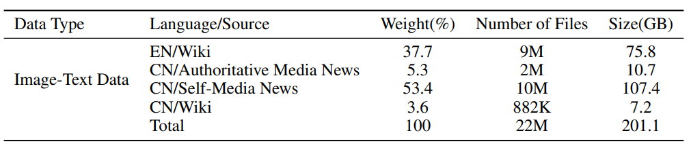

1. 北京700TB通用数据集
    - 通用数据集为用于通用基础模型训练的多种模态数据。当前已经汇聚在数据运营平台的通用数据集有116个，总数据量700.27TB，其中文本数据9.76TB，多模态图文数据量75.31TB，视频数据量615TB，音频数据0.2TB
    - 行业数据集包含了行业领域特有的知识和信息，用于训练各种行业模型，推动人工智能从通用向专业化、精细化持续发展。目前行业专区数据集28个，数据量4.33TB，其中文本数据集22个，数据量4.3TB，多模态图文行业数据集6个，数据量0.03TB。
    - 

2. 书生·万卷1.0
    - 地址：https://arxiv.org/pdf/2308.10755.pdf
    - 下载路径：https://opendatalab.org.cn/OpenDataLab/WanJuan1_dot_0/tree/main/raw/nlp
    - 包含多种模式的大规模训练语料库：书生·万卷文本数据集1.0由来自网页、百科、书籍、专利、教材、
      考题等不同来源的清洗后预训练语料组成，数据总量超过5亿个文档，数据大小超过1TB
    - 该语料将html、text、pdf、epub等多种格式的数据统一处理为字段统一的jsonl格式，并经过细粒度的清洗、去重、价值对齐，
      文本数据包括6亿多篇文档，数据存储量超过1TB；图像-文本数据经过处理后成为文档，共有2200多万篇文档，
      数据量超过200GB（图像通过URL链接提供）；视频文件共有1000多个，数据量超过900GB。
    - 中文数据占比35.1%，约2.2亿个文件，466.54GB。英文数据集占比61.4%，共3.83亿个文件，542.51GB
    - 采用多步骤文本提取流程、语言检测、语料库过滤和重复数据删除
    - 
    - 
