# 1. 简介

完整的视频计算流程：https://mp.weixin.qq.com/s/pNvCMrUjiOPVpE7_442tag

对比语言-图像预训练模型（Contrastive Language–Image Pre-training，简称 CLIP）是 OpenAI 的一项开创性工作，重新定义了计算机视觉和自然语言处理的交集。它是我们今天看到的所有多模态基础模型的基础。CLIP 模型的目标是学习一个文本和图像的共享嵌入空间。

CLIP 是如何计算的呢？下面我们给出每一步的手动计算过程。

# 2. 计算过程
步骤一

提供包含 3 对文本-图像的 mini-batch，对应图中的"big table", "mini chair" 和 "top hat"。OpenAI 当年训练其原始的 CLIP 模型使用了 4 亿对文本-图像。

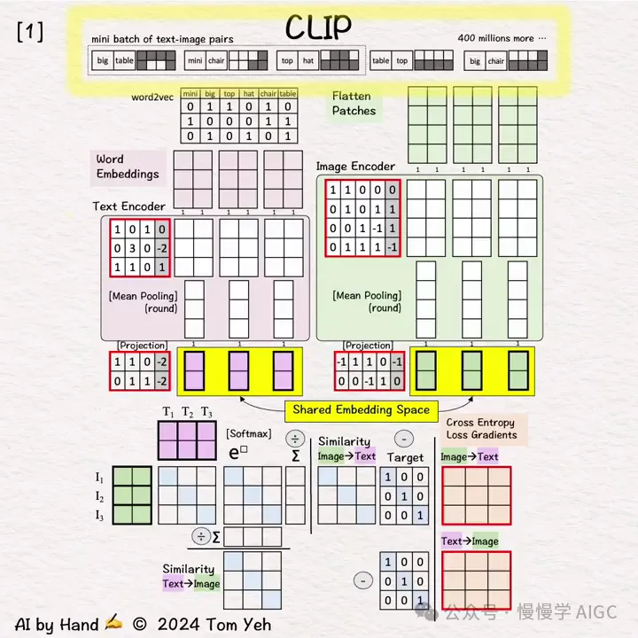

步骤二

使用 word2vec 查找词嵌入向量，将原始文本转换为 2 个 3 维向量。下图展示了分词后的文本 "big", "table" 转换为向量 [1 0 1]', [0 1 1]' 的过程。其他文本转换过程类似。

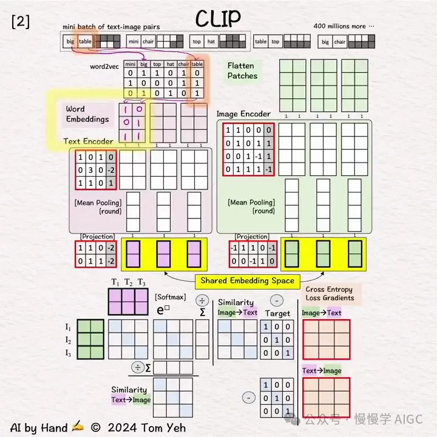

步骤三

将图像分成两个块，并展平每个块，转换为 2 个 4 维向量。 下图展示了第一对图文对中的图片被切分并展开为 [1 1 1 0]', [1 1 0 1]' 两个向量的过程。

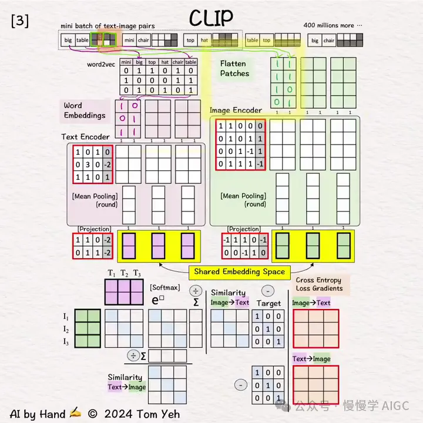

步骤四

重复步骤二、步骤三，处理其他图文对。

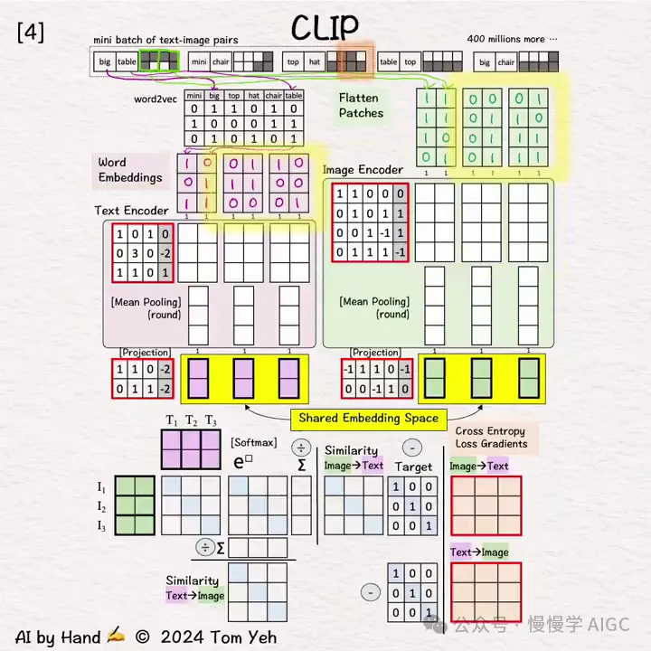

步骤五

使用文本编码器和图像编码器将输入向量编码为特征向量。下图中两个编码器都是简单的单层感知器（线性层 + ReLU），实际中，编码器通常是 transformer 模型。

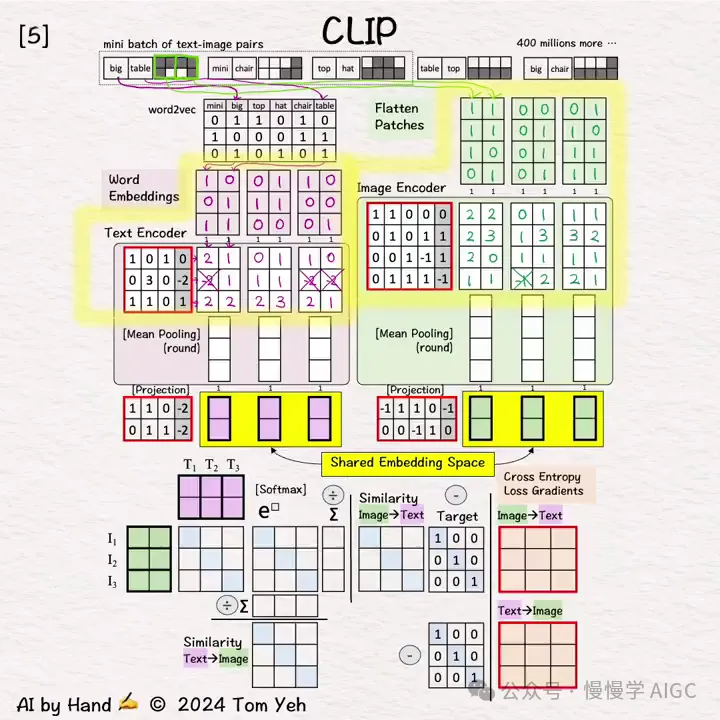

步骤六

通过对列平均，将 2 个特征向量平均为一个向量，这么做的目标是用一个向量来表示每个图像或文本。

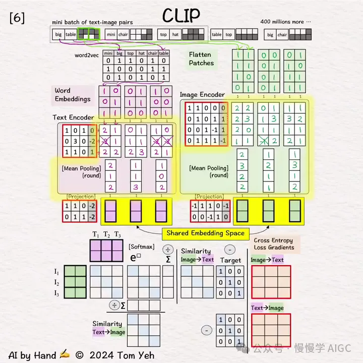

步骤七

使用线性层将图像和文本向量投影到 2 维的共享嵌入空间。注意，来自编码器的文本和图像特征向量具有不同的维度（3 维 vs 4 维），经过投影后变为相同维度（2 维），这样方便做后续文本向量和图片向量的相似度计算。

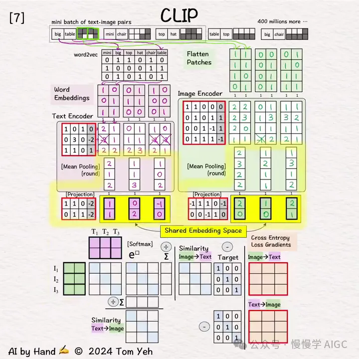

接下来就是对比预训练了 🏋️

步骤八

准备进行矩阵乘法。我们需要复制文本向量（T1,T2,T3）和图像向量的转置（I1,I2,I3），它们都在 2 维的共享嵌入空间中。

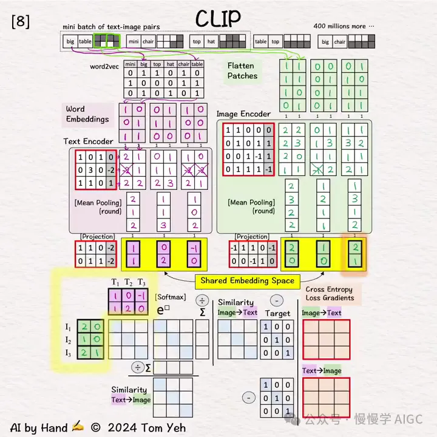

步骤九

矩阵乘法计算，T 矩阵和 I 矩阵相乘。这相当于对每对图像和文本向量进行点积，目的是用点积来估计图像-文本对之间的相似度。

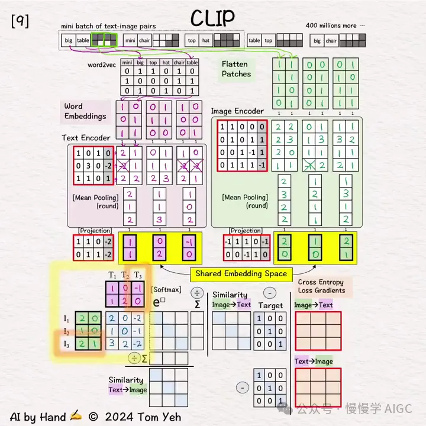

步骤十

计算 Softmax: e^x 这一步。将上一步结果中每个单元中的数字提升为 e 的幂，为简化手算，我们用 3^□ 来近似 e^□。

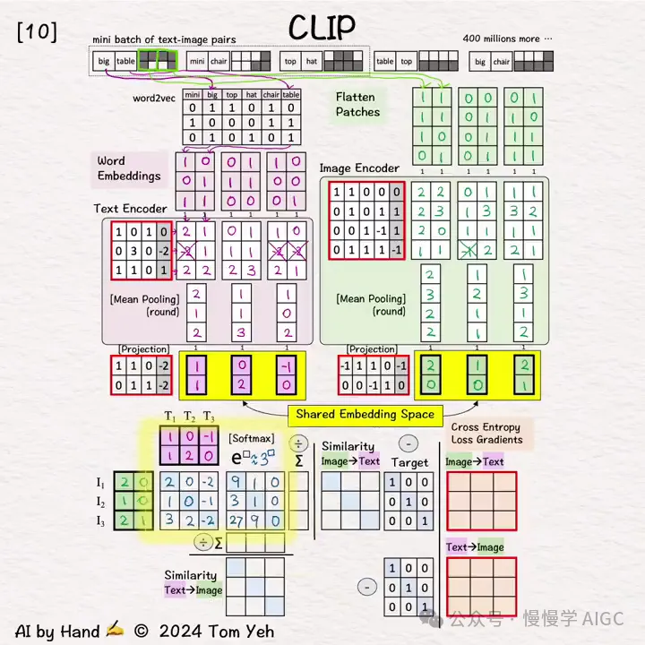

步骤十一

计算 Softmax: ∑ 这一步。对每行、每列求和，为下一步做准备。

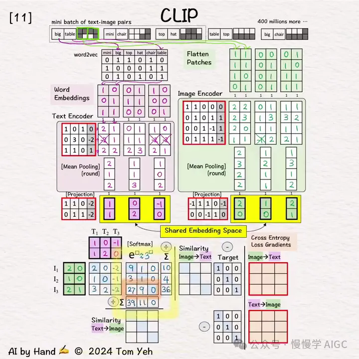

步骤十二

计算 Softmax: 1 / 求和 这一步。每个元素除以列和以获得 🟪 文本→🟩 图像 的相似度矩阵，每个元素除以行和以获得 🟩 图像→🟪 文本 的相似度矩阵。

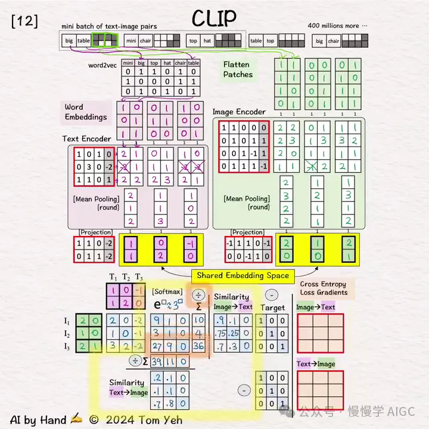

步骤十三

计算损失梯度。相似度矩阵的理想“目标”是单位矩阵。为什么？如果 I 和 T 来自同一对（i=j），我们希望计算的相似度为最高值 1，其他情况则相似度应为 0。

使用简单的[相似度 - 目标]公式来计算双向的梯度。为什么如此简单？因为当 Softmax 和交叉熵损失一起使用时，数学上就会如此神奇地运作。这些梯度启动了反向传播过程，以更新编码器和投影层的权重和偏差（红色边框）。

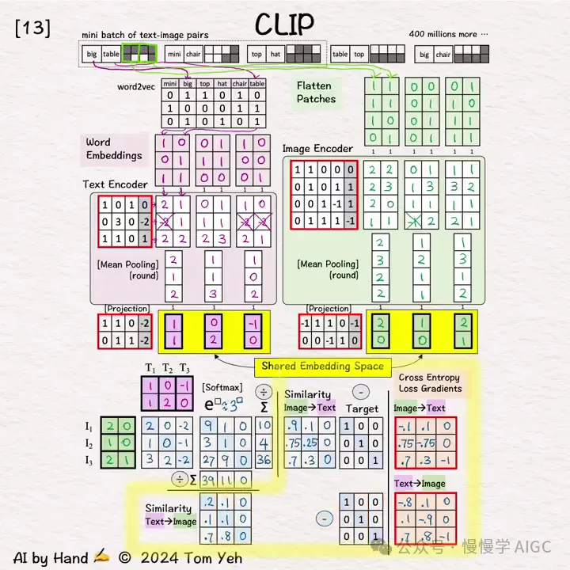

# 参考

[1] 图解 CLIP 计算过程，https://mp.weixin.qq.com/s/pNvCMrUjiOPVpE7_442tag
