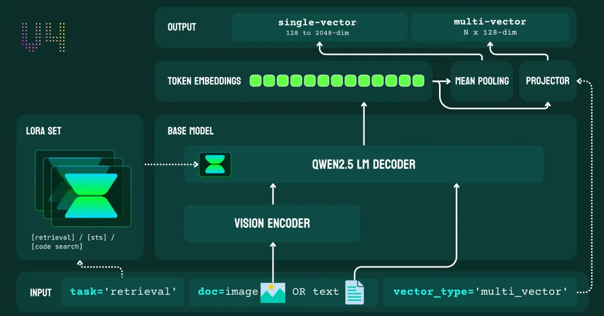
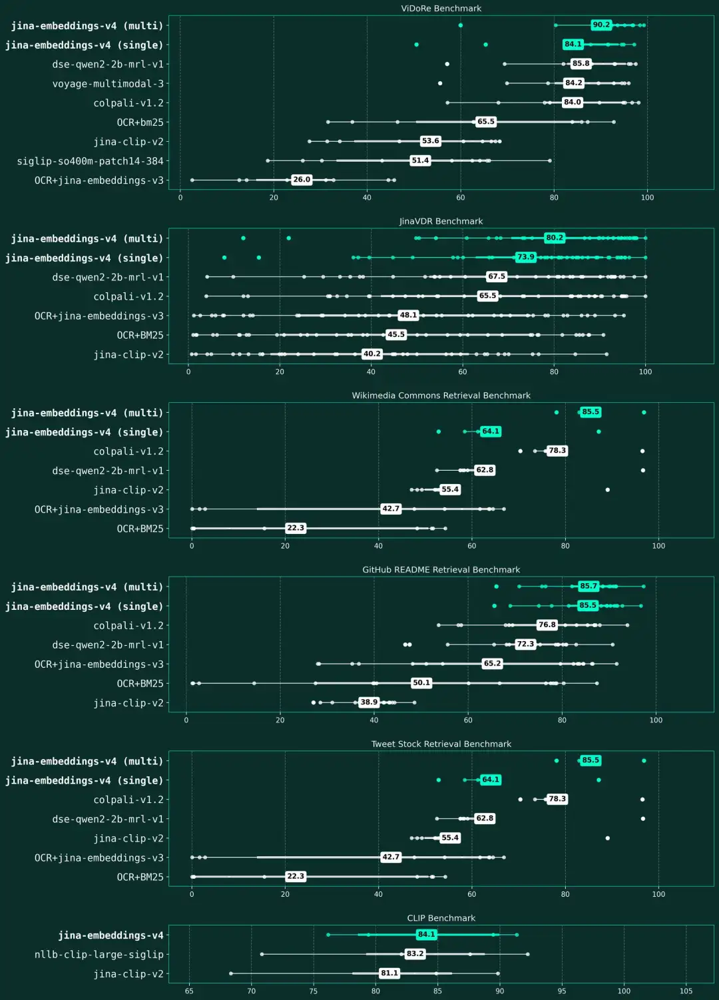
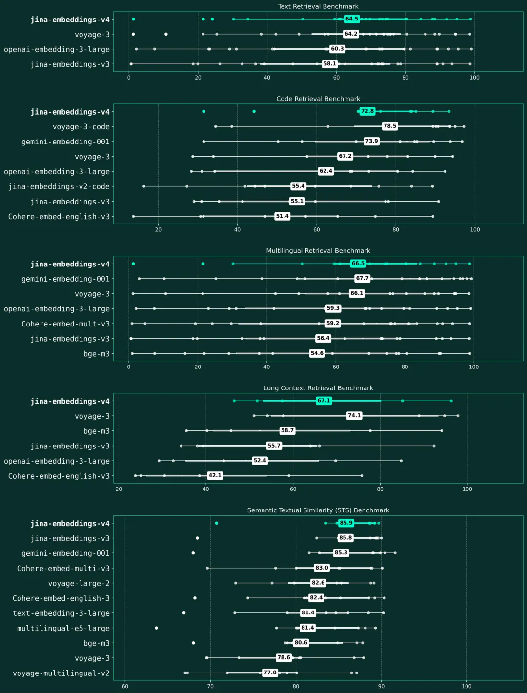

# 1. 资源

- 开源模型链接: https://huggingface.co/jinaai/jina-embeddings-v4
- 模型 API 链接: https://jina.ai/embeddings/
- 模型论文链接: https://arxiv.org/abs/2506.18902

# 2. 原理

jina-embeddings-v4 架构图

jina-embeddings-v4 基于拥有 38 亿参数的多模态语言模型 Qwen2.5-VL-3B-Instruct构建，是一个多模态语言模型。它通过一条共享路径处理文本与图像输入：首先，视觉编码器将图像转换为词元（token）序列；随后，语言模型的解码器通过上下文注意力层，对两种模态进行联合处理。模型集成了三个针对特定任务的 LoRA 适配器（每个含 6000 万参数），专门用于优化检索、文本匹配和代码任务，且无需修改已冻结的骨干网络权重。

该架构支持两种输出模式：

- 单向量模式：通过平均池化生成一个 2048 维的向量（可截断至 128 维），用于高效的相似性搜索。
- 多向量模式：通过投影层为每个词元生成一个 128 维的向量，适用于“迟交互”（Late Interaction）检索策略。

从 jina-embeddings-v3 到 v4 的升级，标志着模型从纯文本向量向多模态向量的范式转换。v3 的重心在于利用特定任务的 LoRA Adapter 优化文本向量，而 v4 则通过统一的表示形式，同时满足处理文本与视觉内容的需求。

| 维度              | jina-embeddings-v3                | jina-embeddings-v4               |
| --------------- | --------------------------------- | -------------------------------- |
| 骨干模型 (Backbone) | jina-XLM-RoBERTa                  | Qwen2.5-VL-3B-Instruct           |
| 基础参数量           | 5.59 亿                            | 38 亿                             |
| 总参数量 (含适配器)     | 5.72 亿                            | 38 亿 + 每个适配器 6000 万              |
| 模态              | 仅文本                               | 文本 + 图像 (多模态)                    |
| 最大文本上下文         | 8192 Tokens                       | 32768 Tokens                     |
| 图像处理能力          | 无                                 | 最高 2000 万像素，支持富视觉文档              |
| 多语言支持           | 89 种语言                            | 29+ 种语言                          |
| 向量类型            | 仅单向量 (Single-vector)              | 单向量 + 多向量 (Late Interaction，迟交互) |
| 单向量维度           | 1024 (支持 MRL 截断至 32)              | 2048 (支持 MRL 截断至 128)            |
| 多向量维度           | 不支持                               | 每 Token 128 维                    |
| 任务 LoRA 适配器     | • 非对称检索 • 文本匹配 • 分类 • 聚类 | • 非对称检索 • 文本匹配 • 代码检索      |
| 训练阶段            | 三阶段：预训练 → 向量微调 → 适配器训练            | 两阶段：联合配对训练 → 任务适配器训练             |
| 损失函数            | InfoNCE, CoSent, 扩展三元组损失          | 联合 InfoNCE + KL 散度 (用于单/多向量)     |
| 位置编码            | RoPE                              | M-RoPE (多模态旋转位置编码)               |
| 跨模态处理           | 不适用                               | 统一编码器 (缩小模态鸿沟)                   |
| MRL 支持          | 是                                 | 是                                |
| 注意力实现           | FlashAttention2                   | FlashAttention2                  |

**底座模型**

v4 最重大的架构革新，在于将其底座模型从 XLM-RoBERTa 更换为 Qwen2.5-VL-3B-Instruct。我们做出这一关键决策，是为了打造一款能实现“真正多模态处理”的通用向量模型。新的骨干网络能直接将图像转换为词元序列，并与文本协同处理，从而消除了传统双编码器架构中固有的模态鸿沟。

选择这款底座模型，也帮助我们实现了多项关键设计目标：首先，它卓越的文档理解方面，直接支撑了 v4 在处理表格、图表和截图等富视觉内容的强大表现；其次，它的动态分辨率功能，使 v4 能处理高达 2000 万像素的图像；最后，其先进的位置编码技术，为 v4 达成了 0.71 的跨模态对齐分数奠定了坚实基础，远超 OpenAI CLIP 的 0.15。

**LoRA 适配器**

我们吸取了 v3 的实践经验和用户反馈，将原有的五个适配器精简为三个核心模块，使其更聚焦、更高效：

1. 非对称检索：将 v3 中独立的查询和段落适配器整合为一。
2. 对称相似度：延续了 v3 的文本匹配功能，专门处理语义文本相似度（STS）任务。
3. 代码检索：借鉴 v2-code 的成功经验，弥补了 v3 在代码支持上的空白。

通过这次整合，我们移除了 v3 的分类和分离适配器，让 v4 集中精力攻克检索与语义相似度这两个最具影响力的应用场景。v4 的每个适配器依然保持 6000 万参数，仅为模型带来不到 2% 的额外内存开销。

**单/多向量输出**

与只支持单向量输出的 v3 不同，v4 创新地设计了一套双输出系统，能同时生成单向量和多向量，以灵活应对不同的检索需求：

1. 单向量模式：生成 2048 维向量（可通过 MRL 技术截断至 128 维），用于高效的相似性搜索。
2. 多向量模式：为每个词元生成 128 维向量，适用于需要深度交互的“迟交互”检索策略。

这一设计，不仅通过多向量表示提升了富视觉文档的处理效果，也通过单向量模式在标准相似性任务中保持了高效率。事实上，在各类视觉任务中，多向量模式的性能始终比单向量模式高出 7-10%，这印证了，“迟交互”策略能为多模态内容提供本质上更优的语义匹配。

**参数量**

虽然 v4 的参数量（38 亿）是 v3（5.7 亿）的 6.7 倍，但其在纯文本任务上的性能提升却相对温和。我们增加参数规模的主要目的，并非为了强化文本处理，而是为了构建强大的多模态功能。例如，在核心文本基准上，v4 的得分仅比 v3 提升了 14%（MMTEB）和 3%（MTEB-EN）。然而，在代码和长文档这类更复杂的任务上，v4 的性能则分别大幅提升了 30% 和 21%。

我们投入更多参数，换来了 v3 完全不具备的强大视觉能力，这让投入物有所值：v4 在视觉文档检索（Jina-VDR）和 ViDoRe 基准上，分别取得了 84.11 nDCG@5 和 90.17 的高分。

因此，这次参数的增加，体现了我们对多模态功能的战略投入，同时模型也保持了极具竞争力的文本性能。更重要的是，其统一架构不仅让我们摆脱了对独立文本和视觉模型的依赖，还成功将跨模态对齐分数提升至 0.71，远超传统双编码器方法的 0.15。

# 3. 性能

jina-embeddings-v4 在视觉文档检索和多模式基准中的性能

这张箱形图直观地衡量并对比了各向量模型在六大基准类别中的平均得分与性能波动。这些类别覆盖了视觉文档检索（ViDoRe、Jina-VDR）、多语言图文匹配（维基共享资源检索）、代码文档检索（GitHub README）、金融图表分析（Tweet Stock）以及通用图文检索（CLIP）。

图中，我们用青色高亮标出了 jina-embeddings-v4 的各个版本。结果显示，jina-embeddings-v4 在处理富视觉文档任务时展现出顶尖性能。其中，其多向量版本不仅在专业的视觉文档基准上取得了最高分（ViDoRe 90.2 分，Jina-VDR 80.2 分），同时在通用的多模态检索任务（CLIP 84.1 分）上也保持了强大的竞争力。所有模型均依据其在各基准类别中的平均性能进行排名。

jina-embeddings-v4 是我们迄今为止最具突破性的一款向量模型。作为一款开源模型，它的性能表现已全面超越来自主流供应商的顶尖闭源模型：

- 在多语言检索方面，其性能比 OpenAI 的 text-embedding-3-large 高出 12%（66.49 vs 59.27）。
- 在长文档任务上，性能提升了 28%（67.11 vs 52.42）。
- 在代码检索方面，效果比 voyage-3 好 15%（71.59 vs 67.23）
- 其综合性能，也能和谷歌的 gemini-embedding-001 模型并驾齐驱。

jina-embeddings-v4 在五大检索基准上的性能表现
该张箱形图展示了各模型在文本检索、代码检索、多语言检索、长上下文检索以及语义文本相似度（STS）五个基准上的平均分。图中以青色高亮标出的 jina-embeddings-v4，在所有评估类别中均展现出顶尖的性能，尤其在文本检索和 STS 任务上成果斐然。我们依据各模型在所有基准类别中的平均性能对其进行排名，图中分散的数据点则具体显示了模型在各项评估任务上的分数分布。

# 4. 结论

jina-embeddings-v4 是我们迄今最重大的飞跃。这款 38 亿参数的通用向量模型，以统一路径处理文本与图像，同时驾驭稠密检索与“迟交互检索”两种模式。在富视觉文档检索等任务上，它的表现已全面超越谷歌、OpenAI 及 Voyage AI 的闭源模型。这项能力凝聚了我们通过四代模型迭代，攻克一系列基础性难题的心血。

2022 年，当我们启动 v1 时，行业信奉“数据越多，性能越好”。我们反其道而行之，证明了 精选胜于堆量：我们从 15 亿数据对中精炼出 3.85 亿高质量样本，性能远超更庞大的数据集。

Jina Embeddings: A Novel Set of High-Performance Sentence Embedding Models

🔗 https://arxiv.org/abs/2307.11224

v2 则解决了 512 Token 的上下文瓶颈。 我们没有采用高成本的长序列训练，而是通过“短训长用”（train short, deploy long）的巧思，借助 ALiBi 算法，让一个仅在 512 词元上训练的模型，推理时能无缝处理 8192 词元的超长序列，用更少的计算撬动了更强的能力。

Jina Embeddings 2: 8192-Token General-Purpose Text Embeddings for Long Documents

🔗 https://arxiv.org/abs/2310.19923

v3 应对了不同任务需要不同优化的新挑战。 我们没有重复造轮，而是在 v3 中另辟蹊径：通过多个 LoRA 适配器，为一个基础模型赋予定制化的任务能力，只增加了。就这样，一个模型灵活地化身为五个专用模型，而额外开销极低。

jina-embeddings-v3: Multilingual Embeddings With Task LoRA

🔗 https://arxiv.org/abs/2409.10173

但模型依然停留在纯文本领域。基于 CLIP 的标准模型因为采用分离的编码器，会造成“模态鸿沟”。为此，v4 借鉴了 jina-reranker-m0 的思路，彻底解决了这个问题：用一条统一的路径处理所有内容，从根源上消除鸿沟，而非在后期弥合。

jina-embeddings-v4: Universal Embeddings for Multimodal Multilingual Retrieval

🔗 https://arxiv.org/abs/2506.18902

jina-embeddings-v4 与 jina-reranker-m0 的背后，是我们核心思路的转变：我们转向使用大语言模型（LLM）作为基座模型，而不再坚守纯编码器架构。这一转变的价值在于，它解决了纯编码器架构的固有缺陷“模态鸿沟”，图像和文本的向量簇彼此分离。而基于 LLM 构建则让真正的混合模态表示成为了可能，也为提升模型的可解释性打开了大门。

我们的核心洞见是：表达（Representation）与生成（Generation）同根同源，本质都是对语义的深度理解。 一个擅长内容生成的大模型，也天然擅长构建精准的向量表达。这样在大模型领域的的每一次技术突破，都能直接惠及我们建立其上的向量模型，而纯编码器的模型则无法享受这一红利。

我们坚信，未来属于统一的架构。在这一架构中，向量模型和重排器都将源自同一个通用搜索底座。而这，正是 Jina AI 全力以赴的方向。

# 参考

[1] Jina Embeddings V4: 为搜索而生，多模态多语言向量模型，https://mp.weixin.qq.com/s/pfbyYOf8_KJijGfmLtTr9w