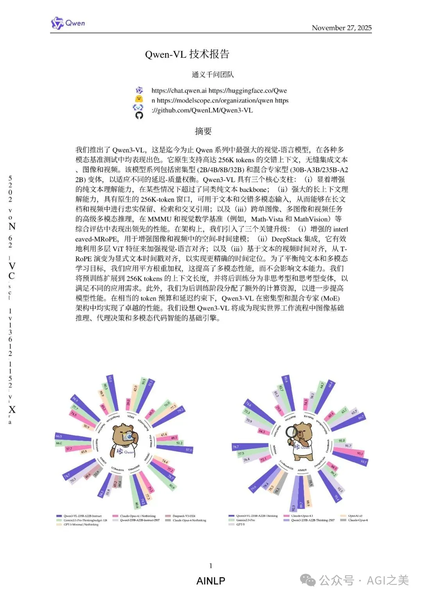
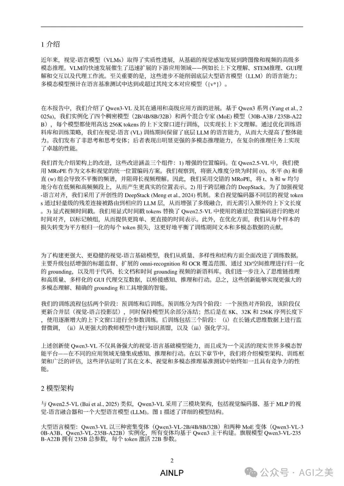
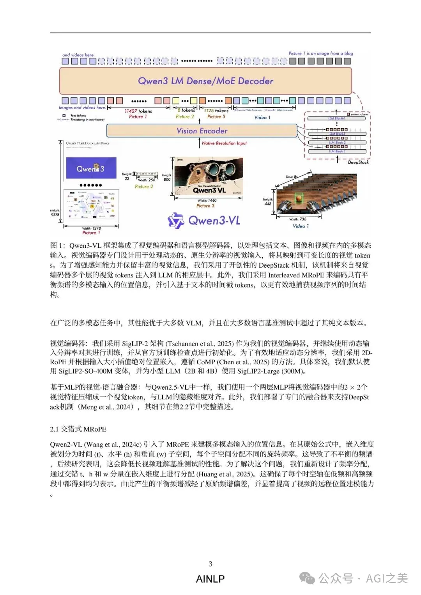
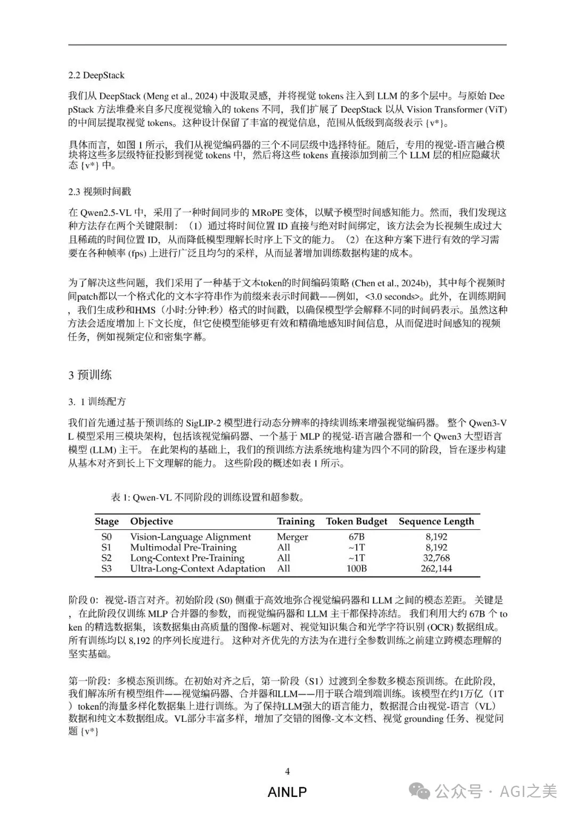
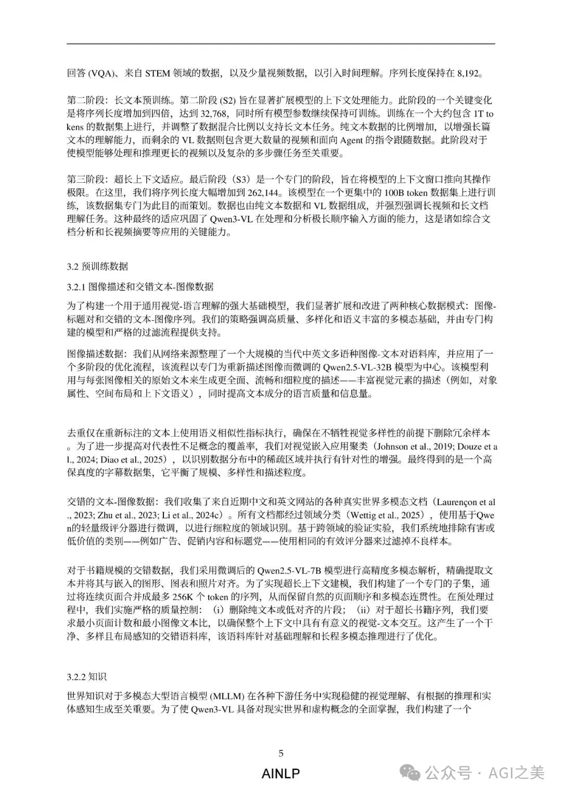

Qwen3-VL 是阿里推出的最先进多模态基础模型，面向文本、图像、PDF、表格、界面（GUI）与视频的统一理解和推理任务。它具备 256K 原生上下文 的长文能力，能够跨数百页文档、完整教材、长视频进行稳定关联、定位与引用，是面向企业真实场景的全栈多模态引擎。

模型体系覆盖 2B / 4B / 8B / 32B Dense，以及 30B-A3B / 235B-A22B MoE，在延迟、吞吐与精度间提供灵活选择。多模态训练不仅未削弱语言能力，反而在多个 NLP benchmark 上优于纯文本大模型，使其在文本任务上也具备强竞争力。

技术核心升级有三点：

Interleaved-MRoPE：将时间/水平/垂直的频率交错排列，解决旧式 MRoPE 在长视频中的频率偏置问题，使视频时空建模更稳定。

DeepStack 视觉跨层注入：从视觉编码器的多个层级提取特征并注入 LLM 对应层，融合低层细节与高层语义，大幅提升视觉理解与推理精度。

文本式时间戳：用 <3.0 seconds> 这种显式 token 替代复杂的时间编码，为长时间序视频带来更可控、更通用的时间理解能力。

训练采用 四阶段预训练（8K→32K→256K）+ SFT + 强到弱蒸馏 + RL（Reasoning + General） 的完整体系，并提供 Thinking / Non-Thinking 双模式，兼顾推理能力与速度。

数据方面构建了庞大的多模态体系：高质量图文、网页与教材、PDF 解析（HTML/Markdown）、39 语言 OCR、3D/空间理解、动作/事件级视频语义、跨层 grounding、超过 6000 万的 STEM 题目、以及 GUI 与多工具 Agent 行为数据，使其具备高度覆盖现实场景的能力。

性能上，235B-A22B 在多模态推理、长文档理解、视频理解、OCR、空间推理等关键任务中普遍领先，部分任务接近或超过 Gemini 2.5 Pro / GPT-5 / Claude Opus；而 32B 也显著领先 GPT-5-mini 和 Gemini Flash，同等尺寸小模型（2B/4B/8B）在轻量级场景中具有强竞争力。

综合来看，Qwen3-VL 是面向企业场景的 多模态智能底座，可胜任从长 PDF 解析、图表理解、界面自动化、流程 Agent，到视频监控分析、技术文档检索、多模态代码生成等核心任务，覆盖从“理解 → 推理 → 决策 → 自动执行”的全链路智能能力。

附该技术报告英中对照版，仅供学习参考，感兴趣的朋友可以关注AINLP公众号回复'qwen3vl'获取该技术报告pdf全文：

# 参考

[1] Qwen3-VL技术报告英中对照版.pdf, https://mp.weixin.qq.com/s/Lusbo2dMSOz4qEQ0H23FAg