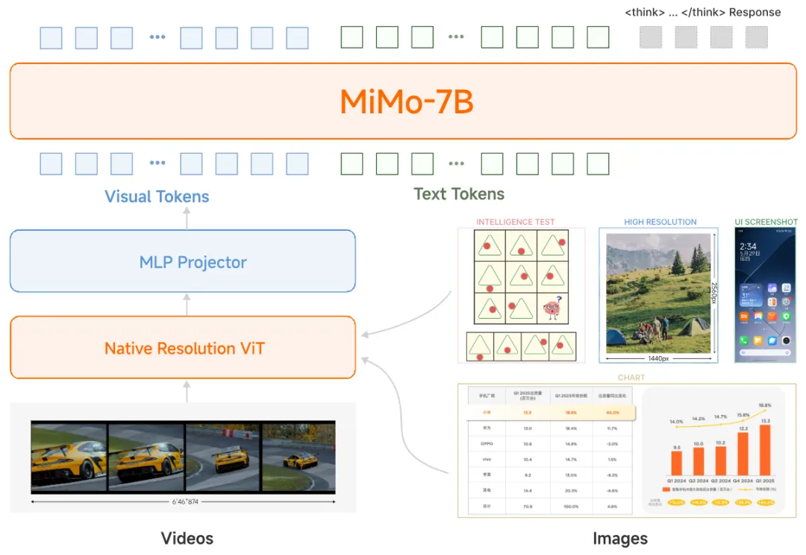
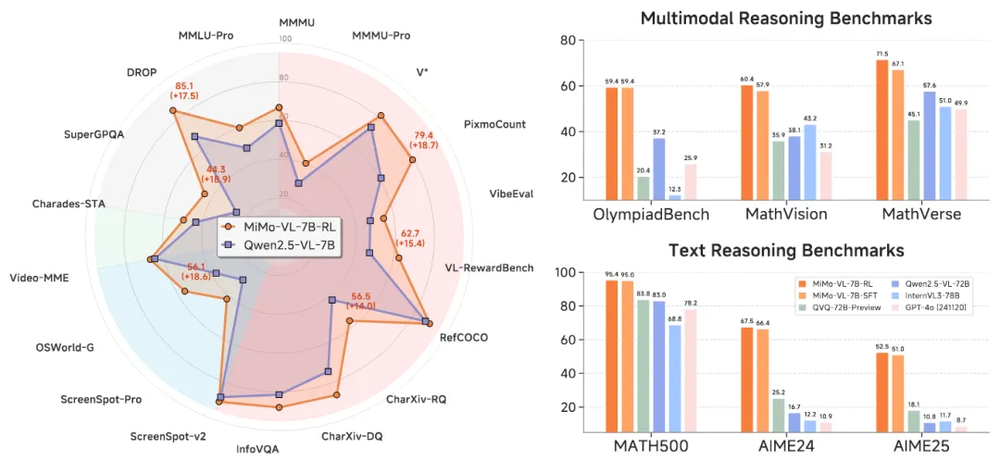
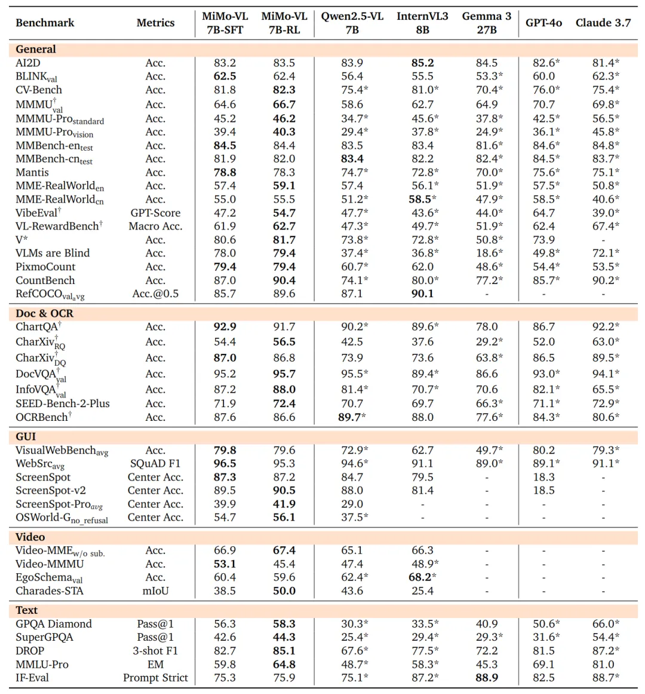

# 1. 资源

模型链接：

https://modelscope.cn/collections/MiMo-VL-bb651017e02742

代码仓库：

https://github.com/XiaomiMiMo/MiMo-VL

技术报告：

https://github.com/XiaomiMiMo/MiMo-VL/blob/main/MiMo-VL-Technical-Report.pdf

# 2. 简介

MiMo-VL-7B的模型架构为：

- 保持细粒度视觉细节的原生分辨率ViT编码器
- 用于高效跨模态对齐的MLP projector
- 专为复杂推理任务优化的MiMo-7B语言模型

MiMo-VL-7B的开发涉及两个连续的训练过程：

1、预训练阶段

数据规模：
总计约 2.4 万亿 tokens，涵盖图像描述、文本-图像交错、OCR／定位、视频、GUI 操作与合成推理数据等多模态语料。

阶段划分：

Projector预热：仅训练Project head，使用图文对齐数据。

视觉-语言对齐：解冻 ViT；引入混合网页、书籍等交错数据。

通用多模态预训练：全面开放所有组件，加入 OCR、定位、视频与 GUI 数据，并少量引入推理与指令数据。

长上下文微调：将最大序列长度扩展至 32K，引入更长文本、视频与高分辨率图像，提高长上下文与深度推理能力。

2、后训练阶段

在此阶段研究团队引入了混合在线强化学习（MORL），这是一种新颖的框架，能够无缝集成涵盖感知准确性、视觉基础精度、逻辑推理能力和人机偏好的多种奖励信号。具体步骤如下：

-RLVR 部分：设计视觉推理、文本推理、图像/GUI 定位、视觉计数与视频时序定位等可规则化验证的奖励函数，实现自动打分与反馈。

-RLHF 部分：构建双模态与文本奖励模型，经 GPT-4o 排序标注，保证生成结果符合人类偏好并降低有害输出。

-混合在线策略：基于 GRPO 的全在线变体，统一通过 Reward-as-a-Service 提供低延迟多任务奖励，消除 KL 惩罚以提升训练稳定性。

# 参考

[1] 小米又放大招！MiMo-VL 多模态大模型开源，魔搭推理微调全面解读来了！https://mp.weixin.qq.com/s/PZUSGB3SI83mVqXqm-GnzQ