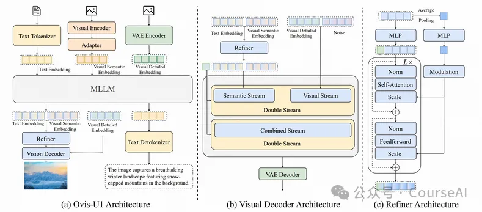
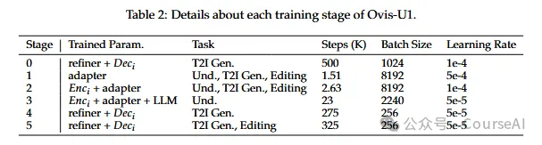

# 1. 简介

单一模型即可出色完成三大核心任务：

理解复杂场景，精准解析图文关联

从文本生成图像，根据描述创建高质量图像

根据指令进行精准编辑图片

统一的架构，完成多个专用模型的需求

基于扩散的视觉解码器 (MMDiT)实现像素级精确渲染

双向 token 精炼器，可实现高保真图像合成，并增强文本与视觉之间的交互。

协同统一训练：

与单一任务训练的模型不同，Ovis-U1 同时基于理解、生成和编辑等多样化数据进行训练。

这种方法实现了更高的泛化能力，能够无缝地以高精度应对现实世界的多模态挑战。

# 2. 架构

LLM（大型语言模型）和文本分词器(LLM & Text tokenizer)

采用 Qwen3 系列作为 LLM 的骨干网络，使用 Qwen3-1.7B 来构建具有 30 亿参数的统一模型

从语言模型开始，使用视觉理解和生成数据进行训练，统一的训练方法协同提升了模型在理解和生成任务上的性能。

视觉编码器和适配器(Visual Encoder & Adapter)

基于 Aimv2-large-patch14-448 进行修改，能够处理任意分辨率的图像，避免了子图像分割策略。

通过插值调整原始固定大小的位置嵌入，并引入二维旋转位置嵌入（RoPE）来提高空间感知能力。

采用可变长度序列注意力机制，遵循 NaViT 的令牌打包策略，以高效处理不同分辨率的图像批次。

视觉解码器和 VAE(Visual Decoder & VAE)

采用 MMDiT 作为骨干网络，并以流匹配作为训练目标。

通过减少层数和注意力头的数量，从 57 层和 24 个注意力头减少到 27 层和 16 个注意力头，得到了一个 10 亿参数的视觉解码器。

由于解码器的容量有限，因此采用了来自 SDXL 的 VAE 模型，该模型具有 4 个通道，并在统一训练期间将其冻结。

视觉语义嵌入与文本嵌入相连接，作为图像生成的语义条件。此外，上下文图像通过 VAE 编码器编码成潜在令牌，这些令牌包含上下文图像的详细信息。

最后，这些视觉详细嵌入以及图像令牌（噪声）被输入到解码器的视觉流中。

精炼器(Refiner)

引入双向令牌细化器以促进视觉嵌入和文本嵌入之间的交互。堆叠了 2 个带有调制机制的 Transformer 块来构成精炼化器。

由于 LLM的不同层捕获了关于图像和文本的不同层次的信息，为了充分利用不同层之间的信息粒度差异，提出将最后一层的特征与倒数第二层的特征连接起来，然后将它们发送到细化器进行信息交互，这有助于生成更好的条件指导。

为了替代 CLIP，引入了可学习的 [CLS] token。通过将可学习的 [CLS] 与 LLM 生成的嵌入连接起来，然后将它们发送到细化器进行交互，从而捕获全局信息。

# 3. 训练

3.1 数据组成
使用了三种不同类型的多模态数据：

多模态理解数据

包括公开可用的数据集 COYO、Wukong、Laion、ShareGPT4V 和 CC3M，以及内部开发的数据。

通过建立数据预处理流程来过滤噪声数据、提高标题质量和调整数据比例，以确保最佳的训练性能。

文本到图像生成数据

从 Laion5B 数据集和 JourneyDB 中获取。

对于 Laion5B，首先选择美学评分高于 6 的样本，然后使用 Qwen 模型为每个选定的图像生成详细的描述，从而创建了 Laion-aes6 数据集。

图像 + 文本到图像生成数据， 细分为四种类型

图像编辑数据：使用公开数据集 OmniEdit、UltraEdit 和 SeedEdit。

内部数据：构建了额外的数据集，包括风格驱动数据、内容移除、风格转换、去噪 / 去模糊数据、彩色化数据、文本渲染数据等，以补充公开可用的资源。

参考图像驱动的图像生成数据：包括 Subjects200K 和 SynCD 用于主体驱动的图像生成，StyleBooth 用于风格驱动的图像生成。

像素级控制的图像生成数据：涵盖 canny-to-image、depth-to-image、inpainting 和 outpainting 等任务，数据来自 MultiGen 20M。

3.2 训练流程

训练过程分为六个阶段

阶段 0：视觉解码器预训练

构建一个 10 亿参数的扩散 Transformer 作为视觉解码器，从随机初始化开始，从头开始训练以发展基本的图像生成能力。

此阶段使用文本到图像训练数据，使视觉解码器以及细化器能够根据 LLM 嵌入生成图像。

阶段 1：适配器预训练

适配器作为视觉编码器和 LLM 之间的桥梁，对齐视觉和文本嵌入。

与 Ovis 不同，Ovis-U1 在理解、文本到图像和图像编辑任务上进行训练。

阶段 2：视觉编码器对齐

视觉编码器和适配器一起微调，以进一步对齐视觉和文本嵌入。

与阶段 1 类似，此阶段也使用所有三个任务进行训练，生成任务有助于从不同模态对齐嵌入。

阶段 3：理解学习

与 Ovis 相同，此阶段对视觉编码器、适配器和 LLM 的参数进行训练，专注于理解任务。

在此阶段之后，这些参数被固定以保留理解能力。

阶段 4：生成学习

由于阶段 3 调整了 LLM 参数，因此接下来训练细化器和视觉解码器以与优化后的文本和图像嵌入对齐。

实验表明，与阶段 0 相比，阶段 1 至 3 对文本嵌入的细化使文本到图像性能得到了提升。

阶段 5：生成微调

在文本到图像能力的基础上，最后的训练阶段涉及对解码器进行微调，以适应文本到图像和图像编辑任务。

# 参考

[1] Alibaba力作:Ovis-U1 融合理解、生成与编辑，解锁无限可能, https://mp.weixin.qq.com/s/4A_hURtOQ6yfUIaHWr71Xg