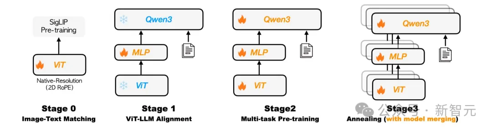

# 1. 资源

Homepage: https://kwai-keye.github.io/

Github Repo: https://github.com/Kwai-Keye/Keye

Model Weight: https://huggingface.co/Kwai-Keye/Keye-VL-8B-Preview

KC-MMBench: https://huggingface.co/datasets/Kwai-Keye/KC-MMbench

# 2. 原理

Kwai Keye-VL基于Qwen3-8B语言模型，并整合了SigLIP初始化的视觉编码器。

它支持动态分辨率输入，按原始比例将图像切分为14x14分块，由一个MLP层整合这些视觉特征。

模型采用3D RoPE（旋转位置编码）统一处理文本、图像和视频，并通过位置编码与时间戳对齐，精准捕捉视频时序变化。

**Pre-Train：构建多模态基座能力**

Kwai Keye-VL的预训练阶段核心目标是，构建强大的图文和视频理解能力（即视觉-语言对齐）。

为支撑这一目标，模型使用了总量高达600B的大规模多模态预训练数据集，包含图文、视频及纯文本数据。

此外，Kwai Keye-VL通过自建高质量中文OCR系统和精细化描述数据，有效突破了开源数据的局限，专门服务于模型图文/视频理解能力的训练。

训练流程采用四阶段渐进式优化策略：

视觉预训练： 持续预训练视觉编码器，使其适配内部数据分布并支持动态分辨率输入。

跨模态对齐： 冻结主干模型，仅训练轻量级MLP适配器，以极低成本高效建立鲁棒的图文/视频-文本对齐关系。

多任务预训练： 解锁全部模型参数，进行多任务联合训练，全面提升模型的综合视觉理解能力。

退火训练： 使用精选高质量数据进行精调，进一步提升模型的精细理解和判别能力。

最后，Kwai Keye-VL探索了同构异质融合技术，通过参数平均融合不同数据配比的退火训练模型，在保留多维度能力的同时，减小模型偏差，增强了模型的鲁棒性。

**Post-Train：两阶段精细微调，突破性强化推理能力**

Kwai Keye-VL的后训练阶段经过精心设计，旨在全面提升模型的性能，尤其是其在复杂任务中的推理能力，这一部分是模型实现高级认知功能的关键突破。

Stage I. 非推理训练（No-Reasoning Training）：夯实基础性能
Kwai Keye-VL首先进行监督微调（SFT），使用500万条高质量多模态VQA数据，数据多样性由自研TaskGalaxy方案建立的任务体系（包含7W种任务）保证，数据质量经AI筛选困难样本及人工标注保障；
随后进行混合偏好优化（MPO），结合开源数据与自建的偏好数据，后者通过收集SFT错误样本作提问素材、Qwen2.5VL 72B与SFT模型生成答案对、人工排序获得。

Stage II. 推理训练（Reasoning Training）：核心突破，赋能复杂认知

此阶段是Kwai Keye-VL训练流程的最大亮点与贡献，通过引入Mix-mode的思维链（CoT）和多思考模式强化学习（RL）机制，显著提升模型的多模态感知、推理和think with image能力，使其能够处理更复杂、需要多步思考的任务。

思维链冷启动阶段（CoT Cold-Start） 通过混合四种推理模式的训练数据，实现对模型思维链能力的零基础激活，使其初步掌握人类分步思考的推理范式。

混合强化学习阶段（CoT-Mix RL） 在冷启动基础上，采用GRPO算法进行混合模式强化学习，通过创新的双轨奖励机制（同步评估结果正确性与过程一致性）深度优化多模态感知、数学推理、短视频理解及智能体协同等综合能力，显著提升模型的推理能力。

多轮迭代对齐阶段（Iterative Alignment） 利用MPO算法对优劣数据对进行多轮迭代，根治内容重复崩溃与逻辑断层问题，最终赋予模型根据问题复杂度智能选择深度推理模式的自适应能力，实现性能与稳定性的双重突破。

Kwai Keye-VL通过分阶段、精细化的预训练与后训练策略，特别是对推理能力的深度强化与创新性突破，确保了模型在多种复杂场景下都能提供高质量、逻辑严谨且稳定的输出。

**训练架构优化：高效稳定的百亿参数模型训练**

为实现百亿参数模型的高效稳定训练，Kwai Keye-VL通过混合并行策略（整合数据并行/序列并行/ZeRO技术）显著提升训练吞吐量，既利用显存分片降低压力，又通过计算通信重叠隐藏延迟。

不同于纯文本模型训练，多模态输入分辨率差异很大，不同显卡计算负载不均会导致整体利用率降低，Kwai Keye-VL在训练框架中实现了全局负载均衡策略，依据样本FLOPS动态分发样本，尽可能消除硬件闲置，显著提高了多模态训练的MFU。同时构建了样本级自动容错机制，依托联合检查点技术使训练意外中断后可自动精准续训，保证了模型迭代的稳定性。

后训练阶段通过升级vLLM框架加速采样，并部署多奖励模型随机分发策略，大幅压缩强化学习的计算耗时，系统性保障了大规模训练的稳定性与效率。

模型评估

· 视觉理解/逻辑推理Benchmark

Kwai Keye-VL在综合感知能力比肩同规模顶尖模型的同时，在复杂推理任务中展现出显著领先优势。

评测数据显示：其基础感知达行业一流水准；而在MMMU、MMStar等通用Benchmark及MathVista、OlympiadBench等推理Benchmark上，该模型性能曲线大幅领跑业界，尤其在需要高阶逻辑推理与数学解题的挑战性任务中，凸显出卓越的复杂问题解决能力。

视频理解Benchmark

Kwai Keye-VL通过公开与自建评测双验证，在学术标准与真实短视频场景中均展现出全面领先优势。

为突破公开数据集的数据污染、语言覆盖局限及任务单一性等问题，快手构建了内部评测集KC-MMBench。

结果显示，该模型在VideoMME等权威公开Benchmark中以67.4分超越Qwen2.5-VL-7B（62.7）与InternVL-3-8B（65.5）；

在内部短视频场景评测中优势进一步扩大，综合得分领先SOTA模型超10%，尤其在热点聚合、内容合集、广告价值等核心场景表现卓越，实证其学术与产业双维竞争力。

# 参考

[1] AI秒懂短视频，快手大模型Keye-VL技术架构全公开：多模态视频大模型是如何炼成的？