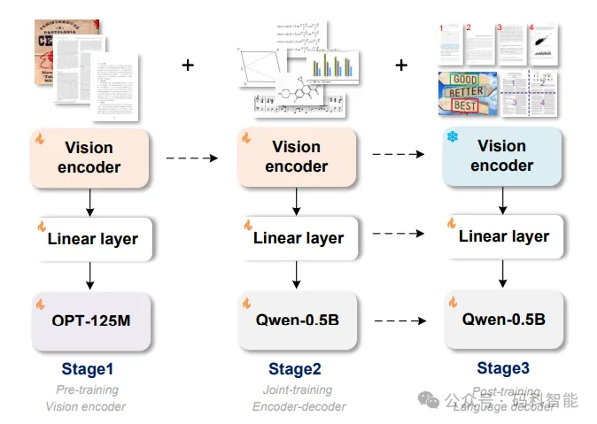
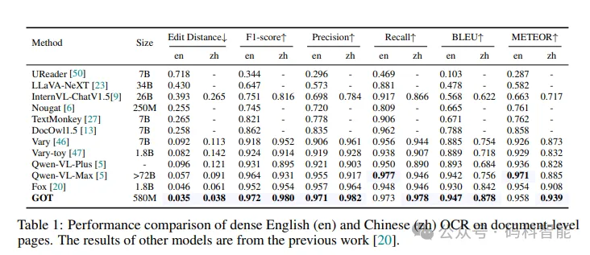
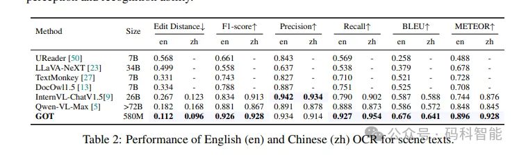

# 1. 简介

- 论文标题：General OCR Theory: Towards OCR-2.0 via a Unified End-to-end Model
- 论文地址：https://arxiv.org/abs/2409.01704
- 项目地址：https://github.com/Ucas-HaoranWei/GOT-OCR2.0
- Hugging Face 体验地址: https://tonic-got-ocr.hf.space/
- Hugging Face 地址: https://hf.co/ucaslcl/GOT-OCR2_0

来自清华和旷视的研究团队提出了一个通用的OCR-2.0模型，其结构比OCR-1.0系统更简单，更专注于纯粹的OCR任务，并且具有更优越的性能。OCR-2.0将各种泛OCR任务集成到一个模型中，是模型设计、数据工程和应用场景中一个有价值的研究方向。团队推出GOT（General OCR Theory）模型的特点如下：

- 模型能力：模型能够处理各种OCR任务中的上述所有类型的“字符”。
- 参数规模：拥有5.8亿参数。
- 端到端设计：是一个统一且优雅的端到端模型，包含高压缩编码器和长上下文解码器。
- 输入支持：支持处理常用的场景和文档风格的图像，包括幻灯片和整页样式。
- 输出灵活：能够通过简单的提示生成纯文本或格式化结果（如markdown、tikz、smiles、kern）。
- 交互式OCR：具备交互式OCR功能，支持通过坐标或颜色引导的区域级识别。
- 适应性：为GOT适配了动态分辨率和多页OCR技术，增强了模型的实用性。

## 1.1 由LVLM驱动的OCR

大型视觉语言模型（LVLMs） 大多数LVLMs的OCR能力来自于现成的CLIP，特别是那些冻结CLIP编码器以完成整个LVLM训练的模型。对于这些模型，原始CLIP主要包含英语场景文本知识，成为OCR性能在领域外任务（如其他语言或文档）的瓶颈。一些模型采用滑动窗口方式将输入图像分解成更小的补丁。虽然这种动态分辨率方法在处理高分辨率输入图像（例如PDF）方面非常有效，但它将导致过多的图像标记，并在一定程度上限制生成的OCR结果的最大长度。

# 2. 原理
## 2.1 结构

在输入方面，模型支持图 1 中全部的 OCR 任务；输出方面，模型同时支持 plain texts 输出以及可读性强、可编辑的 formatted 文本输出，如 markdown 等。

模型的结构和训练方法如图 2 所示，采用 vision encoder+input embedding layer+decoder 的 pipeline。Encoder 主体采用带 local attention 的 VITDet 架构，这不至于 CLIP 方案的全程 global attention 在高分辨率下激活太大，炸显存。

Encoder 后两层采用 Vary 的双卷积设计方案。整个 Encoder 将 1024×1024×3 的图像压缩为 256×1024 的 image tokens，这足以做好 A4 纸级别的 dense OCR。

整个训练过程分为 3 个步骤，没有一个阶段锁 LLM，也就是不会存在图像到文本的对齐阶段，进而导致损害 image token 的文字压缩率。3 个训练阶段分别为：

1. 高效预训练 encoder，GOT 在整个训练过程中，没有 A100 级别的卡，为了节省资源，该阶段使用小型 OPT-125M 作为 decoder 为 encoder 提供优化方向，快速灌入大量数据。
2. 联合训练 encoder-decoder，该阶段 GOT 的基本结构搭建完成，为上一阶段预训练好的 encoder，以及 Qwen 团队预训练好的 Qwen0.5B。我们稍稍加大了 decoder 的大小，因为该阶段需要喂入大量 OCR-2.0 的知识，而不少数据（如化学式的 OCR）其实也是带点 reasoning 的，更小的 decoder 未敢尝试。
3. 锁住 encoder，加强 decoder 以适配更多的 OCR 应用场景，如支持坐标或者颜色引导的细粒度 OCR（点读笔可能会用到），支持动态分辨率 OCR 技术（超大分辨率图可能会用到），多页 OCR 技术（该 feature 主要是为了后续 follower 能更好地训练 Arxiv 这种数据，我们的设想是多页 PDF 直接训练，无须再对 .tex 断页而苦恼！）

通用OCR模型框架

GOT采用了编码器-解码器结构，由三个核心组件构成：图像编码器、线性层和输出解码器。这三个部分协同工作，实现从图像到文本的高效转换。
- 首先，进行纯文本识别任务以预训练视觉编码器，使用小型OPT-125M预训练视觉编码器。将包含场景文本的图像和包含文档级字符的手动图像输入模型，使编码器能够收集两种最常用的字符编码能力。
- 然后，通过将训练好的视觉编码器连接到一个新的更大的解码器Qwen-0.5B来形成GOT架构。作者准备了更多的通用OCR数据（例如，乐谱、数学/分子公式和几何形状），以扩展这一阶段的OCR-2.0知识。
- 最后，为了进一步提高GOT的泛化能力和适用性。生成并添加了细粒度和多裁剪/页面合成数据，以支持GOT进行区域提示OCR、大型图像OCR和批量PDF OCR功能。

## 2.2 针对编码器预训练的数据引擎

在编码器预训练阶段，共使用了约500万张图像-文本对，涵盖300万场景文本OCR数据和200万文档OCR数据。数据获取方法如下：

自然场景数据：英文图像和中文图像分别从Laion-2B和Wukong数据集中采样获取。利用PaddleOCR工具，从这些多样化的真实场景中自动生成伪基准真值。最终，收集到200万条数据，中文和英文各占一半。

文档级数据：通过Common Crawl收集开源PDF样式文件，并运用Fitz Python包从中提取密集文本内容。在此过程中，产生了120万全页PDF样式的图像-文本对以及80万图像切片数据。这些切片数据，包括行级和段落级，是通过从PDF图像中按解析得到的边界框进行裁剪得到的。

# 3. 实验结果

对GOT模型在五个不同的OCR任务上的性能进行了验证，这些任务包括：1) 普通文档OCR；2) 场景文本OCR；3) 细粒度文档OCR；4) 格式化（Mathpix markdown）文档OCR；5) 更通用的角色OCR。为确保测试数据未包含在训练数据中，每个基准的测试数据都经过了严格的文本相似性过滤。

## 3.1 普通文档OCR性能

使用开源的Fox基准测试了GOT在中文和英文PDF OCR上的性能。评估指标包括编辑距离、F1分数、精确度、召回率、BLEU和METEOR，这些是OCR任务中常用的指标。

## 3.2 场景文本OCR性能

收集了400张自然图像作为场景文本OCR的基准，其中中文和英文图像各占一半。所有基准真值均经过手动校正。由于场景图像中的文本相对较短，因此采用字符级分割来计算各项指标。

## 3.3 格式化文档OCR性能

将光学PDF图像转换为类似markdown的格式是OCR模型的一个重要特性。为了验证GOT在这方面的能力，精心准备了90页样本作为高质量基准。该基准包含中英文文档页面。如表所示，单尺度（1024×1024）的GOT能够产生令人满意的结果。采用多裁剪推理时，GOT的性能得到了进一步提升，特别是在处理公式和表格中的小文本方面。

## 3.4 细粒度OCR性能

报告了GOT在细粒度OCR任务中的性能指标。如表所示，GOT在基于边界框和基于颜色的参考性OCR任务上的整体性能均优于Fox基准，这表明模型具备出色的交互式OCR能力。

# 参考

[1] 迈向OCR-2.0新时代：通过统一的端到端模型，实现文本、数学公式、表格、图表及乐谱等内容的精确处理，同时支持场景和文档风格等，https://mp.weixin.qq.com/s/TA1_WTuTgNPypqyiGILZEg
[2] OCR研究不曾结束，它才刚刚开始——GOT-OCR-2.0模型开源！，https://mp.weixin.qq.com/s/rQL-Q0TGhT6e8Ti4zZalrg