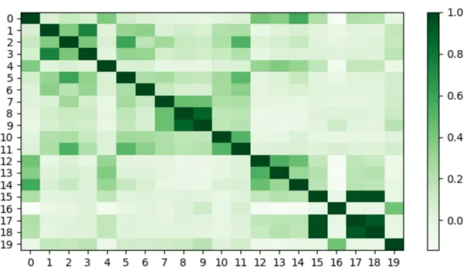

# 1. 简介

- 论文链接：https://arxiv.org/abs/2403.04473
  - TextMonkey: An OCR-Free Large Multimodal Model for Understanding Document
  - 作者：华中科技大学和金山
  - 时间：CVPR2024
- 代码地址 (1.2k Stars)：https://github.com/Yuliang-Liu/Monkey
- Huggingface模型下载：https://huggingface.co/echo840/Monkey
- 智始AI模型下载：https://www.wisemodel.cn/models/HUST-VLRLab/Monkey/intro
- 在线体验：http://vlrlab-monkey.xyz:7681/

训练数据：

- Monkey： https://drive.google.com/file/d/18z_uQTe8Jq61V5rgHtxOt85uKBodbvw1/view
- multi-level description generation method数据：https://huggingface.co/datasets/echo840/Detailed_Caption
- 训练图像：https://pan.baidu.com/share/init?surl=svSjXTxWpI-3boALgSeLlw
  - Extraction code: 4hdh
- 测试图像：https://pan.baidu.com/share/init?surl=svSjXTxWpI-3boALgSeLlw
  - Extraction code: 5h71

问题：

- 当前不支持多轮对话
- 实际测试，复杂的指令，会导致重复输出，停不下来

TextMonkey 是一个专注于文本相关任务（包括文档问答和场景文本问答）的多模态大模型（LMM）。相比于 Monkey，TextMonkey 在多个方面进行改进：通过采用零初始化的 Shifted Window Attention，TextMonkey 实现了更高输入分辨率下的窗口间信息交互；通过使用相似性来过滤出重要的图像特征，TextMonkey 不仅能够简化输入，还可以提高模型的性能。

此外，通过扩展多个文本相关任务并将位置信息纳入回答，TextMonkey 增强了可解释性并减少了幻觉。与此同时，TextMonkey 在微调之后还可以具备 APP Agent 中理解用户指令并点击相应位置的能力，展现了其下游应用的巨大潜力。

例如，TextMonkey 展现出强大的视觉定位与理解能力，不仅能够定位图像中的所有文本，还能在视觉问答时给出答案及其所在位置，增加了可解释性并减少了幻觉。

即使在文字相当密集的情况下，TextMonkey 也可以读取输入图片中的所有文字并且给出图片中文本的坐标。

# 1.1 功能简介

TextMonkey 还能帮助我们结构化图表，表格以及文档数据，通过将图像内容转化为 Json 格式的信息，方便记录和提取。

实验结果表明，TextMonkey 在各种基准数据集上的性能得到了显著提升，在以场景文本为中心的视觉问答、文档 VQA 和关键信息抽取任务中分别取得了 5.2%、6.9% 和 2.8% 的准确率增长，特别是在 OCRBench [2] 上获得了 561 的得分，超越此前所有已开源的多模态大模型。

# 2. 原理

1. Shifted Window Attention

   现有的多模态大模型，如 Monkey 和 LLaVA1.6，通过将图像切分为小块来提高输入分辨率。然而这种裁剪策略可能会无意中分割相关单词，导致语义不连贯。此外，这种分裂造成的空间分离也使得处理与文本位置相关的任务（如文本检测）变得具有挑战性。TextMonkey 在继承 Monkey 高效的图像分辨率缩放功能的同时，采用滑动窗口注意力机制建立了块与块之间的上下文联系。

2. Token Resampler

    目前的多模态大模型面临着图像 token 数目随着输入分辨率的增加而增加的挑战。由于语言模型的输入长度和训练时间的限制，减少 token 的数量是很有必要的。
    
    在自然语言中，语言元素会存在一些冗余信息。那么可以自然的猜测在扩大图像分辨率之后，视觉部分的 token 也会存在冗余。本文根据以往确定语言元素相似性的方法，对已经映射到语言空间的图像 token 的相似性进行了度量：在图像 Resampler 之后随机选取 20 个有序特征，利用余弦相似性成对比较这些特征的相似性，得到的结果如图 2 所示。颜色越深代表相似性越高，实验发现每个图片的 token 都有一个到几个类似的 token，图片特征中存在冗余。
    
    同时，本文还观察到某些 token 是高度独特的，并且缺乏其他相似的 token，如图中的第四个 token，这表明这个 token 是更为重要的。因此本文选用相似度来度量并识别独特的视觉 token。并提出 Token Resampler 来压缩冗余视觉 token。通过计算每个 token 与其他 token 的相似度，过滤得到最重要（相似度最低）的 K 个 token。同时，为了避免直接丢弃其他 token 造成的信息丢失，这里还会利用过滤得到的 K 个 token 作为查询，并采用交叉注意力机制进一步融合所有特征。
    
    

3. 多任务训练

  TextMonkey 支持读出所有文本，文本检测识别，输出给定文本坐标，文本问答，具有位置感知的文本问答，图像结构化等多个任务。TextMonkey 在进行问答时不仅看可以给出答案，还能给出答案所在位置，进一步增强了模型的可解释性。与此同时，在经过微调之后，TextMonkey 还可以具备 APP Agent 中理解用户指令并点击相应位置的能力。

# 3. 实验结果

1. TextMonkey 与现有的多模态大模型相比，表现出了优越的性能。

   

2. 为了进一步验证 TextMonkey 的有效性，本文还在更多数据集上进行了测试。（其中 Deepform 和 KLC 使用 F1-score 作为评估指标，WTQ 使用 accuracy, ChartQA 使用 relaxed accuracy, DocVQA 使用 ANLS。）

    

3. TextMonkey 在 Text Spotting 数据集上相比于传统 OCR 模型也取得了极具竞争力的效果。

    

4. 表 7 的消融实验表明 Shifted Window Attention 和 Token Resampler 两个模块的有效性。
  
   

5. 表 9 的消融实验证明：由于分辨率的提高导致冗余 token 的显著增加，使得找到关键信息变得更加困难，在不压缩 Token 的情况下直接增加分辨率实际上会导致一致的性能损失，如在表中第一行和第四行，在不压缩 Token 时，分辨率由 896 增加到 1344 会导致模型在四个数据集上的指标均有所下降，这说明了没有策略地一味增加模型的分辨率反而会带来负面影响，如何合理地增加分辨率，将会是一个需要集中解决的问题。不仅如此，表 9 中还说明，当选取不同的压缩 Token 数量时，对模型性能的影响也是显著的，选取一个合适的值来作为压缩 Token 的数量，可以使得模型的性能进一步提升。

   

TextMonkey 在场景图像和文档图像中都能准确定位和识别文本。此外，(a) 中的自然图像、(b) 中的文档、(c) 中的图表和 (d) 中的表格都展示了 TextMonkey 在多种场景下识别、理解和定位文本信息的能力。

本文还探索了 TextMonkey 作为智能手机应用程序的 Agent 代理方面的可行性。使用来自 Rico 数据集的 15k 用户点击数据上进行微调之后，TextMonkey 能够理解用户意图并点击相应的图标，这表明了 TextMonkey 在微调之后作为 App Agent 的巨大潜力。

# 4. 总结

TextMonkey 在 Monkey 的基础上增强了其图像间的跨窗口交互，在扩大分辨率的基础上增强了视觉信息的语义连续性，有效缓解了视觉信息碎片化的问题；并通过提出过滤融合策略减少图像特征长度，从而减少输入到大语言模型中冗余的视觉 token 数量。论文的实验说明，分辨率不是越大越好，不合理的提高模型分辨率策略有时会给模型带来负面影响，如何合理地扩大分辨率才是一个更值得去思考的问题。

此外，通过在问答中引入位置信息，TextMonkey 增强了可解释性并减少了幻觉。TextMonkey 在多个文本相关的测试基准中处于国际领先，在 OCRBench 中超越其他开源多模态大模型。TextMonkey 的到来为通用文档理解带来曙光，这有潜力促进办公自动化、智慧教育、智慧金融等行业的技术变革。

# 参考

[1] 通用文档理解新SOTA，多模态大模型TextMonkey来了，https://mp.weixin.qq.com/s/UMemsDJ2mSSoZvUx73iSSw