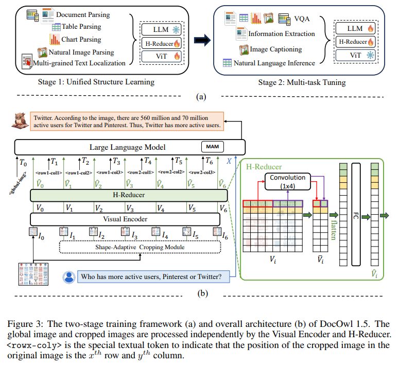

# 1. 资源

- 在线Demo: https://modelscope.cn/studios/iic/mPLUG-DocOwl/summary
- Github (496 stars): https://github.com/X-PLUG/mPLUG-DocOwl
- 论文：
  - mPLUG-DocOwl 1.5: Unified Structure Learning for OCR-free Document Understanding
  - https://arxiv.org/abs/2403.12895

基于在线demo，本人实测，效果很差，几乎不可用

功能：
- 文档问答
- 复杂图表转markdown格式

# 2. 模型

## 2.1 高分辨率

区分于一般图片，文档图片的特点在于形状大小多样化，其可以包括A4大小的文档图、短而宽的表格图、长而窄的手机网页截图以及随手拍摄的场景图等等，分辨率的分布十分广泛。

主流的多模态大模型编码图片时，往往直接缩放图片的大小，例如mPLUG-Owl2和QwenVL缩放到448x448，LLaVA 1.5缩放到336x336。

简单的缩放文档图片会导致图片中的文字模糊形变从而不可辨认。

为了处理文档图片，mPLUG-DocOwl 1.5延续了其前序工作UReader的切图做法，模型结构如图1所示：

## 2.2 通用文档结构理解

对于不依赖OCR系统的文档理解来说，识别文字是基本能力，要实现文档内容的语义理解、结构理解十分重要，例如理解表格内容需要理解表头和行列的对应关系，理解图表需要理解线图、柱状图、饼图等多样化结构，理解合同需要理解日期署名等多样化的键值对。

mPLUG-DocOwl 1.5着力于解决通用文档等结构理解能力，通过模型结构的优化和训练任务的增强实现了显著更强的通用文档理解能力。

结构方面，如图1所示，mPLUG-DocOwl 1.5放弃了mPLUG-Owl/mPLUG-Owl2中Abstractor的视觉语言连接模块，采用基于“卷积+全连接层”的H-Reducer进行特征聚合以及特征对齐。

相比于基于learnable queries的Abstractor，H-Reducer保留了视觉特征之间的相对位置关系，更好的将文档结构信息传递给语言模型。

相比于保留视觉序列长度的MLP，H-Reducer通过卷积大幅缩减了视觉特征数量，使得LLM可以更高效地理解高分辨率文档图片。

考虑到大部分文档图片中文字优先水平排布，水平方向的文字语义具有连贯性，H-Reducer中采用1x4的卷积形状和步长。论文中，作者通过充分的对比实验证明了H-Reducer在结构理解方面的优越性以及1x4是更通用的聚合形状。

训练任务方面，mPLUG-DocOwl 1.5为所有类型的图片设计了统一结构学习（Unified Structure Learning）任务，如图3所示。

Unified Structure Learning既包括了全局的图片文字解析，又包含了多粒度的文字识别和定位。

在全局图片文字解析任务中，对于文档图片和网页图片，采用空格和换行的形式可以最通用地表示文字的结构；对于表格，作者在Markdown语法的基础上引入表示多行多列的特殊字符，兼顾了表格表示的简洁性和通用性；对于图表，考虑到图表是表格数据的可视化呈现，作者同样采用Markdown形式的表格作为图表的解析目标；对于自然图，语义描述和场景文字同等重要，因此采用图片描述拼接场景文字的形式作为解析目标。

在“文字识别和定位”任务中，为了更贴合文档图片理解，作者设计了单词、词组、行、块四种粒度的文字识别和定位，bounding box采用离散化的整数数字表示，范围0-999。

为了支持统一的结构学习，作者构建了一个全面的训练集DocStruct4M，涵盖了文档/网页、表格、图表、自然图等不同类型的图片。

经过统一结构学习，DocOwl 1.5具备多领域文档图片的结构化解析和文字定位能力。

## 2.3 指令遵循

“指令遵循”（Instruction Following）要求模型基于基础的文档理解能力，根据用户的指令执行不同的任务，例如信息抽取、问答、图片描述等。

延续mPLUG-DocOwl的做法，DocOwl 1.5将多个下游任务统一为指令问答的形式，在统一的结构学习之后，通过多任务联合训练的形式得到一个文档领域的通用模型（generalist）。

此外，为了使得模型具备详细解释的能力，mPLUG-DocOwl曾尝试引入纯文本指令微调数据进行联合训练，有一定效果但并不理想。

在DocOwl 1.5中，作者基于下游任务的问题，通过GPT3.5以及GPT4V构建了少量的详细解释数据（DocReason25K）。

通过联合文档下游任务和DocReason25K进行训练，DocOwl 1.5-Chat既可以在基准上实现更优的效果：

## 2.4 外部知识引入

文档图片由于信息的丰富性，进行理解的时候往往需要额外的知识引入，例如特殊领域的专业名词及其含义等等。

为了研究如何引入外部知识进行更好的文档理解，mPLUG团队着手于论文领域提出了mPLUG-PaperOwl，构建了一个高质量论文图表分析数据集M-Paper，涉及447k的高清论文图表。

该数据中为论文中的图表提供了上下文作为外部知识来源，并且设计了“要点”（outline）作为图表分析的控制信号，帮助模型更好地把握用户的意图。

基于UReader，作者在M-Paper上微调得到mPLUG-PaperOwl，展现了初步的论文图表分析能力，如图8所示。

# 3. 性能

阿里新研究mPLUG-DocOwl 1.5在10个文档理解基准上拿下SOTA，5个数据集上提升超过10个点，部分数据集上超过智谱17.3B的CogAgent，在DocVQA上达到82.2的效果。

# 参考

[1] 阿里7B多模态文档理解大模型拿下新SOTA｜开源，https://mp.weixin.qq.com/s/vtymW1k93ZLSOqj0iWwe6A