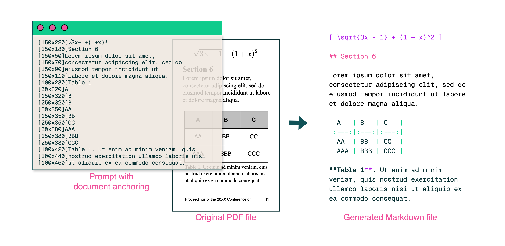
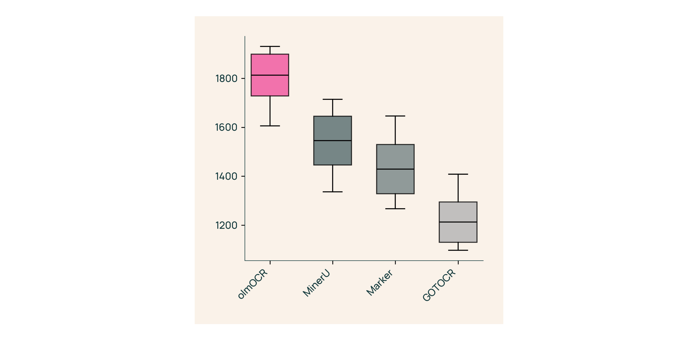
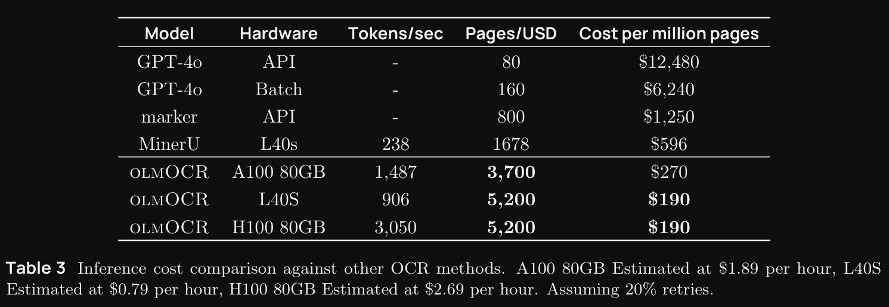

# 使用 Vision Language Models 进行高效的 PDF 文本提取

# 1. 资源
- Github (7.1k stars): https://github.com/allenai/olmocr
- 技术报告：olmOCR: Unlocking Trillions of Tokens in PDFs with Vision Language Models
  - https://olmocr.allenai.org/papers/olmocr.pdf
- 数据及模型：https://huggingface.co/collections/allenai/olmocr-67af8630b0062a25bf1b54a1
- 在线demo（测试无法使用）: https://olmocr.allenai.org/
- 博客：https://olmocr.allenai.org/blog
- 模型大小：7B

要点：
- 数据构建均通过GPT-4o处理
- 使用pyPDF获取文档块的坐标和元信息加入到提示词提升模型性能
- 基于Qwen2-VL-7B-Struct模型微调
- 训练数据均为英文文档，包括学术论文、宣传册、法律文件、图表、幻灯片等
- 使用249,332个PDF训练

个人点评：
- 训练数据均为英文文档，非英语场景性能堪忧 （个人未详细评估中文，但可推断）

# 2. 简介

从预训练到推理，语言模型 （LM） 对纯文本数据进行作。无论是在数万亿个令牌上进行训练，还是在为数据密集型 AI 应用程序提供服务时，这些文本的质量都非常重要。嘈杂的文本会导致训练不稳定和模型性能变差，或者在完成用户请求时输出不佳。

但是，并非所有 LM 使用的数据都以易于解析的格式（如网页）提供。事实上，对于许多域，有价值的信息都存储在电子文档文件（如 PDF）中。这些格式带来了独特的挑战，因为它们旨在在固定大小的页面上呈现内容，而不是保留逻辑文本结构。以 PDF 为例：这种格式将文本存储为二进制字符编码序列，以及它们在页面上的位置和格式。这种格式虽然高效，但很难恢复所有文本单元，如标题、段落、表格和方程式，并按正确的顺序排列它们。

为了帮助处理电子文档，我们引入了 olmOCR，这是一个高性能工具包，旨在将 PDF 和文档图像转换为干净、结构化的纯文本。olmOCR 有何与众不同之处？

- 性能：我们对从各种 PDF 中采样的 250,000 页进行微调 olmOCR。有些是天生的数字，而另一些则是公共领域书籍的扫描副本。这确保了 olmoOCR 可以准确地从各种文档中提取文本。
- 成本效益：olmoOCR 工具包可以处理 100 万个 PDF 页面，价格约为 190 美元，olmOCR 成本大约是您使用 GPT-4o API 在批处理模式下处理相同数量页面所支付费用的 1/32。
- Markdown 输出：olmOCR 以 Markdown 格式输出文本，易于解析和处理。它可以处理方程式、表格和手写内容，即使对于最复杂的多列文档布局，也可以按正确的读取顺序处理。
- 包含电池：olmOCR 是一个完全优化的管道，可与 SGLang 和 vLLM 推理引擎配合使用。它可以从一个 GPU 高效扩展到数百个 GPU，并包含启发式方法来处理常见的解析失败和元数据错误。
- 完全开源：olmOCR 构建在 Qwen2-VL-7B-Struct 之上。我们发布了工具包的所有组件：模型权重、微调数据集、训练和推理代码。

# 3. 训练

为了获得用于训练 olmOCR 的高质量数据，我们开发了一种称为文档锚定的技术。此方法利用 PDF 文件中存在的任何文本和元数据来提高提取文本的质量。

图 1：文档锚定如何用于典型页面的示例。相关的图像位置和文本块被提取、连接并插入到模型提示符中。当提示 VLM 输入文档的纯文本版本时，锚定文本与页面的栅格化图像结合使用。

锚定采用pypdf处理。

使用文档锚定，我们使用 GPT-250,000o 标记 4 个页面。我们结合使用从 Web 爬取的可公开访问的 PDF 和 Internet Archive 扫描的公共领域书籍。数据集是多样化的，有 60% 的学术论文、12% 的宣传册、11% 的法律文件、6% 的图表、5% 的幻灯片和 4% 的其他文档类型。

为了训练模型本身，我们微调了 Qwen2-VL-7B-Instruct 检查点。我们使用 SGLang 仔细优化了用于大规模批处理的推理管道，使 olmOCR 只需 190 美元即可转换 100 万个 PDF 页面——大约是使用 GPT-4o API 成本的 1/32。我们的结果表明，与其他流行的 OCR 工具相比，不仅节省了大量成本，而且在人工评估方面也表现出色。

图 2：olmOCR 与其他流行工具的 ELO 排名。

我们通过将 olmOCR 的输出与其他流行的 PDF 提取工具进行比较来评估 olmOCR：Marker、MinerU 和 GOT-OCR 2.0。我们收集了 11 名研究人员的成对判断。我们抽样了 2,017 个 PDF 并收集了 452 个有意义的比较，计算 ELO 评级以量化性能。olmOCR 的 ELO 分数超过 1800，明显优于所有竞争对手。与其他工具直接比较时，olmOCR 在 61.3% 的与 Marker 的比较中受到青睐，58.6% 与 GOT-OCR 相比，与 MinerU 相比更受欢迎，令人印象深刻的 71.4%，这表明其生成干净、结构良好的文本的卓越能力。

数据来源：

| Source                   | Unique Docs | Total Pages |
|--------------------------|------------|-------------|
| Web crawled PDFs        | 99,903     | 249,332     |
| Internet Archive books  | 5,601      | 16,803      |
| **Total**               | **105,504** | **266,135** |

数据构成比例：

| Document Type | Fraction |
|--------------|---------|
| Academic     | 60%     |
| Brochure     | 12%     |
| Legal        | 11%     |
| Table        | 6%      |
| Diagram      | 5%      |
| Slideshow    | 2%      |
| Other        | 4%      |

# 4. 性能

