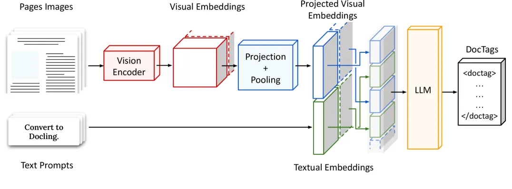

# 1. 资源

[1] https://huggingface.co/ds4sd/SmolDocling-256M-preview
[2] https://huggingface.co/spaces/ds4sd/SmolDocling-256M-Demo
[3] https://arxiv.org/html/2503.11576v1

# 2. 介绍

SmolDocling-256M-preview 是一个多模态的图像-文本到文本模型，专为高效的文档转换而设计。它保留了 Docling 的大部分流行功能，并通过无缝支持 DoclingDocuments 确保与 Docling 的完全兼容。该模型能够从图像中准确提取文本，保留文档结构和元素边界框，识别和格式化代码块，处理数学表达式，提取和解释图表数据，支持结构化表格提取，并区分图形元素。它适用于科学和非科学文档的全面处理。

# 参考

[1] SmolDocling-256M-preview 是一个多模态的图像-文本到文本模型, https://mp.weixin.qq.com/s/ESx4PFKs-M6HN_az2Ao1Pg