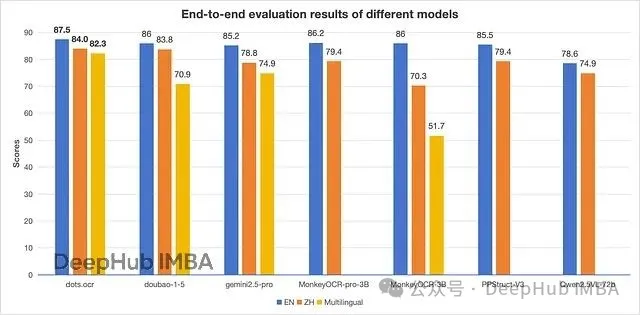
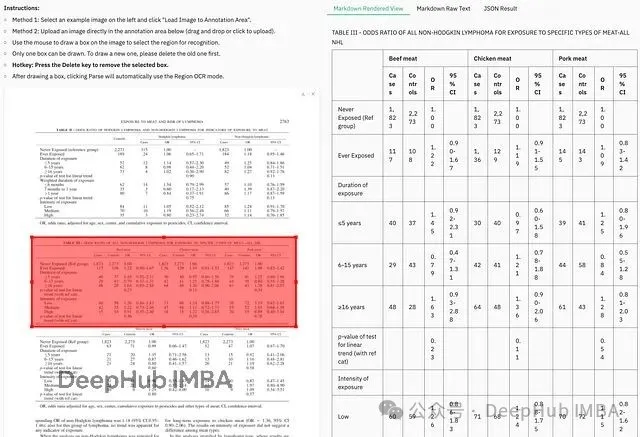

# 简介

在传统OCR技术日趋成熟的今天，一个仅有1.7B参数的视觉语言模型正在重新定义文档处理的技术边界。Dots.ocr的出现标志着OCR领域从传统多模块流水线向统一视觉语言建模的重要转变，其在多项基准测试中超越大参数模型的表现，预示着"小而精"可能比"大而全"更具实用价值。

这一技术突破的核心在于架构创新而非参数堆叠。通过将布局检测、文本识别、阅读顺序理解和数学公式解析等传统上需要多个专门模型处理的任务统一到单一的视觉语言模型中，Dots.ocr不仅简化了部署复杂度，更在准确性和一致性方面取得了显著提升。

本文将深入分析Dots.ocr的技术架构特点、性能表现以及在实际应用中的价值，探讨这一模型如何在参数效率与处理能力之间找到最佳平衡点。

# 统一的视觉语言模型

dots.ocr采用了与传统OCR系统截然不同的技术架构。传统方案通常结合YOLO风格的目标检测器与独立的语言模型，需要在多个模型间协调处理不同任务。而dots.ocr通过单一的视觉语言模型(VLM)实现了布局检测、文本解析、阅读顺序识别以及数学公式识别的统一处理。

这种统一架构的核心优势在于基于提示的任务切换机制。通过调整输入提示，系统可以在布局检测、纯文本OCR以及区域定位等不同任务间无缝切换，避免了传统多模块系统中常见的特征对齐问题和坐标系不一致错误。

这种设计显著简化了模型的部署、调试和扩展流程。开发者无需维护多个独立模型并处理它们之间的协调问题，单一模型即可保证处理结果的一致性和准确性。

# 性能基准测试分析

在文档OCR领域的权威性能评估中，dots.ocr展现出了超越其参数规模的优异表现。

OmniDocBench基准测试

在文档解析领域的黄金标准基准OmniDocBench中，dots.ocr在其参数类别中实现了领先性能。在文本识别任务中，该模型在英文数据集上达到0.032的错误率，中文数据集上为0.066（数值越低表示性能越好）。在公式检测任务中，其性能与72B参数的Gemini2.5-Pro模型相当。表格理解任务中，英文和中文数据集的TableTEDS分数分别达到88.6和89.0。在阅读顺序识别方面，该模型的错误率显著低于GPT-4o、Mistral以及MonkeyOCR-Pro-3B等模型。

这一结果表明，1.7B参数的dots.ocr在多项核心任务中超越了参数规模大20倍的竞争模型，展现了模型架构优化的重要价值。

多语言处理能力评估

在dots.ocr-bench多语言基准测试中，该模型展现出了出色的跨语言泛化能力。该基准包含100种语言的1493个PDF文档，测试结果显示dots.ocr相比Doubao和MonkeyOCR将错误率降低了近50%。这一性能在处理藏语、卡纳达语等低资源语言时尤为突出，而这些语言往往是传统OCR系统的失效点。

布局检测性能对比

在布局检测任务中，dots.ocr与专门的检测模型DocLayout-YOLO进行了直接对比。结果显示，dots.ocr在F1@IoU .50指标上达到0.93的总体分数，显著超越YOLO的0.80。在公式检测这一细分任务中，性能差距更为明显，dots.ocr达到0.832而DocLayout-YOLO仅为0.620。

值得注意的是，dots.ocr并非专门的检测模型，而是通过prompt_layout_only_en提示实现检测功能。这体现了视觉语言模型从传统的"通用但不精专"向"通用且精专"的技术演进。

OLMOCR-bench深度评估
在OLMOCR-bench这一专门针对复杂文档场景的基准测试中，dots.ocr面对噪声PDF、老旧扫描件、数学密集期刊以及复杂页面布局等挑战性场景，获得了79.1的综合分数，超越了MonkeyOCR-pro-3B的75.8分。该模型在处理包含嵌入LaTeX公式和复杂脚注的多栏文档时表现尤为稳定。

在具体文档类型的细分评估中，无论是教科书、试卷、财务报告还是报纸，dots.ocr都保持了领先或次优的性能表现。考虑到模型约3B参数和BF16精度的运行配置，这一性能水平具有重要的实用价值。

# 技术限制与适用场景
当前版本的dots.ocr存在几个需要关注的技术限制。首先，在处理超高分辨率图像（11289600像素以上）时可能出现性能下降，建议将图像DPI调整至200或进行适当降采样。其次，特殊字符如...或___可能在输出中引发重复问题，此时需要尝试替代提示策略。

在功能覆盖方面，模型暂不支持图片内容解析，对于包含信息图表的文档存在处理盲区。在大规模应用场景中，批量处理的吞吐量优化仍有提升空间，尚未针对高并发PDF处理进行专门优化。

尽管存在这些限制，考虑到这是首个发布版本，其整体稳定性和准确性仍超越了市场上的多数同类产品。

# 总结

dots.ocr以其紧凑的1.7B参数规模实现了超越大规模模型的性能表现，展现了优化模型架构的重要价值。其统一的视觉语言模型设计、基于提示的任务切换机制以及出色的多语言处理能力，为OCR技术的发展提供了新的技术路径。

dots.ocr的技术价值不仅体现在OCR性能的提升，更重要的是其代表了视觉语言建模技术的正确发展方向。传统OCR作为独立技术领域，长期依赖复杂的工具链和脆弱的流水线架构。dots.ocr通过单一模型实现多任务统一处理，将整个工具链整合为一个灵活且实用的视觉语言模型。

这种技术范式的转变对于扫描表单处理、多语言文档识别、学术论文解析以及复杂发票处理等应用场景具有重要意义。模型的开源特性进一步促进了技术的普及和创新应用。

在文档智能化应用开发中，dots.ocr提供了一个高效、灵活的解决方案，可以替代传统的多模块检测和识别系统。随着技术的持续优化和功能完善，该模型有望成为文档处理领域的重要基础设施。

# 参考

[1] Dots.ocr：告别复杂多模块架构，1.7B参数单一模型统一处理所有OCR任务, https://mp.weixin.qq.com/s/Bj8d4WXAqAtoGT-5KgLkBA?scene=1