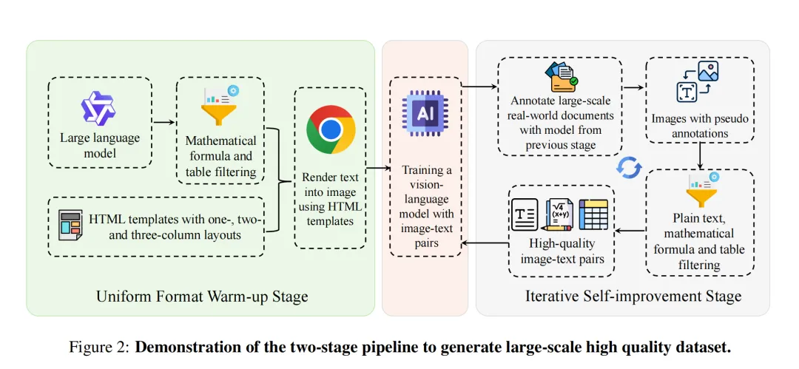
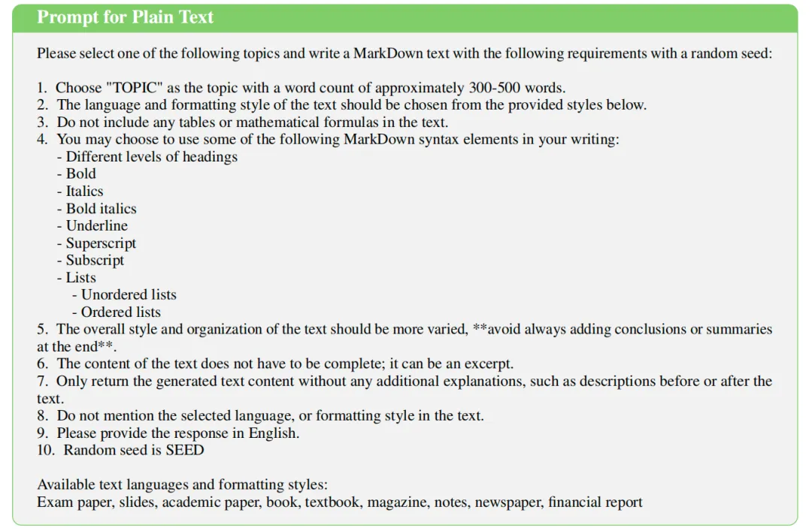

继续看文档智能进展，还是那个问题，PyMuPDF在解析过程中可能无法准确保留复杂结构，MinerU(pipeline版本)和Mathpix，这些方法通过集成多个专有模型，有误差传播，端到端的方案，比如monkeyocr这种，其实在拟数据。

所以，还是要回到数据的问题，因此，再来看这方面的方案，《POINTS-Reader: Distillation-Free Adaptation of Vision-Language Modelsfor Document Conversion》，https://huggingface.co/papers/2509.01215，核心是数据整理生成（虽然名字不是蒸馏，但是其实就是，还是靠llm生成数据的【此处很有趣】）方案【这个是数据工程的范畴】。

1）格式定义， 纯文本使用Markdown格式。表格使用HTML格式（能处理合并单元格等复杂结构），数学公式使用LaTeX格式（行内公式用$...$，行间公式用$$...$$）；

->2）大规模数据合成，使用Qwen2.5-72B，根据特定的提示生成包含纯文本、含公式的文本、含表格的文本以及多栏布局文本的多样化内容。

这块的核心是prompt的设计，例如：

生成plain-text的prompt:

生成的公式和表格进行基于规则的过滤（如语法检查），然后将过滤后的内容使用HTML模板渲染成图像。

->3）伪标+过滤：使用第一阶段训练好的模型去自动标注一个大规模的真实文档数据集（如DocMatix），然后进行过滤，例如：

纯文本过滤（计算模型输出与传统OCR（如PaddleOCR）结果的F1分数，仅保留分数高于阈值（如0.9）的样本，以减少遗漏、幻觉和重复）；表格过滤（检查表格结构的有效性，例如确保每行的单元格数量一致，以去除结构错误的表格）。公式过滤（检查LaTeX公式的语法是否正确，以去除语法错误的公式）

->4）使用经过过滤真实数据，对模型进行重新训练；

->5）开始滚雪球，将新训练的模型作为起点，重复执行“标注->过滤->再训练”的过程【这个其实很理想化，容易漂移】。

实际上，做文档多模态模型，核心的核心是要数据的多样性，基于模板化的方式去生成数据，其实是很局限的，真实的场景复杂多变，应该去挖掘场景文档数据。

此外，通过迭代标注-训练-再标注这种，其关键还是这个处理流程【并不精细】，噪声不好控制。

# 参考

[1] https://mp.weixin.qq.com/s/ycNr_LzfMU-Gr_5IcN36AA, 也谈palantir与ontology本体本质：兼看专利领域KG及文档OCR数据迭代合成思路