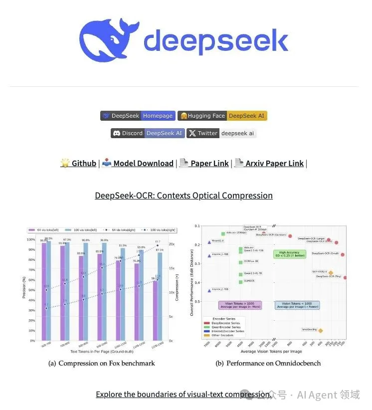

北京时间 2025 年 10 月 20 日，知名人工智能公司 DeepSeek（深度求索）在开源社区 GitHub 和 Hugging Face 上正式发布了其全新的 OCR 模型——DeepSeek-OCR，并同时公开了名为《DeepSeek-OCR：Contexts Optical Compression》（上下文光学压缩）的论文。

这款模型不仅是一个高性能的文字识别工具，更提出了一种创新的方法来解决当前大型语言模型（LLMs）在处理超长文档时面临的效率和成本挑战。

创新的“上下文光学压缩”范式

DeepSeek-OCR 的核心创新在于其提出的“上下文光学压缩”（Contexts Optical Compression）方法。传统的长文本处理，需要将海量文字转化为大量的文本 Token 输入给 LLM，导致计算量和内存需求呈指数级增长。

DeepSeek-OCR 借鉴了人类阅读文档时视觉系统快速捕捉和压缩布局信息的机制，尝试将长文本内容先“渲染”成一张图片，然后利用高效的视觉模型对图片进行压缩和理解，最终只将数量少得多的“视觉 Token”交给语言模型进行“解压”和处理。

这种方法旨在大幅减少输入给 LLM 的 Token 总量，从而显著降低长上下文处理的计算成本，并提升处理效率。

模型架构与性能亮点

DeepSeek-OCR 模型拥有 30 亿参数，它主要由两部分组成：

1. 核心编码器 DeepEncoder： 专为在高分辨率输入下保持低计算激活而设计，目的是实现高压缩比，并将视觉 Token 的数量控制在一个可管理的范围。

2. 解码器 DeepSeek3B-MoE-A570M： 负责对压缩后的视觉特征进行“解压”，恢复出原始文本。

实验结果显示了其在压缩效率和准确性方面的巨大潜力：

• 高精度压缩： 当文本 Token 数量在视觉 Token 数量的 10 倍以内时（即压缩比 < 10\times），DeepSeek-OCR 的 OCR 解码精度可达 97%。

• 卓越的长上下文潜力： 即使压缩比提高到 20 倍，OCR 准确率仍能保持在 60% 左右的水平，这为长上下文压缩、大语言模型中的记忆遗忘机制等前沿研究领域展现了巨大的探索价值。

• 高效实用性： 在实际应用中，DeepSeek-OCR 在 OmniDocBench 等测试中表现出色，并且在生产环境中，单块 A100-40G 显卡每天可生成超过 20 万页的大语言模型/视觉语言模型训练数据，极大地提升了数据预处理的效率。

开源与未来影响

DeepSeek-OCR 的开源（代码已在 GitHub 和 Hugging Face 开放获取），延续了 DeepSeek 团队一贯的开源精神，为整个 AI 社区提供了新的研究工具和思路。

该模型不仅在传统的文档识别领域具备较高的应用价值，其提出的视觉模态作为信息压缩和解压媒介的范式，更可能影响未来的多模态研究方向，例如：

• 探索将多轮对话的历史记录动态渲染成图像，以更低的成本管理更长的对话历史。

• 将海量知识库压缩成一系列紧凑的视觉索引，以提升模型的知识检索效率。

DeepSeek-OCR 的发布，标志着 DeepSeek 在视觉-语言跨模态领域迈出了重要一步，并为大模型在长文本处理中的效率难题提供了富有想象力的解决方案。

# 参考

[1] 告别高成本长文本！DeepSeek-OCR 用高压缩比实现 97% OCR 精度！https://mp.weixin.qq.com/s?__biz=MzIwMDE2MzkwMg==&mid=2653357665&idx=1&sn=9c540d65bd3fc1fccee4f48bc9f44ff4&chksm=8d52f130ba2578269d6f67d4cb1edbd7996179c203c9b26189ee88c78271a8e3eb297a108424&cur_album_id=3879228571033862151&scene=189#wechat_redirect