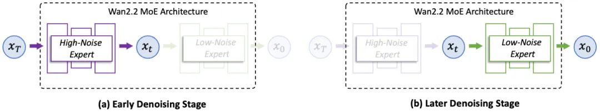
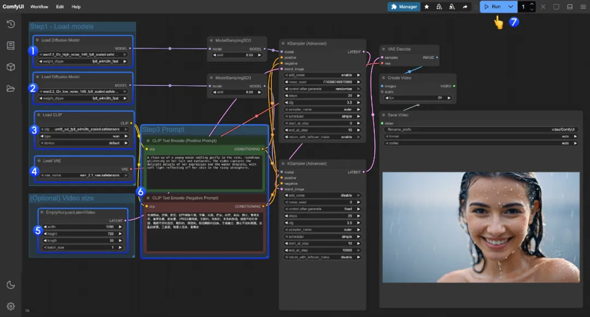
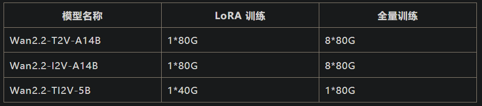

# 1. 资源

开源地址：

- Github：https://github.com/Wan-Video/Wan2.2
- 魔搭社区：https://modelscope.cn/organization/Wan-AI
- 工作流：ComfyUI文档：https://docs.comfy.org/zh-CN/tutorials/video/wan/wan2_2
- 微调：https://github.com/modelscope/DiffSynth-Studio.git

# 2. 简介

最新的Wan2.2模型是业界首个使用MoE架构的视频生成基础模型，两个专家模型分别关注生成视频的整体布局和画面细节的完善，在同参数规模下，可节省约50%的计算资源消耗。Wan2.2模型首创「电影级美学控制系统」，将‘光影密码’、‘构图法则’、‘色彩心理学’编码成了这60多个直观的参数，将光影、色彩、镜头语言装进生成模型，实现电影级质感视频生成。

此次共开源三个版本的模型：

文生视频：Wan2.2-T2V-A14B

图生视频：Wan2.2-I2V-A14B

统一视频生成：Wan2.2-TI2V-5B

其中，Wan2.2-T2V-A14B、Wan2.2-I2V-A14B是业界首个使用MoE架构的视频生成基础模型，可一键生成电影级质感视频；Wan2.2-TI2V-5B版本为统一视频生成模型，单一模型同时支持文生视频和图生视频，可在消费级显卡部署。

# 3. 技术亮点

## 3.1 首个MoE架构的视频生成模型

扩散模型的去噪过程存在阶段性差异，高噪声阶段关注生成视频的整体布局，低噪声阶段则更关注细节的完善，通义万相团队根据去噪时间步进行了专家模型划分，如下图所示，Wan2.2的A14B版本由高噪专家模型和低噪专家模型组成，生成视频时，噪声首先经过高噪专家模型进行前期去噪构建主体结构，再经过低噪专家模型进行后期去噪生成细节，高噪和低噪专家模型各司其职、各自独立激活。在同参数规模下，可节省约50%的计算资源消耗。另外，在复杂运动生成、人物交互、美学表达、复杂运动等维度上取得了显著提升。



## 3.2 数据扩容与美学精调

全新的Wan2.2模型实现了训练数据的显著扩充与升级。较上一代万相2.1模型，图像数据增加65.6%，视频数据增加83.2%。数据扩容提升了模型的泛化能力与创作多样性，文生视频和图生视频效果都一致得到提升，模型在复杂场景、美学表达和运动生成方面表现更加出色，画面生成更稳定，镜头表达更准确。

在模型精调阶段，Wan2.2创新性提出了「电影级美学控制系统」，直接将光影、色彩、镜头语言三大电影美学元素装进模型。通义万相团队编码了60多个直观可控的参数，通过细粒度地训练，使得视频生成的美学属性能够与用户给定的prompt提示词相对应。训练过程中融合了电影工业标准的光影塑造、镜头构图法则和色彩心理学体系，将专业电影导演的美学属性进行了分类，并细致整理成美学提示词。因此，Wan2.2模型能够根据用户的美学提示词准确理解并响应用户的美学需求。

例如用户输入「黄昏」、「柔光」、「边缘光」、「暖色调」「中心构图」等关键词，模型可自动生成金色的落日余晖的浪漫画面；使用「冷色调」、「硬光」、「对称构图」、「低角度」的组合，则可以生成接近科幻片的画面效果。

提示词：视频展示了一位三十多岁的黑人女性在黄昏色调的复古滤镜下，平静地坐在行驶中的地铁车厢内。周围人群来回走动，形成明显的运动模糊，而她始终保持清晰，象征着混乱中的静止。柔和的光线与电影画质营造出喜怒无常的环境氛围，突显她在喧嚣世界中的沉稳与内敛，呈现出强烈的现实主义风格。通义万相即可精准理解提示词中的美学词，并生成一段复古且富有文艺感的视频。

输入提示词：白天，晴天光，边缘光，暖色调，低饱和度，极端全景，平衡构图，画面中有两名穿着宇航服的人，他们正站在一片广阔的水域中。他们都穿着白色为主、带有深色拼接和标记的厚重宇航服，并头戴配有面罩的头盔。位于前方的人正朝着观看者的方向涉水前行，水面淹及他的大腿，他的面部表情严肃。另一人站在他身后稍远的位置，同样身处水中。在他们身后，一艘外形具有未来感的飞行器停泊在水面上。这艘飞行器有着扁平、宽大的机翼和棱角分明的设计。整个场景的背景是布满云彩的天空和无边无际的水面。通义万相可生成一段复刻电影《星际穿越》中宇航员在米勒星球的经典画面。


## 3.3 高压缩比视频生成

通义万相还开源了一款5B小尺寸的统一视频生成模型，单一模型同时支持文生视频和图生视频，可在消费级显卡部署。该模型采用了高压缩率3D VAE架构，时间与空间压缩比达到高达 4×16×16，信息压缩率提升至 64，均实现了开源模型的最高水平，仅需22G显存（单张消费级显卡）即可在数分钟内生成5秒高清视频。

Wan2.2同步公开了全新的高压缩比VAE结构，通过引入残差采样结构和非对称编解码框架。如上表所示，全新的Wan2.2-VAE在更高的信息压缩率下依然保持了领先的重建质量。

# 4. 模型推理

GitHub官方代码
以Wan2.2-TI2V-5B模型为例：

```text
# 1、安装代码
git clone https://github.com/Wan-Video/Wan2.2.git
cd Wan2.2

# 2、安装依赖
# Ensure torch >= 2.4.0
pip install -r requirements.txt

# 3、下载模型
pip install modelscope
modelscope download Wan-AI/Wan2.2-TI2V-5B --local_dir ./Wan2.2-T2V-A14B

# 4、运行脚本
python generate.py --task ti2v-5B --size 1280*704 --ckpt_dir ./Wan2.2-TI2V-5B --offload_model True --convert_model_dtype --t5_cpu --image examples/i2v_input.JPG --prompt "Summer beach vacation style, a white cat wearing sunglasses sits on a surfboard. The fluffy-furred feline gazes directly at the camera with a relaxed expression. Blurred beach scenery forms the background featuring crystal-clear waters, distant green hills, and a blue sky dotted with white clouds. The cat assumes a naturally relaxed posture, as if savoring the sea breeze and warm sunlight. A close-up shot highlights the feline's intricate details and the refreshing atmosphere of the seaside."
```

显存占用：

图生视频I2V-A14B和文生视频T2V-A14B模型需要80G显存。统一视频生成TI2V-5B只需要22G显存，可在魔搭notebook的免费资源推理。

ComfyUI中的使用

在ComfyUI使用Wan2.2模型的步骤：

下载或更新 ComfyUI 到最新版本（下载：https://www.comfy.org/)

在菜单 工作流 -> 浏览模板 -> 视频 找到 Wan2.2 相关模板

ComfyUI的示例工作流：



更详细的信息请戳官方文档👇

ComfyUI文档：

https://docs.comfy.org/zh-CN/tutorials/video/wan/wan2_2

# 5. 微调

DiffSynth-Studio 已支持 Wan2.2 系列模型的 LoRA 训练与全量训练



# 参考

[1] 通义万相2.2开源！可一键生成电影感视频, https://mp.weixin.qq.com/s/rzgO-x_dovyxMM_-69BLdQ