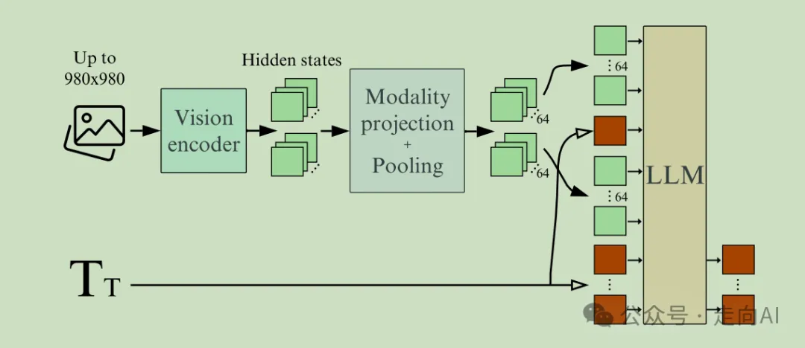
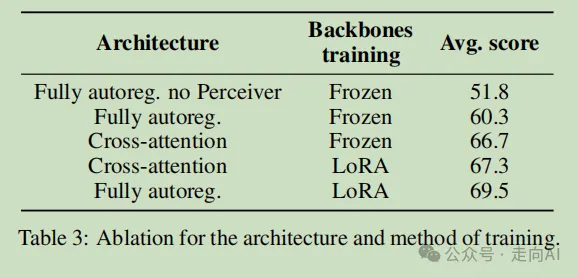
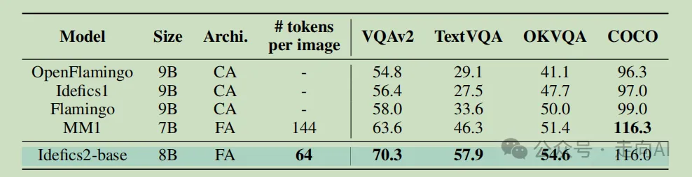
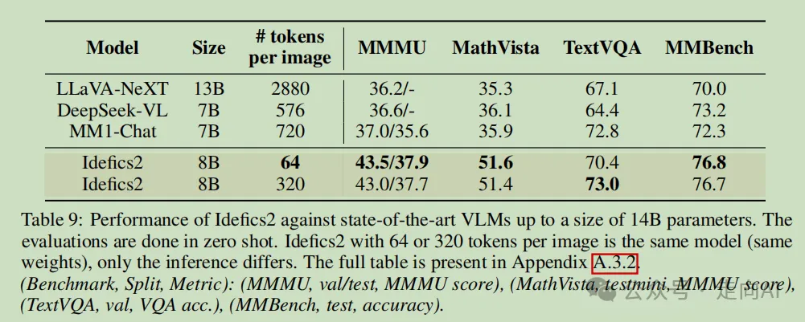

# 1. 资源

- 文名称：What matters when building vision-language models?
- 论文地址：https://arxiv.org/abs/2405.02246
- 论文代码：https://huggingface.co/collections/HuggingFaceM4/idefics2-661d1971b7c50831dd3ce0fe

# 2. 简介

Huggingface的大善人们通过多组实验（闻到了金钱在燃烧的味道），明确了核心设计选择的影响，并提出了以下问题：在构建视觉-语言模型时，哪些因素是重要的？：

总结起来就是几大发现：
1. 参数量固定的前提下，LLM的质量对最终VLM性能的影响大于视觉encoder
2. 预训练时解冻单模态预训练模型，结合LoRA技术来稳定训练，全自回归架构的表现优于交叉注意力架构，即使后者拥有更多参数量
3. 通过学习到的池化减少视觉标记的数量，在训练和推理时显著提高了计算效率，同时提升了下游任务的性能。
4. 将在固定大小正方形图像上预训练的视觉编码器调整以保留图像的原始纵横比和分辨率，这样做不会降低性能，同时加快了训练和推理的速度，并减少了内存使用。
5. 在训练期间将图像分割为子图像可以在推理期间用计算效率换取更多的性能。性能的提升在涉及图像中读取文本的任务中尤为明显。

# 3. 原理

上图显示了我们最终为Idefics2使用的全自回归架构

训练视觉-语言模型（VLM）通常需要将预训练的visual backbone和预训练的大语言模型（LLM）通过初始化新的参数来连接这两种模态，在预训练阶段利用大型多模态数据集，如image-caption对，冻住visual backbone和LLM，对这些新参数进行训练。之后是指令微调阶段，在这个阶段，模型从面向任务的样本中学习。这意味着模型将在特定的任务类型上进行训练，以便更好地理解和执行与该任务相关的指令或请求。

## 3.1 视觉和文本bacbkone的选择

我们固定了预训练backbone的大小、用于多模态预训练的数据以及训练更新的次数。在交叉注意力架构下，我们观察到在视觉-语言基准测试上性能的最大提升来自于更换更好的语言模型。更具体地说，将LLaMA-1-7B（在MMLU上的35.1%）替换为Mistral-7B（在MMLU上的60.1%）可以提高5.1。此外，将视觉编码器从CLIP-ViT-H（在ImageNet上的78.0%）切换到SigLIP-SO400M（在ImageNet上的83.2%）在基准测试上的性能提高了3.3，这一结果也与其他论文中的观察结果一致。

我们注意到，Pali（2022年）报告称，扩大视觉编码器的规模比扩大语言模型的规模带来了更强的性能提升，尽管扩大视觉编码器导致的参数数量增加较小。尽管EVA-CLIP-5B的参数计数是SigLIP-SO400M的十倍，我们在4个基准测试中获得了相似的性能，这表明EVA-CLIP-5B可能训练不足，我们承认开放的VLM社区缺少一个大型且训练良好的视觉编码器。（插一句，InterVL也认为VLM里视觉编码器的规模相比LLM过小，需要需要扩大视觉编码器规模来让两种模态从规模上相当，所以InternVL1.5使用了InternViT-6B视觉编码器，不知道InternViT-6B能否认为是一个大型且训练良好的视觉编码器）

## 3.2 fully autoregressive vs. cross attention

近期的研究探索了两种主要的方式来结合视觉输入和文本输入：

1. 交叉注意力架构：通过visual backbone编码的图像通过交错的交叉注意力块注入到语言模型的不同层中，在这些块中文本交叉关注图像的隐藏状态
2. 全自回归架构：视觉编码器的输出直接与文本嵌入序列连接，并且整个序列作为输入传递给语言模型。因此，语言模型的输入序列是视觉token和文本token的串联
    之前论文研究表明，交叉注意力块与语言模型层交错得越频繁，视觉-语言性能就越高。在这种设置下，交叉注意力架构比全自回归架构多出1.3B个可训练参数（总共有20亿个可训练参数）。此外在推理时前者比后者多使用了10%的浮点运算次数。在这些条件下，我们观察到交叉注意力架构在表3中的表现比全自回归架构好7个百分点。

在总参数数量中，全自回归架构大约有15%，而交叉注意力架构有25%是经过训练的。我们推测这个低比例限制了训练的表达能力，阻碍了性能提升。为了验证这一假设，我们通过解冻所有参数（新初始化的参数和预训练单模态backbone的参数）来比较这两种架构。在这些条件下，训练全自回归架构会导致损失发散，即使我们大幅降低学习率或逐步解冻各个组件，我们也无法成功地稳定训练。为了克服这一稳定性挑战，我们利用低秩适应（Low-Rank Adaptation，LoRA）来适应预训练参数，同时对新初始化的参数使用标准的全微调。这种设置产生了明显更稳定的训练，更重要的是，我们观察到全自回归架构下有9.2个百分点的增长，而交叉注意力架构下只有0.6个百分点的增长。因此，我们在本工作的其余部分选择全自回归架构。    
    
有趣的是，这一发现与之前其他人的实验结论相矛盾，我们推测使用参数高效的微调方法是关键区别。

## 3.3 视觉token的数量

与华科白翔团队提出OCR-Free多模态大模型TextMonkey的Resampler类似，通过使用感知器重采样器作为可训练的基于Transformer的池化形式，来减少每张图片隐藏状态的序列长度。我们观察到学习到的池化在两个方面是有效的：它平均提高了8.5个百分点的性能，并减少了每张图片所需的视觉标记数量，从729个减少到64。

与之前论文发现视觉标记越多越好相反，我们观察到使用超过64个视觉标记时没有性能提升。我们推测，在假设的无限训练和无限数据的情况下，性能最终可能会提高，但这需要更长的训练时间。

## 3.4 保留原始宽高比和图像分辨率

follow了Pix2Struct以及NaViT的做法，验证了保留原始宽高比和分辨率性能更佳，也符合直觉和近期的设计主流

## 3.5 splitting an image into sub-images

这个做法也已经在之前多篇论文解读里介绍过了，略过

# 4. Experimetns

掌握这些经验后，我们训练了一个开放的8B参数视觉-语言模型：Idefics2。

我们从SigLIP-SO400M和Mistral-7B-v0.1开始，并在3种类型的数据上预训练Idefics2模型：

交错图像-文本文档：我们使用了OBELICS，这是一个开放的网络规模数据集，包含交错的图像-文本文档，有3.5亿张图像和1150亿个文本标记。通过使用OBELICS数据集，Idefics2模型能够在保持语言模型性能的同时，学习处理交错的图像和文本，这对于处理长文本上下文和提高VQA任务性能尤其重要。

图像-文本对训练：在图像-文本对上训练使模型能够学习图像与相关文本之间的对齐。我们使用了来自PMD的高质量人工标注图像-文本对，以及更高噪声的网络规模图像-文本对的组合LAION。通过结合高质量和高噪声的数据，Idefics2模型可以在学习准确的图像-文本对齐的同时，也能够泛化到更广泛的图像和文本类型。使用LAION COCO数据集的合成标题可以在不牺牲模型性能的情况下增加训练样本的多样性。

PDF文档：最先进的视觉-语言模型（VLMs）的大部分错误源于它们无法准确提取图像或文档中的文本。为了获得强大的OCR（光学字符识别）和文档理解能力，我们在不同来源的PDF文档上训练Idefics2：
- 来自OCR-IDL的1900万个行业文档；
- 来自PDFA的1800万页文档；
- 添加了Rendered Text来，其中包括用各种字体、颜色和背景编写的文本

我们注意到，这比其他开放的VLMs使用的训练数据多几个数量级。例如，ShareGPT使用了120万张图像，而Monkey使用了140万张图像进行训练。

为了最大化计算效率，我们将预训练分解为两个阶段。在第一阶段，我们将最大图像分辨率限制为384像素，这允许我们使用大型全局批量大小2048（平均17000张图像和250万个文本标记）。我们对OBELICS的70%样本进行采样，最大序列长度为2048；对图像-文本对数据集的30%样本进行采样，最大序列长度为1536。在第二阶段，我们引入了PDF文档。由于它们需要更高的图像分辨率才能使文本清晰可读，我们将分辨率提高到最大980像素。我们不是选择性地冻结/解冻模型的部分，而是在两个阶段都训练整个模型（一些参数使用LoRA训练），并从一个阶段到另一个阶段增加图像分辨率。

下表展示了评估结果。尽管每张图像的标记数更少，也更高效，但与当前其他最佳基础VLM相比，Idefics2的性能更优，特别是在图像中阅读文本方面表现得更好。

 然后通过指令微调阶段继续训练。为此，我们创建并发布了The Cauldron（https://huggingface.co/datasets/HuggingFaceM4/the_cauldron），这是一个包含50个视觉-语言数据集的庞大集合，涵盖了广泛的任务：一般视觉问答、计数、字幕生成、文本转录、文档理解、图表/图形理解、表格理解、视觉推理、几何学、发现两张图像之间的差异或将截图转换为功能性代码。每个数据集都被提示成一个共享的问答格式。当每张图像有多个问答对时，我们将这些对连接成多轮对话。我们在训练集和评估集之间进行去重，确保从训练到评估的污染最小化。
 
除了这些视觉-语言数据集，我们还将仅限文本的指令数据集添加进来。这些数据集旨在教会模型遵循复杂指令、解决数学问题或进行算术计算。

此外，通过在训练中引入随机性和噪声，模型能够更好地泛化，减少对特定训练数据的过度拟合。这些策略有助于提高模型在看不见的数据上的表现，使其成为一个更为健壮和通用的视觉-语言模型。

# 5. 结论

通过表9可以看到，尽管在推理时计算效率要高得多，Idefics2在各种基准测试上展现出强大的性能，超越了当前最佳的基础VLMs。它在某些基准测试上与规模是其四倍的最新模型相当，或与像Gemini 1.5 Pro这样的封闭源模型在MathVista或TextVQA等多个基准测试上表现一致。

这一结果表明，Idefics2模型在保持计算效率的同时，实现了与其尺寸更大的模型相媲美的性能。这种效率和性能的结合使得Idefics2成为一个在多种视觉-语言任务上具有竞争力的模型，尤其是在资源有限或对计算成本有限制的应用场景中。此外，Idefics2的开放源代码特性也使其在研究社区中具有吸引力，因为它允许更广泛的用户群体进行实验和进一步的开发。

# 参考

[1] 经费燃烧后的洞见：Huggingface揭示构建高效VLM的核心要素, https://mp.weixin.qq.com/s/T_cpF-H0f8uktbe70oQX5w
