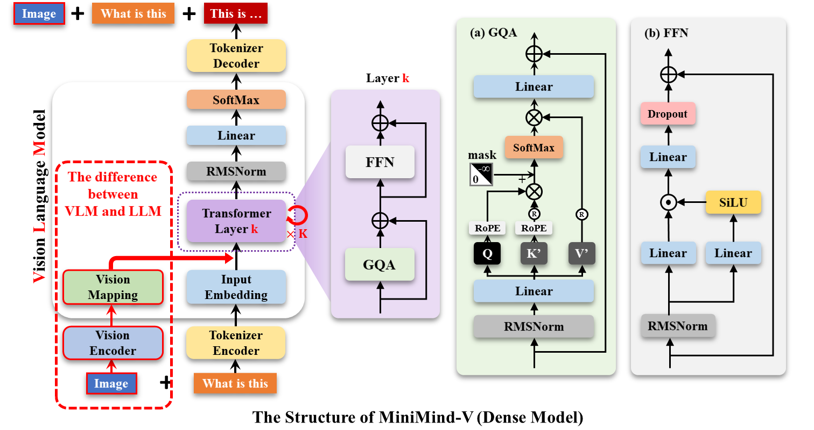
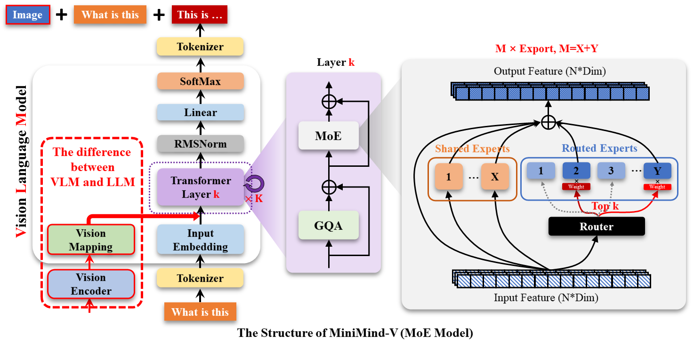
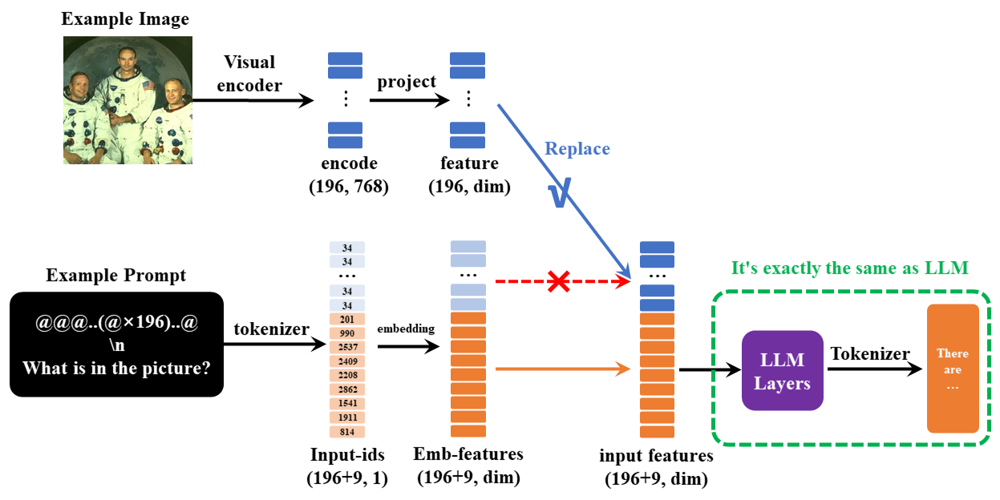

# 1. 资源

- Github(17.1k stars) LLM: https://github.com/jingyaogong/minimind
- Github(1.8k stars) VLM: https://github.com/jingyaogong/minimind-v
- 数据集下载地址：([ModelScope](https://www.modelscope.cn/datasets/gongjy/minimind-v_dataset) | [HuggingFace](https://huggingface.co/datasets/jingyaogong/minimind-v_dataset))
- 模型权重
  - (原生PyTorch`*.pth`权重文件) 下载地址：([ModelScope](https://www.modelscope.cn/models/gongjy/MiniMind2-V-PyTorch) | [HuggingFace](https://huggingface.co/jingyaogong/MiniMind2-V-PyTorch))
  - (`Transformers`格式模型)下载地址：([ModelScope](https://www.modelscope.cn/profile/gongjy) | [HuggingFace](https://huggingface.co/collections/jingyaogong/minimind-v-67000833fb60b3a2e1f3597d))
  
# 2. 特点

- 此项目旨在从0开始，仅用1.3块钱成本 + 1小时！即可训练出26M参数的超小多模态视觉语言模型MiniMind-V。
- MiniMind-V最小版本体积仅为 GPT3 的约1/7000，力求做到个人GPU也可快速推理甚至训练。
- MiniMind-V是MiniMind纯语言模型的视觉能力额外拓展。
- 项目同时包含了VLM大模型的极简结构、数据集清洗、预训练(Pretrain)、监督微调(SFT)等全过程代码。
- 这不仅是一个开源VLM模型的最小实现，也是入门视觉语言模型的简明教程。

# 3. 架构

MiniMind-V (VLM)的基座语言模型MiniMind (LLM)来自孪生项目minimind， 具体的模型结构、训练细节、原理、测试效果等均可移步minimind项目查阅。 此处为减少冗余，省略讨论LLM的相关部分，默认您已对MiniMind (LLM)的细节有基本的了解。

MiniMind-V的结构仅增加Visual Encoder和特征投影两个子模块，增加模态混合分支，以支持多种模态信息的输入：





为了得到MiniMind-V，我们只需要完成这2件事即可：

借助擅长翻译图片的 "外语词典" ，把图片从 "外国语言" 翻译为模型便于理解的 "LLM语言"

训练微调LLM，使其和 "外语词典" 度过磨合期，从而更好的理解图片

"外语词典" 称之为Visual Encoder模型。 和LlaVA、Qwen-VL等视觉语言模型类似，MiniMind-V同样选用开源Clip系列模型作为Visual Encoder。 具体使用clip-vit-base-patch16， 一种基于 ViT-B/16 架构的经典Visual Encoder用于描述图像文本信息。 输入的图像尺寸为224x224，因为划分的Patch是16×16，所以会产生16*16=196个token作为encoder编码层的输入， 最终产生1×768维的嵌入向量用于和文本对计算误差。 我们并不需要最终嵌入表示，因此只取encoder层的输出，也就是VIT核心主干的输出特征即可。 它拿到前一层维度196×768大小的特征，我们把它作为196个visual token输入MiniMind-V。 与LLM的结合在获取图像encoder特征后，一方面需要把768维度的visual token对齐到LLM的文本token， 另一方面，要将图像特征映射到与文本embedding相同的空间，即文本token和原生的视觉token需要磨合并不能直接地一视同仁， 可以称之为跨模态的特征对齐。 LlaVA-1使用简单的无偏线性变换完成了这一操作，效果很不错，MiniMind-V同样如此。


---

下面，我们简单讨论MiniMind-V的外部输入输出的变化。

VLM的输入依然是一段文本，其中包含特殊的<image>占位符。
在计算文本嵌入后，可以将图像编码器生成的向量投影到该占位符对应的嵌入部分，替换掉原先的占位符embedding。
例如：

```text
<image>\n这个图像中有什么内容？
```

在`minimind-v`中，使用196个字符组成的 `@@@...@@@`
占位符代替图像，之所以是196个字符，前面有所提及：
任何图像都被clip模型encoder为196×768维的token，
因此`minimind-v`的prompt为：

```text
@@@......@@@\n这个图片描述的是什么内容？
```

计算完embedding和projection，并对图像部分token替换后整个计算过程到输出则和LLM部分没有任何区别。



一次性多图的实现方法就是通过注入多个<image>图像占位符进行实现，不需要修改任何框架。

一次性多图的实现方法就是通过注入多个`<image>`图像占位符进行实现，不需要修改任何框架。

<details>
<summary> 视频理解的拓展思路 </summary>

write by [@xinyanghuang7](https://github.com/xinyanghuang7)

对于多模态大模型的视频理解能力，一个可行的思路是参考现有MiniCPM-V 2.6 进行视频理解的Python示例。
主要思想是通过提取视频关键帧，而后进行多图推理。
因此，如果希望在MiniMind-V中添加视频理解能力，可以在现有多图训练的基础上，参考此python脚本中对于关键帧的提取方法，而后加大训练文件中支持图片的数量。
所支持的MAX_NUM_FRAMES越多，所消耗的显存越大。

```text
import torch
from PIL import Image
from transformers import AutoModel, AutoTokenizer
from decord import VideoReader, cpu  # pip install decord

model = AutoModel.from_pretrained('openbmb/MiniCPM-V-2_6', trust_remote_code=True,
                                  attn_implementation='sdpa',
                                  torch_dtype=torch.bfloat16)  # sdpa or flash_attention_2, no eager
model = model.eval().cuda()
tokenizer = AutoTokenizer.from_pretrained('openbmb/MiniCPM-V-2_6', trust_remote_code=True)

MAX_NUM_FRAMES = 64  # if cuda OOM set a smaller number


def encode_video(video_path):
    def uniform_sample(l, n):
        gap = len(l) / n
        idxs = [int(i * gap + gap / 2) for i in range(n)]
        return [l[i] for i in idxs]

    vr = VideoReader(video_path, ctx=cpu(0))
    sample_fps = round(vr.get_avg_fps() / 1)  # FPS
    frame_idx = [i for i in range(0, len(vr), sample_fps)]
    if len(frame_idx) > MAX_NUM_FRAMES:
        frame_idx = uniform_sample(frame_idx, MAX_NUM_FRAMES)
    frames = vr.get_batch(frame_idx).asnumpy()
    frames = [Image.fromarray(v.astype('uint8')) for v in frames]
    print('num frames:', len(frames))
    return frames


video_path = "video_test.mp4"
frames = encode_video(video_path)
question = "Describe the video"
msgs = [
    {'role': 'user', 'content': frames + [question]},
]

# Set decode params for video
params = {}
params["use_image_id"] = False
params["max_slice_nums"] = 2  # 如果cuda OOM且视频分辨率大于448*448可设为1

answer = model.chat(
    image=None,
    msgs=msgs,
    tokenizer=tokenizer,
    **params
)
print(answer)
```

</details>

至此，`MiniMind-V`的所有细节已经呈现完毕。
`MiniMind-V`的模型子类完全继承自`MiniMind`，
仅基于后者做**最小**变更而产生，
其核心算法改动`< 50行`，迁移难度极低。
因此可能和`LlAVA`等模型细节可能存在区别，但思路完全统一。

# 4. 实验

## 4.1 数据集

来源：[Chinese-LLaVA-Vision](https://huggingface.co/datasets/LinkSoul/Chinese-LLaVA-Vision-Instructions)
包含约57万张预训练图像，来自CC-3M和COCO 2014；
[llava-en-zh-300k](https://huggingface.co/datasets/BUAADreamer/llava-en-zh-300k)
包含300k条指令微调数据和15万张图像。
问答内容经过翻译，
对中文支持更友好，进一步经过整理并`resize`。

(pretrain_vlm_data.jsonl) 预训练数据集格式：

```json lines
{
  "conversations": [
    {
      "role": "user",
      "content": "提供给定图像的简要描述。\n<image>"
    },
    {
      "role": "assistant",
      "content": "橄榄油是自由使用的健康成分。"
    }
  ],
  "image": "GCC_train_002582585.jpg"
}
```

(sft_vlm_data.jsonl) 单图指令微调数据集格式：

```json lines
{
  "conversations": [
    {
      "role": "user",
      "content": "闹钟的位置对睡眠质量有什么影响？<image>"
    },
    {
      "role": "assistant",
      "content": "把数字闹钟放在床头柜..."
    }
  ],
  "image": "train-00000-of-00001_image_0_0.jpg"
}
```

(sft_vlm_data_multi.jsonl) 多图指令微调数据集格式：

```json lines
{
  "conversations": [
    {
      "role": "user",
      "content": "context: Source Image: <image> Target Image: <image> Instruction: What is the correct image edit instruction that can transfrom the source image to target image?<image>"
    },
    {
      "role": "assistant",
      "content": "take the people out of the back in the photo. Remove the two people behind the woman in the white dress and the man in the blue suit. remove people behind the couple in the centre"
    }
  ],
  "image": "0.jpg, 1.jpg"
}
```

<details>
<summary> 数据说明 </summary>

* 多图数据集规模相对较小且为英文对话，数据集仅包含两图对比的场景，因此微调效果有限，这里只提供一种参考思路。


* `jsonl`均为文本指令，`images.zip`均为配套的图像数据（下载后需要解压）

</details>

数据集下载地址：([ModelScope](https://www.modelscope.cn/datasets/gongjy/minimind-v_dataset) | [HuggingFace](https://huggingface.co/datasets/jingyaogong/minimind-v_dataset))


## 4.2 训练

## Ⅱ 训练

> train_pretrain_vlm

预训练从595K条数据集中学习图片的通用知识，比如鹿是鹿，狗是狗。

> train_sft_vlm

指令微调从300K条真实对话数据集中学习对图片提问的真实问答格式，更符合与人类的交流习惯。

> train_sft_vlm

多图微调提供demo：鸟类对比数据集，长度为13.6k的真实问答格式。

- 训练时均冻结visual encoder也就是clip模型梯度，
- 只训练Projection和LLM两部分。
- 预训练中，只设置Projection和LLM的最后一层参数可学习。
- 指令微调中，设置Projection和LLM的全部参数可学习。