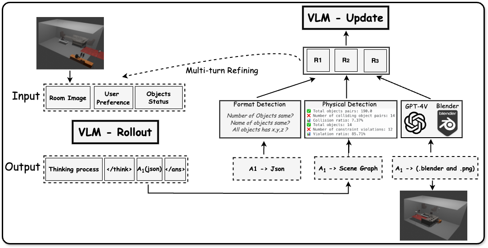

# 1. MetaSpatial 

- Github (155 stars): https://github.com/PzySeere/MetaSpatial?tab=readme-ov-file
- MetaSpatial 利用强化学习来增强视觉语言模型 （VLM） 中的 3D 空间推理，从而为元宇宙、AR/VR 和游戏开发中的应用程序提供更结构化、更真实和自适应的场景生成。
- 论文：https://arxiv.org/abs/2503.18470

MetaSpatial 使用 RL 增强了 VLM 中的空间推理，将 3D 空间推理内部化，无需硬编码优化即可实现实时 3D 场景生成。通过整合物理感知约束和渲染图像评估，我们的框架优化了布局一致性、物理一致性和美观性。我们为元宇宙、AR/VR、数字孪生和游戏开发中的应用提供自适应、高效的解决方案。

我们的目标是在元宇宙中实现 3D 空间推理，在元宇宙中不存在完美的地面实况，使传统的 SFT 无效，而 RL 通过学习物理感知约束和自适应奖励自然地适合任务。