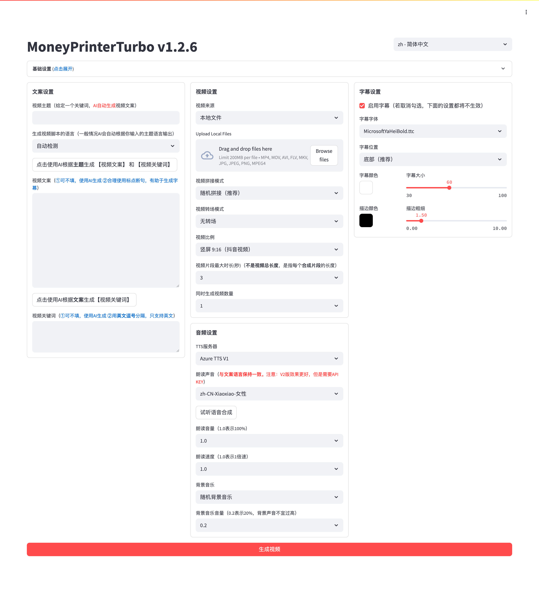

- Github (48.5k stars): https://github.com/harry0703/MoneyPrinterTurbo

利用AI大模型，一键生成高清短视频 Generate short videos with one click using AI LLM.

只需提供一个视频 主题 或 关键词 ，就可以全自动生成视频文案、视频素材、视频字幕、视频背景音乐，然后合成一个高清的短视频。

功能特性 🎯
 完整的 MVC架构，代码 结构清晰，易于维护，支持 API 和 Web界面
 支持视频文案 AI自动生成，也可以自定义文案
 支持多种 高清视频 尺寸
 竖屏 9:16，1080x1920
 横屏 16:9，1920x1080
 支持 批量视频生成，可以一次生成多个视频，然后选择一个最满意的
 支持 视频片段时长 设置，方便调节素材切换频率
 支持 中文 和 英文 视频文案
 支持 多种语音 合成，可 实时试听 效果
 支持 字幕生成，可以调整 字体、位置、颜色、大小，同时支持字幕描边设置
 支持 背景音乐，随机或者指定音乐文件，可设置背景音乐音量
 视频素材来源 高清，而且 无版权，也可以使用自己的 本地素材
 支持 OpenAI、Moonshot、Azure、gpt4free、one-api、通义千问、Google Gemini、Ollama、DeepSeek、 文心一言, Pollinations、ModelScope 等多种模型接入
中国用户建议使用 DeepSeek 或 Moonshot 作为大模型提供商（国内可直接访问，不需要VPN。注册就送额度，基本够用）
后期计划 📅
 GPT-SoVITS 配音支持
 优化语音合成，利用大模型，使其合成的声音，更加自然，情绪更加丰富
 增加视频转场效果，使其看起来更加的流畅
 增加更多视频素材来源，优化视频素材和文案的匹配度
 增加视频长度选项：短、中、长
 支持更多的语音合成服务商，比如 OpenAI TTS
 自动上传到YouTube平台