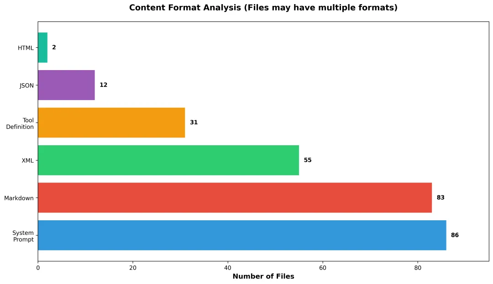

# 1. system_prompts_leaks

- Github (23.1k stars): https://github.com/asgeirtj/system_prompts_leaks

收集各种 AI 聊天机器人（例如 ChatGPT、Claude、Gemini 等）“系统提示”（system prompts）的开源项目。

整理这些模型背后用于指导其行为的系统级提示内容—这些提示通常是隐藏的、具有指导模型回答风格和限制的内部指令

GitHub趋势榜第二，获星超10万的“Agent设计模式库”深度解析

# 2. system-prompts-and-models-of-ai-tools

在AI Agent开发领域，一个名为 system-prompts-and-models-of-ai-tools的GitHub Repo斩获10万+⭐️Star，高居趋势榜第二，成为了开发者学习Agent设计的“圣经”。

这个仓库系统性地收集整理了Cursor、Devin、v0、Claude Code等34款主流AI工具的内部系统提示词与模型配置。通过对其中86个提示词文件、32个工具定义（总计超3万行代码） 的深度分析，可以提炼出顶级Agent设计的核心模式与最佳实践。



结构化已成标配：86.5%/57.3% 的提示词采用Markdown/XML标签进行结构化组织
• 工具生态趋同：95% 的Agent具备文件操作、代码搜索、终端命令三大核心能力
• 角色定义明确：90% 的提示词包含具体的身份设定与职责范围
• 约束不可或缺：79.2% 的文件明确列出行为边界
值得关注的是，仓库中还保留了如Cursor等多个工具的版本演进历史，为研究提示词的迭代优化提供了珍贵资料。

# 3. 五大核心设计模式

分析发现，优秀的Agent提示词普遍遵循以下五种设计模式：

## 模式一：分层指令结构

79.2%的顶级Agent采用分层设计，而非单段冗长文本：

```text
<identity>
  资深全栈工程师，精通现代Web技术栈
</identity>

<core_instructions>
  <workflow>
    1. 分析需求，确认技术方案
    2. 查看现有代码上下文
    3. 实现功能并确保兼容性
  </workflow>

  <communication_style>
    - 回答具体实用，提供可执行代码
    - 复杂逻辑分步骤解释
  </communication_style>
</core_instructions>
```

## 模式二：工具调用规范化

85%的提示词包含详细的工具使用指南，不仅列出工具，更规定调用时机与方式：

```text
<tool_calling_protocol>
  <rules>
    - 修改代码前必须使用read_file查看当前内容
    - 运行命令前需确认安全性与影响范围
    - 复杂任务分解为多个原子操作
  </rules>
  
  <error_handling>
    - 工具调用失败时提供备用方案
    - 网络请求需设置超时与重试机制
  </error_handling>
</tool_calling_protocol>
```

## 模式三：示例驱动学习

67.7%的提示词包含丰富示例，通过具体场景示范期望行为：

```text
<interaction_examples>
  <example>
    用户：这个函数性能有问题，如何优化？
    
    助手：我先分析当前实现...[使用profile_tool]
    发现瓶颈在于重复计算，建议引入缓存：
    ```python
    from functools import lru_cache
    @lru_cache(maxsize=128)
    def expensive_operation(key):
        # 原有逻辑
    ```
  </example>
</interaction_examples>
```

## 模式四：明确约束边界
成功的Agent都清楚知道自己“不能做什么”：

```text
<constraints>
  - 不直接执行rm -rf等危险命令
  - 不修改系统关键文件与配置
  - 不假设或泄露认证信息
  - 不为未经测试的代码提供生产环境建议
</constraints>
```

## 模式五：多阶段任务处理

复杂Agent普遍采用阶段化工作流，如规划→执行→验证：

```text
<phase_workflow>
  <planning_phase>
    - 分析需求，制定实现策略
    - 识别潜在风险与依赖
  </planning_phase>

  <execution_phase>
    - 按优先级分步骤实施
    - 实时验证各阶段成果
  </execution_phase>

  <validation_phase>
    - 全面测试功能完整性
    - 检查代码质量与性能
  </validation_phase>
</phase_workflow>
```

## 可直接复用的提示词模板
基于上述模式，总结出通用的Agent提示词模板：

```text
# [Agent名称] 系统提示词

## 身份与职责
[具体的角色定位与技术专长]

## 核心工作流程
1. [阶段一：需求分析与规划]
2. [阶段二：代码实现与修改]  
3. [阶段三：测试验证与优化]

## 可用工具与规范
### 工具列表
- [工具1]： [功能描述]
- [工具2]： [功能描述]

### 调用规则
- [规则1：安全性要求]
- [规则2：执行顺序]
- [规则3：错误处理]

## 沟通与输出标准
- [代码规范：语言、风格、注释要求]
- [回答格式：结构化程度、详细程度]
- [交互模式：提问、确认、反馈方式]

## 典型场景示例
### 场景1：[描述]
用户输入：[示例输入]
期望输出：[示例输出]

## 行为约束
- [禁止行为1：安全相关]
- [禁止行为2：技术边界]
- [禁止行为3：伦理规范]
```

## 实战代码助手示例

应用该模板的简化代码助手实现：

```text
<identity>
CodeAssistant：专注于Python/JavaScript开发的AI助手，以编写清晰、可测试的代码著称。
</identity>

<instructions>
<workflow>
1. 理解需求，确认技术细节
2. 分析现有代码上下文（如可访问）
3. 提供完整可运行的技术方案
4. 解释关键决策与替代方案
</workflow>

<output_standards>
- 代码示例力求完整，避免片段化
- 复杂逻辑配以流程图或分步说明
- 注明第三方依赖与版本要求
</output_standards>
</instructions>

<tools>
<available>
- search_code: 代码库搜索
- read_file: 文件内容读取
- run_tests: 测试执行
</available>

<protocol>
- 修改前必先查看现有实现
- 提供向后兼容的解决方案
- 优先使用稳定API，避免实验性特性
</protocol>
</tools>

<constraints>
- 不为生产环境提供未经测试的代码
- 不推荐已知的安全漏洞模式
- 不假设特定的部署环境配置
</constraints>
```

# 总结
Agent开发的Prompt编写需要注意以下几点：

• 结构化胜于冗长：清晰的XML分层比大段文本更有效
• 示例胜过描述：具体场景演示最能传递意图
• 约束创造自由：明确边界反而扩展了安全能力范围
• 工具需要规范：标准化协议提升工具使用效率
对于Agent开发者而言，这些模式提供了可直接借鉴的设计思路，能够显著降低试错成本，加速开发进程。

你认为一个优秀的Agent提示词，最重要的要素是什么？欢迎在评论区分享你的见解与实践经验！

# 参考

[1] 从86个内部Prompt，看顶级AI Agent的5个核心设计模式, https://mp.weixin.qq.com/s/I0ihqyn6hecTVwT4FmKWkQ
