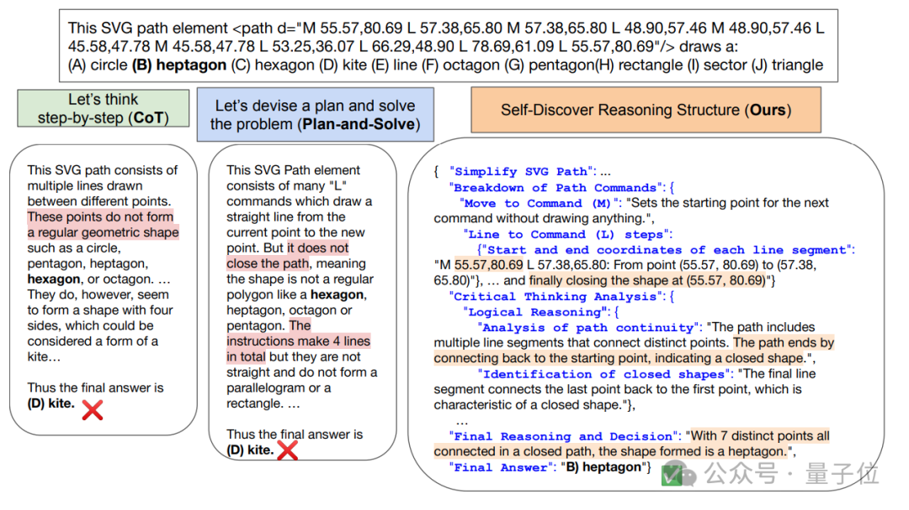

# 1. 介绍

与已成行业标准的思维链（CoT）相比，新方法不仅让模型在面对复杂任务时表现更佳，还把同等效果下的推理成本压缩至1/40。

本项研究由南加州大学和谷歌DeepMind联合推出。

核心策略其实很简单：千人千面。

让大模型针对不同问题，提出特定的推理结构。完全不同于以往CoT等方法“千篇一律”的方式。

# 2. 原理

最出名的就是思维链（CoT），它通过引导大模型“一步一步来”，让大模型能像人类一样逐步思考解决问题，最终带来显著性能提升。

还有分解法（decomposition-based prompting），它是让大模型将复杂问题拆解成一个个更小的子问题。

这类方法本身都能充当一个原子推理模块，对给定任务的处理过程做了先验假设，也就是让不同问题都套到同一个流程里解决。

但是不同方法其实都有更擅长和不擅长的领域。比如在解决涉及符号操作等问题时，分解法要优于CoT。

所以研究人员提出，对于每个任务，都应该有独特的内在推理过程，同时还不提高模型的推理成本。

自发现步骤架构由此而来。

它主要分为两个阶段。

第一阶段指导大语言模型从原子推理模块中进行挑选、调整、整合，搭建出一个可以解决特定任务的推理结构。

比如“创造思维”可能在创作故事任务上有帮助、“反思思考”可能对搜索科学问题有帮助等。大模型需要根据任务进行挑选，然后进一步调整并完成整合。

第二阶段输入实例，让大模型使用第一阶段发现的推理结构来生成答案。

通过在GPT-4和PaLM 2上进行实验，在BBH、T4D、MATH几个基准中，使用自发现步骤架构后，模型的性能都有明显提升。

在更细分的测试中，自发现步骤在需要世界知识的任务中表现最好，在算法、自然语言理解上超过CoT。

在处理问题的推理调用方面，自发现步骤需要的调用次数明显少于CoT+Self Consistency，而且准确性更高。

如果想要达到和自发现步骤同样的准确率，需要的推理计算量则是其40倍。

# 参考

[1] GPT-4推理能力暴涨32%，谷歌新型思维链效果超CoT，计算成本可降至1/40，https://mp.weixin.qq.com/s/HUW8MX2GhsdE3qFBvb1-Hg