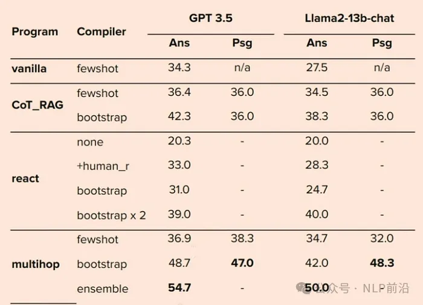

# 1. 简介

提示词工程，实际上就是大量的玩家在试玩大模型之后总结出的技巧。互联网上搜一波可以看到大量的诸如50个大模型提示词技巧，100个提示词技巧。这些技巧本身都很不错，但是在试用之后，你可能发现，没有什么提示词策略是可以解决所有类型的问题的。

LLMs本身对提示词是非常敏感的，这意味着，在实际实验过程中，除了要求大模型输出某个内容，还需要约束它按照某种格式，各种条件约束下输出，以确保整体的稳定性。

今天分享的这个思路，是将prompt llms变成program llms，主要来源于斯坦福大学的DSPY框架。将大模型提示词工程转变成像写pytorch代码一样结构化。这个框架的首图如下：

# 2. 使用

在DSPY中，对应了3大核心模块，Signatures、Modules、Optimizers。如果还原到提示词工程中，Signatures相当于在书写提示词，而Modules就像你使用提示词技巧，比如思维链cot、react等，而Optimizers就像一步一步的去根据模型的生成结果调优提示词。

更具象化一点：

- Signatures是我们告诉DSPY需要做什么，而不是告诉他应该如何做。例如：输入是文档，输出是摘要；输入是上下文+问题，输出是问题回复。
- Modules，在DSPY是一些模块化的组件，比如说：dspy.ChainOfThought、dspy.ProgramOfThought，类似于一些可调用的函数
- Optimizers，根据某个指标对整个流程自动优化。

接下来举个具体的例子：

比如说，我们想解决“姚明的妻子的出生年龄？”这个问题。看到这个问题，大家脑子里肯定蹦出了一堆的解决方案。这是个多跳问题，几乎不可能通过单轮搜索来解决这个问题，大多数系统可以得出“姚明的妻子是谁？”，但是无法回答后续的年龄问题。多轮搜索的系统，通过生成额外的搜索，收集必要的信息，可以得出最终答案，整体上还是蛮复杂的。但是这里举个例子，如何用DSPY只需要几行代码来实现并优化这个问题。

```python
import dspy

turbo = dspy.OpenAI(model='gpt-3.5-turbo')
colbertv2 = dspy.ColBERTv2(url='http://20.102.90.50:2017/wiki17_abstracts')

dspy.settings.configure(lm=turbo, rm=colbertv2 )
```

加载测试数据，多跳问题，可以使用HotPotQA测试

```python
from dspy.datasets import HotPotQA

dataset = HotPotQA(train_seed=1, train_size=20, eval_seed=2023, dev_size=50, test_size=0)

trainset = [x.with_inputs('question') for x in dataset.train]
devset = [x.with_inputs('question') for x in dataset.dev]

len(trainset), len(devset)
#(20, 50)
```

设置Signatures

```python
class GenerateAnswer(dspy.Signature):
    context = dspy.InputField()
    question = dspy.InputField()
    answer = dspy.OutputField()


class GenerateSearchQuery(dspy.Signature):

    context = dspy.InputField()
    question = dspy.InputField()
    query = dspy.OutputField()
```

构建DSPY pipeline

```python
from dsp.utils import deduplicate

class SimplifiedBaleen(dspy.Module):
    def __init__(self, passages_per_hop=3, max_hops=2):
        super().__init__()

        self.generate_query = [dspy.ChainOfThought(GenerateSearchQuery) for _ in range(max_hops)]  # 多跳，每一跳都使用一个dspy.ChainOfThought
        self.retrieve = dspy.Retrieve(k=passages_per_hop)
        self.generate_answer = dspy.ChainOfThought(GenerateAnswer)
        self.max_hops = max_hops
    
    def forward(self, question):
        context = []
        
        for hop in range(self.max_hops):
            query = self.generate_query[hop](context=context, question=question).query
            passages = self.retrieve(query).passages
            context = deduplicate(context + passages)

        pred = self.generate_answer(context=context, question=question)
        return dspy.Prediction(context=context, answer=pred.answer)
```

# 3. 测试

```python
my_question = "How many storeys are in the castle that David Gregory inherited?"

uncompiled_baleen = SimplifiedBaleen()  
pred = uncompiled_baleen(my_question)

print(f"Question: {my_question}")
print(f"Predicted Answer: {pred.answer}")
print(f"Retrieved Contexts (truncated): {[c[:200] + '...' for c in pred.context]}")
```

# 4. 优化

上面提到过，可以用某个打分来优化DSPY的结果，定义一个评估函数

- 预测答案与真实答案相符。
- 检索到的上下文包含真实答案
- 生成的搜索查询不能太杂乱，小于100个字符
- 生成的搜索查询尽量不要重复（跟历史的相比，不能超过0.8）。

```python
def validate_context_and_answer_and_hops(example, pred, trace=None):
    if not dspy.evaluate.answer_exact_match(example, pred): return False
    if not dspy.evaluate.answer_passage_match(example, pred): return False

    hops = [example.question] + [outputs.query for *_, outputs in trace if 'query' in outputs]

    if max([len(h) for h in hops]) > 100: return False
    if any(dspy.evaluate.answer_exact_match_str(hops[idx], hops[:idx], frac=0.8) for idx in range(2, len(hops))): return False

    return True
```

使用 DSPy 中的BootstrapFewShot，通过少量示例来优化流程的预测器。

```python
from dspy.teleprompt import BootstrapFewShot

teleprompter = BootstrapFewShot(metric=validate_context_and_answer_and_hops)
compiled_baleen = teleprompter.compile(SimplifiedBaleen(), teacher=SimplifiedBaleen(passages_per_hop=2), trainset=trainset)
```

# 5. 评估

```python
from dspy.evaluate.evaluate import Evaluate


def gold_passages_retrieved(example, pred, trace=None):
    gold_titles = set(map(dspy.evaluate.normalize_text, example["gold_titles"]))
    found_titles = set(
        map(dspy.evaluate.normalize_text, [c.split(" | ")[0] for c in pred.context])
    )
    return gold_titles.issubset(found_titles)

evaluate_on_hotpotqa = Evaluate(devset=devset, num_threads=1, display_progress=True, display_table=5)

uncompiled_baleen_retrieval_score = evaluate_on_hotpotqa(uncompiled_baleen, metric=gold_passages_retrieved, display=False)

compiled_baleen_retrieval_score = evaluate_on_hotpotqa(compiled_baleen, metric=gold_passages_retrieved)

print(f"## Retrieval Score for uncompiled Baleen: {uncompiled_baleen_retrieval_score}")
print(f"## Retrieval Score for compiled Baleen: {compiled_baleen_retrieval_score}")


#Output
## Retrieval Score for uncompiled Baleen: 36.0
## Retrieval Score for compiled Baleen: 60.0
```



在 DSPy 中结合多跳设置甚至可以超越人类反馈。即使是很小的模型，在 DSPy 设置中使用时也可以与更大尺寸模型进行比较。项目框架中有很多的优秀示例，感兴趣的小伙伴可以学习一波。

# 参考

[1] 别再执着于大模型提示词技巧了，一起迈向program llms新时代！, https://mp.weixin.qq.com/s?__biz=MzkyOTU5NzY1Mw==&mid=2247487635&idx=1&sn=a157c95f46e4f4223444d6a1df03a4d2&chksm=c3687fffaedacbbf2fe4375f9913830b3e6f438cea033fec501d4ebd0afc720c14c79111e7bd&scene=132&exptype=timeline_recommend_article_extendread_samebiz&show_related_article=1&subscene=0&scene=132#wechat_redirect