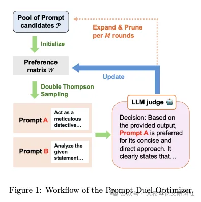
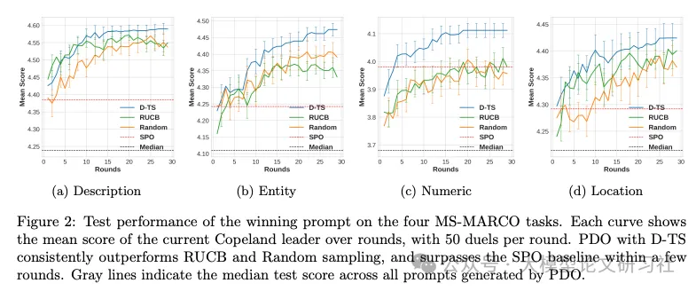
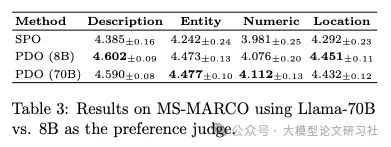

# 1. 资源

- 论文标题: "LLM Prompt Duel Optimizer: Efficient Label-Free Prompt Optimization"
- 作者: "Yuanchen Wu, Saurabh Verma, Justin Lee"
- 发表年份: 2025
- 原文链接: "https://www.arxiv.org/pdf/2510.13907"
- 代码链接: "https://github.com/ meta-llama/prompt-ops"
- 关键词: ["提示优化", "无标签学习", "决斗 bandit", "LLM法官", "自动提示工程"]

我们提出了提示对决优化器（PDO），这是一个样本高效的无标签提示优化框架。PDO将问题表述为对决型多臂老虎机设置，监督信号来自由LLM裁判提供的成对偏好反馈。该框架结合了双重汤普森采样（D-TS），它优先考虑信息量大的提示比较，以及顶尖表现者引导的变异，通过变异表现良好的提示来扩大候选池。PDO自然地在无标签设置中运行，也可以结合部分标签来减轻裁判噪声。在BIG-bench Hard（BBH）和MS MARCO上的实验表明，PDO始终优于基线方法。消融研究进一步证明了D-TS和提示变异的有效性。

# 2. 提示工程的痛点与挑战
大语言模型 (LLM) 的性能高度依赖提示质量，但手动设计有效提示需要领域知识和大量试错。自动提示优化 (APO) 旨在解决这一问题，但现有方法面临两大核心挑战：

1. 标注数据依赖：传统 APO 方法如 APE (Zhou et al., 2022)、OPRO (Yang et al., 2024) 依赖大量标注数据来评分提示，而标注成本高且耗时。例如，在 BBH 数据集上，OPRO 需要数百条标注示例才能优化一个提示。
2. 评估效率与噪声：即使是无标签方法如 SPO (Xiang et al., 2025)，也采用贪心策略进行提示比较，无法高效探索提示空间；同时，LLM 作为法官评估提示时存在噪声（如位置偏差、任务复杂度影响），进一步降低优化效果。

# 3. 原理
决斗 bandit 模型的创新视角
PDO 创新性地将提示优化转化为决斗 bandit 问题（Dueling Bandit Problem），核心 insight 是：

- 提示优化可视为从候选池中选择最优提示的过程，类似从多个臂（arm）中选择最优臂
- 无需直接评分提示，而是通过 LLM 法官比较两个提示的输出（成对偏好），避免绝对评分的校准难题
- 采用 Double Thompson Sampling (D-TS) 算法自适应选择比较对，平衡探索（测试不确定提示）与利用（聚焦优质提示）



图1：PDO框架流程图，包含提示候选池初始化、D-TS采样、LLM法官判断、偏好矩阵更新和提示变异五大模块

方法总览：PDO如何让提示"两两决斗"找出最优解？
核心框架
PDO 的工作流程如图1所示，主要包括以下步骤：

1. 初始化提示池：从基础提示（如 CoT、PoS）和随机生成的提示中构建初始候选池。
2. 双汤普森采样 (D-TS)：根据当前偏好矩阵，自适应选择最具信息量的提示对进行"决斗"。
3. LLM法官评估：调用 LLM 法官比较提示对的输出，生成偏好反馈（A优于B或反之）。
4. 偏好矩阵更新：用 Beta 分布建模提示对的胜率，更新后验概率。
5. 提示变异与剪枝：定期对当前最优提示进行变异（如添加示例、调整表述），并剪枝低质量提示。

关键创新点
- 无标签优化：全程无需人工标注数据，仅依赖 LLM 法官的偏好反馈。
- 样本高效：D-TS 算法减少无效比较，用更少 LLM 调用找到优质提示。
- 动态探索：通过提示变异不断扩展搜索空间，避免陷入局部最优。

关键结论
1. 范式创新：首次将无标签提示优化建模为决斗 bandit 问题，突破传统 APO 对标注数据的依赖。
2. 性能超越：在 BBH 和 MS-MARCO 数据集上，PDO 显著优于 SPO、CoT 等基线，部分任务超越有监督方法。
3. 鲁棒性提升：通过部分标签校正 LLM 法官噪声，在复杂任务（如 Geometric）上性能提升 11.4%。

双汤普森采样 (D-TS)：智能选择"决斗"对手

偏好建模与采样
D-TS 是 PDO 的"大脑"，其核心是维护一个 偏好矩阵 ( W )

采样过程分为两步：

- 第一步：计算所有提示的乐观 Copeland 分数（击败其他提示的估计次数），选择分数最高的候选集。
- 第二步：从候选集中采样，选择与当前最优提示竞争最激烈的对手（胜率接近 0.5 的提示）。
通俗解释：D-TS 像一位精明的教练，不会让冠军反复与弱手比赛，而是优先安排"势均力敌"的对决，既验证冠军实力，又挖掘黑马潜力。

算法伪代码

```python
def D_TS(pool, W, N):
    # 第一步：选择当前最优提示i*
    copeland_scores = compute_copeland(W)  # 计算每个提示的Copeland分数
    candidates = [i for i in pool if copeland_scores[i] == max(copeland_scores)]
    i_star = argmax(sample_beta(W, candidates))  # 从候选集中采样最优提示
    
    # 第二步：选择最不确定的对手j*
    uncertain_opponents = [j for j in pool if j != i_star and W[i_star][j]/N[i_star][j] ≈ 0.5]
    j_star = argmax(sample_beta_rev(W, uncertain_opponents))  # 采样对手
    
    return i_star, j_star  # 返回待决斗的提示对
```

2. LLM法官设计：如何减少偏好评估噪声？
dual-judge策略
为提高评估可靠性，PDO 采用 双法官机制：

• 答案法官：当两个提示输出不同答案时，根据正确性判断胜负。
• 推理法官：当答案一致时，根据推理链的逻辑性、简洁性判断胜负。
例如，在 Web of Lies 任务中，若提示 A 和 B 都回答"否"，法官会比较推理过程：

• A 的推理："因为 X 说谎，所以 Y 说的是真的..."（逻辑跳跃）
• B 的推理："X说谎→Y的陈述为假→Z的陈述为真..."（步骤清晰）→ 法官判 B 胜
噪声处理
当法官可靠性低（如 Geometric 任务），PDO 引入 部分标签（如 30% 真实标签）校正偏好矩阵，控制人工反馈的影响程度。

3. 提示变异：从"冠军"提示生成更强变体
变异策略
PDO 对当前最优提示进行 定向变异，生成新候选：

• 扩展变异：添加补充说明，如"先列出已知条件，再逐步推导"。
• 示例变异：插入 1-2 个解决步骤示例，如"例：若 x²=4，则 x=±2"。
• 语气变异：调整表述风格，如从"请分析"改为"作为侦探，你需要..."。
剪枝规则
每 10 轮保留 Copeland 分数前 50% 的提示，删除其余提示以控制计算成本。实验表明，此策略可使提示池质量提升 40%。

实验结果：PDO性能全面超越基线

# 3. 实验

. BBH数据集：多任务准确率领先
无标签场景（Table 1）
PDO 在 16 个 BBH 任务中的 13 个超越基线，平均准确率 72.3%，显著高于 SPO (68.5%) 和 CoT (67.8%)。


表1：BBH无标签场景性能对比
表1：PDO与无监督基线在BBH任务上的准确率对比（%），最佳结果加粗，次佳下划线

关键发现：

• 复杂推理任务提升显著：Tracking-7（+9.8%）、Web of Lies（+8.1%），表明 PDO 擅长优化多步骤推理提示。
• 稳定性优势：16 个任务中 13 个排名第一，而 SPO 仅在 3 个任务领先，证明 D-TS 采样的可靠性。
有监督场景（Table 2）
当使用少量开发集标签选择最优提示时，PDO 与有监督方法（如 Breeder、OPRO）相当，在 Geometric 任务甚至以 71.2% 准确率领先。


表2：BBH有监督场景性能对比
表2：PDO与有监督APO方法的准确率对比（%）

2. MS-MARCO数据集：收敛速度与效率优势
在开放域问答任务中，PDO 的 D-TS 算法收敛速度远超随机采样和 RUCB 方法：




图2：MS-MARCO任务收敛曲线
图2：PDO在MS-MARCO四个任务上的收敛曲线，D-TS（蓝色）比RUCB（绿色）和随机采样（橙色）更快达到高分数

关键数据：

• 在 Numeric 任务上，PDO 10 轮内达到 4.1 分，比 SPO 快 2 倍。
• 平均每轮仅需 50 次 LLM 法官调用，样本效率比 SPO 高 60%。

3. 法官模型大小影响
实验对比 Llama-8B 和 70B 作为法官的性能：

• 复杂任务（如 Numeric）：70B 法官准确率高 3.6%，因推理能力更强。
• 简单任务（如 Description）：8B 法官性能接近且成本更低。



表3：不同大小法官模型性能对比
表3：Llama-8B与70B作为法官时PDO在MS-MARCO上的表现

未来工作与个人见解

# 参考

[1] 无需人工标注！Meta 新框架 PDO 让 LLM 自动优化提示词，性能碾压传统方法, https://mp.weixin.qq.com/s/H3Hh_dqgHtq4q6fyAMVKtQ