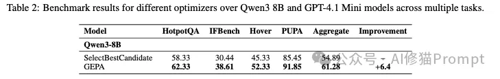
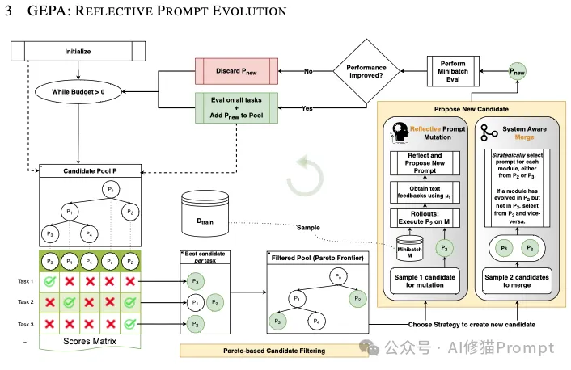
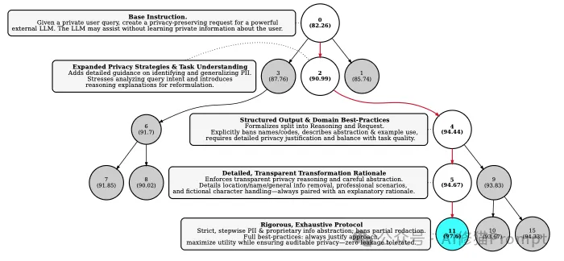
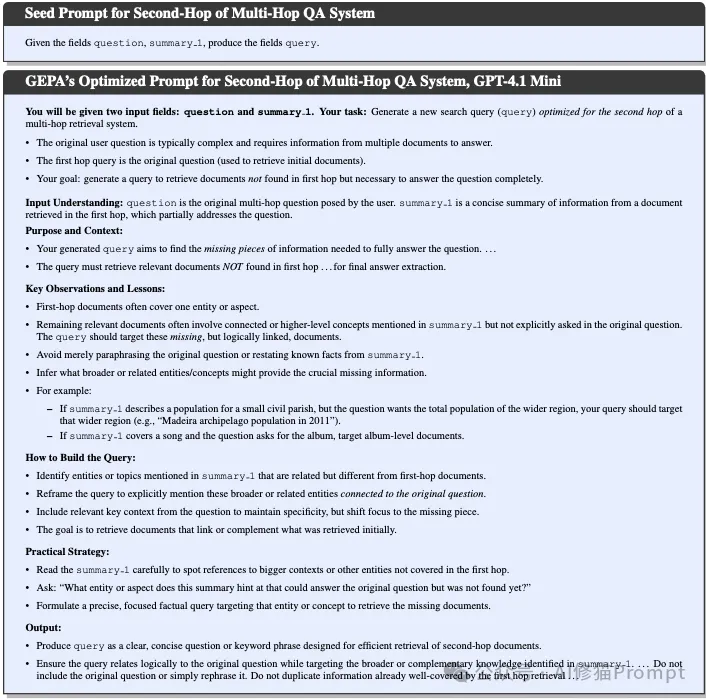
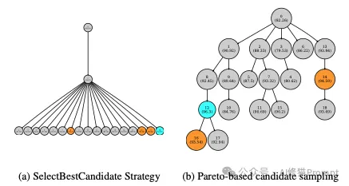

# 1. 资源

- Github (29.4k stars): https://github.com/stanfordnlp/dspy

# 2. 简介

在人工智能的研究中，我们关心的是在序贯决策里如何实现长期目标的最优化；然而，一旦缺乏全局校正，哪怕每一步看似合理，仍可能在错误前提上越走越偏。

在多步骤任务中，Agent 可能由于对指令的误解、知识的缺口或工具返回的歧义，埋下一个微小但关键的错误；此后在每一步都做出基于当下信息的局部/条件最优决策。这些决策本身并非不合理，但因为建立在前序错误之上，错误会被固化并放大。这个过程看似自洽，实则是偏差的滚雪球：细小的误差沿链路传播与复合，最终累积成与事实背离的结论，导致错误回答或任务失败。

这种多步推理中的误差传播/复合误差（error propagation / compounding errors），常由暴露偏差（训练与推断分布不一致）或分布/协变量漂移所驱动，是当前 Agent 系统的一项重要挑战，也直接影响用户对模型可靠性的信任。当然，这并非无解。

由多家机构（包括 Stanford、UC Berkeley 等）的研究者提出的 GEPA，正面回应了这一问题，并给出了一条相对的路径：它不是在执行时逐步干预，而是对完整执行轨迹进行自然语言反思，据此进化提示；同时用帕累托式候选选择在不同训练实例上保留“非支配”的优胜候选，以维持策略多样性与探索，减少陷入单一路径的风险。一个特别的信息是，Dspy的第一作者Omar Khattab也参与了这项研究。

实验表明，在多项任务上，GEPA 相比强化学习方法 GRPO平均约提升 10%（部分任务可更高），且在相同目标下所需 rollouts 最多可减少约 35×；同时，在两种 LLM 设定下，其表现超过 DSPy 的 MIPROv2。这些结果显示，基于语言反思的提示演化在一定条件下可实现更高的样本效率与更好的泛化。

# 3. 原理

GEPA (Genetic-Pareto)，不用训练权重，一个结合了遗传算法（Genetic）和帕累托优化（Pareto）思想的提示词优化器。它的核心是让提示词（Prompt）像生物一样“进化”。GEPA主要包含三个关键机制：

基因式提示进化 (Genetic Prompt Evolution)

这是 GEPA 的宏观框架，定义了优化的整体流程。您可以将其理解为一种模拟生物进化的“优胜劣汰”过程，只不过这里的“物种”是语言模型的提示（Prompt）。

这是什么？ 这是一种迭代式的优化循环，其中包含一个由多个不同提示版本组成的“候选池”，在每一轮迭代中，算法会从这个池子里选择优秀的“父辈”提示，通过“变异”或“交叉”等操作产生新的“子代”提示，并将其加入池中，不断扩大和优化这个种群。

它是如何工作的？

初始化 (Initialize)：算法开始时，候选池里只有一个初始的、简单的“种子提示”。

选择 (Select)：在预算耗尽前，算法在每一轮循环中，会根据特定策略（即接下来的“帕累托选择”机制）从池中挑选出一或两个有潜力的候选提示进行优化。

繁殖 (Propose New Candidate)：通过以下两种方式之一创造新的提示：

变异 (Mutation)：对单个父辈提示进行“反思型提示变异”（即接下来的“反思”机制），产生一个经过改进的新版本。

交叉 (Crossover/Merge)：将两个不同父辈提示的优点结合起来，创造一个集两者之长的全新提示。

评估 (Evaluation)：新生成的提示会先在一个小样本（minibatch）上进行快速评估，看性能是否有所提升。

生存 (Add to Pool)：只有表现优于其父辈的“子代”提示，才会被加入到候选池中，参与后续的进化过程。

Genetic Optimization Loop本身并不新奇，但GEPA的精髓在于它如何实现“变异”和“选择”。

反思型提示变异 (Reflective Prompt Mutation)
这是 GEPA 的核心智能，是产生高质量新提示的“创造引擎”。它摒弃了随机变异，采用了一种基于语言理解的、有逻辑的改进方式。

它是什么？ 利用一个强大的“教师”语言模型对当前提示在具体任务上的表现进行深入“反思”，并根据反思得出的结论，以自然语言的形式生成一个全新的、更优化的指令。

为什么重要？ 这是 GEPA样本效率极高的根本原因。传统方法（如强化学习）从一次失败中可能只学到一个简单的负分，而 GEPA 能从同样的失败中提取出丰富的、可操作的文本反馈。例如，它不仅知道“这次错了”，还能通过反思理解“错在没有考虑边缘情况”或“指令不够明确”，从而进行针对性的、大幅度的改进。

它是如何工作的？

收集案例：GEPA 在一个小批次的数据上运行当前的提示，并记录完整的执行轨迹，包括输入、模型的输出、推理过程以及最重要的，来自评估器的文本反馈。

调用“反思”模型：GEPA 将收集到的信息打包，喂给一个更强大的“教师模型”，比如GPT-4。

执行元提示 (Meta-Prompt)：这个教师模型会执行一个“元提示”，其大意是：“我给了助理以下指令（当前提示），这里是它处理几个任务的例子（输入、输出和反馈），你的任务是为这个助理写一个新的指令。”。

生成新提示：教师模型在理解了成功和失败的模式后，会生成一个全新的、通常更详细、更具针对性的指令。

基于帕累托前沿的候选选择 (Pareto-based Candidate Selection)
这是 GEPA 的智能策略，负责在每一轮进化中明智地选择要优化的“父辈”提示，以平衡“探索”和“利用”的关系。

它是什么？ 一种先进的选择策略，它不只关注在所有任务上平均分最高的那个“全能冠军”提示，而是关注并保留那些在至少一个具体任务实例上取得最高分的“单项冠军”提示。这些“单项冠军”的集合就构成了帕累托前沿。

为什么重要？ 这个机制能有效避免陷入局部最优。一个平均分很高的提示可能在处理某类特定问题时存在致命缺陷。如果只优化这个“全能冠军”，算法可能会不断地在它的弱点上做无用功。而帕累托选择保留了那些虽然平均分不高、但在某些方面有独到之处的“专家”提示，从而维持了策略的多样性，让优化器有机会探索更多不同的、可能最终通向全局最优解的路径。上图直观地展示了这种策略比简单的“选择最优者”策略能探索更广阔的搜索空间。

它是如何工作的？

构建前沿：对于验证集中的每一个数据点，GEPA 都会找出在它上面得分最高的那个（或多个）候选提示。

筛选候选：将所有这些“单项冠军”集合起来，形成一个临时的精英池。

剔除被支配者：从这个精英池中，剔除那些被“完全支配”的候选者。例如，如果提示 A 在任务1和任务2上都是冠军，而提示 B 只在任务1上是冠军，那么提示 B 就被提示 A “支配”，可能会被剔除。

加权抽样：最后，从这个经过筛选的精英池中随机抽取一个提示进行下一轮的“反思型变异”。在这个抽样过程中，成为“单项冠军”次数越多的提示，被选中的概率就越大。

总结来说，这三大机制协同工作：基因式进化提供了持续优化的框架；反思型变异是实现智能、高效改进的核心动力；而帕累托选择则是指导这个进化过程朝向更优、更鲁棒解的智慧罗盘。

# 参考

[1] Agent多步误差咋破？看下GEPA，反思自进化+帕累托前沿，超过DSPy的MIPROv2, https://mp.weixin.qq.com/s/9L6lTE75SVqImWIhn7CD0g