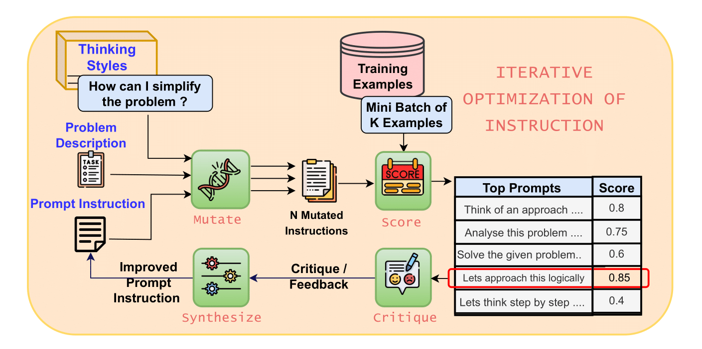
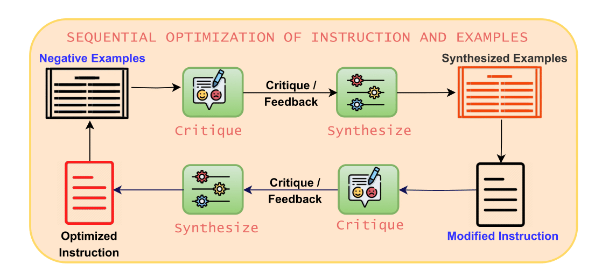
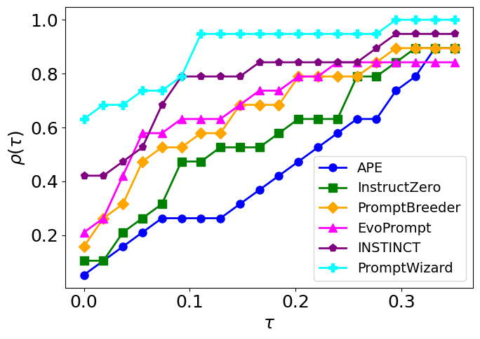

- Github (3.7k stars): https://github.com/microsoft/PromptWizard

PromptWizard 是一个离散的提示优化框架，它采用一种自我进化的机制，LLM 生成、批评和完善自己的提示和示例，通过迭代反馈和综合不断改进。这种自适应方法通过改进指令和上下文学习示例来确保整体优化，以获得更好的任务性能。

PromptWizard 的三个关键组件如下：

反馈驱动的细化：LLM 生成、批评和完善自己的提示和示例，通过迭代反馈和综合不断改进

批评和综合多样化的示例：生成健壮、多样化且任务感知的综合示例。此外，它还同时优化了提示和示例

结合积极、消极和综合示例的自生成思维链 （CoT） 步骤

第一阶段：指令的迭代优化

第 2 阶段：指令和示例的顺序优化

PromptWizard 在各种阈值上始终优于其他方法，保持最高的 p（τ） 值，表明它在所有任务中都接近最佳可能的准确性

图示显示了指令归纳的性能曲线 任务。 性能曲线可视化了不同方法的性能在与最佳性能给定距离内的频率。在这条曲线中，x轴（τ）表示相对于最佳表现方法的性能比，y轴（p（τ ））反映了方法性能处于该比率内的任务比例。因此，对于给定的方法，曲线告诉有多少百分比的任务距离最佳性能在τ范围内。