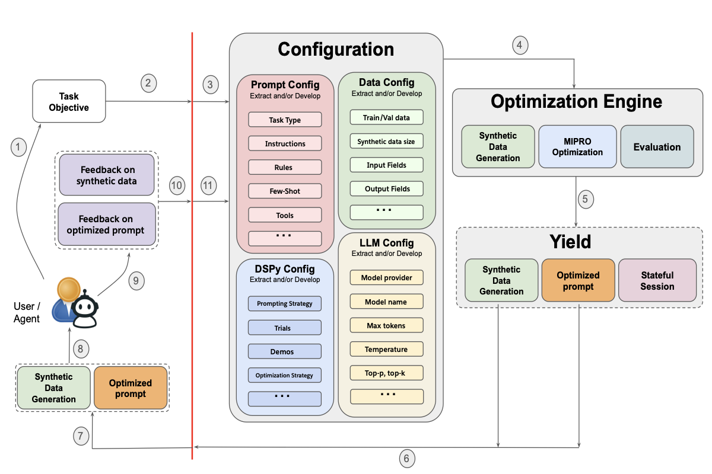

# 1. 资源

- Github (778 stars): https://github.com/SalesforceAIResearch/promptomatix
- salesforce出品，基本是DSPY套壳，但是是用的合成数据

Promptomatix 架构由几个关键组件组成：

输入处理：分析原始用户输入以确定任务类型和需求
合成数据生成：创建针对特定任务的训练和测试数据集
优化引擎：使用 DSPy 或元提示后端迭代改进提示
评估系统：利用任务特定的指标评估提示表现
反馈整合：融入人工反馈以实现持续改进
会话管理：跟踪优化进展并维护详细日志

🌟 主要特征
零配置智能：自动分析任务，选择技巧并配置提示
自动化数据集生成：生成针对特定领域量身定制的合成训练和测试数据
任务专项优化：根据任务类型选择合适的DSPy模块和指标
实时人工反馈：整合用户反馈以实现迭代提示的优化
全面的会话管理：跟踪优化进展并维护详细日志
框架无关设计：支持多个大型语言模型提供商（OpenAI、Anthropic、Cohere）
CLI 和 API 接口：通过命令行或 REST API 灵活使用