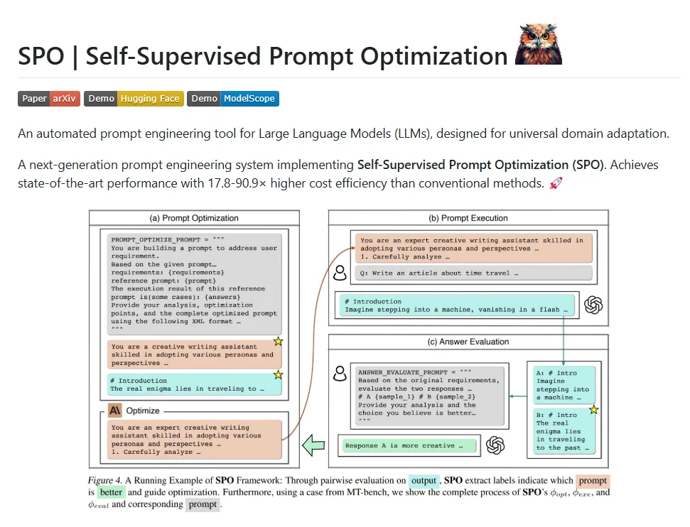

# 1. 资源

- 代码：https://github.com/geekan/MetaGPT/tree/main/examples/spo
- 论文：https://arxiv.org/pdf/2502.06855
- Hugging Face 链接：https://huggingface.co/spaces/XiangJinYu/SPO
- ModelScope 链接：https://modelscope.cn/studios/AI-ModelScope/SPO

# 2. 原理

# 参考

[1] SPO来袭：Prompt工程师90%不存在了？AI自动优化时代开启！https://mp.weixin.qq.com/s/EjpsRtYVD_Ax7eCljGVMog