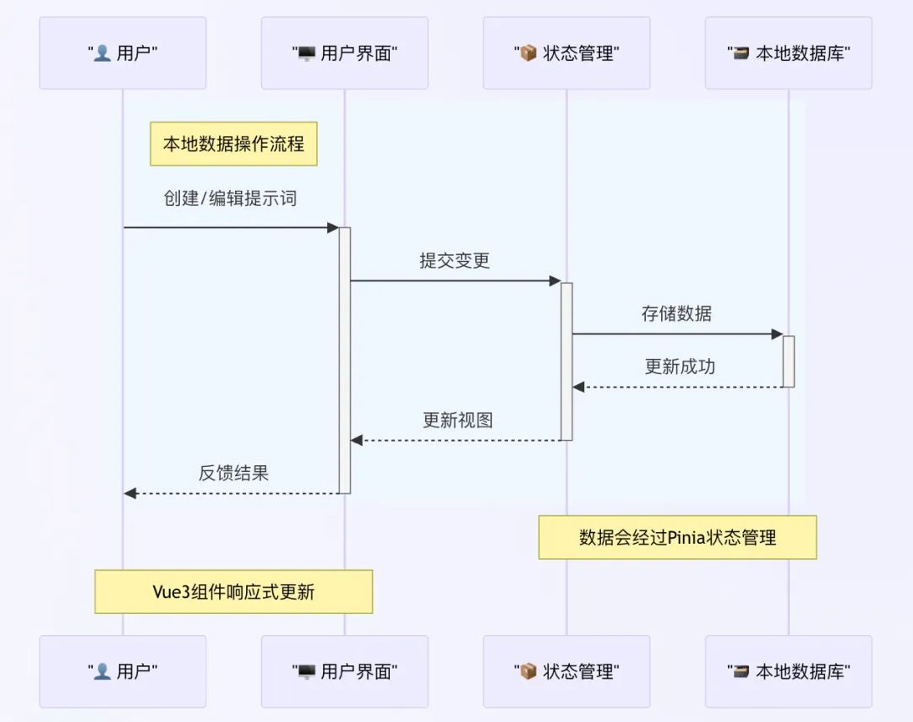

资源：
- https://prompt.orence.net/welcome
- https://prompt.orence.net/app

PromptPro采用前后端分离架构，这种架构设计不仅提高了系统的灵活性和可扩展性，还为用户带来了更流畅的使用体验。

- 前端：基于Vue 3 + TypeScript的单页应用，使用IndexedDB实现本地数据存储。这种设计不仅保证了数据的安全性，还让应用能够在离线状态下正常运行。
- 后端：Node.js + Express构建的RESTful API服务，提供云备份和提示词共享功能。后端使用MySQL作为数据库，确保数据的持久化存储。
- 第三方服务：集成OpenAI API实现提示词测试和优化，让你能够实时测试和优化你的提示词，确保它们能够产生最佳的AI输出。

技术栈：
- 框架：Vue 3 + TypeScript
- UI库：Arco Design
- 状态管理：Pinia
- 本地存储：IndexedDB
- 路由：Vue Router
- HTTP客户端：Axios
- PWA支持：Vite PWA插件

# 参考

[1] PromptPro：AI提示词管理神器，从此告别杂乱无章！https://mp.weixin.qq.com/s/FsZRPhlkOyKj-QsFT0Dwqw