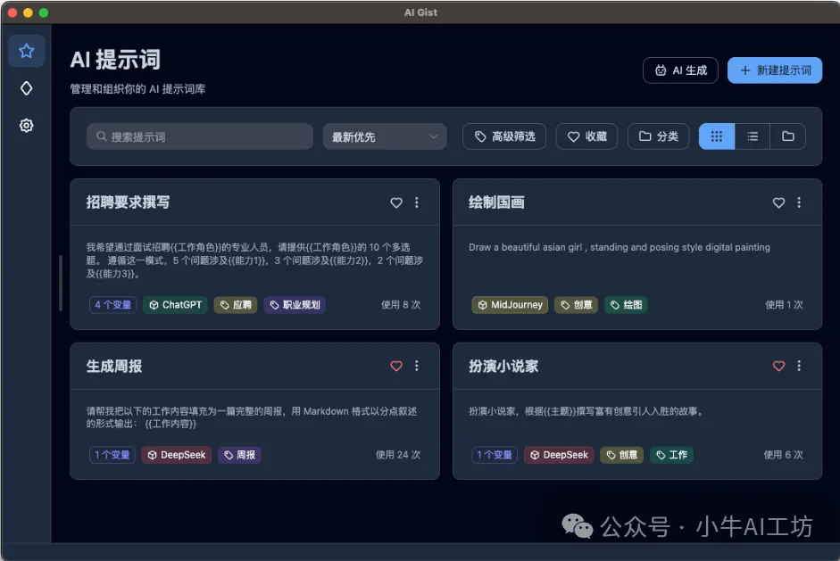

AI-Gist」是什么？

https://github.com/yarin-zhang/AI-Gist

它是一款本地部署的AI提示词管理工具，它可以让我们个人收藏的AI提示词发挥最大的价值。把我们的AI提示词进行管理，支持变量替换、Jinja模板、AI生成和优化、历史版本记录、云端备份等。方便我们记录提示词，同时又方便分享给他人员使用。

三、核心功能包括哪些？

1、AI优化提示词：

      支持变量替换和动态内容填充，可以灵活、快速的修改提示词，同时还有AI辅助优化提示词。

2、支持Jinja模板：

    使用Jinja模板，可以更灵活地创建和修改提示词。

3、配置AI模型 :

     可以配置不同平台的模型，包括本地的Ollama、LM Studio，也可以配置的DeepSeek、OpenAI。

4、AI生成提示词：

     使用配置好的大模型，可以帮助我们生成高质量的提示词，节省了我们创作的时间，提高工作效率。

5、高级筛选：

   支持筛选和搜索，可以多种条件组合查询、智能排序，快速找到所需要的提示词，提高查找效率。

6、分类管理：

   支持自定义标签，方便根据标签快速检索到提示词，定位所需要的内容。

7、历史记录可查：

   完整记录每次使用情况，帮助我们分析提示词性能，优化工作流程。

8、云端备份：

   支持WebDAV、iCloud云端备份，随时随地同步，方便分享他人。

9、布局展示：

   支持卡片和列表两种布局，根据个人喜好随时切换。

10、自定义主题：

支持浅色主题、深色主题自由切换

# 参考

[1] 开源工具AI-Gist，如何让Prompt产出管理效率提升300%？https://mp.weixin.qq.com/s/LMLemdexf_-Uw1AsHkPLuA