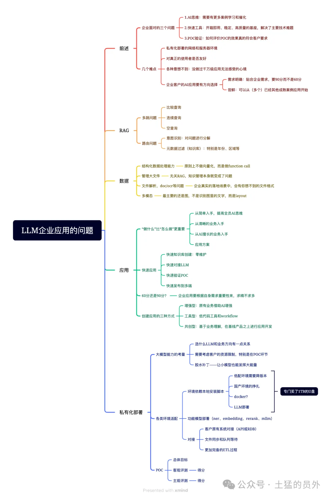
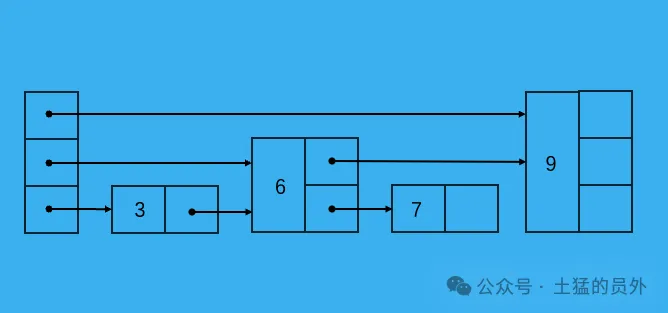
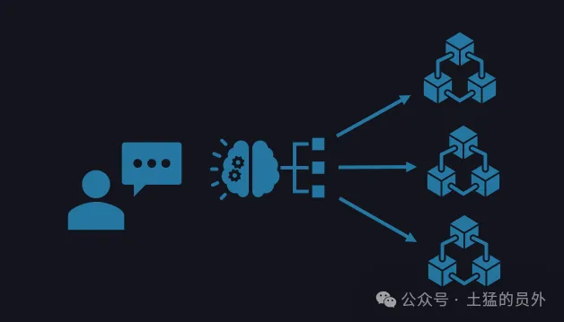

# 1. 简介

# 2. 问题分析
## 2.1 多跳问题

多跳问题在我们的落地场景中一般都是发生在报告编写的数据整理环节，比如要从一堆报表中找出企业近三年的复合增长率，要和竞对比较发展情况等，这时候一般的RAG无法满足。在网上也有不少介绍解决多跳问题的方案，较为常见的是使用图数据库，但是在实际落地环境中，这对于数据更新还是有困难的（也可能是我们不熟悉），所以我们最终没选择图数据库，而是采用了去理解意图，然后拆分实体和意图的方式进行RAG。也许在某些环节中对于关联关系没有图数据库那么强大，但维护方便啊，几乎没有额外的人工维护成本。

## 2.2 路有问题

图3:路有问题，我们也叫外部MoE

说实话这个问题我们之前是没有关注的，但是你知道一旦落到实际生产环境中，文件一多，特别相似文件一多，各种问题就出来了。比如公司2021年的财报和2022年的财报中某项数据，有时候只在文件名和一些大标题才有年份，就造成了chunking之后失去年份等关键信息，造成最终结果的错误。

这种问题我们目前采用的方式是在文件处理时收录元数据，如标题、时间、区域等。然后在检索的时候，首先对问题进行拆解，识别年份等关键信息，直接路由到相应的年份知识库或目录进行检索，不仅提升效率还解决了内容混淆的问题。

## 2.3 数据

相对于RAG，个人觉得数据处理是企业应用中在技术层面最难的问题。下面我就简单分享四点。

结构化数据处理

# 参考

[1] LLM企业应用落地场景中的问题一览 ｜LLM ｜RAG ｜Agent ｜TorchV， https://mp.weixin.qq.com/s/NvRyRXxhBKT-LSyYZ1llqg